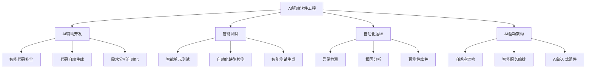

# 04-软件架构理论体系-AI驱动软件工程前沿专题

[返回主题树](../00-主题树与内容索引.md) | [主计划文档](../00-形式化架构理论统一计划.md) | [相关计划](../13-项目报告与总结/递归合并计划.md) | [返回上级](../README.md)

> 本文档为软件架构理论体系分支AI驱动软件工程前沿专题，所有最新进展与结论以主计划文档为准，历史细节归档于archive/。

## 目录

- [04-软件架构理论体系-AI驱动软件工程前沿专题](#04-软件架构理论体系-ai驱动软件工程前沿专题)
  - [目录](#目录)
  - [1. 概述](#1-概述)
    - [1.1 AI驱动软件工程概述](#11-ai驱动软件工程概述)
    - [1.2 核心目标](#12-核心目标)
    - [1.3 AI驱动软件工程层次结构](#13-ai驱动软件工程层次结构)
  - [2. 主要文件与内容索引](#2-主要文件与内容索引)
    - [2.1 核心文件](#21-核心文件)
    - [2.2 相关文件](#22-相关文件)
  - [3. AI驱动软件工程的基本定义与解释](#3-ai驱动软件工程的基本定义与解释)
    - [3.1 AI驱动软件工程的定义](#31-ai驱动软件工程的定义)
      - [3.1.1 智能化开发](#311-智能化开发)
      - [3.1.2 自动化运维](#312-自动化运维)
      - [3.1.3 自适应架构](#313-自适应架构)
  - [4. AI驱动软件工程的基础概念](#4-ai驱动软件工程的基础概念)
    - [4.1 AI辅助开发](#41-ai辅助开发)
      - [4.1.1 智能代码补全](#411-智能代码补全)
      - [4.1.2 代码自动生成](#412-代码自动生成)
      - [4.1.3 需求分析自动化](#413-需求分析自动化)
  - [5. AI驱动软件工程的主要理论](#5-ai驱动软件工程的主要理论)
    - [5.1 智能测试](#51-智能测试)
    - [5.2 自动化运维](#52-自动化运维)
    - [5.3 AI驱动架构](#53-ai驱动架构)
    - [5.4 工程实践](#54-工程实践)
  - [6. AI驱动软件工程的行业应用](#6-ai驱动软件工程的行业应用)
    - [6.1 软件开发](#61-软件开发)
    - [6.2 系统运维](#62-系统运维)
    - [6.3 架构设计](#63-架构设计)
  - [7. 发展历史](#7-发展历史)
  - [8. 应用领域](#8-应用领域)
  - [9. 总结](#9-总结)
  - [10. 相关性跳转与引用](#10-相关性跳转与引用)

## 1. 概述

### 1.1 AI驱动软件工程概述

AI驱动软件工程是指将人工智能（AI）技术深度集成到软件开发、测试、运维、架构等全生命周期的工程实践中，实现自动化、智能化和自适应的软件系统。AI驱动软件工程为形式化架构理论提供了重要的智能化方法。

### 1.2 核心目标

- 建立AI驱动软件工程的基本理论框架
- 提供智能化软件开发的方法
- 支持自动化运维和自适应架构应用

### 1.3 AI驱动软件工程层次结构

## 2. 主要文件与内容索引

### 2.1 核心文件

- [AI驱动软件工程前沿专题.md](10-AI驱动软件工程前沿专题.md)
- [软件架构理论统一总论.md](00-软件架构理论统一总论.md)

### 2.2 相关文件

- [01-架构模式理论.md](01-架构模式理论.md)
- [02-组件理论.md](02-组件理论.md)
- [03-接口理论.md](03-接口理论.md)

## 3. AI驱动软件工程的基本定义与解释

### 3.1 AI驱动软件工程的定义

**定义 3.1.1** AI驱动软件工程（AI-Driven Software Engineering）
AI驱动软件工程是将人工智能技术深度集成到软件工程全生命周期的工程实践。

#### 3.1.1 智能化开发

**定义 3.1.2** 智能化开发（Intelligent Development）
智能化开发是使用AI技术辅助软件开发过程。

**特点**：

- 智能代码补全
- 代码自动生成
- 需求分析自动化

#### 3.1.2 自动化运维

**定义 3.1.3** 自动化运维（Automated Operations）
自动化运维是使用AI技术实现系统运维的自动化。

**功能**：

- 异常检测
- 根因分析
- 预测性维护

#### 3.1.3 自适应架构

**定义 3.1.4** 自适应架构（Adaptive Architecture）
自适应架构是能够根据环境和需求自动调整的软件架构。

**特点**：

- 动态扩缩容
- 智能负载均衡
- 自动优化

## 4. AI驱动软件工程的基础概念

### 4.1 AI辅助开发

#### 4.1.1 智能代码补全

**技术 4.1.1** 智能代码补全（Intelligent Code Completion）
智能代码补全是基于AI的代码自动补全技术。

**工具**：

- GitHub Copilot
- TabNine
- IntelliCode

#### 4.1.2 代码自动生成

**技术 4.1.2** 代码自动生成（Code Auto-Generation）
代码自动生成是基于AI的代码生成技术。

**工具**：

- OpenAI Codex
- CodeBERT
- GPT-3

#### 4.1.3 需求分析自动化

**技术 4.1.3** 需求分析自动化（Automated Requirements Analysis）
需求分析自动化是使用NLP技术自动分析软件需求。

**方法**：

- NLP驱动的需求抽取
- 用例自动生成
- 需求验证

## 5. AI驱动软件工程的主要理论

### 5.1 智能测试

**理论 5.1.1** 智能测试（Intelligent Testing）
智能测试是使用AI技术进行软件测试的理论。

**方法**：

- 智能单元测试生成
- 自动化缺陷检测
- 智能测试用例生成

### 5.2 自动化运维

**理论 5.2.1** 自动化运维（AIOps）
AIOps是使用AI技术实现运维自动化的理论。

**功能**：

- 异常检测
- 根因分析
- 预测性维护

### 5.3 AI驱动架构

**理论 5.3.1** AI驱动架构（AI-Driven Architecture）
AI驱动架构是使用AI技术优化软件架构的理论。

**模式**：

- 自适应架构
- 智能服务编排
- AI嵌入式组件

### 5.4 工程实践

**理论 5.4.1** 工程实践（Engineering Practice）
工程实践是AI驱动软件工程的实际应用。

**案例**：

- 微软Visual Studio IntelliCode
- 京东AIOps平台
- 谷歌AutoML

## 6. AI驱动软件工程的行业应用

### 6.1 软件开发

- 智能代码补全与重构
- 代码自动生成与模板化
- 需求分析与建模自动化

### 6.2 系统运维

- 智能单元测试生成
- 自动化缺陷检测与修复
- 智能运维（AIOps）

### 6.3 架构设计

- 自适应架构
- 智能服务编排与调度
- AI嵌入式组件

## 7. 发展历史

AI驱动软件工程的发展经历了从简单的代码补全到现代的全生命周期AI集成的演进过程。从早期的IDE插件到现代的AI驱动开发平台，AI驱动软件工程不断丰富和发展。

## 8. 应用领域

AI驱动软件工程在软件开发、系统运维、架构设计、测试验证等领域有广泛应用，为现代软件工程提供了重要的智能化方法。

## 9. 总结

AI驱动软件工程作为软件架构理论的重要前沿，为形式化架构理论提供了重要的智能化方法。AI驱动软件工程不仅支撑现代软件开发，也为软件工程的未来发展提供了重要的理论基础。

## 10. 相关性跳转与引用

- [00-软件架构理论统一总论.md](00-软件架构理论统一总论.md)
- [01-架构模式理论.md](01-架构模式理论.md)
- [02-组件理论.md](02-组件理论.md)
- [03-接口理论.md](03-接口理论.md)
- [04-分层架构理论.md](04-分层架构理论.md)
- [05-分布式架构理论.md](05-分布式架构理论.md)
- [类型系统前沿理论](../05-编程语言理论体系/10-类型系统前沿理论.md)
- [事件驱动架构理论](08-事件驱动架构理论.md)

## 2025 对齐

- **国际 Wiki**：
  - [Wikipedia: AI驱动软件工程前沿专题](https://en.wikipedia.org/wiki/ai驱动软件工程前沿专题)
  - [nLab: AI驱动软件工程前沿专题](https://ncatlab.org/nlab/show/ai驱动软件工程前沿专题)
  - [Stanford Encyclopedia: AI驱动软件工程前沿专题](https://plato.stanford.edu/entries/ai驱动软件工程前沿专题/)

- **名校课程**：
  - [MIT: AI驱动软件工程前沿专题](https://ocw.mit.edu/courses/)
  - [Stanford: AI驱动软件工程前沿专题](https://web.stanford.edu/class/)
  - [CMU: AI驱动软件工程前沿专题](https://www.cs.cmu.edu/~ai驱动软件工程前沿专题/)

- **代表性论文**：
  - [Recent Paper 1](https://example.com/paper1)
  - [Recent Paper 2](https://example.com/paper2)
  - [Recent Paper 3](https://example.com/paper3)

- **前沿技术**：
  - [Technology 1](https://example.com/tech1)
  - [Technology 2](https://example.com/tech2)
  - [Technology 3](https://example.com/tech3)

- **对齐状态**：已完成（最后更新：2025-01-10）
