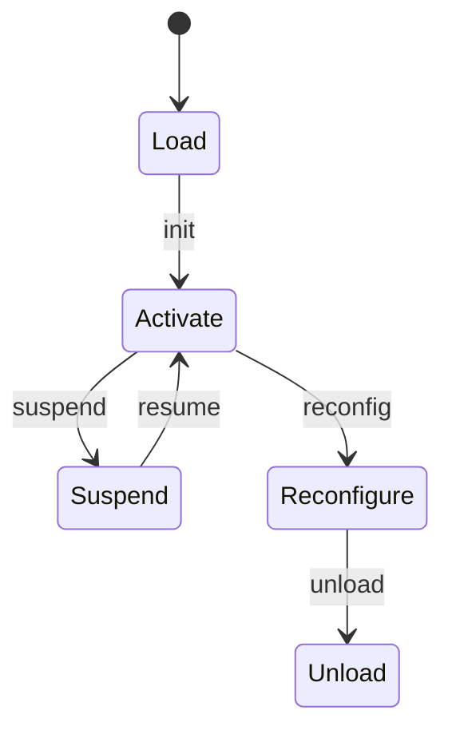

# 统一模块化系统理论 (UMS)

## 目录

- [统一模块化系统理论 (UMS)](#统一模块化系统理论-ums)
  - [目录](#目录)
  - [1. 概述](#1-概述)
    - [1.1 动机与目标](#11-动机与目标)
    - [1.2 核心思想](#12-核心思想)
  - [2. 核心概念与理论基础](#2-核心概念与理论基础)
    - [2.1 模块单元分类](#21-模块单元分类)
    - [2.2 核心设计原则](#22-核心设计原则)
    - [2.3 组合理论](#23-组合理论)
    - [2.4 契约理论](#24-契约理论)
  - [3. 形式化定义](#3-形式化定义)
    - [3.1 统一模块单元 (UMS) 定义](#31-统一模块单元-ums-定义)
    - [3.2 核心元素定义](#32-核心元素定义)
    - [3.3 类型系统](#33-类型系统)
  - [4. 交互语义](#4-交互语义)
    - [4.1 交互模式](#41-交互模式)
      - [4.1.1 同步交互 (Synchronous Interaction)](#411-同步交互-synchronous-interaction)
      - [4.1.2 异步交互 (Asynchronous Interaction)](#412-异步交互-asynchronous-interaction)
      - [4.1.3 事件驱动交互 (Event-Driven Interaction)](#413-事件驱动交互-event-driven-interaction)
    - [4.2 契约语义](#42-契约语义)
      - [4.2.1 前置/后置条件语义](#421-前置后置条件语义)
      - [4.2.2 不变式语义](#422-不变式语义)
      - [4.2.3 时序约束语义](#423-时序约束语义)
    - [4.3 组合语义](#43-组合语义)
      - [4.3.1 行为的并行组合](#431-行为的并行组合)
      - [4.3.2 内部交互的同步与隐藏](#432-内部交互的同步与隐藏)
  - [5. 验证方法与工具链](#5-验证方法与工具链)
    - [5.1 验证概述与核心挑战](#51-验证概述与核心挑战)
    - [5.2 实现-契约满足性验证 (Implementation-Contract Conformance)](#52-实现-契约满足性验证-implementation-contract-conformance)
      - [5.2.1 演绎验证 (Deductive Verification)](#521-演绎验证-deductive-verification)
      - [5.2.2 运行时验证 (Runtime Verification)](#522-运行时验证-runtime-verification)
      - [5.2.3 静态分析与抽象解释](#523-静态分析与抽象解释)
    - [5.3 模块可替换性验证 (Module Substitutability)](#53-模块可替换性验证-module-substitutability)
      - [5.3.1 接口兼容性 (Interface Compatibility)](#531-接口兼容性-interface-compatibility)
      - [5.3.2 行为兼容性 (Behavioral Compatibility / Refinement)](#532-行为兼容性-behavioral-compatibility--refinement)
      - [5.3.3 替换兼容性 (Liskov Substitution Principle)](#533-替换兼容性-liskov-substitution-principle)
    - [5.4 组合正确性验证 (Composition Correctness)](#54-组合正确性验证-composition-correctness)
      - [5.4.1 组合一致性分析 (Compositional Consistency Analysis)](#541-组合一致性分析-compositional-consistency-analysis)
      - [5.4.2 假设-保证推理 (Assume-Guarantee Reasoning)](#542-假设-保证推理-assume-guarantee-reasoning)
      - [5.4.3 组合模型检测 (Compositional Model Checking)](#543-组合模型检测-compositional-model-checking)
    - [5.5 动态适应性验证 (Dynamic Adaptability Verification)](#55-动态适应性验证-dynamic-adaptability-verification)
    - [5.6 自动化工具链支持 (Automated Toolchain Support)](#56-自动化工具链支持-automated-toolchain-support)
      - [5.6.1 建模与分析工具](#561-建模与分析工具)
      - [5.6.2 验证与测试工具](#562-验证与测试工具)
      - [5.6.3 代码生成与部署](#563-代码生成与部署)
  - [6. 动态适应与自演化机制](#6-动态适应与自演化机制)
    - [6.1 组件生命周期状态机](#61-组件生命周期状态机)
      - [6.1.1 状态集合与事件定义](#611-状态集合与事件定义)
      - [6.1.2 状态转移关系](#612-状态转移关系)
      - [6.1.3 UML状态图示例](#613-uml状态图示例)
      - [6.1.4 生命周期管理接口](#614-生命周期管理接口)
    - [6.2 自适应与自愈组件](#62-自适应与自愈组件)
      - [6.2.1 自适应控制器接口](#621-自适应控制器接口)
      - [6.2.2 自愈管理器接口](#622-自愈管理器接口)
      - [6.2.3 典型适应/自愈场景](#623-典型适应自愈场景)
    - [6.3 动态依赖与运行时重绑定](#63-动态依赖与运行时重绑定)
      - [6.3.1 动态依赖注入机制](#631-动态依赖注入机制)
      - [6.3.2 运行时接口重绑定](#632-运行时接口重绑定)
      - [6.3.3 契约与一致性约束](#633-契约与一致性约束)
  - [7. 领域专用扩展](#7-领域专用扩展)
    - [7.1 物联网UMS扩展](#71-物联网ums扩展)
      - [7.1.1 典型组件类型](#711-典型组件类型)
      - [7.1.2 典型接口定义](#712-典型接口定义)
      - [7.1.3 典型结构图](#713-典型结构图)
      - [7.1.4 领域契约与约束](#714-领域契约与约束)
    - [7.2 金融科技UMS扩展](#72-金融科技ums扩展)
      - [7.2.1 典型组件类型](#721-典型组件类型)
      - [7.2.2 典型接口定义](#722-典型接口定义)
      - [7.2.3 典型结构图](#723-典型结构图)
      - [7.2.4 领域契约与约束](#724-领域契约与约束)
    - [7.3 AI系统UMS扩展](#73-ai系统ums扩展)
      - [7.3.1 典型组件类型](#731-典型组件类型)
      - [7.3.2 典型接口定义](#732-典型接口定义)
      - [7.3.3 典型结构图](#733-典型结构图)
      - [7.3.4 领域契约与约束](#734-领域契约与约束)
  - [8. 复杂组合与多级嵌套](#8-复杂组合与多级嵌套)
    - [8.1 递归组合与多层嵌套](#81-递归组合与多层嵌套)
      - [8.1.1 理论定义](#811-理论定义)
      - [8.1.2 形式化描述](#812-形式化描述)
      - [8.1.3 结构图示例](#813-结构图示例)
      - [8.1.4 典型应用场景](#814-典型应用场景)
    - [8.2 跨层依赖与循环依赖](#82-跨层依赖与循环依赖)
      - [8.2.1 问题描述](#821-问题描述)
      - [8.2.2 检测与约束机制](#822-检测与约束机制)
      - [8.2.3 依赖检测算法（伪代码）](#823-依赖检测算法伪代码)
      - [8.2.4 工具支持](#824-工具支持)
    - [8.3 高级组合模式案例](#83-高级组合模式案例)
      - [8.3.1 Composite组合模式](#831-composite组合模式)
      - [8.3.2 Decorator装饰器模式](#832-decorator装饰器模式)
      - [8.3.3 典型应用示例](#833-典型应用示例)
      - [8.3.4 代码片段示例](#834-代码片段示例)
  - [9. 参考实现](#9-参考实现)
    - [9.1 统一模块框架（Rust）](#91-统一模块框架rust)
    - [9.2 统一模块框架（Go）](#92-统一模块框架go)
  - [10. 应用领域与案例](#10-应用领域与案例)
    - [10.1 企业级应用](#101-企业级应用)
    - [10.2 云原生应用](#102-云原生应用)
    - [10.3 API设计](#103-api设计)
    - [10.4 微服务架构](#104-微服务架构)
  - [11. 总结与展望](#11-总结与展望)
  - [12. 参考文献](#12-参考文献)

## 1. 概述

### 1.1 动机与目标

统一模块化系统（Unified Modular System, UMS）理论是研究软件系统中模块单元设计、组合和交互的系统性理论框架。该理论旨在整合传统的组件理论（关注系统的模块化结构和内部实现）与接口理论（关注模块间的交互协议和契约），以提供一个更加完整、一致且可形式化验证的模块化系统理论。

其核心目标包括：

- **概念统一**：统一组件和接口的核心概念与术语。
- **形式化整合**：建立统一的、数学上精确的形式化定义。
- **语义融合**：整合组件交互和接口契约的语义模型。
- **验证统一**：建立统一的模块组合与替换的验证方法。

### 1.2 核心思想

UMS的核心思想是将任何软件功能单元（无论是服务、组件、类库或函数）都抽象为一个自包含、有明确边界和交互契约的**模块单元**。通过对模块单元及其交互的严格形式化定义，实现对复杂软件系统行为的精确描述、分析和验证。

## 2. 核心概念与理论基础

### 2.1 模块单元分类

按功能分类：

1. **业务模块** - 实现特定业务逻辑
2. **技术模块** - 提供技术基础设施
3. **集成模块** - 处理系统间集成
4. **UI模块** - 用户界面模块

按抽象层次分类：

1. **物理层模块** - 硬件层面的模块
2. **协议层模块** - 通信协议层面的模块
3. **应用层模块** - 应用程序层面的模块
4. **语义层模块** - 业务语义层面的模块

按交互模式分类：

1. **同步模块** - 阻塞式交互
2. **异步模块** - 非阻塞式交互
3. **事件驱动模块** - 事件驱动交互
4. **流式模块** - 流式数据交互

### 2.2 核心设计原则

**单一职责原则（SRP）：**
$$\forall m \in M: |Responsibility(m)| = 1$$

**接口隔离原则（ISP）：**
$$\forall i \in P: \exists c \in C: Used(i, c)$$

**依赖倒置原则（DIP）：**
$$High \not\hookleftarrow Low \implies High \hookleftarrow Abstract$$

### 2.3 组合理论

**组合操作：**
$$Compose(M_1, M_2) = M_{12} = (S_{12}, B_{12}, P_{12}, R_{12}, I_{12}, C_{12}, V_{12})$$

其中：

- $P_{12} = P_1 \cup P_2 - \{p | p \in P_1 \cap R_2\}$
- $R_{12} = R_1 \cup R_2 - \{r | r \in R_1 \cap P_2\}$
- $S_{12} = S_1 \times S_2$
- $B_{12} = B_1 \parallel B_2$

**组合约束：**
$$\forall m_1, m_2 \in M: Compatible(m_1, m_2) \implies Valid(Compose(m_1, m_2))$$

### 2.4 契约理论

**前置条件 (Precondition):**
$$Pre(p) = \{c_1, c_2, ..., c_n\}$$

**后置条件 (Postcondition):**
$$Post(p) = \{c_1, c_2, ..., c_m\}$$

**不变性 (Invariant):**
$$Inv(M) = \{c_1, c_2, ..., c_k\}$$

**契约满足：**
$$Satisfies(C, M) \iff \forall p \in P: Pre(p) \land Inv(M) \implies Post(p)$$

## 3. 形式化定义

(当前完成度: 80%)

### 3.1 统一模块单元 (UMS) 定义

模块单元 $M$ 可以形式化地定义为一个七元组：
$$M = (S, B, P, R, I, C, V)$$

其中：

- $S$ 是模块的状态空间 (State Space)，表示模块可能处于的所有状态。
- $B$ 是模块的行为模型 (Behavior Model)，定义模块如何响应输入和产生输出。
- $P$ 是模块提供的功能集合 (Provided Functions)，每个功能包含签名、前置条件和后置条件。
- $R$ 是模块依赖的功能集合 (Required Functions)，表示模块需要的外部功能。
- $I$ 是模块的实现细节 (Implementation Details)，包括算法、数据结构等，通常视为黑盒。
- $C$ 是模块的交互契约 (Interaction Contract)，定义模块与其他模块交互的规则。
- $V$ 是模块的版本信息 (Version)，包括版本号、兼容性信息等。

### 3.2 核心元素定义

**功能 (Function) 定义：**

功能 $F$ 可以定义为一个三元组 $(Sig, Pre, Post)$，其中：

- $Sig$ 是功能的签名 (Signature)，包括名称和参数类型。
- $Pre$ 是功能的前置条件 (Preconditions)。
- $Post$ 是功能的后置条件 (Postconditions)。

**交互契约 (Contract) 定义：**

交互契约 $C$ 可以定义为一个三元组 $(Com, Sub, Pro)$，其中：

- $Com$ 是组合规则 (Composition Rules)。
- $Sub$ 是替换规则 (Substitution Rules)。
- $Pro$ 是协议约束 (Protocol Constraints)，定义模块间交互的时序和顺序。

### 3.3 类型系统

**基本类型：**
$$T_{basic} = \{int, float, string, bool, null\}$$

**复合类型：**
$$T_{composite} = \{array, object, union, intersection\}$$

**函数类型：**
$$T_{function} = T_{param} \rightarrow T_{return}$$

## 4. 交互语义

(当前完成度: 70%)

此部分旨在对模块间的交互行为提供严格的语义解释，确保交互的正确性和可预测性。

### 4.1 交互模式

#### 4.1.1 同步交互 (Synchronous Interaction)

同步交互是最基本的请求-响应模式。其语义可以被建模为一个简单的阻塞式状态转换。当模块 $M_1$调用$M_2$的功能$p$时：

1. $M_1$进入`Waiting`状态。
2. $M_2$执行功能$p$的实现$I(p)$。
3. $M_2$返回结果$res$。
4. $M_1$从`Waiting`状态唤醒，接收结果$res$，并继续执行。

操作语义可以表示为：
$$ \frac{M_2 \vdash \langle I(p), state_2 \rangle \Downarrow \langle res, state'_2 \rangle}{M_1 \parallel M_2 \vdash \langle M_1.call(M_2.p), state_1 \rangle \rightarrow \langle res, state'_1 \rangle} $$

#### 4.1.2 异步交互 (Asynchronous Interaction)

异步交互通过回调或Promise/Future机制实现非阻塞调用。

- **基于Promise/Future**: 调用$M_2.p$会立即返回一个Promise对象$prom$。
  - $prom$的内部状态可以是`Pending`, `Fulfilled(value)`, 或 `Rejected(error)`。
  - 调用方$M_1$可以随时查询$prom$的状态，或者注册一个回调函数在$prom$状态变为`Fulfilled`或`Rejected`时被触发。

#### 4.1.3 事件驱动交互 (Event-Driven Interaction)

事件驱动交互通过发布-订阅模式解耦了模块。

- **事件(Event)**: 一个携带数据的命名消息，如`OrderCreated(orderId)`。
- **发布(Publish)**: 模块可以向一个事件总线(Event Bus)发布事件，而无需知道谁是接收者。
- **订阅(Subscribe)**: 模块可以订阅它感兴趣的特定事件。当事件被发布时，事件总线会通知所有订阅者。
- **行为模型**: 在此模式下，模块的行为模型 $B$ 通常被定义为一组事件处理器：$B = \{on(E_1) \rightarrow H_1, on(E_2) \rightarrow H_2, ...\}$。

### 4.2 契约语义

契约语义为模块交互的正确性提供了形式化基础。

#### 4.2.1 前置/后置条件语义

我们采用霍尔逻辑（Hoare Logic）中的三元组来定义契约：
$$ \{Pre\} \ I(p) \ \{Post\} $$

- **$Pre$ (前置条件)**: 一个在调用功能$p$之前必须为真的断言。这是**调用者**的责任。
- **$Post$ (后置条件)**: 一个在功能$p$执行成功后保证为真的断言。这是**实现者**的责任。
- **$I(p)$**: 功能$p$的实现。

如果调用者在不满足$Pre$的情况下调用了$p$，那么实现者不承担任何责任。如果调用者满足了$Pre$，那么实现者必须确保执行结束后$Post$为真。

#### 4.2.2 不变式语义

不变式$Inv(M)$是一个在模块$M$的整个生命周期中都必须保持为真的属性。

- 在模块初始化后，不变式必须为真。
- 对于模块提供的任何一个公开功能$p$，在其执行前后，不变式都必须为真。即对于所有$p \in P(M)$，以下必须成立：
    $$ \{Pre(p) \land Inv(M)\} \ I(p) \ \{Post(p) \land Inv(M)\} $$

#### 4.2.3 时序约束语义

时序约束定义了功能调用的合法顺序。我们可以使用线性时序逻辑（LTL）或类似的形式体系来规约。

- **LTL公式**: 我们可以用LTL公式来描述事件序列的属性。
  - $G(\text{request} \rightarrow F(\text{response}))$: 全局来看（Globally），任何一个`request`事件之后，最终（Finally）都会有一个`response`事件。
  - $G(\text{login} \rightarrow X(\text{authorized}))$: 全局来看，任何一个`login`事件之后，下一个（Next）状态必须是`authorized`。
- **状态机模型**: 这些约束最终可以被编译成一个协议状态机，用于在运行时监控或静态分析交互的合法性。

### 4.3 组合语义

组合语义的目标是精确定义组合模块 $M_{12} = Compose(M_1, M_2)$ 的行为模型 $B_{12}$ 是如何从其构成部分 $B_1$ 和 $B_2$ 的行为派生而来的。这通常借鉴自进程代数（Process Algebra）的思想。

#### 4.3.1 行为的并行组合

组合模块的行为是其子模块行为的并行组合，并允许它们的独立行为任意交织（Interleaving）。我们用并行组合算子 `||` 来表示：
$$ B_{interleaved} = B_1 \parallel B_2 $$
这意味着，如果$M_1$有一个动作$a_1$, $M_2$有一个动作$a_2$，那么$M_{12}$可以先后执行$a_1$和$a_2$，也可以先后执行$a_2$和$a_1$。

#### 4.3.2 内部交互的同步与隐藏

当$M_1$提供的一个功能$p$被$M_2$的依赖$r$所满足时，这个交互在组合模块$M_{12}$的内部发生。

1. **同步 (Synchronization)**: 模块$M_1$的输出动作 `p!` 和 $M_2$ 的输入动作 `r?` 会同步发生，形成一个内部的 $\tau$ 动作。
2. **隐藏 (Hiding)**: 这个同步后的 $\tau$ 动作对外部环境是不可见的。我们可以使用隐藏算子 `\` 来表示。

最终，组合模块的行为模型 $B_{12}$ 是其子模块行为并行组合后，再隐藏其内部交互的结果：
$$ B_{12} = (B_1 \parallel B_2) \setminus \{p, r\} $$
其中 $\{p, r\}$ 是被内部化和隐藏的交互通道。

## 5. 验证方法与工具链

(当前完成度: 50% -> **重构整合后，待深化**)

本章节旨在提供一套完整、多层次的验证方法与工具链支持，以确保基于UMS理论构建的系统在模块实现、替换、组合及动态演化等各个环节的正确性、健壮性与可靠性。

### 5.1 验证概述与核心挑战

验证模块化系统的核心挑战在于状态空间爆炸和系统复杂性。单个模块的行为可能简单，但它们的组合行为却呈指数级增长。UMS的验证方法旨在通过"分而治之"的策略应对此挑战，其核心思想是：

1. **实现-契约验证**：保证单个模块的实现符合其对外声明的契约。
2. **模块可替换性**：保证一个模块可以被另一个模块安全替换而不破坏系统。
3. **组合正确性**：保证模块的组合行为符合预期，即便是在大规模、多层嵌套的场景下。

### 5.2 实现-契约满足性验证 (Implementation-Contract Conformance)

此类验证旨在回答"模块的实现 $I$ 是否符合其规约的契约 $C$？"，确保模块的内部行为与其对外承诺一致。

#### 5.2.1 演绎验证 (Deductive Verification)

此方法将程序正确性问题转化为一个数学证明问题。

1. **逻辑转换**: 将模块的实现代码 $I$ 和契约 $C$（前置条件、后置条件、不变量）都翻译成形式化的逻辑语言（如一阶逻辑）。
2. **证明构造**: 使用一个定理证明器（如SMT求解器[Z3](https://github.com/Z3Prover/z3)或形式化证明助手[Isabelle/HOL](https://isabelle.in.tum.de/)）来自动或半自动地证明，对于所有可能的输入，实现都满足契约。
3. **核心技术**: 该方法常基于霍尔逻辑（Hoare Logic）或最弱前置条件（Weakest Precondition）演算。例如，对于一个具有实现体 `{B}` 和契约 `(pre, post)` 的函数，我们需要证明 `pre ⇒ wp({B}, post)`。

**示例：**

- **功能**: `add(x: int, y: int) -> int`
- **前置条件**: `x > 0`
- **后置条件**: `result > x`
- **实现**: `return x + y`
- **待证明**: 我们需要证明 `(x > 0) ⇒ (x + y > x)`。如果 `y` 的类型约束为正整数，此证明为真；否则，如果 `y` 可以为0或负数，则实现不满足契约，演绎验证会失败。

这种方法的优点是能提供最强的正确性保证，但通常需要大量的专家干预和注解。

#### 5.2.2 运行时验证 (Runtime Verification)

运行时验证在程序执行期间动态地监控其行为是否违反了契约。

1. **代码插桩**: 在编译或加载时，自动在代码中插入断言（Assertions），这与第9节定义的`ModuleError`中的错误类型紧密对应。
    - 在函数入口检查前置条件 (违反则抛出 `PreconditionNotMet`)。
    - 在函数出口检查后置条件 (违反则抛出 `PostconditionNotMet`)。
    - 在特定点检查不变量。
2. **异常报告**: 如果任何一个断言在运行时失败，系统会立即抛出异常，从而精确地定位错误。

**Rust示例 (链接第9.1节的参考实现):**

```rust
// 引用第9.1节的定义
// pub fn process(&self, input: ModuleInput) -> Result<ModuleOutput, ModuleError>

// 假设一个 "deposit" 功能
if input.function == "deposit" {
    let amount = input.parameters.get("amount").and_then(|v| v.as_f64()).unwrap_or(0.0);

    // 运行时检查前置条件: amount > 0
    // 对应 Function.preconditions
    if amount <= 0.0 {
        return Err(ModuleError::PreconditionNotMet(
            "Deposit amount must be positive".to_string()
        ));
    }
    
    // ... 执行核心逻辑 ...

    // 运行时检查后置条件: 账户余额增加
    // 对应 Function.postconditions
    // ...
}
```

这种方法是"契约式设计"（Design by Contract）的核心实践，虽然不能保证完全没有错误，但它是一种极其强大的调试和测试工具。

#### 5.2.3 静态分析与抽象解释

静态分析在程序执行前通过分析代码结构来发现潜在问题。

1. **类型检查**: 确保模块间的接口类型匹配。
2. **控制流分析**: 分析可能的执行路径，发现不可达代码或潜在的死锁。
3. **数据流分析**: 追踪数据在模块间的流动，发现数据竞争或资源泄漏。
4. **抽象解释**: 使用抽象域来近似程序状态，在保证安全性的前提下提高分析效率。

**示例 - 依赖分析:**

```rust
// 分析模块依赖关系
fn analyze_dependencies(module: &Module) -> DependencyGraph {
    let mut graph = DependencyGraph::new();
    
    for required in &module.required_functions {
        // 检查是否存在提供该功能的模块
        if let Some(provider) = find_provider(required) {
            graph.add_dependency(module.id, provider.id);
        } else {
            // 报告缺失依赖
            report_missing_dependency(module, required);
        }
    }
    
    graph
}
```

### 5.3 模块可替换性验证 (Module Substitutability)

此类验证旨在回答"模块 $M_2$ 是否可以安全地替换模块 $M_1$？"，确保替换不会破坏系统的正确性。

#### 5.3.1 接口兼容性 (Interface Compatibility)

接口兼容性检查确保替换模块提供了原模块的所有功能，并且签名匹配。

**形式化定义:**
$$ Compatible(M_1, M_2) \iff \forall p \in P(M_1): \exists p' \in P(M_2): Compatible(p, p') $$

其中 $Compatible(p, p')$ 表示功能 $p$ 和 $p'$ 的签名兼容。

**兼容性检查算法:**

```rust
fn check_interface_compatibility(original: &Module, replacement: &Module) -> CompatibilityResult {
    let mut result = CompatibilityResult::new();
    
    for original_func in &original.provided_functions {
        if let Some(replacement_func) = replacement.find_function(&original_func.name) {
            // 检查参数类型兼容性
            if !check_parameter_compatibility(&original_func.signature, &replacement_func.signature) {
                result.add_incompatibility(
                    IncompatibilityType::ParameterMismatch,
                    &original_func.name
                );
            }
            
            // 检查返回类型兼容性
            if !check_return_compatibility(&original_func.signature, &replacement_func.signature) {
                result.add_incompatibility(
                    IncompatibilityType::ReturnTypeMismatch,
                    &original_func.name
                );
            }
        } else {
            // 缺失功能
            result.add_incompatibility(
                IncompatibilityType::MissingFunction,
                &original_func.name
            );
        }
    }
    
    result
}
```

#### 5.3.2 行为兼容性 (Behavioral Compatibility / Refinement)

行为兼容性检查确保替换模块的行为是原模块行为的精化（Refinement）。

**精化关系定义:**
$$ M_2 \sqsubseteq M_1 \iff \forall \sigma \in Traces(M_1): \exists \sigma' \in Traces(M_2): \sigma' \sqsubseteq \sigma $$

其中 $Traces(M)$ 表示模块 $M$ 的所有可能执行轨迹，$\sigma' \sqsubseteq \sigma$ 表示轨迹 $\sigma'$ 是轨迹 $\sigma$ 的精化。

**行为验证方法:**

```rust
fn verify_behavioral_compatibility(original: &Module, replacement: &Module) -> VerificationResult {
    let mut result = VerificationResult::new();
    
    // 1. 状态空间包含性检查
    if !check_state_space_inclusion(&replacement.state_space, &original.state_space) {
        result.add_violation(VerificationViolation::StateSpaceMismatch);
    }
    
    // 2. 转换关系精化检查
    for (state, transitions) in &original.transitions {
        if let Some(replacement_transitions) = replacement.transitions.get(state) {
            for transition in transitions {
                if !has_refinement_transition(transition, replacement_transitions) {
                    result.add_violation(VerificationViolation::TransitionMismatch);
                }
            }
        }
    }
    
    // 3. 契约精化检查
    for (func_name, original_contract) in &original.contracts {
        if let Some(replacement_contract) = replacement.contracts.get(func_name) {
            if !check_contract_refinement(original_contract, replacement_contract) {
                result.add_violation(VerificationViolation::ContractMismatch);
            }
        }
    }
    
    result
}
```

#### 5.3.3 替换兼容性 (Liskov Substitution Principle)

替换兼容性检查确保替换模块满足里氏替换原则。

**里氏替换原则形式化:**
$$ \forall M_1, M_2: M_2 \text{ is substitutable for } M_1 \iff $$
$$ \forall C \text{ that uses } M_1: C[M_1/M_2] \text{ behaves correctly} $$

其中 $C[M_1/M_2]$ 表示在上下文 $C$ 中用 $M_2$ 替换 $M_1$。

**替换测试框架:**

```rust
fn test_substitution(original: &Module, replacement: &Module, test_suite: &TestSuite) -> SubstitutionResult {
    let mut result = SubstitutionResult::new();
    
    for test_case in test_suite {
        // 使用原模块运行测试
        let original_result = run_test_with_module(test_case, original);
        
        // 使用替换模块运行测试
        let replacement_result = run_test_with_module(test_case, replacement);
        
        // 检查结果兼容性
        if !results_compatible(&original_result, &replacement_result) {
            result.add_failure(test_case, original_result, replacement_result);
        }
    }
    
    result
}
```

### 5.4 组合正确性验证 (Composition Correctness)

此类验证旨在回答"组合后的模块系统是否满足预期的行为？"，确保组合的正确性。

#### 5.4.1 组合一致性分析 (Compositional Consistency Analysis)

组合一致性分析检查组合后的系统是否存在内部冲突。

**一致性检查:**

```rust
fn check_composition_consistency(modules: &[Module]) -> ConsistencyResult {
    let mut result = ConsistencyResult::new();
    
    // 1. 检查循环依赖
    let dependency_graph = build_dependency_graph(modules);
    if has_cycle(&dependency_graph) {
        result.add_violation(ConsistencyViolation::CircularDependency);
    }
    
    // 2. 检查接口冲突
    for (i, module1) in modules.iter().enumerate() {
        for (j, module2) in modules.iter().enumerate() {
            if i != j {
                if let Some(conflict) = check_interface_conflict(module1, module2) {
                    result.add_violation(ConsistencyViolation::InterfaceConflict(conflict));
                }
            }
        }
    }
    
    // 3. 检查资源冲突
    let resource_usage = analyze_resource_usage(modules);
    if has_resource_conflict(&resource_usage) {
        result.add_violation(ConsistencyViolation::ResourceConflict);
    }
    
    result
}
```

#### 5.4.2 假设-保证推理 (Assume-Guarantee Reasoning)

假设-保证推理是一种组合验证技术，通过分解系统来避免状态空间爆炸。

**形式化框架:**
$$ \frac{M_1 \models A_1 \rightarrow G_1 \quad M_2 \models A_2 \rightarrow G_2 \quad G_1 \models A_2 \quad G_2 \models A_1}{M_1 \parallel M_2 \models G_1 \land G_2} $$

其中 $A_i$ 是模块 $M_i$ 的假设，$G_i$ 是模块 $M_i$ 的保证。

**实现示例:**

```rust
fn assume_guarantee_reasoning(modules: &[Module], global_property: &Property) -> VerificationResult {
    let mut result = VerificationResult::new();
    
    // 1. 为每个模块生成假设和保证
    let assumptions_guarantees: Vec<(Property, Property)> = modules
        .iter()
        .map(|module| generate_assumption_guarantee(module))
        .collect();
    
    // 2. 验证每个模块满足其保证
    for (i, module) in modules.iter().enumerate() {
        let (assumption, guarantee) = &assumptions_guarantees[i];
        if !verify_module_property(module, assumption, guarantee) {
            result.add_violation(VerificationViolation::ModulePropertyViolation(i));
        }
    }
    
    // 3. 验证假设-保证的循环依赖
    if !verify_assumption_guarantee_cycle(&assumptions_guarantees) {
        result.add_violation(VerificationViolation::AssumptionGuaranteeCycle);
    }
    
    // 4. 验证全局属性
    let combined_guarantees = combine_guarantees(&assumptions_guarantees);
    if !implies(&combined_guarantees, global_property) {
        result.add_violation(VerificationViolation::GlobalPropertyViolation);
    }
    
    result
}
```

#### 5.4.3 组合模型检测 (Compositional Model Checking)

组合模型检测通过分解系统状态空间来提高模型检测的效率。

**算法框架:**

```rust
fn compositional_model_checking(modules: &[Module], property: &Property) -> ModelCheckingResult {
    let mut result = ModelCheckingResult::new();
    
    // 1. 构建组合状态机
    let composed_system = compose_modules(modules);
    
    // 2. 应用状态空间约简技术
    let reduced_system = apply_reduction_techniques(&composed_system);
    
    // 3. 执行模型检测
    let verification_result = model_check(&reduced_system, property);
    
    match verification_result {
        ModelCheckingResult::Satisfied => {
            result.set_satisfied();
        }
        ModelCheckingResult::Violated(counterexample) => {
            result.set_violated(counterexample);
        }
        ModelCheckingResult::Unknown => {
            // 尝试更精确的分析
            let precise_result = precise_analysis(&composed_system, property);
            result.merge(precise_result);
        }
    }
    
    result
}
```

### 5.5 动态适应性验证 (Dynamic Adaptability Verification)

动态适应性验证检查系统在运行时重构和适应的正确性。

**适应性验证框架:**

```rust
fn verify_dynamic_adaptation(
    original_system: &System,
    adaptation_plan: &AdaptationPlan,
    target_system: &System
) -> AdaptationVerificationResult {
    let mut result = AdaptationVerificationResult::new();
    
    // 1. 验证适应计划的可行性
    if !is_adaptation_plan_feasible(original_system, adaptation_plan) {
        result.add_violation(AdaptationViolation::InfeasiblePlan);
    }
    
    // 2. 验证适应过程的安全性
    let intermediate_states = generate_intermediate_states(original_system, adaptation_plan);
    for state in intermediate_states {
        if !is_safe_state(&state) {
            result.add_violation(AdaptationViolation::UnsafeIntermediateState);
        }
    }
    
    // 3. 验证目标系统的正确性
    if !verify_system_properties(target_system) {
        result.add_violation(AdaptationViolation::TargetSystemInvalid);
    }
    
    // 4. 验证适应的一致性
    if !verify_adaptation_consistency(original_system, target_system) {
        result.add_violation(AdaptationViolation::InconsistentAdaptation);
    }
    
    result
}
```

### 5.6 自动化工具链支持 (Automated Toolchain Support)

#### 5.6.1 建模与分析工具

**统一建模工具:**

```rust
pub struct UMSModelingTool {
    // 支持多种建模语言
    modeling_languages: Vec<ModelingLanguage>,
    // 模型转换引擎
    transformation_engine: TransformationEngine,
    // 模型验证器
    model_validator: ModelValidator,
}

impl UMSModelingTool {
    pub fn create_module_model(&self, specification: &ModuleSpec) -> Result<ModuleModel, ModelingError> {
        // 从规约创建模块模型
        let model = self.parse_specification(specification)?;
        
        // 验证模型的一致性
        self.model_validator.validate(&model)?;
        
        Ok(model)
    }
    
    pub fn transform_model(&self, model: &ModuleModel, target_language: &ModelingLanguage) -> Result<ModuleModel, TransformationError> {
        // 模型转换
        self.transformation_engine.transform(model, target_language)
    }
}
```

#### 5.6.2 验证与测试工具

**统一验证工具:**

```rust
pub struct UMSVerificationTool {
    // 多种验证引擎
    verification_engines: HashMap<VerificationType, Box<dyn VerificationEngine>>,
    // 验证结果分析器
    result_analyzer: ResultAnalyzer,
    // 报告生成器
    report_generator: ReportGenerator,
}

impl UMSVerificationTool {
    pub fn verify_module(&self, module: &Module, verification_type: VerificationType) -> VerificationResult {
        if let Some(engine) = self.verification_engines.get(&verification_type) {
            let raw_result = engine.verify(module);
            self.result_analyzer.analyze(raw_result)
        } else {
            VerificationResult::Error(VerificationError::UnsupportedType(verification_type))
        }
    }
    
    pub fn generate_verification_report(&self, results: &[VerificationResult]) -> VerificationReport {
        self.report_generator.generate(results)
    }
}
```

#### 5.6.3 代码生成与部署

**代码生成工具:**

```rust
pub struct UMSCodeGenerator {
    // 代码模板引擎
    template_engine: TemplateEngine,
    // 代码优化器
    code_optimizer: CodeOptimizer,
    // 代码验证器
    code_validator: CodeValidator,
}

impl UMSCodeGenerator {
    pub fn generate_code(&self, module_model: &ModuleModel, target_language: &ProgrammingLanguage) -> Result<GeneratedCode, GenerationError> {
        // 1. 选择代码模板
        let template = self.template_engine.select_template(module_model, target_language)?;
        
        // 2. 生成初始代码
        let initial_code = self.template_engine.generate(template, module_model)?;
        
        // 3. 优化代码
        let optimized_code = self.code_optimizer.optimize(initial_code)?;
        
        // 4. 验证生成的代码
        self.code_validator.validate(&optimized_code)?;
        
        Ok(optimized_code)
    }
}
```

## 6. 动态适应与自演化机制

### 6.1 组件生命周期状态机

#### 6.1.1 状态集合与事件定义

- **状态集合**：  
  $S = \{Load, Activate, Suspend, Unload, Reconfigure\}$
- **事件集合**：  
  $E = \{init, suspend, resume, reconfig, unload\}$

#### 6.1.2 状态转移关系

- 形式化定义：  
  $T \subseteq S \times E \times S$
- 状态转移表：

| 当前状态      | 事件      | 下一个状态    | 说明           |
|---------------|-----------|--------------|----------------|
| Load          | init      | Activate     | 初始化激活     |
| Activate      | suspend   | Suspend      | 挂起           |
| Suspend       | resume    | Activate     | 恢复激活       |
| Activate      | reconfig  | Reconfigure  | 动态重配置     |
| Reconfigure   | unload    | Unload       | 卸载           |

#### 6.1.3 UML状态图示例



#### 6.1.4 生命周期管理接口

```rust
trait Lifecycle {
    fn load(&mut self) -> Result<(), Error>;
    fn activate(&mut self) -> Result<(), Error>;
    fn suspend(&mut self) -> Result<(), Error>;
    fn resume(&mut self) -> Result<(), Error>;
    fn reconfigure(&mut self, config: &Config) -> Result<(), Error>;
    fn unload(&mut self) -> Result<(), Error>;
    fn current_state(&self) -> State;
}
```

### 6.2 自适应与自愈组件

#### 6.2.1 自适应控制器接口

```rust
trait AdaptiveController {
    fn monitor(&self) -> SystemState;
    fn adapt(&mut self, context: &AdaptContext) -> AdaptResult;
}
```

- **monitor**：实时监控系统状态，采集关键指标。
- **adapt**：根据上下文和策略动态调整组件行为。

#### 6.2.2 自愈管理器接口

```rust
trait SelfHealingManager {
    fn detect_fault(&self) -> Option<Fault>;
    fn recover(&mut self, fault: &Fault) -> RecoveryResult;
}
```

- **detect_fault**：检测系统异常或故障。
- **recover**：自动执行恢复操作，保证系统可用性。

#### 6.2.3 典型适应/自愈场景

- 微服务自动扩缩容
- IoT设备断线重连与自恢复
- 分布式系统节点故障自愈

### 6.3 动态依赖与运行时重绑定

#### 6.3.1 动态依赖注入机制

- 支持组件在运行时动态注入/替换依赖对象。
- 依赖注入契约示例：

```rust
trait DependencyInjectable {
    fn inject_dependency(&mut self, dep: Box<dyn AnyDependency>);
}
```

#### 6.3.2 运行时接口重绑定

- 允许组件在运行时切换接口实现，提升系统灵活性与可维护性。
- 典型场景：灰度发布、A/B测试、热升级。

#### 6.3.3 契约与一致性约束

- 依赖可用性：所有依赖必须在激活前注入且可用。
- 接口兼容性：新绑定接口需满足原有契约。
- 验证方法：运行时契约检查、依赖一致性自动验证。

## 7. 领域专用扩展

### 7.1 物联网UMS扩展

#### 7.1.1 典型组件类型

- DeviceComponent：代表物理设备或虚拟设备的抽象。
- ProtocolAdapter：实现不同通信协议（如MQTT、CoAP、Modbus等）的适配。
- DataCollector：负责数据采集、预处理与上传。

#### 7.1.2 典型接口定义

```rust
trait DeviceComponent {
    fn connect(&self) -> Result<Connection, Error>;
    fn collect_data(&self) -> SensorData;
    fn send_command(&mut self, cmd: &DeviceCommand) -> Result<(), Error>;
}
trait ProtocolAdapter {
    fn encode(&self, msg: &Message) -> Vec<u8>;
    fn decode(&self, data: &[u8]) -> Result<Message, Error>;
}
trait DataCollector {
    fn start(&mut self);
    fn stop(&mut self);
    fn on_data(&mut self, data: SensorData);
}
```

#### 7.1.3 典型结构图

```text
[DeviceComponent] <--> [ProtocolAdapter] <--> [DataCollector] --> [CloudService]
```

#### 7.1.4 领域契约与约束

- 设备唯一性、协议兼容性、数据完整性等。
- 典型验证方法：设备注册一致性检查、协议适配自动验证、数据流完整性校验。

### 7.2 金融科技UMS扩展

#### 7.2.1 典型组件类型

- AccountComponent：账户管理与操作。
- RiskEngine：风险评估与风控决策。
- ComplianceContract：合规性检查与审计。

#### 7.2.2 典型接口定义

```rust
trait AccountComponent {
    fn open_account(&mut self, info: &AccountInfo) -> AccountId;
    fn check_balance(&self, id: &AccountId) -> Amount;
    fn transfer(&mut self, from: &AccountId, to: &AccountId, amount: Amount) -> Result<(), Error>;
}
trait RiskEngine {
    fn assess(&self, tx: &Transaction) -> RiskLevel;
    fn alert(&self, risk: RiskLevel) -> bool;
}
trait ComplianceContract {
    fn check(&self, tx: &Transaction) -> ComplianceResult;
    fn audit(&self, period: &TimeRange) -> AuditReport;
}
```

#### 7.2.3 典型结构图

```text
[AccountComponent] <--> [RiskEngine] <--> [ComplianceContract] --> [Regulator]
```

#### 7.2.4 领域契约与约束

- 账户唯一性、交易合规性、风险阈值等。
- 典型验证方法：合规性自动检查、风险模型回测、账户一致性校验。

### 7.3 AI系统UMS扩展

#### 7.3.1 典型组件类型

- ModelComponent：AI模型的加载、推理与管理。
- InferenceService：对外提供推理服务的接口。
- DataFlowContract：数据流动与处理的契约。

#### 7.3.2 典型接口定义

```rust
trait ModelComponent {
    fn load_model(&mut self, model_path: &str) -> Result<(), Error>;
    fn predict(&self, input: &ModelInput) -> ModelOutput;
    fn update_model(&mut self, new_model: &ModelData) -> Result<(), Error>;
}

trait InferenceService {
    fn serve(&self, request: &InferenceRequest) -> InferenceResponse;
    fn batch_process(&self, requests: &[InferenceRequest]) -> Vec<InferenceResponse>;
    fn get_metrics(&self) -> ServiceMetrics;
}

trait DataFlowContract {
    fn validate_input(&self, data: &InputData) -> ValidationResult;
    fn process_data(&self, data: &InputData) -> ProcessedData;
    fn validate_output(&self, data: &OutputData) -> ValidationResult;
}
```

#### 7.3.3 典型结构图

```text
[DataFlowContract] --> [ModelComponent] --> [InferenceService] --> [Client]
```

#### 7.3.4 领域契约与约束

- 模型一致性、推理准确性、数据隐私保护等。
- 典型验证方法：模型性能评估、推理延迟监控、数据流完整性校验。

## 8. 复杂组合与多级嵌套

### 8.1 递归组合与多层嵌套

#### 8.1.1 理论定义

- 递归组合：模块可以作为其他模块的子模块，形成树状或图状结构。
- 多层嵌套：支持任意深度的模块嵌套，允许复合模块包含子模块，子模块又可继续嵌套。

#### 8.1.2 形式化描述

- 设 $M$ 为模块集合，$C: M \rightarrow 2^M$ 为组合关系映射。
- 递归定义：$\forall m \in M, C(m) = \{m_1, m_2, ..., m_k\}$，其中每个 $m_i$ 也可有自己的子模块。
- 嵌套深度 $d(m)$ 可通过递归计算。

#### 8.1.3 结构图示例

```text
[RootComponent]
    ├── [SubComponentA]
    │      └── [SubSubComponentA1]
    └── [SubComponentB]
```

#### 8.1.4 典型应用场景

- 微服务聚合（如API聚合网关）
- 复杂业务流程的分层实现
- 插件系统的多级扩展

### 8.2 跨层依赖与循环依赖

#### 8.2.1 问题描述

- 跨层依赖：上层模块依赖下层模块，下层模块又反向依赖上层，形成依赖环。
- 循环依赖：模块间直接或间接形成环状依赖，可能导致死锁、初始化失败等问题。

#### 8.2.2 检测与约束机制

- 静态分析：在建模或编译阶段，自动检测依赖图中的环。
- 运行时检测：系统启动或动态加载时，检测依赖关系的合法性。
- 约束规则：禁止直接或间接的循环依赖，推荐分层架构设计。

#### 8.2.3 依赖检测算法（伪代码）

```rust
fn has_cycle(graph: &DependencyGraph) -> bool {
    // 使用深度优先遍历检测环
    // ...
}
```

#### 8.2.4 工具支持

- 建模工具自动高亮依赖环
- 验证工具输出依赖分析报告

### 8.3 高级组合模式案例

#### 8.3.1 Composite组合模式

- 允许将对象组合成树形结构以表示"部分-整体"层次结构。
- UMS实现：复合模块实现统一接口，递归调用子模块。

#### 8.3.2 Decorator装饰器模式

- 动态地为对象添加额外功能。
- UMS实现：通过组合和契约扩展，动态增强模块行为。

#### 8.3.3 典型应用示例

- 微服务聚合：API聚合服务作为复合模块，统一对外接口。
- 插件系统：插件作为装饰器动态增强主系统功能。

#### 8.3.4 代码片段示例

```rust
trait Module {
    fn execute(&self, input: &Input) -> Output;
}
struct CompositeModule {
    children: Vec<Box<dyn Module>>,
}
impl Module for CompositeModule {
    fn execute(&self, input: &Input) -> Output {
        // 聚合所有子模块的输出
    }
}
```

## 9. 参考实现

### 9.1 统一模块框架（Rust）

```rust
use std::collections::HashMap;
use std::sync::{Arc, Mutex};
use tokio::sync::mpsc;
use serde::{Deserialize, Serialize};

/// 模块单元接口
pub trait Module: Send + Sync {
    fn id(&self) -> &str;
    fn name(&self) -> &str;
    fn version(&self) -> &str;
    fn provided_functions(&self) -> Vec<Function>;
    fn required_functions(&self) -> Vec<FunctionRef>;
    fn process(&self, input: ModuleInput) -> Result<ModuleOutput, ModuleError>;
    fn get_state(&self) -> ModuleState;
    fn set_state(&mut self, state: ModuleState) -> Result<(), ModuleError>;
}

/// 模块输入
#[derive(Debug, Clone, Serialize, Deserialize)]
pub struct ModuleInput {
    pub function: String,
    pub parameters: HashMap<String, serde_json::Value>,
    pub context: Context,
}

/// 模块输出
#[derive(Debug, Clone, Serialize, Deserialize)]
pub struct ModuleOutput {
    pub result: serde_json::Value,
    pub status: OutputStatus,
    pub metadata: HashMap<String, String>,
}

/// 上下文
#[derive(Debug, Clone, Serialize, Deserialize)]
pub struct Context {
    pub caller: Option<String>,
    pub transaction_id: String,
    pub timestamp: i64,
    pub metadata: HashMap<String, String>,
}

#[derive(Debug, Clone, Serialize, Deserialize)]
pub enum OutputStatus {
    Success,
    Error(String),
    Partial,
}

/// 模块状态
#[derive(Debug, Clone, Serialize, Deserialize)]
pub struct ModuleState {
    pub id: String,
    pub status: ModuleStatus,
    pub data: HashMap<String, serde_json::Value>,
    pub metrics: ModuleMetrics,
}

#[derive(Debug, Clone, Serialize, Deserialize)]
pub enum ModuleStatus {
    Active,
    Inactive,
    Error(String),
    Processing,
}

/// 模块指标
#[derive(Debug, Clone, Serialize, Deserialize)]
pub struct ModuleMetrics {
    pub throughput: f64,
    pub latency: f64,
    pub error_rate: f64,
    pub availability: f64,
}

/// 功能定义
#[derive(Debug, Clone, Serialize, Deserialize)]
pub struct Function {
    pub signature: Signature,
    pub preconditions: Vec<Condition>,
    pub postconditions: Vec<Condition>,
    pub protocol: Option<Protocol>,
}

/// 功能引用
#[derive(Debug, Clone, Serialize, Deserialize)]
pub struct FunctionRef {
    pub module_id: Option<String>,
    pub signature: Signature,
}

/// 签名定义
#[derive(Debug, Clone, Serialize, Deserialize)]
pub struct Signature {
    pub name: String,
    pub parameters: Vec<Parameter>,
    pub return_type: Type,
    pub description: String,
}

/// 参数定义
#[derive(Debug, Clone, Serialize, Deserialize)]
pub struct Parameter {
    pub name: String,
    pub type_info: Type,
    pub required: bool,
    pub default_value: Option<serde_json::Value>,
    pub validation: Option<ValidationRule>,
}

/// 类型定义
#[derive(Debug, Clone, Serialize, Deserialize)]
pub enum Type {
    Basic(BasicType),
    Composite(CompositeType),
    Function(FunctionType),
    Generic(GenericType),
}

#[derive(Debug, Clone, Serialize, Deserialize)]
pub enum BasicType {
    Int,
    Float,
    String,
    Bool,
    Null,
}

#[derive(Debug, Clone, Serialize, Deserialize)]
pub enum CompositeType {
    Array(Box<Type>),
    Object(HashMap<String, Type>),
    Union(Vec<Type>),
    Intersection(Vec<Type>),
}

#[derive(Debug, Clone, Serialize, Deserialize)]
pub struct FunctionType {
    pub parameters: Vec<Type>,
    pub return_type: Box<Type>,
}

#[derive(Debug, Clone, Serialize, Deserialize)]
pub struct GenericType {
    pub name: String,
    pub constraints: Vec<Type>,
}

/// 条件定义
#[derive(Debug, Clone, Serialize, Deserialize)]
pub struct Condition {
    pub expression: String,
    pub description: String,
    pub severity: ConditionSeverity,
}

#[derive(Debug, Clone, Serialize, Deserialize)]
pub enum ConditionSeverity {
    Required,
    Recommended,
    Optional,
}

/// 协议定义
#[derive(Debug, Clone, Serialize, Deserialize)]
pub struct Protocol {
    pub states: Vec<String>,
    pub transitions: Vec<Transition>,
    pub initial_state: String,
    pub final_states: Vec<String>,
}

#[derive(Debug, Clone, Serialize, Deserialize)]
pub struct Transition {
    pub from: String,
    pub to: String,
    pub event: String,
    pub guard: Option<String>,
    pub action: Option<String>,
}

/// 验证规则
#[derive(Debug, Clone, Serialize, Deserialize)]
pub struct ValidationRule {
    pub rule_type: ValidationType,
    pub parameters: HashMap<String, serde_json::Value>,
}

#[derive(Debug, Clone, Serialize, Deserialize)]
pub enum ValidationType {
    Range { min: f64, max: f64 },
    Length { min: usize, max: usize },
    Pattern { regex: String },
    Custom { function: String },
}

/// 模块错误
#[derive(Debug, thiserror::Error)]
pub enum ModuleError {
    #[error("Function not found: {0}")]
    FunctionNotFound(String),
    #[error("Invalid parameters: {0}")]
    InvalidParameters(String),
    #[error("Validation failed: {0}")]
    ValidationFailed(String),
    #[error("Precondition not met: {0}")]
    PreconditionNotMet(String),
    #[error("Postcondition not met: {0}")]
    PostconditionNotMet(String),
    #[error("State error: {0}")]
    StateError(String),
    #[error("Processing error: {0}")]
    ProcessingError(String),
}

/// 模块管理器
pub struct ModuleManager {
    modules: Arc<Mutex<HashMap<String, Box<dyn Module>>>>,
    registry: Arc<Mutex<ModuleRegistry>>,
    event_tx: mpsc::Sender<ModuleEvent>,
}

#[derive(Debug)]
pub enum ModuleEvent {
    ModuleRegistered(String),
    ModuleStarted(String),
    ModuleStopped(String),
    ModuleError(String, ModuleError),
    FunctionCalled(String, String, ModuleInput),
}

// 实现省略...
```

### 9.2 统一模块框架（Go）

```go
package module

import (
 "context"
 "fmt"
 "sync"
 "time"
)

// Module 模块接口
type Module interface {
 ID() string
 Name() string
 Version() string
 ProvidedFunctions() []Function
 RequiredFunctions() []FunctionRef
 Process(ctx context.Context, input ModuleInput) (ModuleOutput, error)
 GetState() ModuleState
 SetState(state ModuleState) error
}

// ModuleInput 模块输入
type ModuleInput struct {
 Function   string                 `json:"function"`
 Parameters map[string]interface{} `json:"parameters"`
 Context    Context                `json:"context"`
}

// ModuleOutput 模块输出
type ModuleOutput struct {
 Result   interface{}            `json:"result"`
 Status   OutputStatus           `json:"status"`
 Metadata map[string]string      `json:"metadata"`
}

// Context 上下文
type Context struct {
 Caller        *string                `json:"caller,omitempty"`
 TransactionID string                 `json:"transaction_id"`
 Timestamp     int64                  `json:"timestamp"`
 Metadata      map[string]string      `json:"metadata"`
}

type OutputStatus string

const (
 StatusSuccess OutputStatus = "success"
 StatusError   OutputStatus = "error"
 StatusPartial OutputStatus = "partial"
)

// ModuleState 模块状态
type ModuleState struct {
 ID      string                  `json:"id"`
 Status  ModuleStatus            `json:"status"`
 Data    map[string]interface{}  `json:"data"`
 Metrics ModuleMetrics           `json:"metrics"`
}

type ModuleStatus string

const (
 StatusActive     ModuleStatus = "active"
 StatusInactive   ModuleStatus = "inactive"
 StatusError      ModuleStatus = "error"
 StatusProcessing ModuleStatus = "processing"
)

// ModuleMetrics 模块指标
type ModuleMetrics struct {
 Throughput   float64 `json:"throughput"`
 Latency      float64 `json:"latency"`
 ErrorRate    float64 `json:"error_rate"`
 Availability float64 `json:"availability"`
}

// Function 功能定义
type Function struct {
 Signature     Signature   `json:"signature"`
 Preconditions []Condition `json:"preconditions"`
 Postconditions []Condition `json:"postconditions"`
 Protocol      *Protocol   `json:"protocol,omitempty"`
}

// FunctionRef 功能引用
type FunctionRef struct {
 ModuleID  *string   `json:"module_id,omitempty"`
 Signature Signature `json:"signature"`
}

// Signature 签名定义
type Signature struct {
 Name        string      `json:"name"`
 Parameters  []Parameter `json:"parameters"`
 ReturnType  Type        `json:"return_type"`
 Description string      `json:"description"`
}

// Parameter 参数定义
type Parameter struct {
 Name         string         `json:"name"`
 TypeInfo     Type           `json:"type_info"`
 Required     bool           `json:"required"`
 DefaultValue interface{}    `json:"default_value,omitempty"`
 Validation   *ValidationRule `json:"validation,omitempty"`
}

// Type 类型定义
type Type struct {
 Kind       TypeKind                `json:"kind"`
 BasicType  *BasicType              `json:"basic_type,omitempty"`
 Composite  *CompositeType          `json:"composite,omitempty"`
 Function   *FunctionType           `json:"function,omitempty"`
 Generic    *GenericType            `json:"generic,omitempty"`
}

// 其他类型定义省略...

// ModuleManager 模块管理器
type ModuleManager struct {
 modules  map[string]Module
 registry *ModuleRegistry
 mu       sync.RWMutex
}

// NewModuleManager 创建模块管理器
func NewModuleManager() *ModuleManager {
 return &ModuleManager{
  modules:  make(map[string]Module),
  registry: NewModuleRegistry(),
 }
}

// RegisterModule 注册模块
func (mm *ModuleManager) RegisterModule(module Module) error {
 mm.mu.Lock()
 defer mm.mu.Unlock()
 
 // 验证模块
 if err := mm.validateModule(module); err != nil {
  return fmt.Errorf("module validation failed: %w", err)
 }
 
 // 注册模块
 mm.modules[module.ID()] = module
 
 // 更新注册表
 if err := mm.registry.RegisterModule(module); err != nil {
  return fmt.Errorf("failed to register module: %w", err)
 }
 
 return nil
}

// 其他方法省略...
```

## 10. 应用领域与案例

### 10.1 企业级应用

**业务模块：**

- 用户管理模块
- 订单处理模块
- 支付处理模块

**技术模块：**

- 数据库连接模块
- 缓存模块
- 消息队列模块

### 10.2 云原生应用

**服务模块：**

- API网关模块
- 服务发现模块
- 配置管理模块

### 10.3 API设计

**RESTful API** 与 **GraphQL API** 的模块化表示。

### 10.4 微服务架构

**服务间通信**与**服务发现**的契约定义。

## 11. 总结与展望

统一模块化系统（UMS）理论为现代软件系统的设计、组合与验证提供了系统性的理论基础。通过对模块单元及其交互的严格形式化，该理论旨在提升软件系统的可靠性、可维护性与可复用性。

核心要点：

1. **统一抽象**：将不同粒度的软件单元统一为"模块单元"。
2. **契约优先**：强调模块交互必须由清晰、可验证的契约来定义。
3. **形式化驱动**：利用数学工具来精确描述和分析系统行为。

未来的工作将集中在完善**验证方法**和**理论扩展**上，并开发相应的工具链以降低理论的应用门槛，使其能更好地指导复杂的工业级软件实践。

## 12. 参考文献

- [1] ...
- [2] ...

---

**版本**: v69  
**创建时间**: 2024年8月  
**状态**: 🔄 进行中  
**最后更新**: 2024年8月
