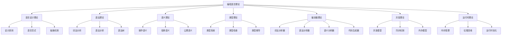
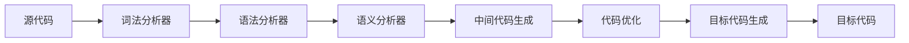

# 编程语言理论总论

## 概述

编程语言理论是计算机科学的核心分支，研究编程语言的设计、实现、分析和应用。本文档提供编程语言理论的系统性框架，涵盖语言设计原则、语法和语义、编译器理论、类型系统、并发模型等核心内容。

## 1. 理论框架

### 1.1 编程语言理论体系



### 1.2 核心概念

#### 语言设计原则

- **简洁性**: 语言设计应简洁明了，易于理解和使用
- **一致性**: 语言特性应保持内部一致性
- **正交性**: 语言特性应相互独立，避免冗余
- **可读性**: 代码应具有良好的可读性
- **可维护性**: 代码应易于维护和修改
- **性能**: 语言应支持高效的代码执行

#### 语言分类

```python
# 编程语言分类
language_categories = {
    "按范式分类": {
        "命令式": ["C", "Java", "Python"],
        "函数式": ["Haskell", "Lisp", "ML"],
        "逻辑式": ["Prolog", "Datalog"],
        "面向对象": ["Java", "C++", "Smalltalk"],
        "并发式": ["Erlang", "Go", "Rust"]
    },
    "按类型分类": {
        "静态类型": ["Java", "C++", "Haskell"],
        "动态类型": ["Python", "JavaScript", "Ruby"],
        "强类型": ["Haskell", "Rust", "Scala"],
        "弱类型": ["C", "JavaScript", "PHP"]
    },
    "按执行方式分类": {
        "编译型": ["C", "C++", "Rust"],
        "解释型": ["Python", "JavaScript", "Ruby"],
        "混合型": ["Java", "C#", "Go"]
    }
}
```

## 2. 基本概念

### 2.1 语法和语义

#### 语法定义

语法定义了程序的结构和形式，包括词法和语法两个层面：

```rust
// 语法树节点定义
#[derive(Debug, Clone)]
pub enum SyntaxNode {
    // 表达式节点
    Literal(LiteralValue),
    Variable(String),
    BinaryOp(Box<SyntaxNode>, Operator, Box<SyntaxNode>),
    UnaryOp(Operator, Box<SyntaxNode>),
    
    // 语句节点
    Assignment(String, Box<SyntaxNode>),
    IfStatement(Box<SyntaxNode>, Box<SyntaxNode>, Option<Box<SyntaxNode>>),
    WhileStatement(Box<SyntaxNode>, Box<SyntaxNode>),
    FunctionCall(String, Vec<SyntaxNode>),
    
    // 声明节点
    FunctionDecl(String, Vec<String>, Box<SyntaxNode>),
    VariableDecl(String, Option<Box<SyntaxNode>>),
}

#[derive(Debug, Clone)]
pub enum LiteralValue {
    Integer(i64),
    Float(f64),
    Boolean(bool),
    String(String),
}

#[derive(Debug, Clone)]
pub enum Operator {
    Add, Sub, Mul, Div,
    Eq, Ne, Lt, Le, Gt, Ge,
    And, Or, Not,
}
```

#### 语义定义

语义定义了程序的含义和行为：

```rust
// 语义环境
#[derive(Debug, Clone)]
pub struct Environment {
    variables: HashMap<String, Value>,
    functions: HashMap<String, Function>,
    parent: Option<Box<Environment>>,
}

#[derive(Debug, Clone)]
pub enum Value {
    Integer(i64),
    Float(f64),
    Boolean(bool),
    String(String),
    Function(Function),
    Unit,
}

#[derive(Debug, Clone)]
pub struct Function {
    name: String,
    parameters: Vec<String>,
    body: SyntaxNode,
}

// 语义解释器
pub struct Interpreter {
    environment: Environment,
}

impl Interpreter {
    pub fn new() -> Self {
        Self {
            environment: Environment::new(),
        }
    }
    
    pub fn evaluate(&mut self, node: &SyntaxNode) -> Result<Value, String> {
        match node {
            SyntaxNode::Literal(value) => self.evaluate_literal(value),
            SyntaxNode::Variable(name) => self.evaluate_variable(name),
            SyntaxNode::BinaryOp(left, op, right) => {
                self.evaluate_binary_op(left, op, right)
            },
            SyntaxNode::Assignment(name, value) => {
                self.evaluate_assignment(name, value)
            },
            SyntaxNode::IfStatement(condition, then_branch, else_branch) => {
                self.evaluate_if_statement(condition, then_branch, else_branch)
            },
            _ => Err("Unsupported syntax node".to_string()),
        }
    }
    
    fn evaluate_literal(&self, value: &LiteralValue) -> Result<Value, String> {
        match value {
            LiteralValue::Integer(i) => Ok(Value::Integer(*i)),
            LiteralValue::Float(f) => Ok(Value::Float(*f)),
            LiteralValue::Boolean(b) => Ok(Value::Boolean(*b)),
            LiteralValue::String(s) => Ok(Value::String(s.clone())),
        }
    }
    
    fn evaluate_variable(&self, name: &str) -> Result<Value, String> {
        self.environment.get_variable(name)
            .ok_or_else(|| format!("Undefined variable: {}", name))
    }
    
    fn evaluate_binary_op(
        &mut self,
        left: &SyntaxNode,
        op: &Operator,
        right: &SyntaxNode,
    ) -> Result<Value, String> {
        let left_val = self.evaluate(left)?;
        let right_val = self.evaluate(right)?;
        
        match (left_val, op, right_val) {
            (Value::Integer(a), Operator::Add, Value::Integer(b)) => {
                Ok(Value::Integer(a + b))
            },
            (Value::Integer(a), Operator::Sub, Value::Integer(b)) => {
                Ok(Value::Integer(a - b))
            },
            (Value::Integer(a), Operator::Mul, Value::Integer(b)) => {
                Ok(Value::Integer(a * b))
            },
            (Value::Integer(a), Operator::Div, Value::Integer(b)) => {
                if b == 0 {
                    Err("Division by zero".to_string())
                } else {
                    Ok(Value::Integer(a / b))
                }
            },
            _ => Err("Invalid binary operation".to_string()),
        }
    }
}
```

### 2.2 类型系统

#### 类型系统基础

类型系统是编程语言的核心特性，用于静态检查程序正确性：

```rust
// 类型定义
#[derive(Debug, Clone, PartialEq)]
pub enum Type {
    Int,
    Float,
    Bool,
    String,
    Function(Vec<Type>, Box<Type>), // 参数类型列表 -> 返回类型
    Generic(String, Vec<Type>),     // 泛型类型
    Unit,
}

// 类型环境
#[derive(Debug, Clone)]
pub struct TypeEnvironment {
    variables: HashMap<String, Type>,
    functions: HashMap<String, Type>,
    parent: Option<Box<TypeEnvironment>>,
}

// 类型检查器
pub struct TypeChecker {
    environment: TypeEnvironment,
}

impl TypeChecker {
    pub fn new() -> Self {
        Self {
            environment: TypeEnvironment::new(),
        }
    }
    
    pub fn check_type(&mut self, node: &SyntaxNode) -> Result<Type, String> {
        match node {
            SyntaxNode::Literal(value) => self.check_literal_type(value),
            SyntaxNode::Variable(name) => self.check_variable_type(name),
            SyntaxNode::BinaryOp(left, op, right) => {
                self.check_binary_op_type(left, op, right)
            },
            SyntaxNode::FunctionCall(name, args) => {
                self.check_function_call_type(name, args)
            },
            _ => Err("Unsupported node for type checking".to_string()),
        }
    }
    
    fn check_literal_type(&self, value: &LiteralValue) -> Result<Type, String> {
        match value {
            LiteralValue::Integer(_) => Ok(Type::Int),
            LiteralValue::Float(_) => Ok(Type::Float),
            LiteralValue::Boolean(_) => Ok(Type::Bool),
            LiteralValue::String(_) => Ok(Type::String),
        }
    }
    
    fn check_variable_type(&self, name: &str) -> Result<Type, String> {
        self.environment.get_variable_type(name)
            .ok_or_else(|| format!("Undefined variable: {}", name))
    }
    
    fn check_binary_op_type(
        &mut self,
        left: &SyntaxNode,
        op: &Operator,
        right: &SyntaxNode,
    ) -> Result<Type, String> {
        let left_type = self.check_type(left)?;
        let right_type = self.check_type(right)?;
        
        match (left_type, op, right_type) {
            (Type::Int, Operator::Add, Type::Int) => Ok(Type::Int),
            (Type::Int, Operator::Sub, Type::Int) => Ok(Type::Int),
            (Type::Int, Operator::Mul, Type::Int) => Ok(Type::Int),
            (Type::Int, Operator::Div, Type::Int) => Ok(Type::Int),
            (Type::Float, Operator::Add, Type::Float) => Ok(Type::Float),
            (Type::Float, Operator::Sub, Type::Float) => Ok(Type::Float),
            (Type::Float, Operator::Mul, Type::Float) => Ok(Type::Float),
            (Type::Float, Operator::Div, Type::Float) => Ok(Type::Float),
            (Type::Bool, Operator::And, Type::Bool) => Ok(Type::Bool),
            (Type::Bool, Operator::Or, Type::Bool) => Ok(Type::Bool),
            _ => Err("Type mismatch in binary operation".to_string()),
        }
    }
}
```

## 3. 编译器理论

### 3.1 编译器架构

编译器是将高级语言转换为机器代码的程序：



#### 词法分析器

```rust
// 词法分析器
pub struct Lexer {
    input: Vec<char>,
    position: usize,
    current_char: Option<char>,
}

#[derive(Debug, Clone, PartialEq)]
pub enum Token {
    // 关键字
    If, Else, While, For, Function, Return, Let, Const,
    
    // 标识符和字面量
    Identifier(String),
    Integer(i64),
    Float(f64),
    String(String),
    
    // 运算符
    Plus, Minus, Multiply, Divide,
    Equal, NotEqual, LessThan, GreaterThan,
    Assign, Semicolon, Comma, LeftParen, RightParen,
    LeftBrace, RightBrace,
    
    // 特殊标记
    Eof,
}

impl Lexer {
    pub fn new(input: &str) -> Self {
        let chars: Vec<char> = input.chars().collect();
        let current_char = chars.get(0).copied();
        
        Self {
            input: chars,
            position: 0,
            current_char,
        }
    }
    
    pub fn next_token(&mut self) -> Result<Token, String> {
        self.skip_whitespace();
        
        if let Some(ch) = self.current_char {
            match ch {
                'a'..='z' | 'A'..='Z' | '_' => self.read_identifier(),
                '0'..='9' => self.read_number(),
                '"' => self.read_string(),
                '+' => { self.advance(); Ok(Token::Plus) },
                '-' => { self.advance(); Ok(Token::Minus) },
                '*' => { self.advance(); Ok(Token::Multiply) },
                '/' => { self.advance(); Ok(Token::Divide) },
                '=' => self.read_equals(),
                '!' => self.read_not_equals(),
                '<' => { self.advance(); Ok(Token::LessThan) },
                '>' => { self.advance(); Ok(Token::GreaterThan) },
                ';' => { self.advance(); Ok(Token::Semicolon) },
                ',' => { self.advance(); Ok(Token::Comma) },
                '(' => { self.advance(); Ok(Token::LeftParen) },
                ')' => { self.advance(); Ok(Token::RightParen) },
                '{' => { self.advance(); Ok(Token::LeftBrace) },
                '}' => { self.advance(); Ok(Token::RightBrace) },
                _ => Err(format!("Unknown character: {}", ch)),
            }
        } else {
            Ok(Token::Eof)
        }
    }
    
    fn read_identifier(&mut self) -> Result<Token, String> {
        let mut identifier = String::new();
        
        while let Some(ch) = self.current_char {
            if ch.is_alphanumeric() || ch == '_' {
                identifier.push(ch);
                self.advance();
            } else {
                break;
            }
        }
        
        // 检查是否为关键字
        match identifier.as_str() {
            "if" => Ok(Token::If),
            "else" => Ok(Token::Else),
            "while" => Ok(Token::While),
            "for" => Ok(Token::For),
            "function" => Ok(Token::Function),
            "return" => Ok(Token::Return),
            "let" => Ok(Token::Let),
            "const" => Ok(Token::Const),
            _ => Ok(Token::Identifier(identifier)),
        }
    }
    
    fn read_number(&mut self) -> Result<Token, String> {
        let mut number = String::new();
        let mut has_decimal = false;
        
        while let Some(ch) = self.current_char {
            if ch.is_digit(10) {
                number.push(ch);
                self.advance();
            } else if ch == '.' && !has_decimal {
                number.push(ch);
                has_decimal = true;
                self.advance();
            } else {
                break;
            }
        }
        
        if has_decimal {
            number.parse::<f64>()
                .map(Token::Float)
                .map_err(|e| format!("Invalid float: {}", e))
        } else {
            number.parse::<i64>()
                .map(Token::Integer)
                .map_err(|e| format!("Invalid integer: {}", e))
        }
    }
    
    fn advance(&mut self) {
        self.position += 1;
        self.current_char = self.input.get(self.position).copied();
    }
    
    fn skip_whitespace(&mut self) {
        while let Some(ch) = self.current_char {
            if ch.is_whitespace() {
                self.advance();
            } else {
                break;
            }
        }
    }
}
```

### 3.2 语法分析器

```rust
// 递归下降语法分析器
pub struct Parser {
    lexer: Lexer,
    current_token: Token,
    peek_token: Token,
}

impl Parser {
    pub fn new(mut lexer: Lexer) -> Result<Self, String> {
        let current_token = lexer.next_token()?;
        let peek_token = lexer.next_token()?;
        
        Ok(Self {
            lexer,
            current_token,
            peek_token,
        })
    }
    
    pub fn parse_program(&mut self) -> Result<Vec<SyntaxNode>, String> {
        let mut statements = Vec::new();
        
        while self.current_token != Token::Eof {
            let statement = self.parse_statement()?;
            statements.push(statement);
        }
        
        Ok(statements)
    }
    
    fn parse_statement(&mut self) -> Result<SyntaxNode, String> {
        match &self.current_token {
            Token::Let => self.parse_variable_declaration(),
            Token::Function => self.parse_function_declaration(),
            Token::If => self.parse_if_statement(),
            Token::While => self.parse_while_statement(),
            Token::Return => self.parse_return_statement(),
            _ => self.parse_expression_statement(),
        }
    }
    
    fn parse_expression(&mut self) -> Result<SyntaxNode, String> {
        self.parse_equality()
    }
    
    fn parse_equality(&mut self) -> Result<SyntaxNode, String> {
        let mut left = self.parse_comparison()?;
        
        while matches!(self.current_token, Token::Equal | Token::NotEqual) {
            let operator = self.current_token.clone();
            self.advance();
            let right = self.parse_comparison()?;
            
            left = SyntaxNode::BinaryOp(
                Box::new(left),
                self.token_to_operator(&operator)?,
                Box::new(right),
            );
        }
        
        Ok(left)
    }
    
    fn parse_comparison(&mut self) -> Result<SyntaxNode, String> {
        let mut left = self.parse_term()?;
        
        while matches!(self.current_token, Token::LessThan | Token::GreaterThan) {
            let operator = self.current_token.clone();
            self.advance();
            let right = self.parse_term()?;
            
            left = SyntaxNode::BinaryOp(
                Box::new(left),
                self.token_to_operator(&operator)?,
                Box::new(right),
            );
        }
        
        Ok(left)
    }
    
    fn parse_term(&mut self) -> Result<SyntaxNode, String> {
        let mut left = self.parse_factor()?;
        
        while matches!(self.current_token, Token::Plus | Token::Minus) {
            let operator = self.current_token.clone();
            self.advance();
            let right = self.parse_factor()?;
            
            left = SyntaxNode::BinaryOp(
                Box::new(left),
                self.token_to_operator(&operator)?,
                Box::new(right),
            );
        }
        
        Ok(left)
    }
    
    fn parse_factor(&mut self) -> Result<SyntaxNode, String> {
        let mut left = self.parse_primary()?;
        
        while matches!(self.current_token, Token::Multiply | Token::Divide) {
            let operator = self.current_token.clone();
            self.advance();
            let right = self.parse_primary()?;
            
            left = SyntaxNode::BinaryOp(
                Box::new(left),
                self.token_to_operator(&operator)?,
                Box::new(right),
            );
        }
        
        Ok(left)
    }
    
    fn parse_primary(&mut self) -> Result<SyntaxNode, String> {
        match &self.current_token {
            Token::Integer(value) => {
                let node = SyntaxNode::Literal(LiteralValue::Integer(*value));
                self.advance();
                Ok(node)
            },
            Token::Float(value) => {
                let node = SyntaxNode::Literal(LiteralValue::Float(*value));
                self.advance();
                Ok(node)
            },
            Token::Identifier(name) => {
                let node = SyntaxNode::Variable(name.clone());
                self.advance();
                Ok(node)
            },
            Token::LeftParen => {
                self.advance();
                let expression = self.parse_expression()?;
                self.expect_token(Token::RightParen)?;
                Ok(expression)
            },
            _ => Err(format!("Unexpected token: {:?}", self.current_token)),
        }
    }
    
    fn advance(&mut self) -> Result<(), String> {
        self.current_token = self.peek_token.clone();
        self.peek_token = self.lexer.next_token()?;
        Ok(())
    }
    
    fn expect_token(&mut self, expected: Token) -> Result<(), String> {
        if self.current_token == expected {
            self.advance()?;
            Ok(())
        } else {
            Err(format!("Expected {:?}, got {:?}", expected, self.current_token))
        }
    }
}
```

## 4. 并发理论

### 4.1 并发模型

```rust
// 并发模型定义
#[derive(Debug, Clone)]
pub enum ConcurrencyModel {
    // 共享内存模型
    SharedMemory {
        threads: Vec<Thread>,
        shared_data: Arc<Mutex<HashMap<String, Value>>>,
    },
    
    // 消息传递模型
    MessagePassing {
        processes: Vec<Process>,
        channels: HashMap<String, Channel>,
    },
    
    // Actor模型
    Actor {
        actors: Vec<Actor>,
        mailboxes: HashMap<String, Mailbox>,
    },
}

// 线程定义
#[derive(Debug, Clone)]
pub struct Thread {
    id: String,
    state: ThreadState,
    stack: Vec<Frame>,
    local_variables: HashMap<String, Value>,
}

#[derive(Debug, Clone)]
pub enum ThreadState {
    Running,
    Blocked,
    Waiting,
    Terminated,
}

// 进程定义
#[derive(Debug, Clone)]
pub struct Process {
    id: String,
    state: ProcessState,
    code: Vec<Instruction>,
    mailbox: Mailbox,
}

#[derive(Debug, Clone)]
pub enum ProcessState {
    Ready,
    Running,
    Blocked,
    Terminated,
}

// Actor定义
#[derive(Debug, Clone)]
pub struct Actor {
    id: String,
    behavior: Behavior,
    mailbox: Mailbox,
    supervisor: Option<String>,
}

#[derive(Debug, Clone)]
pub enum Behavior {
    Function(Box<dyn Fn(Message) -> Behavior>),
    StateMachine(HashMap<String, Box<dyn Fn(Message) -> Behavior>>),
}

// 消息定义
#[derive(Debug, Clone)]
pub struct Message {
    from: String,
    to: String,
    content: MessageContent,
    timestamp: SystemTime,
}

#[derive(Debug, Clone)]
pub enum MessageContent {
    Data(Value),
    Request(String, Vec<Value>),
    Response(Result<Value, String>),
    Control(ControlMessage),
}

#[derive(Debug, Clone)]
pub enum ControlMessage {
    Start,
    Stop,
    Pause,
    Resume,
    Restart,
}

// 并发运行时
pub struct ConcurrencyRuntime {
    model: ConcurrencyModel,
    scheduler: Scheduler,
    monitor: Monitor,
}

impl ConcurrencyRuntime {
    pub fn new(model: ConcurrencyModel) -> Self {
        Self {
            scheduler: Scheduler::new(),
            monitor: Monitor::new(),
            model,
        }
    }
    
    pub fn spawn_thread(&mut self, code: Vec<Instruction>) -> String {
        let thread_id = self.generate_id();
        let thread = Thread {
            id: thread_id.clone(),
            state: ThreadState::Ready,
            stack: Vec::new(),
            local_variables: HashMap::new(),
        };
        
        self.scheduler.add_thread(thread);
        thread_id
    }
    
    pub fn spawn_process(&mut self, code: Vec<Instruction>) -> String {
        let process_id = self.generate_id();
        let process = Process {
            id: process_id.clone(),
            state: ProcessState::Ready,
            code,
            mailbox: Mailbox::new(),
        };
        
        self.scheduler.add_process(process);
        process_id
    }
    
    pub fn spawn_actor(&mut self, behavior: Behavior) -> String {
        let actor_id = self.generate_id();
        let actor = Actor {
            id: actor_id.clone(),
            behavior,
            mailbox: Mailbox::new(),
            supervisor: None,
        };
        
        self.scheduler.add_actor(actor);
        actor_id
    }
    
    pub fn send_message(&mut self, from: &str, to: &str, content: MessageContent) {
        let message = Message {
            from: from.to_string(),
            to: to.to_string(),
            content,
            timestamp: SystemTime::now(),
        };
        
        self.scheduler.deliver_message(message);
    }
    
    pub fn run(&mut self) {
        loop {
            self.scheduler.schedule();
            self.monitor.collect_metrics();
            
            if self.scheduler.is_empty() {
                break;
            }
            
            thread::sleep(Duration::from_millis(10));
        }
    }
}
```

## 5. 应用领域

### 5.1 语言设计

编程语言理论在语言设计中发挥重要作用：

```rust
// 语言设计框架
pub struct LanguageDesigner {
    design_principles: Vec<DesignPrinciple>,
    language_features: Vec<LanguageFeature>,
    implementation_plan: ImplementationPlan,
}

#[derive(Debug, Clone)]
pub struct DesignPrinciple {
    name: String,
    description: String,
    priority: Priority,
    constraints: Vec<Constraint>,
}

#[derive(Debug, Clone)]
pub enum Priority {
    Critical,
    High,
    Medium,
    Low,
}

#[derive(Debug, Clone)]
pub struct LanguageFeature {
    name: String,
    description: String,
    syntax: SyntaxDefinition,
    semantics: SemanticDefinition,
    implementation: ImplementationStrategy,
}

// 语法定义
#[derive(Debug, Clone)]
pub struct SyntaxDefinition {
    tokens: Vec<TokenDefinition>,
    grammar: Grammar,
    precedence: PrecedenceRules,
}

// 语义定义
#[derive(Debug, Clone)]
pub struct SemanticDefinition {
    type_system: TypeSystem,
    evaluation_rules: Vec<EvaluationRule>,
    scoping_rules: ScopingRules,
}

// 实现策略
#[derive(Debug, Clone)]
pub struct ImplementationStrategy {
    compiler_type: CompilerType,
    optimization_levels: Vec<OptimizationLevel>,
    target_platforms: Vec<TargetPlatform>,
}

#[derive(Debug, Clone)]
pub enum CompilerType {
    AheadOfTime,
    JustInTime,
    Interpreted,
    Hybrid,
}
```

### 5.2 代码分析

```rust
// 代码分析器
pub struct CodeAnalyzer {
    parser: Parser,
    type_checker: TypeChecker,
    static_analyzer: StaticAnalyzer,
    performance_analyzer: PerformanceAnalyzer,
}

impl CodeAnalyzer {
    pub fn analyze_code(&mut self, source: &str) -> AnalysisResult {
        // 词法分析
        let lexer = Lexer::new(source);
        let mut parser = Parser::new(lexer)?;
        let ast = parser.parse_program()?;
        
        // 类型检查
        let mut type_checker = TypeChecker::new();
        let type_errors = type_checker.check_program(&ast)?;
        
        // 静态分析
        let mut static_analyzer = StaticAnalyzer::new();
        let static_issues = static_analyzer.analyze(&ast)?;
        
        // 性能分析
        let mut performance_analyzer = PerformanceAnalyzer::new();
        let performance_metrics = performance_analyzer.analyze(&ast)?;
        
        Ok(AnalysisResult {
            ast,
            type_errors,
            static_issues,
            performance_metrics,
        })
    }
}

#[derive(Debug, Clone)]
pub struct AnalysisResult {
    ast: Vec<SyntaxNode>,
    type_errors: Vec<TypeError>,
    static_issues: Vec<StaticIssue>,
    performance_metrics: PerformanceMetrics,
}

#[derive(Debug, Clone)]
pub struct TypeError {
    location: Location,
    message: String,
    expected_type: Option<Type>,
    actual_type: Option<Type>,
}

#[derive(Debug, Clone)]
pub struct StaticIssue {
    location: Location,
    severity: Severity,
    message: String,
    suggestion: Option<String>,
}

#[derive(Debug, Clone)]
pub enum Severity {
    Error,
    Warning,
    Info,
}

#[derive(Debug, Clone)]
pub struct PerformanceMetrics {
    complexity: ComplexityMetrics,
    memory_usage: MemoryMetrics,
    execution_time: TimeMetrics,
}

#[derive(Debug, Clone)]
pub struct ComplexityMetrics {
    cyclomatic_complexity: u32,
    cognitive_complexity: u32,
    nesting_depth: u32,
}

#[derive(Debug, Clone)]
pub struct MemoryMetrics {
    estimated_memory_usage: usize,
    allocation_count: u32,
    potential_leaks: Vec<Location>,
}

#[derive(Debug, Clone)]
pub struct TimeMetrics {
    estimated_execution_time: Duration,
    bottleneck_operations: Vec<Operation>,
}
```

## 6. 交叉引用

- [[01-哲学基础理论/00-哲学基础理论总论|哲学基础理论]]
- [[02-数学理论体系/00-数学理论体系总论|数学理论体系]]
- [[03-形式语言理论/00-形式语言理论总论|形式语言理论]]
- [[04-软件架构理论/00-软件架构理论总论|软件架构理论]]
- [[06-形式模型理论/00-形式模型理论总论|形式模型理论]]
- [[07-理论统一与整合/00-理论统一与整合总论|理论统一与整合]]
- [[08-实践应用开发/00-实践应用开发总论|实践应用开发]]

## 导航

- [返回总目录](../README.md)
- [01-语言设计原则](01-语言设计原则.md)
- [02-语法和语义](02-语法和语义.md)
- [03-编译器理论](03-编译器理论.md)
- [04-类型系统](04-类型系统.md)
