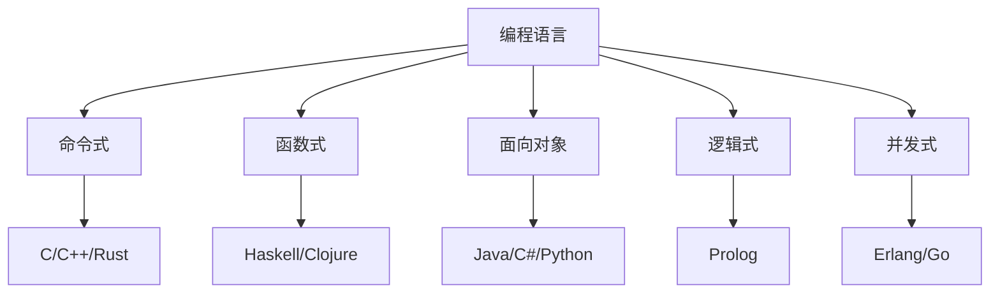

# 01-编程语言基础理论：语言设计与实现原理

## 目录

1. [1.0 编程语言分类](#10-编程语言分类)
2. [2.0 语法与语义](#20-语法与语义)
3. [3.0 类型系统](#30-类型系统)
4. [4.0 内存管理](#40-内存管理)
5. [5.0 并发模型](#50-并发模型)
6. [6.0 语言实现](#60-语言实现)

## 1.0 编程语言分类

### 1.1 按范式分类

**定义 1.1.1 (编程范式)**
编程范式是编程语言的基本风格和方法论。

**定义 1.1.2 (主要范式)**
- **命令式编程**：基于状态改变和指令序列
- **函数式编程**：基于数学函数和不可变性
- **面向对象编程**：基于对象和消息传递
- **逻辑编程**：基于逻辑推理和规则
- **并发编程**：基于并行执行和通信



### 1.2 按执行方式分类

**定义 1.2.1 (编译型语言)**
源代码被编译成机器代码后执行。

**定义 1.2.2 (解释型语言)**
源代码被解释器逐行解释执行。

**定义 1.2.3 (混合型语言)**
先编译成中间代码，再由虚拟机执行。

```rust
// 编译型语言示例（Rust）
pub fn factorial(n: u32) -> u32 {
    if n <= 1 {
        1
    } else {
        n * factorial(n - 1)
    }
}

// 解释型语言等价示例（Python）
/*
def factorial(n):
    if n <= 1:
        return 1
    else:
        return n * factorial(n - 1)
*/
```

## 2.0 语法与语义

### 2.1 语法定义

**定义 2.1.1 (语法)**
语法定义了程序的结构和形式。

**定义 2.1.2 (BNF范式)**
巴科斯-诺尔范式用于描述语法规则。

```rust
// 简单表达式的BNF定义
/*
expression ::= term | expression + term | expression - term
term ::= factor | term * factor | term / factor
factor ::= number | (expression) | identifier
*/

#[derive(Debug, Clone)]
pub enum Expression {
    Number(i32),
    Identifier(String),
    BinaryOp(Box<Expression>, Operator, Box<Expression>),
    Parenthesized(Box<Expression>),
}

#[derive(Debug, Clone)]
pub enum Operator {
    Add,
    Subtract,
    Multiply,
    Divide,
}

// 语法分析器
pub struct Parser {
    tokens: Vec<Token>,
    position: usize,
}

#[derive(Debug, Clone)]
pub enum Token {
    Number(i32),
    Identifier(String),
    Plus,
    Minus,
    Multiply,
    Divide,
    LeftParen,
    RightParen,
    End,
}

impl Parser {
    pub fn new(tokens: Vec<Token>) -> Self {
        Self { tokens, position: 0 }
    }

    pub fn parse_expression(&mut self) -> Result<Expression, String> {
        self.parse_term()
    }

    fn parse_term(&mut self) -> Result<Expression, String> {
        let mut left = self.parse_factor()?;
        
        while let Some(token) = self.peek() {
            match token {
                Token::Multiply | Token::Divide => {
                    self.advance();
                    let operator = match token {
                        Token::Multiply => Operator::Multiply,
                        Token::Divide => Operator::Divide,
                        _ => unreachable!(),
                    };
                    let right = self.parse_factor()?;
                    left = Expression::BinaryOp(Box::new(left), operator, Box::new(right));
                }
                _ => break,
            }
        }
        
        Ok(left)
    }

    fn parse_factor(&mut self) -> Result<Expression, String> {
        match self.advance() {
            Some(Token::Number(n)) => Ok(Expression::Number(n)),
            Some(Token::Identifier(name)) => Ok(Expression::Identifier(name)),
            Some(Token::LeftParen) => {
                let expr = self.parse_expression()?;
                if let Some(Token::RightParen) = self.advance() {
                    Ok(Expression::Parenthesized(Box::new(expr)))
                } else {
                    Err("Expected closing parenthesis".to_string())
                }
            }
            _ => Err("Unexpected token".to_string()),
        }
    }

    fn peek(&self) -> Option<&Token> {
        self.tokens.get(self.position)
    }

    fn advance(&mut self) -> Option<Token> {
        if self.position < self.tokens.len() {
            let token = self.tokens[self.position].clone();
            self.position += 1;
            Some(token)
        } else {
            None
        }
    }
}
```

### 2.2 语义定义

**定义 2.2.1 (语义)**
语义定义了程序的含义和行为。

**定义 2.2.2 (操作语义)**
描述程序执行时的状态转换。

```rust
// 表达式求值器
pub struct Evaluator {
    environment: HashMap<String, i32>,
}

impl Evaluator {
    pub fn new() -> Self {
        Self {
            environment: HashMap::new(),
        }
    }

    pub fn evaluate(&mut self, expr: &Expression) -> Result<i32, String> {
        match expr {
            Expression::Number(n) => Ok(*n),
            Expression::Identifier(name) => {
                self.environment.get(name)
                    .copied()
                    .ok_or_else(|| format!("Undefined variable: {}", name))
            }
            Expression::BinaryOp(left, op, right) => {
                let left_val = self.evaluate(left)?;
                let right_val = self.evaluate(right)?;
                
                match op {
                    Operator::Add => Ok(left_val + right_val),
                    Operator::Subtract => Ok(left_val - right_val),
                    Operator::Multiply => Ok(left_val * right_val),
                    Operator::Divide => {
                        if right_val == 0 {
                            Err("Division by zero".to_string())
                        } else {
                            Ok(left_val / right_val)
                        }
                    }
                }
            }
            Expression::Parenthesized(expr) => self.evaluate(expr),
        }
    }

    pub fn set_variable(&mut self, name: String, value: i32) {
        self.environment.insert(name, value);
    }
}
```

## 3.0 类型系统

### 3.1 类型系统基础

**定义 3.1.1 (类型)**
类型是对值的分类，规定了值的可能操作。

**定义 3.1.2 (类型检查)**
在编译时或运行时验证类型正确性。

```rust
#[derive(Debug, Clone, PartialEq)]
pub enum Type {
    Int,
    Bool,
    String,
    Function(Box<Type>, Box<Type>), // 参数类型 -> 返回类型
    Tuple(Vec<Type>),
    List(Box<Type>),
    Unit,
}

#[derive(Debug, Clone)]
pub enum TypedExpression {
    Literal(Literal),
    Variable(String),
    BinaryOp(Box<TypedExpression>, Operator, Box<TypedExpression>),
    FunctionCall(Box<TypedExpression>, Vec<TypedExpression>),
    Lambda(String, Box<Type>, Box<TypedExpression>),
}

#[derive(Debug, Clone)]
pub enum Literal {
    Int(i32),
    Bool(bool),
    String(String),
}

pub struct TypeChecker {
    environment: HashMap<String, Type>,
}

impl TypeChecker {
    pub fn new() -> Self {
        Self {
            environment: HashMap::new(),
        }
    }

    pub fn check_type(&mut self, expr: &TypedExpression) -> Result<Type, String> {
        match expr {
            TypedExpression::Literal(lit) => match lit {
                Literal::Int(_) => Ok(Type::Int),
                Literal::Bool(_) => Ok(Type::Bool),
                Literal::String(_) => Ok(Type::String),
            },
            TypedExpression::Variable(name) => {
                self.environment.get(name)
                    .cloned()
                    .ok_or_else(|| format!("Undefined variable: {}", name))
            }
            TypedExpression::BinaryOp(left, op, right) => {
                let left_type = self.check_type(left)?;
                let right_type = self.check_type(right)?;
                
                match op {
                    Operator::Add | Operator::Subtract | Operator::Multiply | Operator::Divide => {
                        if left_type == Type::Int && right_type == Type::Int {
                            Ok(Type::Int)
                        } else {
                            Err("Arithmetic operations require integer operands".to_string())
                        }
                    }
                }
            }
            TypedExpression::FunctionCall(func, args) => {
                let func_type = self.check_type(func)?;
                
                if let Type::Function(param_type, return_type) = func_type {
                    if args.len() == 1 {
                        let arg_type = self.check_type(&args[0])?;
                        if arg_type == *param_type {
                            Ok(*return_type)
                        } else {
                            Err("Type mismatch in function call".to_string())
                        }
                    } else {
                        Err("Wrong number of arguments".to_string())
                    }
                } else {
                    Err("Not a function".to_string())
                }
            }
            TypedExpression::Lambda(param, param_type, body) => {
                let mut new_env = self.environment.clone();
                new_env.insert(param.clone(), *param_type.clone());
                
                let mut body_checker = TypeChecker { environment: new_env };
                let body_type = body_checker.check_type(body)?;
                
                Ok(Type::Function(param_type.clone(), Box::new(body_type)))
            }
        }
    }
}
```

### 3.2 类型推导

**定义 3.2.1 (类型推导)**
自动推断表达式的类型。

**定义 3.2.2 (Hindley-Milner算法)**
经典的类型推导算法。

```rust
use std::collections::HashMap;

#[derive(Debug, Clone, PartialEq)]
pub enum TypeVar {
    Named(String),
    Anonymous(usize),
}

#[derive(Debug, Clone, PartialEq)]
pub enum TypeScheme {
    Mono(Type),
    Poly(String, Box<TypeScheme>),
}

pub struct TypeInferrer {
    next_var: usize,
    substitutions: HashMap<TypeVar, Type>,
}

impl TypeInferrer {
    pub fn new() -> Self {
        Self {
            next_var: 0,
            substitutions: HashMap::new(),
        }
    }

    pub fn fresh_var(&mut self) -> TypeVar {
        let var = TypeVar::Anonymous(self.next_var);
        self.next_var += 1;
        var
    }

    pub fn unify(&mut self, t1: &Type, t2: &Type) -> Result<(), String> {
        match (t1, t2) {
            (Type::Int, Type::Int) | (Type::Bool, Type::Bool) | (Type::String, Type::String) => {
                Ok(())
            }
            (Type::Function(p1, r1), Type::Function(p2, r2)) => {
                self.unify(p1, p2)?;
                self.unify(r1, r2)
            }
            (Type::Tuple(ts1), Type::Tuple(ts2)) => {
                if ts1.len() != ts2.len() {
                    return Err("Tuple length mismatch".to_string());
                }
                for (t1, t2) in ts1.iter().zip(ts2.iter()) {
                    self.unify(t1, t2)?;
                }
                Ok(())
            }
            _ => Err("Cannot unify types".to_string()),
        }
    }
}
```

## 4.0 内存管理

### 4.1 内存管理策略

**定义 4.1.1 (内存管理)**
管理程序运行时的内存分配和释放。

**定义 4.1.2 (管理策略)**
- **手动管理**：程序员显式分配和释放
- **垃圾回收**：自动检测和回收无用内存
- **所有权系统**：编译时保证内存安全

```rust
// 手动内存管理模拟
pub struct ManualMemoryManager {
    allocated_blocks: HashMap<usize, MemoryBlock>,
    next_id: usize,
}

#[derive(Debug)]
pub struct MemoryBlock {
    id: usize,
    size: usize,
    data: Vec<u8>,
    is_freed: bool,
}

impl ManualMemoryManager {
    pub fn new() -> Self {
        Self {
            allocated_blocks: HashMap::new(),
            next_id: 0,
        }
    }

    pub fn allocate(&mut self, size: usize) -> Result<usize, String> {
        let id = self.next_id;
        self.next_id += 1;
        
        let block = MemoryBlock {
            id,
            size,
            data: vec![0; size],
            is_freed: false,
        };
        
        self.allocated_blocks.insert(id, block);
        Ok(id)
    }

    pub fn deallocate(&mut self, id: usize) -> Result<(), String> {
        if let Some(block) = self.allocated_blocks.get_mut(&id) {
            if block.is_freed {
                return Err("Double free detected".to_string());
            }
            block.is_freed = true;
            Ok(())
        } else {
            Err("Invalid memory block".to_string())
        }
    }

    pub fn write(&mut self, id: usize, offset: usize, data: &[u8]) -> Result<(), String> {
        if let Some(block) = self.allocated_blocks.get_mut(&id) {
            if block.is_freed {
                return Err("Writing to freed memory".to_string());
            }
            if offset + data.len() > block.size {
                return Err("Buffer overflow".to_string());
            }
            block.data[offset..offset + data.len()].copy_from_slice(data);
            Ok(())
        } else {
            Err("Invalid memory block".to_string())
        }
    }
}

// Rust所有权系统示例
pub struct RustStyleMemory {
    data: String,
}

impl RustStyleMemory {
    pub fn new(data: String) -> Self {
        Self { data }
    }

    pub fn consume(self) -> String {
        // 所有权转移，原对象失效
        self.data
    }

    pub fn borrow(&self) -> &str {
        // 不可变借用
        &self.data
    }

    pub fn borrow_mut(&mut self) -> &mut String {
        // 可变借用
        &mut self.data
    }
}

// 使用示例
pub fn demonstrate_ownership() {
    let mut memory = RustStyleMemory::new("Hello".to_string());
    
    // 不可变借用
    let reference = memory.borrow();
    println!("Borrowed: {}", reference);
    
    // 可变借用
    let mutable_ref = memory.borrow_mut();
    mutable_ref.push_str(" World");
    
    // 所有权转移
    let consumed = memory.consume();
    println!("Consumed: {}", consumed);
    
    // 以下代码会编译错误，因为memory已经被消费
    // println!("{}", memory.borrow());
}
```

### 4.2 垃圾回收

**定义 4.2.1 (垃圾回收)**
自动检测和回收不再使用的内存。

**定义 4.2.2 (GC算法)**
- 标记-清除算法
- 复制算法
- 分代算法

```rust
use std::collections::{HashMap, HashSet};

#[derive(Debug, Clone)]
pub enum GCValue {
    Int(i32),
    String(String),
    Object(HashMap<String, usize>), // 字段名 -> 值ID
}

pub struct GarbageCollector {
    objects: HashMap<usize, GCValue>,
    roots: HashSet<usize>,
    next_id: usize,
}

impl GarbageCollector {
    pub fn new() -> Self {
        Self {
            objects: HashMap::new(),
            roots: HashSet::new(),
            next_id: 0,
        }
    }

    pub fn allocate(&mut self, value: GCValue) -> usize {
        let id = self.next_id;
        self.next_id += 1;
        self.objects.insert(id, value);
        id
    }

    pub fn add_root(&mut self, id: usize) {
        self.roots.insert(id);
    }

    pub fn remove_root(&mut self, id: usize) {
        self.roots.remove(&id);
    }

    pub fn collect(&mut self) -> usize {
        let mut reachable = HashSet::new();
        
        // 标记阶段：从根对象开始标记所有可达对象
        for &root_id in &self.roots {
            self.mark(root_id, &mut reachable);
        }
        
        // 清除阶段：删除不可达对象
        let before_count = self.objects.len();
        self.objects.retain(|id, _| reachable.contains(id));
        let after_count = self.objects.len();
        
        before_count - after_count
    }

    fn mark(&self, id: usize, reachable: &mut HashSet<usize>) {
        if reachable.contains(&id) {
            return; // 已经标记过
        }
        
        reachable.insert(id);
        
        if let Some(value) = self.objects.get(&id) {
            match value {
                GCValue::Object(fields) => {
                    // 递归标记对象的所有字段
                    for &field_id in fields.values() {
                        self.mark(field_id, reachable);
                    }
                }
                _ => {} // 基本类型没有引用
            }
        }
    }

    pub fn get_value(&self, id: usize) -> Option<&GCValue> {
        self.objects.get(&id)
    }
}
```

## 5.0 并发模型

### 5.1 并发基础

**定义 5.1.1 (并发)**
多个任务同时执行的能力。

**定义 5.1.2 (并行)**
多个任务真正同时执行。

```rust
use std::sync::{Arc, Mutex};
use std::thread;
use std::time::Duration;

// 共享状态并发
pub struct SharedCounter {
    value: Arc<Mutex<i32>>,
}

impl SharedCounter {
    pub fn new() -> Self {
        Self {
            value: Arc::new(Mutex::new(0)),
        }
    }

    pub fn increment(&self) {
        if let Ok(mut value) = self.value.lock() {
            *value += 1;
        }
    }

    pub fn get_value(&self) -> i32 {
        if let Ok(value) = self.value.lock() {
            *value
        } else {
            0
        }
    }
}

// 消息传递并发
use tokio::sync::mpsc;

#[derive(Debug)]
pub enum Message {
    Increment,
    GetValue(tokio::sync::oneshot::Sender<i32>),
    Stop,
}

pub struct MessagePassingCounter {
    sender: mpsc::Sender<Message>,
}

impl MessagePassingCounter {
    pub async fn new() -> Self {
        let (sender, mut receiver) = mpsc::channel(100);
        let mut value = 0;

        // 后台任务处理消息
        tokio::spawn(async move {
            while let Some(message) = receiver.recv().await {
                match message {
                    Message::Increment => {
                        value += 1;
                    }
                    Message::GetValue(response) => {
                        let _ = response.send(value);
                    }
                    Message::Stop => {
                        break;
                    }
                }
            }
        });

        Self { sender }
    }

    pub async fn increment(&self) -> Result<(), String> {
        self.sender.send(Message::Increment).await
            .map_err(|e| format!("Failed to send increment message: {}", e))
    }

    pub async fn get_value(&self) -> Result<i32, String> {
        let (response_sender, response_receiver) = tokio::sync::oneshot::channel();
        
        self.sender.send(Message::GetValue(response_sender)).await
            .map_err(|e| format!("Failed to send get value message: {}", e))?;
        
        response_receiver.await
            .map_err(|e| format!("Failed to receive value: {}", e))
    }
}

// 异步编程
pub async fn async_example() {
    let counter = MessagePassingCounter::new().await;
    
    // 并发执行多个任务
    let tasks = vec![
        tokio::spawn({
            let counter = counter.clone();
            async move {
                for _ in 0..100 {
                    counter.increment().await.unwrap();
                    tokio::time::sleep(Duration::from_millis(1)).await;
                }
            }
        }),
        tokio::spawn({
            let counter = counter.clone();
            async move {
                for _ in 0..100 {
                    counter.increment().await.unwrap();
                    tokio::time::sleep(Duration::from_millis(1)).await;
                }
            }
        }),
    ];

    // 等待所有任务完成
    for task in tasks {
        task.await.unwrap();
    }

    let final_value = counter.get_value().await.unwrap();
    println!("Final counter value: {}", final_value);
}
```

## 6.0 语言实现

### 6.1 解释器实现

**定义 6.1.1 (解释器)**
直接执行源代码的程序。

```rust
pub struct Interpreter {
    environment: HashMap<String, Value>,
}

#[derive(Debug, Clone)]
pub enum Value {
    Number(f64),
    Boolean(bool),
    String(String),
    Function(Function),
    Nil,
}

#[derive(Debug, Clone)]
pub struct Function {
    name: String,
    parameters: Vec<String>,
    body: Vec<Statement>,
}

#[derive(Debug, Clone)]
pub enum Statement {
    Expression(Expression),
    VariableDeclaration(String, Expression),
    FunctionDeclaration(Function),
    Return(Option<Expression>),
    If(Expression, Vec<Statement>, Option<Vec<Statement>>),
    While(Expression, Vec<Statement>),
}

impl Interpreter {
    pub fn new() -> Self {
        Self {
            environment: HashMap::new(),
        }
    }

    pub fn interpret(&mut self, statements: &[Statement]) -> Result<Value, String> {
        let mut result = Value::Nil;
        
        for statement in statements {
            result = self.execute_statement(statement)?;
        }
        
        Ok(result)
    }

    fn execute_statement(&mut self, statement: &Statement) -> Result<Value, String> {
        match statement {
            Statement::Expression(expr) => self.evaluate_expression(expr),
            Statement::VariableDeclaration(name, expr) => {
                let value = self.evaluate_expression(expr)?;
                self.environment.insert(name.clone(), value.clone());
                Ok(value)
            }
            Statement::FunctionDeclaration(func) => {
                self.environment.insert(func.name.clone(), Value::Function(func.clone()));
                Ok(Value::Nil)
            }
            Statement::Return(expr) => {
                if let Some(expr) = expr {
                    self.evaluate_expression(expr)
                } else {
                    Ok(Value::Nil)
                }
            }
            Statement::If(condition, then_branch, else_branch) => {
                let condition_value = self.evaluate_expression(condition)?;
                
                if self.is_truthy(&condition_value) {
                    self.execute_statements(then_branch)
                } else if let Some(else_branch) = else_branch {
                    self.execute_statements(else_branch)
                } else {
                    Ok(Value::Nil)
                }
            }
            Statement::While(condition, body) => {
                let mut result = Value::Nil;
                
                while self.is_truthy(&self.evaluate_expression(condition)?) {
                    result = self.execute_statements(body)?;
                }
                
                Ok(result)
            }
        }
    }

    fn evaluate_expression(&mut self, expr: &Expression) -> Result<Value, String> {
        // 表达式求值实现
        // 简化实现
        Ok(Value::Nil)
    }

    fn execute_statements(&mut self, statements: &[Statement]) -> Result<Value, String> {
        let mut result = Value::Nil;
        
        for statement in statements {
            result = self.execute_statement(statement)?;
        }
        
        Ok(result)
    }

    fn is_truthy(&self, value: &Value) -> bool {
        match value {
            Value::Boolean(b) => *b,
            Value::Number(n) => *n != 0.0,
            Value::String(s) => !s.is_empty(),
            Value::Nil => false,
            Value::Function(_) => true,
        }
    }
}
```

### 6.2 编译器实现

**定义 6.2.1 (编译器)**
将源代码转换为目标代码的程序。

```rust
pub struct Compiler {
    symbol_table: HashMap<String, Symbol>,
    next_temp: usize,
}

#[derive(Debug, Clone)]
pub struct Symbol {
    name: String,
    type_info: Type,
    address: usize,
}

#[derive(Debug)]
pub struct Instruction {
    opcode: Opcode,
    operands: Vec<Operand>,
}

#[derive(Debug)]
pub enum Opcode {
    Load,
    Store,
    Add,
    Subtract,
    Multiply,
    Divide,
    Jump,
    JumpIfZero,
    Call,
    Return,
}

#[derive(Debug)]
pub enum Operand {
    Immediate(i32),
    Register(usize),
    Address(usize),
    Label(String),
}

impl Compiler {
    pub fn new() -> Self {
        Self {
            symbol_table: HashMap::new(),
            next_temp: 0,
        }
    }

    pub fn compile(&mut self, ast: &[Statement]) -> Result<Vec<Instruction>, String> {
        let mut instructions = Vec::new();
        
        for statement in ast {
            let stmt_instructions = self.compile_statement(statement)?;
            instructions.extend(stmt_instructions);
        }
        
        Ok(instructions)
    }

    fn compile_statement(&mut self, statement: &Statement) -> Result<Vec<Instruction>, String> {
        match statement {
            Statement::Expression(expr) => self.compile_expression(expr),
            Statement::VariableDeclaration(name, expr) => {
                let mut instructions = self.compile_expression(expr)?;
                
                // 分配变量地址
                let address = self.allocate_variable(name);
                instructions.push(Instruction {
                    opcode: Opcode::Store,
                    operands: vec![Operand::Address(address)],
                });
                
                Ok(instructions)
            }
            _ => Ok(vec![]), // 简化实现
        }
    }

    fn compile_expression(&mut self, expr: &Expression) -> Result<Vec<Instruction>, String> {
        // 表达式编译实现
        // 简化实现
        Ok(vec![])
    }

    fn allocate_variable(&mut self, name: &str) -> usize {
        let address = self.next_temp;
        self.next_temp += 1;
        
        self.symbol_table.insert(name.to_string(), Symbol {
            name: name.to_string(),
            type_info: Type::Int, // 简化实现
            address,
        });
        
        address
    }
}
```

---

## 总结

编程语言基础理论为语言设计和实现提供了系统化的方法论，通过语法语义、类型系统、内存管理、并发模型等核心概念，构建了完整的语言理论体系。 