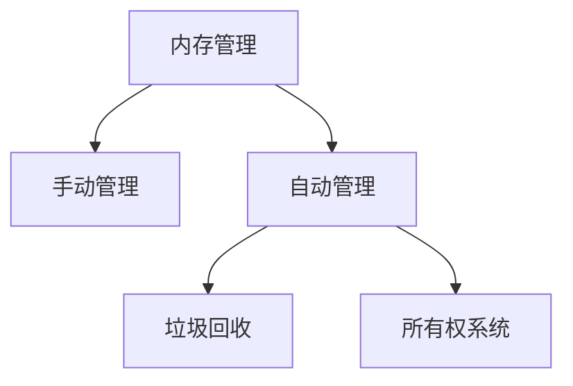
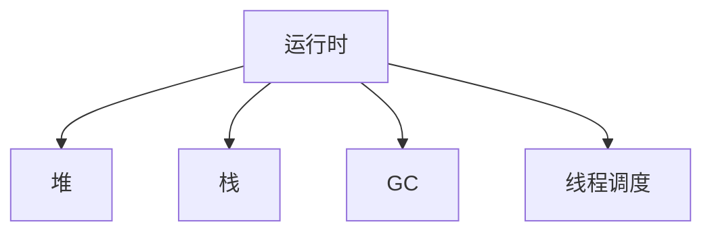

# 04-内存管理与运行时理论

## 目录

1. [1.0 内存管理基础](#10-内存管理基础)
2. [2.0 手动内存管理](#20-手动内存管理)
3. [3.0 垃圾回收机制](#30-垃圾回收机制)
4. [4.0 所有权与借用系统](#40-所有权与借用系统)
5. [5.0 运行时结构](#50-运行时结构)

## 1.0 内存管理基础

**定义 1.1 (内存管理)**
内存管理是指程序在运行期间对内存空间的分配、使用和回收的机制。

**定理 1.1 (内存安全性)**
良好的内存管理机制能够防止悬垂指针、内存泄漏和数据竞争。



## 2.0 手动内存管理

**定义 2.1 (手动内存管理)**
程序员显式地分配和释放内存，如C/C++中的malloc/free。

```rust
// C风格手动内存管理（Rust模拟）
pub struct ManualMemoryManager {
    allocated: Vec<Vec<u8>>,
}

impl ManualMemoryManager {
    pub fn new() -> Self {
        Self { allocated: Vec::new() }
    }
    pub fn malloc(&mut self, size: usize) -> usize {
        self.allocated.push(vec![0; size]);
        self.allocated.len() - 1
    }
    pub fn free(&mut self, index: usize) {
        if index < self.allocated.len() {
            self.allocated[index].clear();
        }
    }
}
```

## 3.0 垃圾回收机制

**定义 3.1 (垃圾回收)**
自动检测和回收不再使用的内存。

**常见算法：**
- 标记-清除
- 复制算法
- 分代回收

```rust
// 简单标记-清除GC模型
use std::collections::{HashMap, HashSet};

pub struct GCObject {
    marked: bool,
    children: Vec<usize>,
}

pub struct SimpleGC {
    heap: HashMap<usize, GCObject>,
    roots: HashSet<usize>,
}

impl SimpleGC {
    pub fn mark(&mut self, id: usize) {
        if let Some(obj) = self.heap.get_mut(&id) {
            if !obj.marked {
                obj.marked = true;
                for &child in &obj.children {
                    self.mark(child);
                }
            }
        }
    }
    pub fn sweep(&mut self) {
        self.heap.retain(|_, obj| obj.marked);
        for obj in self.heap.values_mut() {
            obj.marked = false;
        }
    }
    pub fn collect_garbage(&mut self) {
        for &root in &self.roots {
            self.mark(root);
        }
        self.sweep();
    }
}
```

## 4.0 所有权与借用系统

**定义 4.1 (所有权)**
每个值有唯一所有者，离开作用域自动释放。

**定义 4.2 (借用)**
允许对数据的临时引用，分为可变借用和不可变借用。

```rust
// Rust所有权与借用示例
pub struct Owner {
    data: String,
}

impl Owner {
    pub fn new(data: String) -> Self {
        Self { data }
    }
    pub fn borrow(&self) -> &str {
        &self.data
    }
    pub fn borrow_mut(&mut self) -> &mut String {
        &mut self.data
    }
    pub fn consume(self) -> String {
        self.data
    }
}
```

## 5.0 运行时结构

**定义 5.1 (运行时)**
运行时是指程序执行期间提供支持的系统组件，如堆、栈、垃圾回收器、线程调度器等。



---

## 总结

内存管理与运行时理论为程序安全与高效执行提供基础保障，现代语言通过所有权、GC等机制实现自动化和安全性。 