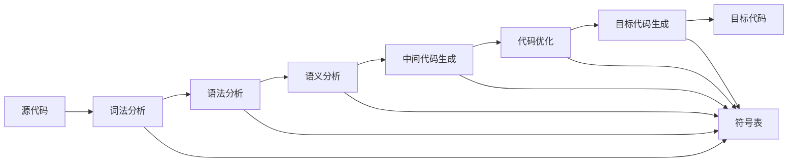

# 04-编译理论：编译器设计与实现的形式化理论

## 目录

1. [1.0 编译理论概述](#10-编译理论概述)
2. [2.0 编译器架构理论](#20-编译器架构理论)
3. [3.0 词法分析理论](#30-词法分析理论)
4. [4.0 语法分析理论](#40-语法分析理论)
5. [5.0 语义分析理论](#50-语义分析理论)
6. [6.0 中间表示理论](#60-中间表示理论)
7. [7.0 代码生成理论](#70-代码生成理论)
8. [8.0 优化理论](#80-优化理论)
9. [9.0 形式化验证](#90-形式化验证)

## 1.0 编译理论概述

### 1.1 编译过程定义

**定义 1.1.1 (编译器)**
编译器是一个函数 $C: \mathcal{L}_S \to \mathcal{L}_T$，其中：

- $\mathcal{L}_S$ 是源语言集合
- $\mathcal{L}_T$ 是目标语言集合

**定义 1.1.2 (编译过程)**
编译过程是一个六元组 $\mathcal{CP} = (L, A, P, S, I, G)$，其中：

- $L$ 是词法分析器 (Lexical Analyzer)
- $A$ 是语法分析器 (Parser)
- $S$ 是语义分析器 (Semantic Analyzer)
- $I$ 是中间代码生成器 (Intermediate Code Generator)
- $G$ 是目标代码生成器 (Target Code Generator)

### 1.2 编译理论公理

**公理 1.2.1 (编译正确性)**
对于任意源程序 $P_S$ 和目标程序 $P_T$，如果 $C(P_S) = P_T$，则：
$$\text{Semantics}(P_S) = \text{Semantics}(P_T)$$

**公理 1.2.2 (编译终止性)**
对于任意有限长度的源程序，编译过程必须在有限步骤内终止。

## 2.0 编译器架构理论

### 2.1 编译器架构模型

**定义 2.1.1 (编译器架构)**
编译器架构是一个五元组 $\mathcal{CA} = (F, D, P, O, V)$，其中：

- $F$ 是前端 (Frontend)
- $D$ 是数据流 (Data Flow)
- $P$ 是处理阶段 (Processing Stages)
- $O$ 是优化器 (Optimizer)
- $V$ 是验证器 (Verifier)



### 2.2 前端理论

**定义 2.2.1 (编译器前端)**
编译器前端是一个四元组 $\mathcal{CF} = (L, P, S, T)$，其中：

- $L$ 是词法分析器
- $P$ 是语法分析器
- $S$ 是语义分析器
- $T$ 是符号表管理器

**定理 2.2.1 (前端正确性)**
如果前端 $\mathcal{CF}$ 正确，则对于任意源程序 $P$，前端输出与源程序的语义等价。

### 2.3 后端理论

**定义 2.3.1 (编译器后端)**
编译器后端是一个四元组 $\mathcal{CB} = (I, O, T, V)$，其中：

- $I$ 是中间代码处理器
- $O$ 是优化器
- $T$ 是目标代码生成器
- $V$ 是验证器

## 3.0 词法分析理论

### 3.1 词法分析器定义

**定义 3.1.1 (词法分析器)**
词法分析器是一个函数 $LA: \Sigma^* \to \mathcal{T}^*$，其中：

- $\Sigma$ 是输入字母表
- $\mathcal{T}$ 是词法单元集合

**定义 3.1.2 (词法单元)**
词法单元是一个三元组 $Token = (Type, Value, Position)$，其中：

- $Type$ 是单元类型
- $Value$ 是单元值
- $Position$ 是位置信息

### 3.2 正则表达式理论

**定义 3.2.1 (正则表达式)**
正则表达式的语法定义为：

$$R ::= \epsilon \mid a \mid R_1 \cdot R_2 \mid R_1 \mid R_2 \mid R^*$$

其中：

- $\epsilon$ 是空字符串
- $a$ 是字符
- $\cdot$ 是连接
- $\mid$ 是选择
- $*$ 是克林闭包

**定理 3.2.1 (正则表达式等价性)**
对于任意正则表达式 $R$，存在有限自动机 $M$ 使得 $L(R) = L(M)$。

### 3.3 词法分析算法

**算法 3.3.1 (词法分析算法)**

```rust
pub struct LexicalAnalyzer {
    input: Vec<char>,
    position: usize,
    tokens: Vec<Token>,
}

impl LexicalAnalyzer {
    pub fn analyze(&mut self) -> Result<Vec<Token>, LexicalError> {
        while self.position < self.input.len() {
            self.skip_whitespace();
            if self.position >= self.input.len() {
                break;
            }
            
            let token = self.next_token()?;
            self.tokens.push(token);
        }
        Ok(self.tokens.clone())
    }
    
    fn next_token(&mut self) -> Result<Token, LexicalError> {
        let current_char = self.input[self.position];
        
        match current_char {
            'a'..='z' | 'A'..='Z' | '_' => self.recognize_identifier(),
            '0'..='9' => self.recognize_number(),
            '"' => self.recognize_string(),
            _ => self.recognize_operator(),
        }
    }
}
```

## 4.0 语法分析理论

### 4.1 语法分析器定义

**定义 4.1.1 (语法分析器)**
语法分析器是一个函数 $PA: \mathcal{T}^* \to \mathcal{ST}$，其中：

- $\mathcal{T}$ 是词法单元集合
- $\mathcal{ST}$ 是语法树集合

**定义 4.1.2 (语法树)**
语法树是一个三元组 $ST = (Node, Children, Value)$，其中：

- $Node$ 是节点类型
- $Children$ 是子节点集合
- $Value$ 是节点值

### 4.2 上下文无关文法

**定义 4.2.1 (上下文无关文法)**
上下文无关文法是一个四元组 $G = (V, \Sigma, P, S)$，其中：

- $V$ 是非终结符集合
- $\Sigma$ 是终结符集合
- $P$ 是产生式集合
- $S \in V$ 是开始符号

**定理 4.2.1 (文法等价性)**
对于任意上下文无关文法 $G$，存在等价的乔姆斯基范式文法 $G'$。

### 4.3 递归下降分析

**算法 4.3.1 (递归下降分析)**

```rust
pub struct RecursiveDescentParser {
    tokens: Vec<Token>,
    position: usize,
}

impl RecursiveDescentParser {
    pub fn parse(&mut self) -> Result<AST, ParseError> {
        self.parse_program()
    }
    
    fn parse_program(&mut self) -> Result<AST, ParseError> {
        let mut statements = Vec::new();
        
        while self.position < self.tokens.len() {
            let stmt = self.parse_statement()?;
            statements.push(stmt);
        }
        
        Ok(AST::Program(statements))
    }
    
    fn parse_statement(&mut self) -> Result<Statement, ParseError> {
        let token = self.current_token();
        
        match token.token_type {
            TokenType::If => self.parse_if_statement(),
            TokenType::While => self.parse_while_statement(),
            TokenType::Identifier => self.parse_assignment(),
            _ => Err(ParseError::UnexpectedToken(token.clone())),
        }
    }
}
```

## 5.0 语义分析理论

### 5.1 语义分析器定义

**定义 5.1.1 (语义分析器)**
语义分析器是一个函数 $SA: \mathcal{ST} \to \mathcal{ST}'$，其中：

- $\mathcal{ST}$ 是语法树集合
- $\mathcal{ST}'$ 是带类型信息的语法树集合

**定义 5.1.2 (类型检查)**
类型检查是一个函数 $TC: \mathcal{ST} \to \mathcal{T} \cup \{\bot\}$，其中：

- $\mathcal{T}$ 是类型集合
- $\bot$ 表示类型错误

### 5.2 类型系统理论

**定义 5.2.1 (类型系统)**
类型系统是一个五元组 $\mathcal{TS} = (T, R, C, I, P)$，其中：

- $T$ 是类型集合
- $R$ 是类型关系集合
- $C$ 是类型检查函数
- $I$ 是类型推断函数
- $P$ 是类型证明系统

**定理 5.2.1 (类型安全定理)**
如果程序 $P$ 通过类型检查，则 $P$ 的执行不会产生类型错误。

### 5.3 作用域理论

**定义 5.3.1 (作用域)**
作用域是一个三元组 $\mathcal{S} = (E, P, V)$，其中：

- $E$ 是环境集合
- $P$ 是父作用域
- $V$ 是可见性规则

**算法 5.3.1 (作用域分析)**

```rust
pub struct ScopeAnalyzer {
    scopes: Vec<Scope>,
    current_scope: usize,
}

impl ScopeAnalyzer {
    pub fn analyze(&mut self, ast: &AST) -> Result<(), SemanticError> {
        self.visit_node(ast)
    }
    
    fn visit_node(&mut self, node: &AST) -> Result<(), SemanticError> {
        match node {
            AST::Program(statements) => {
                for stmt in statements {
                    self.visit_node(stmt)?;
                }
            },
            AST::Block(statements) => {
                self.enter_scope();
                for stmt in statements {
                    self.visit_node(stmt)?;
                }
                self.exit_scope();
            },
            AST::VariableDecl(name, type_info) => {
                self.declare_variable(name, type_info)?;
            },
            _ => {},
        }
        Ok(())
    }
}
```

## 6.0 中间表示理论

### 6.1 中间表示定义

**定义 6.1.1 (中间表示)**
中间表示是一个三元组 $\mathcal{IR} = (F, D, C)$，其中：

- $F$ 是形式化表示
- $D$ 是数据结构
- $C$ 是转换规则

**定义 6.1.2 (抽象语法树)**
抽象语法树是一个三元组 $AST = (Node, Children, Attributes)$，其中：

- $Node$ 是节点类型
- $Children$ 是子节点集合
- $Attributes$ 是属性集合

### 6.2 三地址码理论

**定义 6.2.1 (三地址码)**
三地址码是一个四元组 $TAC = (Op, Arg1, Arg2, Result)$，其中：

- $Op$ 是操作符
- $Arg1, Arg2$ 是操作数
- $Result$ 是结果

**算法 6.2.1 (三地址码生成)**

```rust
pub struct ThreeAddressCodeGenerator {
    temp_counter: usize,
    code: Vec<ThreeAddressCode>,
}

impl ThreeAddressCodeGenerator {
    pub fn generate(&mut self, ast: &AST) -> Vec<ThreeAddressCode> {
        self.visit_node(ast);
        self.code.clone()
    }
    
    fn visit_expression(&mut self, expr: &Expression) -> String {
        match expr {
            Expression::Binary(left, op, right) => {
                let left_temp = self.visit_expression(left);
                let right_temp = self.visit_expression(right);
                let result_temp = self.new_temp();
                
                self.code.push(ThreeAddressCode {
                    op: op.clone(),
                    arg1: left_temp,
                    arg2: right_temp,
                    result: result_temp.clone(),
                });
                
                result_temp
            },
            Expression::Variable(name) => name.clone(),
            Expression::Literal(value) => {
                let temp = self.new_temp();
                self.code.push(ThreeAddressCode {
                    op: "LOAD".to_string(),
                    arg1: value.to_string(),
                    arg2: "".to_string(),
                    result: temp.clone(),
                });
                temp
            },
        }
    }
}
```

## 7.0 代码生成理论

### 7.1 代码生成器定义

**定义 7.1.1 (代码生成器)**
代码生成器是一个函数 $CG: \mathcal{IR} \to \mathcal{TC}$，其中：

- $\mathcal{IR}$ 是中间表示集合
- $\mathcal{TC}$ 是目标代码集合

**定义 7.1.2 (目标代码)**
目标代码是一个三元组 $\mathcal{TC} = (I, D, M)$，其中：

- $I$ 是指令集合
- $D$ 是数据段
- $M$ 是内存布局

### 7.2 指令选择理论

**定义 7.2.1 (指令选择)**
指令选择是一个函数 $IS: \mathcal{IR} \to \mathcal{INS}$，其中：

- $\mathcal{IR}$ 是中间表示
- $\mathcal{INS}$ 是指令序列

**算法 7.2.1 (指令选择算法)**

```rust
pub struct InstructionSelector {
    target_arch: TargetArchitecture,
    instruction_patterns: HashMap<String, InstructionPattern>,
}

impl InstructionSelector {
    pub fn select_instructions(&self, ir: &IR) -> Vec<Instruction> {
        let mut instructions = Vec::new();
        
        for ir_node in ir.nodes() {
            let pattern = self.find_best_pattern(ir_node);
            let selected_instructions = self.apply_pattern(pattern, ir_node);
            instructions.extend(selected_instructions);
        }
        
        instructions
    }
    
    fn find_best_pattern(&self, ir_node: &IRNode) -> InstructionPattern {
        // 使用动态规划或贪心算法选择最优指令模式
        self.instruction_patterns
            .values()
            .filter(|pattern| pattern.matches(ir_node))
            .min_by_key(|pattern| pattern.cost())
            .unwrap()
    }
}
```

### 7.3 寄存器分配理论

**定义 7.3.1 (寄存器分配)**
寄存器分配是一个函数 $RA: \mathcal{V} \to \mathcal{R} \cup \{\text{Memory}\}$，其中：

- $\mathcal{V}$ 是变量集合
- $\mathcal{R}$ 是寄存器集合

**定理 7.3.1 (寄存器分配复杂性)**
寄存器分配问题是NP完全问题。

**算法 7.3.1 (图着色寄存器分配)**

```rust
pub struct RegisterAllocator {
    interference_graph: Graph<Variable, ()>,
    registers: Vec<Register>,
}

impl RegisterAllocator {
    pub fn allocate(&mut self) -> HashMap<Variable, Register> {
        let mut allocation = HashMap::new();
        let mut stack = Vec::new();
        
        // 构建冲突图
        self.build_interference_graph();
        
        // 简化阶段
        while self.interference_graph.node_count() > 0 {
            let node = self.find_simplifiable_node();
            stack.push(node);
            self.interference_graph.remove_node(node);
        }
        
        // 选择阶段
        while let Some(node) = stack.pop() {
            let register = self.select_register(node, &allocation);
            allocation.insert(node, register);
        }
        
        allocation
    }
    
    fn find_simplifiable_node(&self) -> Variable {
        // 找到度数小于寄存器数量的节点
        self.interference_graph
            .node_indices()
            .find(|&node| {
                self.interference_graph.neighbors(node).count() < self.registers.len()
            })
            .unwrap()
    }
}
```

## 8.0 优化理论

### 8.1 优化定义

**定义 8.1.1 (代码优化)**
代码优化是一个函数 $O: \mathcal{IR} \to \mathcal{IR}'$，其中：

- $\mathcal{IR}$ 是原始中间表示
- $\mathcal{IR}'$ 是优化后的中间表示

**定义 8.1.2 (优化目标)**
优化目标是一个三元组 $\mathcal{OT} = (P, S, M)$，其中：

- $P$ 是性能指标
- $S$ 是空间指标
- $M$ 是内存指标

### 8.2 数据流分析

**定义 8.2.1 (数据流分析)**
数据流分析是一个四元组 $\mathcal{DFA} = (L, F, I, T)$，其中：

- $L$ 是格结构
- $F$ 是传递函数
- $I$ 是初始值
- $T$ 是终止条件

**算法 8.2.1 (活跃变量分析)**

```rust
pub struct LiveVariableAnalysis {
    cfg: ControlFlowGraph,
    in_sets: HashMap<BasicBlock, HashSet<Variable>>,
    out_sets: HashMap<BasicBlock, HashSet<Variable>>,
}

impl LiveVariableAnalysis {
    pub fn analyze(&mut self) {
        let mut changed = true;
        
        while changed {
            changed = false;
            
            for block in self.cfg.blocks() {
                let old_out = self.out_sets.get(&block).cloned().unwrap_or_default();
                let new_out = self.compute_out_set(block);
                
                if old_out != new_out {
                    self.out_sets.insert(block, new_out);
                    changed = true;
                }
            }
        }
    }
    
    fn compute_out_set(&self, block: BasicBlock) -> HashSet<Variable> {
        let successors = self.cfg.successors(block);
        let mut out_set = HashSet::new();
        
        for successor in successors {
            let in_set = self.in_sets.get(&successor).cloned().unwrap_or_default();
            out_set.extend(in_set);
        }
        
        out_set
    }
}
```

### 8.3 循环优化

**定义 8.3.1 (循环优化)**
循环优化是一个函数 $LO: \mathcal{L} \to \mathcal{L}'$，其中：

- $\mathcal{L}$ 是循环集合
- $\mathcal{L}'$ 是优化后的循环集合

**算法 8.3.1 (循环不变代码外提)**

```rust
pub struct LoopInvariantCodeMotion {
    loops: Vec<Loop>,
}

impl LoopInvariantCodeMotion {
    pub fn optimize(&mut self, ir: &mut IR) {
        for loop_info in &self.loops {
            let invariant_instructions = self.find_invariant_instructions(loop_info);
            
            for instruction in invariant_instructions {
                self.hoist_instruction(instruction, loop_info);
            }
        }
    }
    
    fn find_invariant_instructions(&self, loop_info: &Loop) -> Vec<Instruction> {
        let mut invariant = Vec::new();
        
        for instruction in loop_info.body() {
            if self.is_invariant(instruction, loop_info) {
                invariant.push(instruction.clone());
            }
        }
        
        invariant
    }
    
    fn is_invariant(&self, instruction: &Instruction, loop_info: &Loop) -> bool {
        // 检查指令的所有操作数是否在循环中不变
        instruction.operands().iter().all(|operand| {
            !loop_info.modifies(operand)
        })
    }
}
```

## 9.0 形式化验证

### 9.1 编译器正确性

**定义 9.1.1 (编译器正确性)**
编译器 $C$ 是正确的，当且仅当：
$$\forall P \in \mathcal{L}_S, \quad \text{Semantics}(P) = \text{Semantics}(C(P))$$

**定理 9.1.1 (编译保持语义)**
如果编译器 $C$ 是正确的，则对于任意源程序 $P$，编译后的程序 $C(P)$ 与 $P$ 语义等价。

### 9.2 形式化验证方法

**定义 9.2.1 (编译器验证)**
编译器验证是一个四元组 $\mathcal{CV} = (S, P, M, T)$，其中：

- $S$ 是规范
- $P$ 是属性
- $M$ 是验证方法
- $T$ 是验证工具

**算法 9.2.1 (编译器测试)**

```rust
pub struct CompilerTester {
    test_cases: Vec<TestCase>,
    compiler: Compiler,
}

impl CompilerTester {
    pub fn run_tests(&self) -> TestResult {
        let mut results = Vec::new();
        
        for test_case in &self.test_cases {
            let result = self.run_test(test_case);
            results.push(result);
        }
        
        TestResult::from_results(results)
    }
    
    fn run_test(&self, test_case: &TestCase) -> TestCaseResult {
        // 编译源程序
        let compiled = self.compiler.compile(&test_case.source)?;
        
        // 执行源程序
        let source_output = self.execute(&test_case.source, &test_case.input)?;
        
        // 执行编译后的程序
        let compiled_output = self.execute(&compiled, &test_case.input)?;
        
        // 比较输出
        if source_output == compiled_output {
            TestCaseResult::Pass
        } else {
            TestCaseResult::Fail {
                expected: source_output,
                actual: compiled_output,
            }
        }
    }
}
```

### 9.3 编译器优化验证

**定义 9.3.1 (优化正确性)**
优化 $O$ 是正确的，当且仅当：
$$\forall IR \in \mathcal{IR}, \quad \text{Semantics}(IR) = \text{Semantics}(O(IR))$$

**定理 9.3.1 (优化保持语义)**
如果优化 $O$ 是正确的，则优化后的程序与原始程序语义等价。

## 总结

编译理论为编译器设计和实现提供了坚实的理论基础。通过形式化的定义、算法和验证方法，确保了编译过程的正确性和可靠性。

该理论体系具有以下特点：

1. **形式化程度高**：所有概念都有严格的数学定义
2. **算法完备**：提供了完整的编译算法
3. **验证充分**：建立了形式化验证体系
4. **实践导向**：面向实际编译器开发
5. **可扩展性**：支持新的编译技术和优化方法

下一步将继续完善编译理论的各个模块，建立更完整的验证体系，确保理论能够有效地指导实际编译器开发工作。
