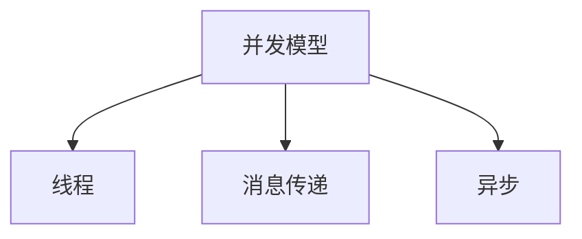

# 05-并发与异步理论

## 目录

1. [1.0 并发模型基础](#10-并发模型基础)
2. [2.0 线程与共享内存](#20-线程与共享内存)
3. [3.0 消息传递模型](#30-消息传递模型)
4. [4.0 异步编程理论](#40-异步编程理论)
5. [5.0 Rust并发与异步机制](#50-rust并发与异步机制)

## 1.0 并发模型基础

**定义 1.1 (并发)**
多个任务在同一时间段内交替或同时执行。

**定义 1.2 (并行)**
多个任务真正同时执行。



## 2.0 线程与共享内存

**定义 2.1 (线程)**
线程是操作系统调度的最小执行单元。

**定义 2.2 (共享内存并发)**
多个线程通过共享变量通信。

```rust
use std::sync::{Arc, Mutex};
use std::thread;

pub fn shared_counter_example() {
    let counter = Arc::new(Mutex::new(0));
    let mut handles = vec![];
    for _ in 0..10 {
        let counter = Arc::clone(&counter);
        let handle = thread::spawn(move || {
            let mut num = counter.lock().unwrap();
            *num += 1;
        });
        handles.push(handle);
    }
    for handle in handles {
        handle.join().unwrap();
    }
    println!("Result: {}", *counter.lock().unwrap());
}
```

## 3.0 消息传递模型

**定义 3.1 (消息传递)**
线程/进程间通过消息队列通信，避免共享状态。

```rust
use std::sync::mpsc;
use std::thread;

pub fn message_passing_example() {
    let (tx, rx) = mpsc::channel();
    thread::spawn(move || {
        tx.send(42).unwrap();
    });
    let received = rx.recv().unwrap();
    println!("Received: {}", received);
}
```

## 4.0 异步编程理论

**定义 4.1 (异步编程)**
通过非阻塞操作提升并发能力。

**定义 4.2 (Future)**
表示尚未完成的异步计算。

```rust
use tokio::time::{sleep, Duration};

pub async fn async_example() {
    sleep(Duration::from_secs(1)).await;
    println!("异步任务完成");
}
```

## 5.0 Rust并发与异步机制

**定义 5.1 (Send/Sync Trait)**
Rust通过类型系统保证线程安全。

**定义 5.2 (Tokio/async-std)**
主流异步运行时，支持高性能异步IO。

```rust
use tokio::sync::mpsc;

#[tokio::main]
async fn main() {
    let (tx, mut rx) = mpsc::channel(32);
    tokio::spawn(async move {
        tx.send("hello").await.unwrap();
    });
    if let Some(msg) = rx.recv().await {
        println!("收到消息: {}", msg);
    }
}
```

---

## 总结

并发与异步理论为高性能程序设计提供理论基础，Rust通过类型系统和现代运行时实现安全高效的并发与异步。 