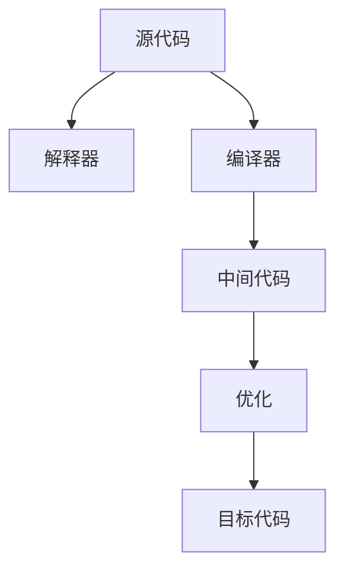
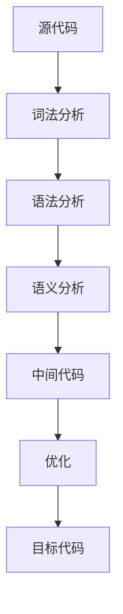

# 06-语言实现与编译原理

## 目录

1. [1.0 语言实现概述](#10-语言实现概述)
2. [2.0 解释器原理](#20-解释器原理)
3. [3.0 编译器结构](#30-编译器结构)
4. [4.0 词法分析](#40-词法分析)
5. [5.0 语法分析](#50-语法分析)
6. [6.0 中间代码生成](#60-中间代码生成)
7. [7.0 优化与目标代码生成](#70-优化与目标代码生成)

## 1.0 语言实现概述

**定义 1.1 (语言实现)**
将高级语言程序转换为可执行结果的过程，包括解释和编译两种主要方式。



## 2.0 解释器原理

**定义 2.1 (解释器)**
逐条读取并执行源代码的程序。

```rust
use std::collections::HashMap;

pub struct Interpreter {
    env: HashMap<String, i32>,
}

impl Interpreter {
    pub fn new() -> Self {
        Self { env: HashMap::new() }
    }
    pub fn eval(&mut self, expr: &str) -> i32 {
        // 简化：仅支持加法表达式
        let tokens: Vec<&str> = expr.split('+').collect();
        tokens.iter().map(|t| t.trim().parse::<i32>().unwrap_or(0)).sum()
    }
}
```

## 3.0 编译器结构

**定义 3.1 (编译器)**
将源代码翻译为目标代码（机器码/字节码）的程序。

**主要阶段：**
- 词法分析
- 语法分析
- 语义分析
- 中间代码生成
- 优化
- 目标代码生成



## 4.0 词法分析

**定义 4.1 (词法分析)**
将字符流分割为有意义的记号（Token）。

```rust
#[derive(Debug, Clone, PartialEq)]
pub enum Token {
    Number(i32),
    Plus,
    Minus,
    Star,
    Slash,
    LParen,
    RParen,
    Identifier(String),
    EOF,
}

pub struct Lexer {
    input: Vec<char>,
    pos: usize,
}

impl Lexer {
    pub fn new(input: &str) -> Self {
        Self { input: input.chars().collect(), pos: 0 }
    }
    pub fn next_token(&mut self) -> Token {
        // 简化实现
        Token::EOF
    }
}
```

## 5.0 语法分析

**定义 5.1 (语法分析)**
根据文法规则将Token序列构建为语法树（AST）。

```rust
#[derive(Debug, Clone)]
pub enum ASTNode {
    Number(i32),
    BinaryOp(Box<ASTNode>, String, Box<ASTNode>),
}

pub struct Parser {
    tokens: Vec<Token>,
    pos: usize,
}

impl Parser {
    pub fn new(tokens: Vec<Token>) -> Self {
        Self { tokens, pos: 0 }
    }
    pub fn parse(&mut self) -> Option<ASTNode> {
        // 简化实现
        None
    }
}
```

## 6.0 中间代码生成

**定义 6.1 (中间代码)**
介于源代码和目标代码之间的抽象表示，便于优化和移植。

```rust
#[derive(Debug, Clone)]
pub enum IR {
    LoadConst(i32),
    Add,
    Sub,
    Mul,
    Div,
    Store(String),
}

pub struct IRGenerator;

impl IRGenerator {
    pub fn generate(ast: &ASTNode) -> Vec<IR> {
        // 简化实现
        vec![]
    }
}
```

## 7.0 优化与目标代码生成

**定义 7.1 (优化)**
改写中间代码以提升性能。

**定义 7.2 (目标代码生成)**
将中间代码翻译为机器码或虚拟机字节码。

```rust
pub struct Optimizer;

impl Optimizer {
    pub fn optimize(ir: Vec<IR>) -> Vec<IR> {
        // 简化实现
        ir
    }
}

pub struct CodeGenerator;

impl CodeGenerator {
    pub fn generate(ir: Vec<IR>) -> Vec<u8> {
        // 简化实现
        vec![]
    }
}
```

---

## 总结

语言实现与编译原理为程序从源代码到可执行文件的全过程提供理论与工程基础，现代编译器通过多阶段处理实现高效、安全的代码转换。 