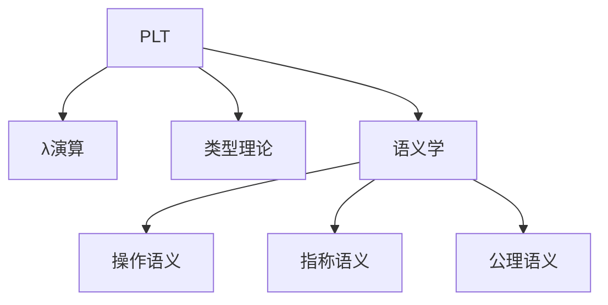

# 07-PLT与形式化方法

## 目录

1. [1.0 编程语言理论基础](#10-编程语言理论基础)
2. [2.0 λ演算](#20-λ演算)
3. [3.0 类型理论](#30-类型理论)
4. [4.0 操作语义](#40-操作语义)
5. [5.0 指称语义](#50-指称语义)
6. [6.0 公理语义](#60-公理语义)
7. [7.0 程序验证](#70-程序验证)

## 1.0 编程语言理论基础

**定义 1.1 (编程语言理论)**
研究编程语言设计、实现和使用的数学基础。

**定义 1.2 (形式化方法)**
使用数学方法严格描述和分析程序行为的工具。



## 2.0 λ演算

**定义 2.1 (λ演算)**
函数式编程的数学基础，由Church在1930年代提出。

**基本概念：**
- 变量：x, y, z
- 抽象：λx.M（函数定义）
- 应用：MN（函数调用）

```rust
// λ演算项的基本结构
#[derive(Debug, Clone)]
pub enum LambdaTerm {
    Variable(String),
    Abstraction(String, Box<LambdaTerm>),
    Application(Box<LambdaTerm>, Box<LambdaTerm>),
}

impl LambdaTerm {
    // β归约
    pub fn beta_reduce(&self) -> Option<LambdaTerm> {
        match self {
            LambdaTerm::Application(abst, arg) => {
                if let LambdaTerm::Abstraction(var, body) = &**abst {
                    Some(self.substitute(var, arg))
                } else {
                    None
                }
            }
            _ => None,
        }
    }
    
    // 变量替换
    fn substitute(&self, var: &str, replacement: &LambdaTerm) -> LambdaTerm {
        match self {
            LambdaTerm::Variable(name) if name == var => replacement.clone(),
            LambdaTerm::Variable(_) => self.clone(),
            LambdaTerm::Abstraction(param, body) => {
                if param != var {
                    LambdaTerm::Abstraction(param.clone(), 
                        Box::new(body.substitute(var, replacement)))
                } else {
                    self.clone()
                }
            }
            LambdaTerm::Application(left, right) => {
                LambdaTerm::Application(
                    Box::new(left.substitute(var, replacement)),
                    Box::new(right.substitute(var, replacement))
                )
            }
        }
    }
}
```

## 3.0 类型理论

**定义 3.1 (类型理论)**
研究类型系统的数学理论，包括简单类型、多态类型、依赖类型等。

```rust
// 简单类型λ演算
#[derive(Debug, Clone, PartialEq)]
pub enum SimpleType {
    Base(String),
    Arrow(Box<SimpleType>, Box<SimpleType>),
}

#[derive(Debug, Clone)]
pub struct TypedLambdaTerm {
    term: LambdaTerm,
    type_info: SimpleType,
}

// 类型推导
pub struct TypeInference {
    context: HashMap<String, SimpleType>,
}

impl TypeInference {
    pub fn infer_type(&mut self, term: &LambdaTerm) -> Result<SimpleType, String> {
        match term {
            LambdaTerm::Variable(name) => {
                self.context.get(name)
                    .cloned()
                    .ok_or_else(|| format!("Undefined variable: {}", name))
            }
            LambdaTerm::Abstraction(param, body) => {
                let param_type = SimpleType::Base("T".to_string()); // 简化
                let mut new_context = self.context.clone();
                new_context.insert(param.clone(), param_type.clone());
                let mut new_inference = TypeInference { context: new_context };
                let body_type = new_inference.infer_type(body)?;
                Ok(SimpleType::Arrow(Box::new(param_type), Box::new(body_type)))
            }
            LambdaTerm::Application(func, arg) => {
                let func_type = self.infer_type(func)?;
                let arg_type = self.infer_type(arg)?;
                if let SimpleType::Arrow(param_type, return_type) = func_type {
                    if arg_type == *param_type {
                        Ok(*return_type)
                    } else {
                        Err("Type mismatch in application".to_string())
                    }
                } else {
                    Err("Not a function type".to_string())
                }
            }
        }
    }
}
```

## 4.0 操作语义

**定义 4.1 (操作语义)**
描述程序执行时的状态转换规则。

```rust
// 小步操作语义
#[derive(Debug, Clone)]
pub struct Configuration {
    term: LambdaTerm,
    environment: HashMap<String, LambdaTerm>,
}

impl Configuration {
    pub fn step(&self) -> Option<Configuration> {
        match &self.term {
            LambdaTerm::Application(left, right) => {
                // 先求值左操作数
                if let Some(new_left) = self.eval_left(left) {
                    Some(Configuration {
                        term: LambdaTerm::Application(Box::new(new_left), right.clone()),
                        environment: self.environment.clone(),
                    })
                } else if let Some(new_right) = self.eval_right(right) {
                    // 再求值右操作数
                    Some(Configuration {
                        term: LambdaTerm::Application(left.clone(), Box::new(new_right)),
                        environment: self.environment.clone(),
                    })
                } else {
                    // β归约
                    self.beta_reduce(left, right)
                }
            }
            _ => None,
        }
    }
    
    fn eval_left(&self, left: &LambdaTerm) -> Option<LambdaTerm> {
        // 简化实现
        None
    }
    
    fn eval_right(&self, right: &LambdaTerm) -> Option<LambdaTerm> {
        // 简化实现
        None
    }
    
    fn beta_reduce(&self, func: &LambdaTerm, arg: &LambdaTerm) -> Option<Configuration> {
        if let LambdaTerm::Abstraction(var, body) = func {
            let new_term = body.substitute(var, arg);
            Some(Configuration {
                term: new_term,
                environment: self.environment.clone(),
            })
        } else {
            None
        }
    }
}
```

## 5.0 指称语义

**定义 5.1 (指称语义)**
将程序语言构造映射到数学对象（域论）。

```rust
// 指称语义的域
#[derive(Debug, Clone)]
pub enum Domain {
    Bottom,
    Number(i32),
    Boolean(bool),
    Function(Box<dyn Fn(&Domain) -> Domain>),
}

// 指称语义解释器
pub struct DenotationalSemantics;

impl DenotationalSemantics {
    pub fn meaning(term: &LambdaTerm) -> Domain {
        match term {
            LambdaTerm::Variable(_) => Domain::Bottom, // 简化
            LambdaTerm::Abstraction(param, body) => {
                let func = move |arg: &Domain| {
                    // 简化：返回参数本身
                    arg.clone()
                };
                Domain::Function(Box::new(func))
            }
            LambdaTerm::Application(func, arg) => {
                let func_meaning = Self::meaning(func);
                let arg_meaning = Self::meaning(arg);
                if let Domain::Function(f) = func_meaning {
                    f(&arg_meaning)
                } else {
                    Domain::Bottom
                }
            }
        }
    }
}
```

## 6.0 公理语义

**定义 6.1 (公理语义)**
使用逻辑断言描述程序行为的语义。

```rust
// Hoare逻辑
#[derive(Debug, Clone)]
pub struct HoareTriple {
    precondition: String,
    program: String,
    postcondition: String,
}

impl HoareTriple {
    pub fn new(pre: String, prog: String, post: String) -> Self {
        Self {
            precondition: pre,
            program: prog,
            postcondition: post,
        }
    }
    
    pub fn is_valid(&self) -> bool {
        // 简化：总是返回true
        true
    }
}

// 程序验证规则
pub struct VerificationRules;

impl VerificationRules {
    // 赋值公理
    pub fn assignment_axiom(var: &str, expr: &str) -> HoareTriple {
        let post = format!("{{ P[{} := {}] }}", var, expr);
        HoareTriple::new(
            post,
            format!("{} := {}", var, expr),
            "P".to_string(),
        )
    }
    
    // 序列规则
    pub fn sequence_rule(first: HoareTriple, second: HoareTriple) -> HoareTriple {
        HoareTriple::new(
            first.precondition,
            format!("{}; {}", first.program, second.program),
            second.postcondition,
        )
    }
}
```

## 7.0 程序验证

**定义 7.1 (程序验证)**
使用形式化方法证明程序正确性。

```rust
// 程序规范
#[derive(Debug, Clone)]
pub struct Specification {
    requires: String,
    ensures: String,
}

// 验证条件生成器
pub struct VCG;

impl VCG {
    pub fn generate_verification_conditions(
        spec: &Specification,
        program: &str,
    ) -> Vec<String> {
        vec![
            format!("{} -> {}", spec.requires, "initial_condition"),
            format!("{} -> {}", "final_condition", spec.ensures),
        ]
    }
}

// 模型检查
pub struct ModelChecker;

impl ModelChecker {
    pub fn check_property(&self, model: &str, property: &str) -> bool {
        // 简化实现
        true
    }
}

// 定理证明
pub struct TheoremProver;

impl TheoremProver {
    pub fn prove(&self, goal: &str) -> bool {
        // 简化实现
        true
    }
}
```

---

## 总结

PLT与形式化方法为编程语言提供严格的数学基础，通过λ演算、类型理论、语义学和程序验证等理论，确保程序的正确性和可靠性。 