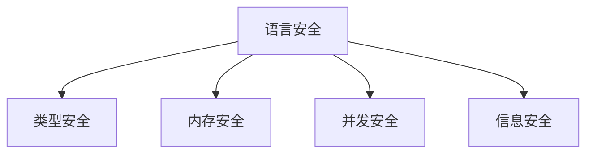

# 08-语言安全性理论

## 目录

1. [1.0 语言安全性概述](#10-语言安全性概述)
2. [2.0 类型安全](#20-类型安全)
3. [3.0 内存安全](#30-内存安全)
4. [4.0 并发安全](#40-并发安全)
5. [5.0 信息安全](#50-信息安全)
6. [6.0 安全编程实践](#60-安全编程实践)

## 1.0 语言安全性概述

**定义 1.1 (语言安全性)**
编程语言在编译时和运行时防止错误行为的能力。

**定义 1.2 (安全保证)**
语言设计提供的安全保障机制。



## 2.0 类型安全

**定义 2.1 (类型安全)**
程序在运行时不会出现类型错误。

**定理 2.1 (类型安全定理)**
如果程序通过类型检查，则运行时不会出现类型错误。

```rust
// 类型安全示例
pub struct TypeSafeExample {
    data: i32,
}

impl TypeSafeExample {
    pub fn new(value: i32) -> Self {
        Self { data: value }
    }
    
    // 类型安全的操作
    pub fn add(&self, other: i32) -> i32 {
        self.data + other
    }
    
    // 编译时类型检查
    pub fn safe_operation<T: std::fmt::Display>(&self, value: T) -> String {
        format!("Data: {}, Value: {}", self.data, value)
    }
}

// 编译时类型检查
pub fn demonstrate_type_safety() {
    let example = TypeSafeExample::new(42);
    
    // 这些操作在编译时检查类型
    let result = example.add(10);
    let string_result = example.safe_operation("hello");
    
    // 以下代码会在编译时出错
    // let error = example.add("not a number"); // 类型错误
}
```

## 3.0 内存安全

**定义 3.1 (内存安全)**
程序不会出现内存访问错误，如悬垂指针、缓冲区溢出等。

```rust
// Rust内存安全机制
pub struct MemorySafeExample {
    data: String,
}

impl MemorySafeExample {
    pub fn new(data: String) -> Self {
        Self { data }
    }
    
    // 所有权保证内存安全
    pub fn consume(self) -> String {
        self.data // 所有权转移
    }
    
    // 借用检查
    pub fn borrow(&self) -> &str {
        &self.data
    }
    
    pub fn borrow_mut(&mut self) -> &mut String {
        &mut self.data
    }
}

// 内存安全示例
pub fn demonstrate_memory_safety() {
    let mut example = MemorySafeExample::new("hello".to_string());
    
    // 不可变借用
    let reference = example.borrow();
    
    // 可变借用（编译错误：同时存在可变和不可变借用）
    // let mutable_ref = example.borrow_mut();
    
    println!("{}", reference);
    
    // 现在可以可变借用
    let mutable_ref = example.borrow_mut();
    mutable_ref.push_str(" world");
}
```

## 4.0 并发安全

**定义 4.1 (并发安全)**
多线程环境下程序行为的正确性。

**定义 4.2 (数据竞争)**
多个线程同时访问共享数据且至少有一个是写操作。

```rust
use std::sync::{Arc, Mutex, RwLock};
use std::thread;

// 并发安全示例
pub struct ConcurrentSafeExample {
    counter: Arc<Mutex<i32>>,
    data: Arc<RwLock<String>>,
}

impl ConcurrentSafeExample {
    pub fn new() -> Self {
        Self {
            counter: Arc::new(Mutex::new(0)),
            data: Arc::new(RwLock::new(String::new())),
        }
    }
    
    // 线程安全的计数器
    pub fn increment(&self) {
        if let Ok(mut counter) = self.counter.lock() {
            *counter += 1;
        }
    }
    
    // 读写锁保护的数据
    pub fn read_data(&self) -> String {
        if let Ok(data) = self.data.read() {
            data.clone()
        } else {
            String::new()
        }
    }
    
    pub fn write_data(&self, new_data: String) {
        if let Ok(mut data) = self.data.write() {
            *data = new_data;
        }
    }
}

// 并发安全演示
pub fn demonstrate_concurrent_safety() {
    let example = ConcurrentSafeExample::new();
    let mut handles = vec![];
    
    // 启动多个线程
    for i in 0..5 {
        let example = Arc::new(example);
        let handle = thread::spawn(move || {
            example.increment();
            example.write_data(format!("Thread {}", i));
        });
        handles.push(handle);
    }
    
    // 等待所有线程完成
    for handle in handles {
        handle.join().unwrap();
    }
    
    println!("Final counter: {}", *example.counter.lock().unwrap());
    println!("Final data: {}", example.read_data());
}
```

## 5.0 信息安全

**定义 5.1 (信息安全)**
防止程序被恶意利用或泄露敏感信息。

```rust
// 信息安全示例
pub struct SecurityExample {
    sensitive_data: String,
}

impl SecurityExample {
    pub fn new(data: String) -> Self {
        Self { sensitive_data: data }
    }
    
    // 安全的字符串比较（防止时序攻击）
    pub fn secure_compare(&self, input: &str) -> bool {
        if self.sensitive_data.len() != input.len() {
            return false;
        }
        
        let mut result = 0u8;
        for (a, b) in self.sensitive_data.bytes().zip(input.bytes()) {
            result |= a ^ b;
        }
        result == 0
    }
    
    // 安全的字符串清理
    pub fn sanitize_input(input: &str) -> String {
        input.chars()
            .filter(|c| c.is_alphanumeric() || c.is_whitespace())
            .collect()
    }
}

// 零知识证明模拟
pub struct ZeroKnowledgeProof {
    secret: u64,
}

impl ZeroKnowledgeProof {
    pub fn new(secret: u64) -> Self {
        Self { secret }
    }
    
    // 简化的零知识证明
    pub fn prove_knowledge(&self, challenge: u64) -> u64 {
        // 模拟证明过程
        (self.secret + challenge) % 1000
    }
    
    pub fn verify_knowledge(&self, challenge: u64, proof: u64) -> bool {
        proof == self.prove_knowledge(challenge)
    }
}
```

## 6.0 安全编程实践

**定义 6.1 (安全编程)**
遵循安全最佳实践的编程方法。

```rust
// 安全编程实践示例
pub struct SecureProgramming {
    data: Vec<u8>,
}

impl SecureProgramming {
    pub fn new() -> Self {
        Self { data: Vec::new() }
    }
    
    // 边界检查
    pub fn safe_access(&self, index: usize) -> Option<&u8> {
        self.data.get(index)
    }
    
    // 输入验证
    pub fn validate_input(input: &str) -> Result<String, String> {
        if input.len() > 1000 {
            return Err("Input too long".to_string());
        }
        
        if input.contains('\0') {
            return Err("Input contains null bytes".to_string());
        }
        
        Ok(input.to_string())
    }
    
    // 安全的随机数生成
    pub fn secure_random() -> u64 {
        use std::collections::hash_map::DefaultHasher;
        use std::hash::{Hash, Hasher};
        
        let mut hasher = DefaultHasher::new();
        std::time::SystemTime::now().hash(&mut hasher);
        hasher.finish()
    }
    
    // 安全的字符串处理
    pub fn secure_string_handling(input: &str) -> String {
        // 防止注入攻击
        input.replace("<", "&lt;")
             .replace(">", "&gt;")
             .replace("\"", "&quot;")
             .replace("'", "&#x27;")
    }
}

// 安全配置
pub struct SecurityConfig {
    max_input_length: usize,
    allowed_chars: Vec<char>,
    timeout_seconds: u64,
}

impl Default for SecurityConfig {
    fn default() -> Self {
        Self {
            max_input_length: 1000,
            allowed_chars: "abcdefghijklmnopqrstuvwxyzABCDEFGHIJKLMNOPQRSTUVWXYZ0123456789 ".chars().collect(),
            timeout_seconds: 30,
        }
    }
}

impl SecurityConfig {
    pub fn validate_input(&self, input: &str) -> Result<String, String> {
        if input.len() > self.max_input_length {
            return Err("Input exceeds maximum length".to_string());
        }
        
        for c in input.chars() {
            if !self.allowed_chars.contains(&c) {
                return Err(format!("Invalid character: {}", c));
            }
        }
        
        Ok(input.to_string())
    }
}
```

---

## 总结

语言安全性理论为构建可靠、安全的软件系统提供理论基础，通过类型安全、内存安全、并发安全和信息安全等多层次保障，确保程序在各种环境下都能正确、安全地运行。 