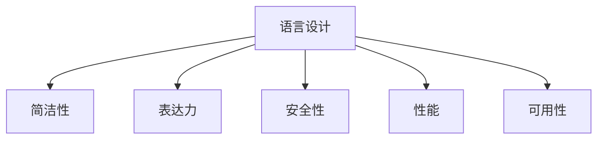

# 09-语言设计哲学

## 目录

1. [1.0 语言设计概述](#10-语言设计概述)
2. [2.0 设计原则](#20-设计原则)
3. [3.0 权衡理论](#30-权衡理论)
4. [4.0 语言演进](#40-语言演进)
5. [5.0 设计模式](#50-设计模式)
6. [6.0 哲学思考](#60-哲学思考)

## 1.0 语言设计概述

**定义 1.1 (语言设计)**
编程语言的设计理念、原则和方法论。

**定义 1.2 (设计哲学)**
指导语言设计的核心思想和价值观。



## 2.0 设计原则

**原则 2.1 (简洁性)**
语言应该简洁明了，避免不必要的复杂性。

**原则 2.2 (一致性)**
语言特性应该保持内部一致性。

**原则 2.3 (正交性)**
语言特性应该相互独立，组合使用时不会产生意外行为。

```rust
// 简洁性示例：Rust的所有权系统
pub struct SimpleOwnership {
    data: String,
}

impl SimpleOwnership {
    pub fn new(data: String) -> Self {
        Self { data }
    }
    
    // 简洁的API设计
    pub fn get_data(&self) -> &str {
        &self.data
    }
    
    // 明确的所有权转移
    pub fn take_data(self) -> String {
        self.data
    }
}

// 一致性示例：统一的错误处理
pub enum Result<T, E> {
    Ok(T),
    Err(E),
}

impl<T, E> Result<T, E> {
    // 一致的API设计
    pub fn map<U, F>(self, f: F) -> Result<U, E>
    where
        F: FnOnce(T) -> U,
    {
        match self {
            Ok(t) => Ok(f(t)),
            Err(e) => Err(e),
        }
    }
    
    pub fn and_then<U, F>(self, f: F) -> Result<U, E>
    where
        F: FnOnce(T) -> Result<U, E>,
    {
        match self {
            Ok(t) => f(t),
            Err(e) => Err(e),
        }
    }
}

// 正交性示例：独立的语言特性
pub trait Display {
    fn fmt(&self, f: &mut std::fmt::Formatter<'_>) -> std::fmt::Result;
}

pub trait Debug {
    fn fmt(&self, f: &mut std::fmt::Formatter<'_>) -> std::fmt::Result;
}

// Display和Debug是正交的，可以独立实现
impl Display for SimpleOwnership {
    fn fmt(&self, f: &mut std::fmt::Formatter<'_>) -> std::fmt::Result {
        write!(f, "{}", self.data)
    }
}

impl Debug for SimpleOwnership {
    fn fmt(&self, f: &mut std::fmt::Formatter<'_>) -> std::fmt::Result {
        write!(f, "SimpleOwnership {{ data: {:?} }}", self.data)
    }
}
```

## 3.0 权衡理论

**定义 3.1 (设计权衡)**
语言设计中的各种目标之间的平衡。

**权衡 3.1 (性能 vs 安全性)**
高性能往往需要牺牲一些安全保障。

**权衡 3.2 (简洁性 vs 表达力)**
过于简洁可能限制表达力，过于复杂可能影响可用性。

```rust
// 性能与安全性的权衡
pub struct PerformanceVsSafety {
    // 高性能但需要手动管理
    raw_data: *mut u8,
    // 安全但可能有性能开销
    safe_data: Vec<u8>,
}

impl PerformanceVsSafety {
    pub fn new() -> Self {
        Self {
            raw_data: std::ptr::null_mut(),
            safe_data: Vec::new(),
        }
    }
    
    // 高性能但危险的操作
    pub unsafe fn fast_operation(&mut self) {
        // 需要unsafe块，性能高但需要开发者保证安全
        if !self.raw_data.is_null() {
            *self.raw_data = 42;
        }
    }
    
    // 安全但可能有性能开销的操作
    pub fn safe_operation(&mut self) {
        // 自动边界检查，安全但可能有性能开销
        if let Some(value) = self.safe_data.get_mut(0) {
            *value = 42;
        }
    }
}

// 简洁性与表达力的权衡
pub struct SimplicityVsExpressiveness;

impl SimplicityVsExpressiveness {
    // 简洁但功能有限
    pub fn simple_function(x: i32) -> i32 {
        x + 1
    }
    
    // 表达力强但复杂
    pub fn expressive_function<T, F, R>(input: T, transform: F) -> R
    where
        F: FnOnce(T) -> R,
    {
        transform(input)
    }
}

// 使用示例
pub fn demonstrate_tradeoffs() {
    // 简洁性：直接明了
    let result1 = SimplicityVsExpressiveness::simple_function(5);
    
    // 表达力：灵活但复杂
    let result2 = SimplicityVsExpressiveness::expressive_function(5, |x| x * 2);
    let result3 = SimplicityVsExpressiveness::expressive_function("hello", |s| s.len());
}
```

## 4.0 语言演进

**定义 4.1 (语言演进)**
编程语言随时间的发展和变化。

**演进模式 4.1 (渐进式演进)**
通过版本迭代逐步改进语言特性。

**演进模式 4.2 (革命式演进)**
通过重大变革引入新的设计理念。

```rust
// 语言演进示例：从简单到复杂
pub struct LanguageEvolution {
    version: u32,
    features: Vec<String>,
}

impl LanguageEvolution {
    pub fn new() -> Self {
        Self {
            version: 1,
            features: vec!["basic_types".to_string()],
        }
    }
    
    // 版本1：基本功能
    pub fn v1_basic_types(&self) -> (i32, bool, String) {
        (42, true, "hello".to_string())
    }
    
    // 版本2：添加泛型
    pub fn v2_generics<T>(&self, value: T) -> T {
        value
    }
    
    // 版本3：添加trait系统
    pub fn v3_traits<T: std::fmt::Display>(&self, value: T) -> String {
        format!("Value: {}", value)
    }
    
    // 版本4：添加异步支持
    pub async fn v4_async(&self) -> String {
        tokio::time::sleep(tokio::time::Duration::from_millis(100)).await;
        "async result".to_string()
    }
    
    // 版本5：添加宏系统
    macro_rules! v5_macro {
        ($name:ident) => {
            pub fn $name() -> String {
                stringify!($name).to_string()
            }
        };
    }
    
    v5_macro!(macro_function);
}

// 向后兼容性
pub struct BackwardCompatibility {
    old_api: String,
    new_api: String,
}

impl BackwardCompatibility {
    pub fn new() -> Self {
        Self {
            old_api: "deprecated".to_string(),
            new_api: "modern".to_string(),
        }
    }
    
    // 旧API（已弃用但保持兼容）
    #[deprecated(since = "2.0", note = "Use new_api instead")]
    pub fn old_method(&self) -> &str {
        &self.old_api
    }
    
    // 新API
    pub fn new_method(&self) -> &str {
        &self.new_api
    }
}
```

## 5.0 设计模式

**定义 5.1 (语言设计模式)**
在语言设计中反复出现的解决方案。

**模式 5.1 (零成本抽象)**
高级抽象不应该带来运行时开销。

**模式 5.2 (组合优于继承)**
通过组合实现代码复用而不是继承。

```rust
// 零成本抽象模式
pub struct ZeroCostAbstraction;

impl ZeroCostAbstraction {
    // 高级抽象：迭代器
    pub fn process_data<T, F>(data: Vec<T>, processor: F) -> Vec<T>
    where
        F: Fn(T) -> T,
    {
        data.into_iter().map(processor).collect()
    }
    
    // 编译时优化：泛型特化
    pub fn specialized_function<T>(value: T) -> T
    where
        T: Copy + std::fmt::Display,
    {
        // 编译器会为每种类型生成优化的代码
        value
    }
}

// 组合优于继承模式
pub trait Behavior {
    fn perform(&self);
}

pub struct WalkBehavior;
impl Behavior for WalkBehavior {
    fn perform(&self) {
        println!("Walking");
    }
}

pub struct FlyBehavior;
impl Behavior for FlyBehavior {
    fn perform(&self) {
        println!("Flying");
    }
}

pub struct Entity {
    behavior: Box<dyn Behavior>,
}

impl Entity {
    pub fn new(behavior: Box<dyn Behavior>) -> Self {
        Self { behavior }
    }
    
    pub fn act(&self) {
        self.behavior.perform();
    }
    
    // 动态改变行为
    pub fn change_behavior(&mut self, behavior: Box<dyn Behavior>) {
        self.behavior = behavior;
    }
}

// 建造者模式
pub struct BuilderPattern {
    name: Option<String>,
    age: Option<u32>,
    email: Option<String>,
}

impl BuilderPattern {
    pub fn new() -> Self {
        Self {
            name: None,
            age: None,
            email: None,
        }
    }
    
    pub fn name(mut self, name: String) -> Self {
        self.name = Some(name);
        self
    }
    
    pub fn age(mut self, age: u32) -> Self {
        self.age = Some(age);
        self
    }
    
    pub fn email(mut self, email: String) -> Self {
        self.email = Some(email);
        self
    }
    
    pub fn build(self) -> Result<Person, String> {
        let name = self.name.ok_or("Name is required")?;
        let age = self.age.ok_or("Age is required")?;
        let email = self.email.ok_or("Email is required")?;
        
        Ok(Person { name, age, email })
    }
}

pub struct Person {
    name: String,
    age: u32,
    email: String,
}
```

## 6.0 哲学思考

**思考 6.1 (语言的目的)**
编程语言应该服务于什么目标？

**思考 6.2 (抽象的本质)**
如何在抽象和具体之间找到平衡？

**思考 6.3 (表达力与可读性)**
如何平衡语言的表达力和代码的可读性？

```rust
// 哲学思考的代码体现
pub struct PhilosophicalDesign {
    // 表达力：能够表达复杂的概念
    complex_abstraction: Box<dyn std::any::Any>,
    // 可读性：代码意图清晰
    clear_intent: String,
    // 简洁性：避免不必要的复杂性
    simple_interface: fn() -> String,
}

impl PhilosophicalDesign {
    pub fn new() -> Self {
        Self {
            complex_abstraction: Box::new(42),
            clear_intent: "This represents a clear concept".to_string(),
            simple_interface: || "Simple and clear".to_string(),
        }
    }
    
    // 平衡表达力和可读性
    pub fn balanced_design<T, F, R>(input: T, processor: F) -> R
    where
        F: FnOnce(T) -> R,
        T: std::fmt::Debug,
        R: std::fmt::Display,
    {
        // 表达力：支持任意类型和转换
        // 可读性：函数名和类型约束清晰表达意图
        let result = processor(input);
        println!("Processed result: {}", result);
        result
    }
    
    // 抽象的本质：隐藏复杂性，暴露简单接口
    pub fn abstract_complexity(&self) -> String {
        // 内部可能很复杂，但接口简单
        "Simple result from complex computation".to_string()
    }
}

// 语言设计哲学的应用
pub struct DesignPhilosophy {
    principles: Vec<String>,
}

impl DesignPhilosophy {
    pub fn new() -> Self {
        Self {
            principles: vec![
                "Simplicity".to_string(),
                "Consistency".to_string(),
                "Expressiveness".to_string(),
                "Safety".to_string(),
                "Performance".to_string(),
            ],
        }
    }
    
    pub fn apply_principle(&self, principle: &str) -> bool {
        self.principles.contains(&principle.to_string())
    }
    
    pub fn evaluate_design(&self, design: &str) -> String {
        // 根据设计原则评估设计
        if self.apply_principle("Simplicity") {
            "Design follows simplicity principle".to_string()
        } else {
            "Design may be too complex".to_string()
        }
    }
}
```

---

## 总结

语言设计哲学为编程语言的设计提供指导原则和思考框架，通过平衡各种设计目标，创造出既实用又优雅的编程语言。 