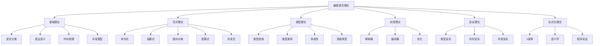

# 10-编程语言理论总结

## 目录

1. [1.0 理论体系概述](#10-理论体系概述)
2. [2.0 核心概念回顾](#20-核心概念回顾)
3. [3.0 理论联系](#30-理论联系)
4. [4.0 发展趋势](#40-发展趋势)
5. [5.0 实践应用](#50-实践应用)
6. [6.0 未来展望](#60-未来展望)

## 1.0 理论体系概述

**定义 1.1 (编程语言理论体系)**
编程语言理论是一个完整的知识体系，涵盖语言设计、实现、分析和应用的理论基础。



## 2.0 核心概念回顾

### 2.1 语言基础

**核心概念 2.1.1 (语言分类)**
- 按范式：命令式、函数式、面向对象、逻辑式、并发式
- 按执行方式：编译型、解释型、混合型

**核心概念 2.1.2 (语法语义)**
- 语法：程序结构的形式定义
- 语义：程序含义的数学描述

```rust
// 语言基础的综合体现
pub struct LanguageFoundation {
    paradigm: ProgrammingParadigm,
    execution_model: ExecutionModel,
    syntax: SyntaxDefinition,
    semantics: SemanticModel,
}

#[derive(Debug, Clone)]
pub enum ProgrammingParadigm {
    Imperative,
    Functional,
    ObjectOriented,
    Logic,
    Concurrent,
}

#[derive(Debug, Clone)]
pub enum ExecutionModel {
    Compiled,
    Interpreted,
    Hybrid,
}

pub struct SyntaxDefinition {
    grammar: String,
    tokens: Vec<String>,
}

pub struct SemanticModel {
    operational_semantics: String,
    denotational_semantics: String,
    axiomatic_semantics: String,
}
```

### 2.2 类型系统

**核心概念 2.2.1 (类型安全)**
编译时类型检查确保运行时类型安全。

**核心概念 2.2.2 (类型推导)**
自动推断表达式类型，减少显式类型注解。

```rust
// 类型系统的综合体现
pub struct TypeSystem {
    type_checker: TypeChecker,
    type_inferrer: TypeInferrer,
    type_safety: TypeSafety,
}

pub struct TypeChecker {
    environment: HashMap<String, Type>,
}

pub struct TypeInferrer {
    constraints: Vec<TypeConstraint>,
    substitutions: HashMap<TypeVar, Type>,
}

pub struct TypeSafety {
    guarantees: Vec<String>,
    violations: Vec<String>,
}

impl TypeSystem {
    pub fn ensure_safety(&self, program: &str) -> Result<(), String> {
        // 类型检查
        let types = self.type_checker.check(program)?;
        
        // 类型推导
        let inferred_types = self.type_inferrer.infer(program)?;
        
        // 安全性验证
        self.type_safety.verify(types, inferred_types)
    }
}
```

### 2.3 内存管理

**核心概念 2.3.1 (内存安全)**
防止内存访问错误，如悬垂指针、缓冲区溢出。

**核心概念 2.3.2 (所有权系统)**
编译时保证内存安全，无需垃圾回收。

```rust
// 内存管理的综合体现
pub struct MemoryManagement {
    ownership_system: OwnershipSystem,
    garbage_collection: GarbageCollection,
    manual_management: ManualManagement,
}

pub struct OwnershipSystem {
    rules: Vec<OwnershipRule>,
    borrow_checker: BorrowChecker,
}

pub struct GarbageCollection {
    algorithm: GCAlgorithm,
    roots: Vec<GCRoot>,
    heap: GCHeap,
}

pub struct ManualManagement {
    allocator: Allocator,
    deallocator: Deallocator,
}

impl MemoryManagement {
    pub fn manage_memory(&self, strategy: MemoryStrategy) -> Result<(), String> {
        match strategy {
            MemoryStrategy::Ownership => self.ownership_system.enforce(),
            MemoryStrategy::GarbageCollection => self.garbage_collection.collect(),
            MemoryStrategy::Manual => self.manual_management.manage(),
        }
    }
}

#[derive(Debug, Clone)]
pub enum MemoryStrategy {
    Ownership,
    GarbageCollection,
    Manual,
}
```

## 3.0 理论联系

### 3.1 理论间的关联

**关联 3.1.1 (类型系统与安全性)**
类型系统是实现语言安全性的重要机制。

**关联 3.1.2 (形式化方法与实现)**
形式化方法为语言实现提供理论基础。

```rust
// 理论联系的综合体现
pub struct TheoreticalConnections {
    type_safety_connection: TypeSafetyConnection,
    formal_implementation_connection: FormalImplementationConnection,
    paradigm_safety_connection: ParadigmSafetyConnection,
}

pub struct TypeSafetyConnection {
    type_system: TypeSystem,
    safety_guarantees: Vec<SafetyGuarantee>,
}

pub struct FormalImplementationConnection {
    formal_specification: FormalSpecification,
    implementation: Implementation,
    correctness_proof: CorrectnessProof,
}

pub struct ParadigmSafetyConnection {
    paradigm: ProgrammingParadigm,
    safety_mechanisms: Vec<SafetyMechanism>,
}

impl TheoreticalConnections {
    pub fn demonstrate_connections(&self) -> String {
        let mut connections = Vec::new();
        
        // 类型系统与安全性
        connections.push("Type systems provide compile-time safety guarantees".to_string());
        
        // 形式化方法与实现
        connections.push("Formal methods ensure implementation correctness".to_string());
        
        // 范式与安全性
        connections.push("Programming paradigms influence safety mechanisms".to_string());
        
        connections.join("\n")
    }
}
```

### 3.2 实践应用

**应用 3.2.1 (编译器设计)**
理论指导编译器实现，确保正确性和效率。

**应用 3.2.2 (语言设计)**
理论为语言设计提供指导原则。

```rust
// 实践应用的综合体现
pub struct PracticalApplications {
    compiler_design: CompilerDesign,
    language_design: LanguageDesign,
    tool_development: ToolDevelopment,
}

pub struct CompilerDesign {
    frontend: Frontend,
    backend: Backend,
    optimizations: Vec<Optimization>,
}

pub struct LanguageDesign {
    principles: Vec<DesignPrinciple>,
    features: Vec<LanguageFeature>,
    tradeoffs: Vec<DesignTradeoff>,
}

pub struct ToolDevelopment {
    static_analysis: StaticAnalysis,
    dynamic_analysis: DynamicAnalysis,
    verification_tools: Vec<VerificationTool>,
}

impl PracticalApplications {
    pub fn apply_theory(&self, application: ApplicationType) -> Result<String, String> {
        match application {
            ApplicationType::Compiler => self.compiler_design.build(),
            ApplicationType::Language => self.language_design.design(),
            ApplicationType::Tool => self.tool_development.develop(),
        }
    }
}

#[derive(Debug, Clone)]
pub enum ApplicationType {
    Compiler,
    Language,
    Tool,
}
```

## 4.0 发展趋势

### 4.1 当前趋势

**趋势 4.1.1 (类型系统发展)**
- 依赖类型系统
- 线性类型系统
- 会话类型系统

**趋势 4.1.2 (并发模型)**
- 异步编程
- 消息传递
- 无锁编程

```rust
// 发展趋势的综合体现
pub struct DevelopmentTrends {
    type_system_trends: TypeSystemTrends,
    concurrency_trends: ConcurrencyTrends,
    safety_trends: SafetyTrends,
}

pub struct TypeSystemTrends {
    dependent_types: DependentTypeSystem,
    linear_types: LinearTypeSystem,
    session_types: SessionTypeSystem,
}

pub struct ConcurrencyTrends {
    async_programming: AsyncProgramming,
    message_passing: MessagePassing,
    lock_free: LockFreeProgramming,
}

pub struct SafetyTrends {
    formal_verification: FormalVerification,
    static_analysis: StaticAnalysis,
    runtime_safety: RuntimeSafety,
}

impl DevelopmentTrends {
    pub fn analyze_trends(&self) -> Vec<String> {
        vec![
            "Dependent type systems gaining adoption".to_string(),
            "Async programming becoming mainstream".to_string(),
            "Formal verification tools improving".to_string(),
            "Static analysis becoming more sophisticated".to_string(),
        ]
    }
}
```

### 4.2 新兴领域

**新兴领域 4.2.1 (量子编程语言)**
为量子计算设计的专用语言。

**新兴领域 4.2.2 (领域特定语言)**
针对特定应用领域的专用语言。

```rust
// 新兴领域的综合体现
pub struct EmergingAreas {
    quantum_programming: QuantumProgramming,
    domain_specific_languages: DomainSpecificLanguages,
    ai_assisted_programming: AIAssistedProgramming,
}

pub struct QuantumProgramming {
    quantum_types: QuantumTypeSystem,
    quantum_operations: QuantumOperations,
    quantum_algorithms: QuantumAlgorithms,
}

pub struct DomainSpecificLanguages {
    embedded_languages: Vec<EmbeddedLanguage>,
    external_languages: Vec<ExternalLanguage>,
    language_workbenches: Vec<LanguageWorkbench>,
}

pub struct AIAssistedProgramming {
    code_generation: CodeGeneration,
    program_synthesis: ProgramSynthesis,
    bug_detection: BugDetection,
}

impl EmergingAreas {
    pub fn explore_emerging_areas(&self) -> Vec<String> {
        vec![
            "Quantum programming languages for quantum computing".to_string(),
            "Domain-specific languages for specialized applications".to_string(),
            "AI-assisted programming for productivity".to_string(),
        ]
    }
}
```

## 5.0 实践应用

### 5.1 工业应用

**应用 5.1.1 (系统编程)**
Rust、C++等语言在系统编程中的应用。

**应用 5.1.2 (Web开发)**
JavaScript、TypeScript等在Web开发中的应用。

```rust
// 工业应用的综合体现
pub struct IndustrialApplications {
    systems_programming: SystemsProgramming,
    web_development: WebDevelopment,
    embedded_systems: EmbeddedSystems,
}

pub struct SystemsProgramming {
    languages: Vec<String>,
    applications: Vec<String>,
    challenges: Vec<String>,
}

pub struct WebDevelopment {
    frontend_languages: Vec<String>,
    backend_languages: Vec<String>,
    frameworks: Vec<String>,
}

pub struct EmbeddedSystems {
    real_time_languages: Vec<String>,
    resource_constraints: Vec<String>,
    safety_requirements: Vec<String>,
}

impl IndustrialApplications {
    pub fn analyze_applications(&self) -> String {
        format!(
            "Systems Programming: {:?}\nWeb Development: {:?}\nEmbedded Systems: {:?}",
            self.systems_programming.languages,
            self.web_development.frontend_languages,
            self.embedded_systems.real_time_languages
        )
    }
}
```

### 5.2 研究应用

**应用 5.2.1 (形式化验证)**
使用形式化方法验证程序正确性。

**应用 5.2.2 (程序分析)**
静态和动态程序分析技术。

```rust
// 研究应用的综合体现
pub struct ResearchApplications {
    formal_verification: FormalVerification,
    program_analysis: ProgramAnalysis,
    language_design: LanguageDesign,
}

pub struct FormalVerification {
    model_checking: ModelChecking,
    theorem_proving: TheoremProving,
    static_analysis: StaticAnalysis,
}

pub struct ProgramAnalysis {
    data_flow_analysis: DataFlowAnalysis,
    control_flow_analysis: ControlFlowAnalysis,
    interprocedural_analysis: InterproceduralAnalysis,
}

pub struct LanguageDesign {
    syntax_design: SyntaxDesign,
    semantics_design: SemanticsDesign,
    type_system_design: TypeSystemDesign,
}

impl ResearchApplications {
    pub fn conduct_research(&self, area: ResearchArea) -> ResearchResult {
        match area {
            ResearchArea::Verification => self.formal_verification.verify(),
            ResearchArea::Analysis => self.program_analysis.analyze(),
            ResearchArea::Design => self.language_design.design(),
        }
    }
}

#[derive(Debug, Clone)]
pub enum ResearchArea {
    Verification,
    Analysis,
    Design,
}

#[derive(Debug, Clone)]
pub struct ResearchResult {
    findings: Vec<String>,
    publications: Vec<String>,
    tools: Vec<String>,
}
```

## 6.0 未来展望

### 6.1 技术展望

**展望 6.1.1 (智能化编程)**
AI辅助的编程语言和工具。

**展望 6.1.2 (量子编程)**
量子计算时代的编程语言。

```rust
// 未来展望的综合体现
pub struct FutureProspects {
    intelligent_programming: IntelligentProgramming,
    quantum_computing: QuantumComputing,
    human_computer_interaction: HumanComputerInteraction,
}

pub struct IntelligentProgramming {
    ai_assisted_coding: AIAssistedCoding,
    automatic_program_synthesis: AutomaticProgramSynthesis,
    intelligent_debugging: IntelligentDebugging,
}

pub struct QuantumComputing {
    quantum_languages: Vec<QuantumLanguage>,
    quantum_algorithms: Vec<QuantumAlgorithm>,
    quantum_compilers: Vec<QuantumCompiler>,
}

pub struct HumanComputerInteraction {
    natural_language_programming: NaturalLanguageProgramming,
    visual_programming: VisualProgramming,
    collaborative_programming: CollaborativeProgramming,
}

impl FutureProspects {
    pub fn envision_future(&self) -> Vec<String> {
        vec![
            "AI-assisted programming becoming mainstream".to_string(),
            "Quantum programming languages for quantum computers".to_string(),
            "Natural language programming interfaces".to_string(),
            "Visual programming for non-programmers".to_string(),
            "Collaborative programming environments".to_string(),
        ]
    }
}
```

### 6.2 挑战与机遇

**挑战 6.2.1 (复杂性管理)**
如何管理日益复杂的软件系统。

**挑战 6.2.2 (安全性保障)**
如何在保持性能的同时确保安全性。

```rust
// 挑战与机遇的综合体现
pub struct ChallengesAndOpportunities {
    complexity_management: ComplexityManagement,
    security_guarantees: SecurityGuarantees,
    performance_optimization: PerformanceOptimization,
}

pub struct ComplexityManagement {
    abstraction_techniques: Vec<AbstractionTechnique>,
    modularity_approaches: Vec<ModularityApproach>,
    verification_methods: Vec<VerificationMethod>,
}

pub struct SecurityGuarantees {
    type_safety: TypeSafety,
    memory_safety: MemorySafety,
    concurrency_safety: ConcurrencySafety,
}

pub struct PerformanceOptimization {
    compilation_optimizations: Vec<CompilationOptimization>,
    runtime_optimizations: Vec<RuntimeOptimization>,
    hardware_specific_optimizations: Vec<HardwareOptimization>,
}

impl ChallengesAndOpportunities {
    pub fn address_challenges(&self) -> Vec<String> {
        vec![
            "Develop better abstraction mechanisms".to_string(),
            "Improve type and memory safety guarantees".to_string(),
            "Optimize performance without sacrificing safety".to_string(),
            "Create more intuitive programming interfaces".to_string(),
        ]
    }
    
    pub fn seize_opportunities(&self) -> Vec<String> {
        vec![
            "Leverage AI for program synthesis".to_string(),
            "Explore quantum computing applications".to_string(),
            "Develop domain-specific languages".to_string(),
            "Create more accessible programming tools".to_string(),
        ]
    }
}
```

---

## 总结

编程语言理论是一个不断发展的领域，通过深入理解基础理论、掌握核心概念、把握发展趋势，我们能够更好地设计、实现和使用编程语言，为软件系统的开发提供坚实的理论基础。 