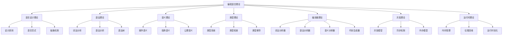

# 编程语言理论统一总论

## 概述

编程语言理论是计算机科学的核心分支，研究编程语言的设计、实现、分析和应用。本文档提供编程语言理论的系统性框架，涵盖语言设计原则、语法和语义、编译器理论、类型系统、并发模型等核心内容。

## 1. 理论框架

### 1.1 编程语言理论体系

**形式化定义：**

设 $PL$ 为编程语言，则：
$$PL = (S, T, E, R, I)$$

其中：

- $S$ 为语法系统
- $T$ 为类型系统
- $E$ 为执行环境
- $R$ 为运行时系统
- $I$ 为实现机制



### 1.2 核心概念

#### 语言设计原则

- **简洁性**: 语言设计应简洁明了，易于理解和使用
- **一致性**: 语言特性应保持内部一致性
- **正交性**: 语言特性应相互独立，避免冗余
- **可读性**: 代码应具有良好的可读性
- **可维护性**: 代码应易于维护和修改
- **性能**: 语言应支持高效的代码执行

#### 语言分类

**按抽象层次：**

- 机器语言：$L_{machine} = \{0, 1\}^*$
- 汇编语言：$L_{assembly} = \{指令, 操作数\}$
- 高级语言：$L_{high} = \{表达式, 语句, 函数\}$

**按编程范式：**

- 命令式：$P_{imperative} = (状态, 赋值, 控制流)$
- 函数式：$P_{functional} = (函数, 表达式, 不可变性)$
- 面向对象：$P_{oop} = (对象, 类, 继承, 多态)$
- 逻辑式：$P_{logic} = (谓词, 规则, 推理)$

```python
# 编程语言分类
language_categories = {
    "按范式分类": {
        "命令式": ["C", "Java", "Python"],
        "函数式": ["Haskell", "Lisp", "ML"],
        "逻辑式": ["Prolog", "Datalog"],
        "面向对象": ["Java", "C++", "Smalltalk"],
        "并发式": ["Erlang", "Go", "Rust"]
    },
    "按类型分类": {
        "静态类型": ["Java", "C++", "Haskell"],
        "动态类型": ["Python", "JavaScript", "Ruby"],
        "强类型": ["Haskell", "Rust", "Scala"],
        "弱类型": ["C", "JavaScript", "PHP"]
    },
    "按执行方式分类": {
        "编译型": ["C", "C++", "Rust"],
        "解释型": ["Python", "JavaScript", "Ruby"],
        "混合型": ["Java", "C#", "Go"]
    }
}
```

**语言特性：**

**静态类型：**
$$\forall x \in Program, Type(x) \text{ 在编译时确定}$$

**动态类型：**
$$\forall x \in Program, Type(x) \text{ 在运行时确定}$$

**强类型：**
$$\forall x, y \in Program, Type(x) \neq Type(y) \implies \text{禁止隐式转换}$$

## 2. 基本概念

### 2.1 语法和语义

#### 语法定义

语法定义了程序的结构和形式，包括词法和语法两个层面：

**上下文无关文法：**
$$G = (V, \Sigma, P, S)$$

其中：

- $V$ 为非终结符集合
- $\Sigma$ 为终结符集合
- $P$ 为产生式规则集合
- $S$ 为开始符号

**语法树：**
$$Tree = (Node, Children, Value)$$

```rust
// 语法树节点定义
#[derive(Debug, Clone)]
pub enum SyntaxNode {
    // 表达式节点
    Literal(LiteralValue),
    Variable(String),
    BinaryOp(Box<SyntaxNode>, Operator, Box<SyntaxNode>),
    UnaryOp(Operator, Box<SyntaxNode>),
    
    // 语句节点
    Assignment(String, Box<SyntaxNode>),
    IfStatement(Box<SyntaxNode>, Box<SyntaxNode>, Option<Box<SyntaxNode>>),
    WhileStatement(Box<SyntaxNode>, Box<SyntaxNode>),
    FunctionCall(String, Vec<SyntaxNode>),
    
    // 声明节点
    FunctionDecl(String, Vec<String>, Box<SyntaxNode>),
    VariableDecl(String, Option<Box<SyntaxNode>>),
}

#[derive(Debug, Clone)]
pub enum LiteralValue {
    Integer(i64),
    Float(f64),
    Boolean(bool),
    String(String),
}

#[derive(Debug, Clone)]
pub enum Operator {
    Add, Sub, Mul, Div,
    Eq, Ne, Lt, Le, Gt, Ge,
    And, Or, Not,
}
```

#### 语义定义

语义定义了程序的含义和行为：

**操作语义：**
$$\frac{Precondition}{Expression} \rightarrow Result$$

**指称语义：**
$$[\![Expression]\!] : Environment \rightarrow Value$$

**公理语义：**
$$\{P\} Statement \{Q\}$$

```rust
// 语义环境
#[derive(Debug, Clone)]
pub struct Environment {
    variables: HashMap<String, Value>,
    functions: HashMap<String, Function>,
    parent: Option<Box<Environment>>,
}

#[derive(Debug, Clone)]
pub enum Value {
    Integer(i64),
    Float(f64),
    Boolean(bool),
    String(String),
    Function(Function),
    Unit,
}

#[derive(Debug, Clone)]
pub struct Function {
    name: String,
    parameters: Vec<String>,
    body: SyntaxNode,
}

// 语义解释器
pub struct Interpreter {
    environment: Environment,
}

impl Interpreter {
    pub fn new() -> Self {
        Self {
            environment: Environment::new(),
        }
    }
    
    pub fn evaluate(&mut self, node: &SyntaxNode) -> Result<Value, String> {
        match node {
            SyntaxNode::Literal(value) => self.evaluate_literal(value),
            SyntaxNode::Variable(name) => self.evaluate_variable(name),
            SyntaxNode::BinaryOp(left, op, right) => {
                self.evaluate_binary_op(left, op, right)
            },
            SyntaxNode::Assignment(name, value) => {
                self.evaluate_assignment(name, value)
            },
            SyntaxNode::IfStatement(condition, then_branch, else_branch) => {
                self.evaluate_if_statement(condition, then_branch, else_branch)
            },
            _ => Err("Unsupported syntax node".to_string()),
        }
    }
    
    fn evaluate_literal(&self, value: &LiteralValue) -> Result<Value, String> {
        match value {
            LiteralValue::Integer(i) => Ok(Value::Integer(*i)),
            LiteralValue::Float(f) => Ok(Value::Float(*f)),
            LiteralValue::Boolean(b) => Ok(Value::Boolean(*b)),
            LiteralValue::String(s) => Ok(Value::String(s.clone())),
        }
    }
}
```

### 2.2 类型理论

**类型系统：**
$$TypeSystem = (Types, Subtyping, TypeChecking)$$

**类型推导：**
$$\Gamma \vdash e : \tau$$

**多态性：**
$$\forall \alpha. Expression[\alpha]$$

## 3. 核心理论

### 3.1 编译器理论

编译器是将高级语言转换为机器代码的程序，主要包含以下阶段：

1. **词法分析** - 将源代码转换为词法单元序列
2. **语法分析** - 构建抽象语法树
3. **语义分析** - 类型检查和语义验证
4. **中间代码生成** - 生成中间表示
5. **代码优化** - 优化中间代码
6. **目标代码生成** - 生成目标机器代码

### 3.2 运行时理论

运行时系统负责程序的执行环境，包括：

- **内存管理** - 内存分配和回收
- **垃圾回收** - 自动内存管理
- **异常处理** - 错误处理机制
- **并发支持** - 多线程和异步执行

### 3.3 并发理论

并发编程模型包括：

- **共享内存模型** - 线程间共享内存
- **消息传递模型** - 进程间通过消息通信
- **Actor模型** - 基于消息的并发模型
- **CSP模型** - 通信顺序进程

## 4. 应用领域

### 4.1 语言设计

- 新编程语言的设计和实现
- 领域特定语言(DSL)的开发
- 语言特性的研究和评估

### 4.2 编译器开发

- 编译器前端的实现
- 代码优化技术
- 目标代码生成

### 4.3 程序分析

- 静态程序分析
- 动态程序分析
- 程序验证和测试

### 4.4 软件工程

- 代码质量评估
- 重构和优化
- 软件维护

## 5. 发展趋势

### 5.1 函数式编程

- 不可变数据结构
- 高阶函数和闭包
- 类型系统的发展

### 5.2 并发编程

- 异步编程模型
- 内存模型的研究
- 并发安全性的保证

### 5.3 类型系统

- 依赖类型系统
- 线性类型系统
- 类型推导的改进

### 5.4 性能优化

- 编译时优化
- 运行时优化
- 内存管理的改进

## 6. 总结

编程语言理论为现代软件开发提供了坚实的理论基础。通过深入理解语言设计原则、类型系统、编译技术和运行时机制，我们可以设计出更加高效、安全和易用的编程语言，推动软件技术的不断发展。

随着计算机科学的发展，编程语言理论将继续演进，为新的编程范式和计算模型提供理论支持。
