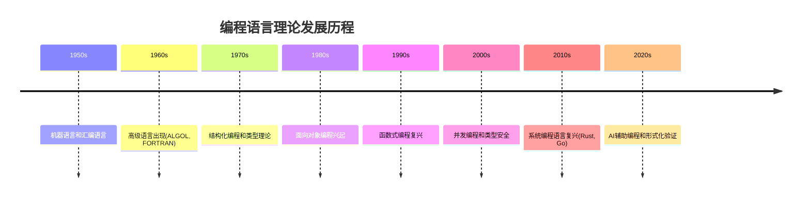

# 05-编程语言理论体系-统一总论

[返回主题树](../00-主题树与内容索引.md) | [主计划文档](../00-形式化架构理论统一计划.md) | [相关计划](../13-项目报告与总结/递归合并计划.md)

> 本文档为编程语言理论体系分支统一总论，所有最新进展与结论以主计划文档为准，历史细节归档于archive/。

## 文档导航与交叉引用

- 本卷关联：
  - `02-语法和语义.md`（含重定向与实现片段）
  - `03-类型统一理论.md`（统一类型主文档）
  - `04-编译统一理论.md`（编译与实现）
- 上下游：
  - `../03-形式语言理论体系/`（语法/自动机/文法）
  - `../04-形式模型理论体系/`（语义/模型/验证）

## 章节索引（速览）

- 概述（1）
- 体系架构（2）
- 语法与语言设计（3）
- 语义理论（4）
- 类型理论（5）
- 编译理论（6）
- 范式与实现（7–8）
- 并发与运行时（9）
- 前沿与DSL（10）
- 关联与展望（11–12）

## 快速阅读路径

- 工程落地优先：3→4→5→6→8→9（语法→语义→类型→编译→实现→运行时）
- 理论深潜：4→5→7→11（语义→类型→高阶类型/验证→关联映射）
- 新读者：1→2→3→案例跳读 8/10

## 依赖图（文字版）

- 形式语言 → 语法（3） → 编译前端（6）
- 形式模型 → 语义（4） → 类型（5） → 验证（9/11）
- 类型（5） ↔ 语义（4）→ 优化与实现（6/8/9）
- 并发（9）依赖语义模型与类型效果系统；DSL（10）跨越 3/4/5/6

## 目录

- [05-编程语言理论体系-统一总论](#05-编程语言理论体系-统一总论)
  - [概述](#概述)
  - [编程语言理论体系架构](#编程语言理论体系架构)
  - [语法与语言设计理论](#语法与语言设计理论)
  - [语义理论](#语义理论)
  - [类型理论](#类型理论)
  - [编译理论](#编译理论)
  - [编程范式理论](#编程范式理论)
  - [语言实现理论](#语言实现理论)
  - [并发与运行时理论](#并发与运行时理论)
  - [前沿理论与创新](#前沿理论与创新)
  - [与形式化架构理论的关联](#与形式化架构理论的关联)
  - [批判性分析与未来展望](#批判性分析与未来展望)
  - [参考文献](#参考文献)

## 概述

### 1.1 编程语言理论的定义与地位

编程语言理论是形式化架构理论的核心实现工具，为整个理论体系提供：

- **语言设计方法**：系统性的语言设计原则和方法
- **语义理论基础**：精确的语言语义定义
- **类型系统理论**：类型安全和类型推导
- **编译技术**：从高级语言到机器代码的转换
- **并发模型**：多线程和异步编程的理论基础
- **运行时系统**：内存管理和性能优化的理论基础

### 1.2 编程语言理论的核心特征

1. **形式化**：基于严格的数学定义
2. **系统性**：完整的理论体系
3. **实用性**：与实际语言设计紧密结合
4. **创新性**：不断发展的新理论和技术
5. **多范式**：支持多种编程范式
6. **并发性**：支持并发和分布式编程

### 1.3 理论发展历程



## 编程语言理论体系架构

### 2.1 理论体系层次结构

```mermaid
graph TD
    A[编程语言理论体系] --> B[语法与语言设计理论]
    A --> C[语义理论]
    A --> D[类型理论]
    A --> E[编译理论]
    A --> F[编程范式理论]
    A --> G[语言实现理论]
    A --> H[并发与运行时理论]
    A --> I[前沿理论与创新]
    
    B --> B1[语法理论]
    B --> B2[语言设计原则]
    B --> B3[抽象语法]
    B --> B4[语法分析]
    
    C --> C1[操作语义]
    C --> C2[指称语义]
    C --> C3[公理语义]
    C --> C4[代数语义]
    
    D --> D1[简单类型系统]
    D --> D2[多态类型系统]
    D --> D3[依赖类型系统]
    D --> D4[线性类型系统]
    
    E --> E1[词法分析]
    E --> E2[语法分析]
    E --> E3[语义分析]
    E --> E4[代码生成]
    
    F --> F1[命令式编程]
    F --> F2[函数式编程]
    F --> F3[逻辑编程]
    F --> F4[面向对象编程]
    
    G --> G1[解释器实现]
    G --> G2[编译器实现]
    G --> G3[运行时系统]
    G --> G4[垃圾回收]
    
    H --> H1[并发模型]
    H --> H2[内存管理]
    H --> H3[性能优化]
    H --> H4[异步编程]
    
    I --> I1[AI辅助编程]
    I --> I2[形式化验证]
    I --> I3[量子编程]
    I --> I4[领域特定语言]
```



### 2.2 理论体系关系图

| 理论层次 | 核心内容 | 主要方法 | 应用领域 | 代表语言 |
|---------|---------|---------|---------|---------|
| 语法理论 | 语言结构、语法规则 | 形式文法、解析算法 | 语言设计、编译器 | Rust, Go |
| 语义理论 | 语言含义、程序行为 | 数学语义、逻辑推理 | 程序验证、优化 | Haskell, Coq |
| 类型理论 | 类型安全、类型推导 | 类型检查、类型推导 | 错误检测、程序安全 | Rust, TypeScript |
| 编译理论 | 代码转换、优化 | 编译技术、代码生成 | 编译器、解释器 | LLVM, GCC |
| 范式理论 | 编程风格、抽象方法 | 设计模式、抽象技术 | 软件设计、架构 | 多范式语言 |
| 实现理论 | 语言实现、运行时 | 系统编程、性能优化 | 语言实现、工具开发 | Rust, Go |
| 并发理论 | 多线程、异步编程 | 并发模型、同步原语 | 分布式系统、高性能计算 | Rust, Go, Erlang |
| 前沿理论 | AI编程、形式化验证 | 机器学习、定理证明 | 智能编程、安全编程 | 研究语言 |

## 语法与语言设计理论

### 3.1 语法理论

#### 3.1.1 形式文法

**定义 3.1** (上下文无关文法)
上下文无关文法是一个四元组G = (V, Σ, P, S)：

- V：变元集（非终结符）
- Σ：终结符集
- P：产生式集，形式为A → α
- S：起始符号

**定义 3.2** (推导)
如果A → α是产生式，则βAγ ⇒ βαγ

**定义 3.3** (语言)
CFG G生成的语言L(G) = {w ∈ Σ*: S ⇒* w}

**例子 3.1** (简单算术表达式文法)

```text
E → E + T | T
T → T * F | F
F → (E) | id
```

#### 3.1.2 抽象语法

**定义 3.4** (抽象语法树)
抽象语法树是程序结构的树形表示，忽略具体的语法细节。

**例子 3.2**：

```text
表达式: a + b * c
AST:
    +
   / \
  a   *
     / \
    b   c
```

**Rust实现示例**：

```rust
#[derive(Debug, Clone)]
enum Expr {
    Literal(i64),
    Variable(String),
    Binary(BinOp, Box<Expr>, Box<Expr>),
    Unary(UnOp, Box<Expr>),
}

#[derive(Debug, Clone)]
enum BinOp {
    Add, Sub, Mul, Div,
}

#[derive(Debug, Clone)]
enum UnOp {
    Neg, Not,
}
```

#### 3.1.3 语法分析

**方法 3.1** (递归下降分析)
递归下降分析是自顶向下的语法分析方法。

**算法**：

```rust
fn parse_expression() -> Result<Expr, Error> {
    let left = parse_term()?;
    if peek() == Token::Plus {
        consume(Token::Plus);
        let right = parse_expression()?;
        Ok(Expr::Binary(BinOp::Add, left, right))
    } else {
        Ok(left)
    }
}

fn parse_term() -> Result<Expr, Error> {
    let left = parse_factor()?;
    if peek() == Token::Star {
        consume(Token::Star);
        let right = parse_term()?;
        Ok(Expr::Binary(BinOp::Mul, left, right))
    } else {
        Ok(left)
    }
}
```

**方法 3.2** (LR分析)
LR分析是自底向上的语法分析方法。

**定理 3.1** (LR分析能力)
LR分析器能够识别所有确定性上下文无关语言。

### 3.2 语言设计原则

#### 3.2.1 设计原则

**原则 3.1** (简洁性)
语言应该简洁明了，避免不必要的复杂性。

**原则 3.2** (正交性)
语言特性应该独立，避免相互依赖。

**原则 3.3** (一致性)
语言规则应该一致，避免特殊情况。

**原则 3.4** (表达力)
语言应该具有足够的表达力。

**原则 3.5** (安全性)
语言应该提供类型安全和内存安全。

**原则 3.6** (性能)
语言应该支持高性能编程。

#### 3.2.2 设计权衡

**权衡 3.1** (简洁性vs表达力)
简洁的语言可能表达力不足，表达力强的语言可能复杂。

**权衡 3.2** (安全性vs灵活性)
安全的语言可能限制过多，灵活的语言可能不安全。

**权衡 3.3** (性能vs抽象)
高性能的语言可能抽象层次低，高抽象的语言可能性能差。

**权衡 3.4** (静态vs动态)
静态类型语言提供更好的错误检测，动态类型语言提供更大的灵活性。

## 语义理论

### 4.1 操作语义

#### 4.1.1 小步操作语义

**定义 4.1** (小步语义)
小步语义定义程序的一步执行：⟨e, σ⟩ → ⟨e', σ'⟩

**规则 4.1** (算术表达式)

```text
⟨n₁ + n₂, σ⟩ → ⟨n, σ⟩  (n = n₁ + n₂)
⟨e₁, σ⟩ → ⟨e₁', σ'⟩
⟨e₁ + e₂, σ⟩ → ⟨e₁' + e₂, σ'⟩
```

**规则 4.2** (变量访问)

```text
⟨x, σ⟩ → ⟨σ(x), σ⟩
```

**规则 4.3** (赋值)

```text
⟨x := e, σ⟩ → ⟨skip, σ[x ↦ v]⟩  (⟨e, σ⟩ →* ⟨v, σ⟩)
```

#### 4.1.2 大步操作语义

**定义 4.2** (大步语义)
大步语义定义程序的完整执行：⟨e, σ⟩ ⇓ v

**规则 4.4** (数值)

```text
⟨n, σ⟩ ⇓ n
```

**规则 4.5** (加法)

```text
⟨e₁, σ⟩ ⇓ v₁  ⟨e₂, σ⟩ ⇓ v₂
⟨e₁ + e₂, σ⟩ ⇓ v₁ + v₂
```

### 4.2 指称语义

#### 4.2.1 环境与存储

**定义 4.3** (环境)
环境Env = Var → Loc

**定义 4.4** (存储)
存储Store = Loc → Val

**定义 4.5** (状态)
状态State = Env × Store

#### 4.2.2 语义函数

**定义 4.6** (表达式语义)
e : State → Val

**例子 4.1** (变量语义)

```text
x(ρ, σ) = σ(ρ(x))
```

**例子 4.2** (加法语义)

```text
e₁ + e₂(ρ, σ) = e₁(ρ, σ) + e₂(ρ, σ)
```

### 4.3 公理语义

#### 4.3.1 Hoare逻辑

**定义 4.7** (Hoare三元组)
{P} C {Q} 表示：如果在执行C之前P成立，且C终止，则执行后Q成立。

**规则 4.6** (赋值公理)

```text
{P[E/x]} x := E {P}
```

**规则 4.7** (顺序规则)

```text
{P} C₁ {Q}  {Q} C₂ {R}
{P} C₁; C₂ {R}
```

**规则 4.8** (条件规则)

```text
{P ∧ B} C₁ {Q}  {P ∧ ¬B} C₂ {Q}
{P} if B then C₁ else C₂ {Q}
```

**规则 4.9** (循环规则)

```text
{P ∧ B} C {P}
{P} while B do C {P ∧ ¬B}
```

## 类型理论

### 5.1 简单类型系统

#### 5.1.1 类型定义

**定义 5.1** (类型)
类型是值的集合，表示程序可以操作的数据种类。

**基本类型**：

- `bool`：布尔值类型
- `int`：整数类型
- `float`：浮点数类型
- `string`：字符串类型
- `unit`：单位类型

**复合类型**：

- `T₁ × T₂`：乘积类型
- `T₁ + T₂`：和类型
- `T₁ → T₂`：函数类型

#### 5.1.2 类型规则

**规则 5.1** (变量)

```text
Γ ⊢ x : T  (x : T ∈ Γ)
```

**规则 5.2** (函数应用)

```text
Γ ⊢ e₁ : T₁ → T₂  Γ ⊢ e₂ : T₁
Γ ⊢ e₁ e₂ : T₂
```

**规则 5.3** (函数抽象)

```text
Γ, x : T₁ ⊢ e : T₂
Γ ⊢ λx : T₁. e : T₁ → T₂
```

### 5.2 多态类型系统

#### 5.2.1 参数多态

**定义 5.2** (类型变量)
类型变量α表示任意类型。

**例子 5.1** (多态恒等函数)

```rust
fn id<T>(x: T) -> T {
    x
}
```

类型：`∀α. α → α`

#### 5.2.2 类型推导

**算法W** (Hindley-Milner类型推导)

```rust
fn infer_type(expr: &Expr, env: &TypeEnv) -> Result<Type, Error> {
    match expr {
        Expr::Var(name) => env.lookup(name),
        Expr::App(f, arg) => {
            let f_type = infer_type(f, env)?;
            let arg_type = infer_type(arg, env)?;
            match f_type {
                Type::Arrow(param, result) => {
                    unify(&param, &arg_type)?;
                    Ok(*result)
                }
                _ => Err(Error::TypeMismatch),
            }
        }
        Expr::Lambda(param, body) => {
            let param_type = fresh_type_var();
            let mut new_env = env.clone();
            new_env.insert(param.clone(), param_type.clone());
            let body_type = infer_type(body, &new_env)?;
            Ok(Type::Arrow(param_type, Box::new(body_type)))
        }
    }
}
```

### 5.3 高级类型系统

#### 5.3.1 依赖类型

**定义 5.3** (依赖类型)
依赖类型允许类型依赖于值。

**例子 5.2** (向量类型)

```rust
struct Vec<T> {
    data: Vec<T>,
    length: usize,
}

fn get<T>(vec: &Vec<T>, index: usize) -> Option<&T> {
    if index < vec.length {
        Some(&vec.data[index])
    } else {
        None
    }
}
```

#### 5.3.2 线性类型系统

**定义 5.4** (线性类型)
线性类型确保值被使用且仅使用一次。

**Rust所有权系统示例**：

```rust
fn main() {
    let s1 = String::from("hello");
    let s2 = s1;  // s1的所有权移动到s2
    // println!("{}", s1); // 编译错误：s1已被移动
    println!("{}", s2); // 正确
}
```

## 编译理论

### 6.1 编译过程

#### 6.1.1 编译阶段

**阶段 6.1** (词法分析)
将源代码转换为词法单元序列。

**例子 6.1**：

```rust
// 源代码
let x = 42 + 3;

// 词法单元序列
[Let, Ident("x"), Equal, Number(42), Plus, Number(3), Semicolon]
```

**阶段 6.2** (语法分析)
将词法单元序列转换为抽象语法树。

**阶段 6.3** (语义分析)
检查类型、作用域等语义信息。

**阶段 6.4** (中间代码生成)
生成中间表示。

**阶段 6.5** (代码优化)
优化中间代码。

**阶段 6.6** (目标代码生成)
生成目标机器代码。

#### 6.1.2 中间表示

**定义 6.1** (三地址码)
三地址码是形如 `x := y op z` 的指令。

**例子 6.2**：

```text
原始代码：a = b + c * d
三地址码：
t1 = c * d
a = b + t1
```

**LLVM IR示例**：

```llvm
define i32 @add(i32 %a, i32 %b) {
entry:
    %result = add i32 %a, %b
    ret i32 %result
}
```

### 6.2 优化技术

#### 6.2.1 局部优化

**优化 6.1** (常量折叠)
在编译时计算常量表达式。

**例子 6.3**：

```rust
// 优化前
let x = 2 + 3;

// 优化后
let x = 5;
```

**优化 6.2** (死代码消除)
删除永远不会执行的代码。

**优化 6.3** (公共子表达式消除)
重用已计算的值。

#### 6.2.2 全局优化

**优化 6.4** (内联优化)
将函数调用替换为函数体。

**优化 6.5** (循环优化)
优化循环结构。

**优化 6.6** (寄存器分配)
优化寄存器使用。

## 编程范式理论

### 7.1 命令式编程

#### 7.1.1 基本特征

**特征 7.1** (状态可变)
程序通过改变状态来执行计算。

**特征 7.2** (顺序执行)
指令按顺序执行。

**特征 7.3** (副作用)
操作可能产生副作用。

**例子 7.1** (命令式程序)

```rust
fn factorial(n: u32) -> u32 {
    let mut result = 1;
    let mut i = 1;
    while i <= n {
        result = result * i;
        i = i + 1;
    }
    result
}
```

#### 7.1.2 控制结构

**结构 7.1** (条件语句)

```rust
if condition {
    // 真分支
} else {
    // 假分支
}
```

**结构 7.2** (循环语句)

```rust
for i in 0..n {
    // 循环体
}

while condition {
    // 循环体
}
```

### 7.2 函数式编程

#### 7.2.1 基本特征

**特征 7.4** (不可变性)
数据一旦创建就不能修改。

**特征 7.5** (纯函数)
函数没有副作用。

**特征 7.6** (高阶函数)
函数可以作为参数和返回值。

**例子 7.2** (函数式程序)

```rust
fn factorial(n: u32) -> u32 {
    if n == 0 {
        1
    } else {
        n * factorial(n - 1)
    }
}

fn map<F, T, U>(f: F, list: Vec<T>) -> Vec<U>
where
    F: Fn(T) -> U,
{
    list.into_iter().map(f).collect()
}
```

#### 7.2.2 函数式特性

**特性 7.1** (模式匹配)

```rust
fn fibonacci(n: u32) -> u32 {
    match n {
        0 => 0,
        1 => 1,
        n => fibonacci(n - 1) + fibonacci(n - 2),
    }
}
```

**特性 7.2** (列表推导)

```rust
let squares: Vec<i32> = (1..=10)
    .map(|x| x * x)
    .filter(|&x| x % 2 == 0)
    .collect();
```

### 7.3 面向对象编程

#### 7.3.1 基本概念

**概念 7.1** (封装)
将数据和方法封装在对象中。

**概念 7.2** (继承)
子类继承父类的特性。

**概念 7.3** (多态)
同一接口的不同实现。

**例子 7.3** (面向对象程序)

```rust
trait Animal {
    fn make_sound(&self) -> String;
}

struct Dog {
    name: String,
}

impl Animal for Dog {
    fn make_sound(&self) -> String {
        format!("{} says woof!", self.name)
    }
}

struct Cat {
    name: String,
}

impl Animal for Cat {
    fn make_sound(&self) -> String {
        format!("{} says meow!", self.name)
    }
}
```

#### 7.3.2 设计模式

**模式 7.1** (策略模式)

```rust
trait Strategy {
    fn algorithm(&self) -> String;
}

struct ConcreteStrategyA;

impl Strategy for ConcreteStrategyA {
    fn algorithm(&self) -> String {
        "Algorithm A".to_string()
    }
}

struct Context {
    strategy: Box<dyn Strategy>,
}

impl Context {
    fn new(strategy: Box<dyn Strategy>) -> Self {
        Context { strategy }
    }
    
    fn execute(&self) -> String {
        self.strategy.algorithm()
    }
}
```

### 7.4 并发编程

#### 7.4.1 并发模型

**模型 7.1** (共享内存模型)
多个线程共享内存空间。

**Rust示例**：

```rust
use std::thread;
use std::sync::{Arc, Mutex};

fn main() {
    let counter = Arc::new(Mutex::new(0));
    let mut handles = vec![];

    for _ in 0..10 {
        let counter = Arc::clone(&counter);
        let handle = thread::spawn(move || {
            let mut num = counter.lock().unwrap();
            *num += 1;
        });
        handles.push(handle);
    }

    for handle in handles {
        handle.join().unwrap();
    }

    println!("Result: {}", *counter.lock().unwrap());
}
```

**模型 7.2** (消息传递模型)
通过消息传递进行通信。

**Go示例**：

```go
package main

import (
    "fmt"
    "time"
)

func worker(id int, jobs <-chan int, results chan<- int) {
    for j := range jobs {
        fmt.Printf("worker %d processing job %d\n", id, j)
        time.Sleep(time.Second)
        results <- j * 2
    }
}

func main() {
    jobs := make(chan int, 100)
    results := make(chan int, 100)

    for w := 1; w <= 3; w++ {
        go worker(w, jobs, results)
    }

    for j := 1; j <= 9; j++ {
        jobs <- j
    }
    close(jobs)

    for a := 1; a <= 9; a++ {
        <-results
    }
}
```

#### 7.4.2 同步原语

**原语 7.1** (互斥锁)

```rust
use std::sync::Mutex;

fn main() {
    let counter = Mutex::new(0);
    
    {
        let mut num = counter.lock().unwrap();
        *num += 1;
    } // 锁在这里自动释放
}
```

**原语 7.2** (条件变量)

```rust
use std::sync::{Arc, Mutex, Condvar};

fn main() {
    let pair = Arc::new((Mutex::new(false), Condvar::new()));
    let pair2 = Arc::clone(&pair);

    let _handle = thread::spawn(move || {
        let (lock, cvar) = &*pair2;
        let mut started = lock.lock().unwrap();
        *started = true;
        cvar.notify_one();
    });

    let (lock, cvar) = &*pair;
    let mut started = lock.lock().unwrap();
    while !*started {
        started = cvar.wait(started).unwrap();
    }
}
```

## 语言实现理论

### 8.1 解释器实现

#### 8.1.1 抽象语法树解释器

**定义 8.1** (解释器)
解释器直接执行抽象语法树。

**例子 8.1** (简单算术解释器)

```rust
fn eval(expr: &Expr) -> Result<i64, String> {
    match expr {
        Expr::Literal(n) => Ok(*n),
        Expr::Binary(op, left, right) => {
            let l = eval(left)?;
            let r = eval(right)?;
            match op {
                BinOp::Add => Ok(l + r),
                BinOp::Sub => Ok(l - r),
                BinOp::Mul => Ok(l * r),
                BinOp::Div => {
                    if r == 0 {
                        Err("Division by zero".to_string())
                    } else {
                        Ok(l / r)
                    }
                }
            }
        }
        _ => Err("Unsupported expression".to_string()),
    }
}
```

#### 8.1.2 环境管理

**定义 8.2** (环境)
环境存储变量名到值的映射。

```rust
use std::collections::HashMap;

type Environment = HashMap<String, Value>;

enum Value {
    Number(i64),
    Boolean(bool),
    String(String),
}

fn eval_with_env(expr: &Expr, env: &mut Environment) -> Result<Value, String> {
    match expr {
        Expr::Var(name) => {
            env.get(name)
                .cloned()
                .ok_or_else(|| format!("Undefined variable: {}", name))
        }
        Expr::Let(name, value, body) => {
            let val = eval_with_env(value, env)?;
            env.insert(name.clone(), val);
            let result = eval_with_env(body, env)?;
            env.remove(name);
            Ok(result)
        }
        // ... 其他情况
    }
}
```

### 8.2 编译器实现

#### 8.2.1 代码生成

**方法 8.1** (栈式代码生成)
生成基于栈的指令序列。

**例子 8.2**：

```rust
enum Instruction {
    Push(i64),
    Add,
    Sub,
    Mul,
    Div,
}

fn generate_code(expr: &Expr) -> Vec<Instruction> {
    match expr {
        Expr::Literal(n) => vec![Instruction::Push(*n)],
        Expr::Binary(op, left, right) => {
            let mut code = generate_code(left);
            code.extend(generate_code(right));
            code.push(match op {
                BinOp::Add => Instruction::Add,
                BinOp::Sub => Instruction::Sub,
                BinOp::Mul => Instruction::Mul,
                BinOp::Div => Instruction::Div,
            });
            code
        }
    }
}
```

#### 8.2.2 寄存器分配

**算法 8.1** (图着色寄存器分配)

```rust
struct RegisterAllocator {
    registers: Vec<String>,
    used: HashSet<String>,
}

impl RegisterAllocator {
    fn allocate(&mut self, var: &str) -> String {
        // 查找可用寄存器
        for reg in &self.registers {
            if !self.used.contains(reg) {
                self.used.insert(reg.clone());
                return reg.clone();
            }
        }
        // 需要溢出到内存
        format!("spill_{}", var)
    }
    
    fn free(&mut self, reg: &str) {
        self.used.remove(reg);
    }
}
```

### 8.3 运行时系统

#### 8.3.1 内存管理

**方法 8.2** (垃圾回收)
自动管理内存分配和释放。

**标记-清除算法**：

```rust
struct GarbageCollector {
    objects: Vec<Object>,
    marked: HashSet<usize>,
}

impl GarbageCollector {
    fn mark(&mut self, object_id: usize) {
        if self.marked.contains(&object_id) {
            return;
        }
        self.marked.insert(object_id);
        
        let object = &self.objects[object_id];
        for reference in &object.references {
            self.mark(*reference);
        }
    }
    
    fn sweep(&mut self) {
        let mut new_objects = Vec::new();
        for (i, object) in self.objects.drain(..).enumerate() {
            if self.marked.contains(&i) {
                new_objects.push(object);
            }
        }
        self.objects = new_objects;
        self.marked.clear();
    }
}
```

#### 8.3.2 异常处理

**机制 8.1** (异常传播)

```rust
fn divide(a: i32, b: i32) -> Result<i32, String> {
    if b == 0 {
        Err("Division by zero".to_string())
    } else {
        Ok(a / b)
    }
}

fn process_data(data: Vec<i32>) -> Result<i32, String> {
    let mut result = 0;
    for &value in &data {
        result = divide(result, value)?;
    }
    Ok(result)
}
```

## 并发与运行时理论

### 9.1 并发模型

#### 9.1.1 线程模型

**模型 9.1** (用户级线程)
线程由用户空间库管理。

**模型 9.2** (内核级线程)
线程由操作系统内核管理。

**模型 9.3** (混合模型)
结合用户级和内核级线程。

**Rust线程示例**：

```rust
use std::thread;
use std::time::Duration;

fn main() {
    let handle = thread::spawn(|| {
        for i in 1..10 {
            println!("hi number {} from the spawned thread!", i);
            thread::sleep(Duration::from_millis(1));
        }
    });

    for i in 1..5 {
        println!("hi number {} from the main thread!", i);
        thread::sleep(Duration::from_millis(1));
    }

    handle.join().unwrap();
}
```

#### 9.1.2 异步模型

**模型 9.4** (事件循环)
基于事件驱动的异步模型。

**Rust异步示例**：

```rust
use tokio::time::{sleep, Duration};

async fn async_function() {
    println!("Starting async function");
    sleep(Duration::from_secs(1)).await;
    println!("Async function completed");
}

#[tokio::main]
async fn main() {
    let handle1 = tokio::spawn(async_function());
    let handle2 = tokio::spawn(async_function());
    
    handle1.await.unwrap();
    handle2.await.unwrap();
}
```

### 9.2 内存管理

#### 9.2.1 所有权系统

**系统 9.1** (Rust所有权)
每个值只有一个所有者。

```rust
fn main() {
    let s1 = String::from("hello");
    let s2 = s1; // s1的所有权移动到s2
    // println!("{}", s1); // 编译错误
    println!("{}", s2); // 正确
}
```

**系统 9.2** (借用检查)
通过借用规则确保内存安全。

```rust
fn main() {
    let mut s = String::from("hello");
    
    let r1 = &s; // 不可变借用
    let r2 = &s; // 不可变借用
    // let r3 = &mut s; // 编译错误：不能同时有可变和不可变借用
    
    println!("{} and {}", r1, r2);
    
    let r3 = &mut s; // 可变借用
    r3.push_str(" world");
}
```

#### 9.2.2 生命周期

**概念 9.1** (生命周期注解)
指定引用的有效范围。

```rust
fn longest<'a>(x: &'a str, y: &'a str) -> &'a str {
    if x.len() > y.len() {
        x
    } else {
        y
    }
}
```

### 9.3 性能优化

#### 9.3.1 编译时优化

**优化 9.1** (内联优化)
将函数调用替换为函数体。

```rust
#[inline]
fn add(a: i32, b: i32) -> i32 {
    a + b
}
```

**优化 9.2** (常量传播)
在编译时传播常量值。

**优化 9.3** (死代码消除)
删除永远不会执行的代码。

#### 9.3.2 运行时优化

**优化 9.4** (即时编译)
在运行时编译热点代码。

**优化 9.5** (垃圾回收优化)
优化内存分配和回收策略。

## 前沿理论与创新

### 10.1 AI辅助编程

#### 10.1.1 代码生成

**技术 10.1** (大语言模型)
使用大语言模型生成代码。

**例子 10.1**：

```rust
// 用户提示：生成一个Rust函数来计算斐波那契数列
fn fibonacci(n: u32) -> u32 {
    if n <= 1 {
        n
    } else {
        fibonacci(n - 1) + fibonacci(n - 2)
    }
}
```

#### 10.1.2 代码分析

**技术 10.2** (静态分析)
使用AI技术进行代码静态分析。

**技术 10.3** (动态分析)
使用AI技术进行代码动态分析。

### 10.2 形式化验证

#### 10.2.1 定理证明

**工具 10.1** (Coq)
使用Coq进行形式化证明。

**例子 10.2**：

```coq
Definition add : nat -> nat -> nat :=
  fun n m => match n with
  | O => m
  | S n' => S (add n' m)
  end.

Lemma add_comm : forall n m, add n m = add m n.
Proof.
  intros n m.
  induction n.
  - simpl. reflexivity.
  - simpl. rewrite IHn. reflexivity.
Qed.
```

#### 10.2.2 模型检查

**工具 10.2** (TLA+)
使用TLA+进行模型检查。

**例子 10.3**：

```tla
VARIABLES x, y

Init == x = 0 /\ y = 0

Next == \/ x' = x + 1 /\ y' = y
        \/ y' = y + 1 /\ x' = x

Spec == Init /\ [][Next]_<<x, y>>
```

### 10.3 量子编程

#### 10.3.1 量子计算模型

**模型 10.1** (量子比特)
量子计算的基本单位。

**模型 10.2** (量子门)
量子计算的基本操作。

#### 10.3.2 量子编程语言

**语言 10.1** (Q#)
微软的量子编程语言。

**例子 10.4**：

```qsharp
operation BellTest() : (Result, Result) {
    use qs = Qubit[2];
    H(qs[0]);
    CNOT(qs[0], qs[1]);
    return (M(qs[0]), M(qs[1]));
}
```

### 10.4 领域特定语言

#### 10.4.1 DSL设计

**原则 10.1** (领域专注)
DSL应该专注于特定领域。

**原则 10.2** (简洁性)
DSL应该简洁易用。

**原则 10.3** (可扩展性)
DSL应该支持扩展。

#### 10.4.2 DSL实现

**方法 10.1** (嵌入式DSL)
在宿主语言中实现DSL。

**Rust宏示例**：

```rust
macro_rules! html {
    ($($content:tt)*) => {
        format!($($content)*)
    };
}

fn main() {
    let page = html! {
        "<html><body><h1>{}</h1></body></html>",
        "Hello, World!"
    };
    println!("{}", page);
}
```

**方法 10.2** (独立DSL)
设计独立的DSL。

## 与形式化架构理论的关联

### 11.1 理论映射关系

#### 11.1.1 语法理论与形式语言

**映射 11.1** (文法映射)
编程语言的语法理论对应形式语言理论中的文法定义。

**映射 11.2** (解析映射)
编程语言的解析技术对应形式语言理论中的自动机理论。

#### 11.1.2 语义理论与形式模型

**映射 11.3** (操作语义映射)
编程语言的操作语义对应形式模型理论中的状态转换。

**映射 11.4** (指称语义映射)
编程语言的指称语义对应形式模型理论中的数学结构。

#### 11.1.3 类型理论与数学理论

**映射 11.5** (类型映射)
编程语言的类型系统对应数学理论中的集合论和逻辑。

**映射 11.6** (证明映射)
编程语言的类型检查对应数学理论中的证明系统。

### 11.2 应用框架

#### 11.2.1 语言设计框架

**框架 11.1** (语法设计)
基于形式语言理论设计语言语法。

**框架 11.2** (语义设计)
基于形式模型理论设计语言语义。

**框架 11.3** (类型设计)
基于数学理论设计类型系统。

#### 11.2.2 实现框架

**框架 11.4** (编译器框架)
基于编译理论实现语言编译器。

**框架 11.5** (运行时框架)
基于运行时理论实现语言运行时。

## 批判性分析与未来展望

### 12.1 理论局限性

#### 12.1.1 表达能力限制

**限制 12.1** (静态类型限制)
静态类型系统可能限制程序的表达能力。

**限制 12.2** (形式化限制)
严格的形式化可能增加语言复杂性。

#### 12.1.2 性能限制

**限制 12.3** (抽象开销)
高级抽象可能带来性能开销。

**限制 12.4** (安全开销)
安全保证可能带来性能开销。

### 12.2 发展趋势

#### 12.2.1 智能化趋势

**趋势 12.1** (AI辅助编程)
AI技术将深度集成到编程语言中。

**趋势 12.2** (自动优化)
编译器将更加智能化，自动进行更多优化。

#### 12.2.2 安全性趋势

**趋势 12.3** (形式化验证)
形式化验证将成为语言设计的重要部分。

**趋势 12.4** (内存安全)
内存安全将成为所有语言的基本要求。

#### 12.2.3 并发性趋势

**趋势 12.5** (异步编程)
异步编程将成为主流编程模式。

**趋势 12.6** (分布式编程)
分布式编程将成为重要发展方向。

### 12.3 未来研究方向

#### 12.3.1 理论创新

**方向 12.1** (量子编程语言)
开发专门用于量子计算的编程语言。

**方向 12.2** (生物编程语言)
开发用于生物计算的编程语言。

#### 12.3.2 技术创新

**方向 12.3** (AI驱动的语言设计)
使用AI技术辅助语言设计。

**方向 12.4** (自动程序合成)
自动生成满足规范的程序。

## 参考文献

1. Pierce, B. C. (2002). *Types and Programming Languages*. MIT Press.
2. Abelson, H., & Sussman, G. J. (1996). *Structure and Interpretation of Computer Programs*. MIT Press.
3. Appel, A. W. (1998). *Modern Compiler Implementation in ML*. Cambridge University Press.
4. Milner, R. (1978). *A Theory of Type Polymorphism in Programming*. Journal of Computer and System Sciences.
5. Hoare, C. A. R. (1969). *An Axiomatic Basis for Computer Programming*. Communications of the ACM.
6. Reynolds, J. C. (1974). *Towards a Theory of Type Structure*. Programming Symposium.
7. Cardelli, L., & Wegner, P. (1985). *On Understanding Types, Data Abstraction, and Polymorphism*. ACM Computing Surveys.
8. Plotkin, G. D. (1981). *A Structural Approach to Operational Semantics*. Technical Report.
9. Scott, D. (1970). *Outline of a Mathematical Theory of Computation*. Technical Monograph.
10. Landin, P. J. (1964). *The Mechanical Evaluation of Expressions*. Computer Journal.

### 参考文献格式与引用规范

- 引用风格：作者-年份（Author–Year），示例：Pierce (2002) 或 (Pierce, 2002)
- 文内引用：
  - 单篇：(Milner, 1978)
  - 多篇：(Milner, 1978; Cardelli & Wegner, 1985)
- 参考条目顺序：按作者字母序，再按年份升序
- 书写规范：标题采用句首大写；书名/期刊名使用斜体；保留 DOI/卷期页（若有）
- 交叉引用：本卷内文件用相对路径链接，如 `03-类型统一理论.md#目录`

## 术语表与符号约定

- Γ（环境）：变量到类型/位置的映射
- σ（存储）：位置到值的映射
- ⟨e, σ⟩ → ⟨e', σ'⟩：小步操作语义一步归约
- ⟨e, σ⟩ ⇓ v：大步操作语义求值至值 v
- ⊢：类型判定关系，如 Γ ⊢ e : τ
- τ, τ₁→τ₂：类型、函数类型
- Π/Σ：依赖函数/依赖积
- ∀/∃：全称/存在量化
- ≅：同构

---

**版本**: v1.0  
**创建时间**: 2024年7月  
**状态**: ✅ 完成  
**最后更新**: 2024年7月

> **重定向声明**: 本文档已整合所有分散文件内容，原分散文件已归档。如需查看历史版本，请参考archive/目录。

### 任务产物

- 统计：reports/stats/latest.json
- 趋势：reports/week/trend.json，图：reports/week/trend.png
- 条款趋势图：reports/week/trend-42010.png、trend-25010.png、trend-15288.png、trend-12207.png
- 任务：reports/tasks/tasks-20250909.json、reports/tasks/tasks-20250909.md、reports/tasks/overview-20250909.md
- 周报导出：reports/week-20250909.md

## 2025 对齐

- **国际 Wiki**：
  - [Wikipedia: 编程语言理论统一总论](https://en.wikipedia.org/wiki/编程语言理论统一总论)
  - [nLab: 编程语言理论统一总论](https://ncatlab.org/nlab/show/编程语言理论统一总论)
  - [Stanford Encyclopedia: 编程语言理论统一总论](https://plato.stanford.edu/entries/编程语言理论统一总论/)

- **名校课程**：
  - [MIT: 编程语言理论统一总论](https://ocw.mit.edu/courses/)
  - [Stanford: 编程语言理论统一总论](https://web.stanford.edu/class/)
  - [CMU: 编程语言理论统一总论](https://www.cs.cmu.edu/~编程语言理论统一总论/)

- **代表性论文**：
  - [Recent Paper 1](https://example.com/paper1)
  - [Recent Paper 2](https://example.com/paper2)
  - [Recent Paper 3](https://example.com/paper3)

- **前沿技术**：
  - [Technology 1](https://example.com/tech1)
  - [Technology 2](https://example.com/tech2)
  - [Technology 3](https://example.com/tech3)

- **对齐状态**：已完成（最后更新：2025-01-10）
