[返回主题树](../00-主题树与内容索引.md) | [主计划文档](../00-形式化架构理论统一计划.md) | [相关计划](../递归合并计划.md)

# 05-编程语言理论体系-统一总论

> 本文档为编程语言理论体系分支统一总论，所有最新进展与结论以主计划文档为准，历史细节归档于archive/。

## 目录

1. [概述](#概述)
2. [编程语言理论体系架构](#编程语言理论体系架构)
3. [语法与语言设计理论](#语法与语言设计理论)
4. [语义理论](#语义理论)
5. [类型理论](#类型理论)
6. [编译理论](#编译理论)
7. [编程范式理论](#编程范式理论)
8. [语言实现理论](#语言实现理论)
9. [与形式化架构理论的关联](#与形式化架构理论的关联)
10. [参考文献](#参考文献)

## 概述

### 1.1 编程语言理论的定义与地位

编程语言理论是形式化架构理论的核心实现工具，为整个理论体系提供：

- **语言设计方法**：系统性的语言设计原则和方法
- **语义理论基础**：精确的语言语义定义
- **类型系统理论**：类型安全和类型推导
- **编译技术**：从高级语言到机器代码的转换

### 1.2 编程语言理论的核心特征

1. **形式化**：基于严格的数学定义
2. **系统性**：完整的理论体系
3. **实用性**：与实际语言设计紧密结合
4. **创新性**：不断发展的新理论和技术

## 编程语言理论体系架构

### 2.1 理论体系层次结构

```mermaid
graph TD
    A[编程语言理论体系] --> B[语法与语言设计理论]
    A --> C[语义理论]
    A --> D[类型理论]
    A --> E[编译理论]
    A --> F[编程范式理论]
    A --> G[语言实现理论]
    
    B --> B1[语法理论]
    B --> B2[语言设计原则]
    B --> B3[抽象语法]
    B --> B4[语法分析]
    
    C --> C1[操作语义]
    C --> C2[指称语义]
    C --> C3[公理语义]
    C --> C4[代数语义]
    
    D --> D1[简单类型系统]
    D --> D2[多态类型系统]
    D --> D3[依赖类型系统]
    D --> D4[线性类型系统]
    
    E --> E1[词法分析]
    E --> E2[语法分析]
    E --> E3[语义分析]
    E --> E4[代码生成]
    
    F --> F1[命令式编程]
    F --> F2[函数式编程]
    F --> F3[逻辑编程]
    F --> F4[面向对象编程]
    
    G --> G1[解释器实现]
    G --> G2[编译器实现]
    G --> G3[运行时系统]
    G --> G4[垃圾回收]
```



### 2.2 理论体系关系图

| 理论层次 | 核心内容 | 主要方法 | 应用领域 |
|---------|---------|---------|---------|
| 语法理论 | 语言结构、语法规则 | 形式文法、解析算法 | 语言设计、编译器 |
| 语义理论 | 语言含义、程序行为 | 数学语义、逻辑推理 | 程序验证、优化 |
| 类型理论 | 类型安全、类型推导 | 类型检查、类型推导 | 错误检测、程序安全 |
| 编译理论 | 代码转换、优化 | 编译技术、代码生成 | 编译器、解释器 |
| 范式理论 | 编程风格、抽象方法 | 设计模式、抽象技术 | 软件设计、架构 |
| 实现理论 | 语言实现、运行时 | 系统编程、性能优化 | 语言实现、工具开发 |

## 语法与语言设计理论

### 3.1 语法理论

#### 3.1.1 形式文法

**定义 3.1** (上下文无关文法)
上下文无关文法是一个四元组G = (V, Σ, P, S)：

- V：变元集（非终结符）
- Σ：终结符集
- P：产生式集，形式为A → α
- S：起始符号

**定义 3.2** (推导)
如果A → α是产生式，则βAγ ⇒ βαγ

**定义 3.3** (语言)
CFG G生成的语言L(G) = {w ∈ Σ*: S ⇒* w}

#### 3.1.2 抽象语法

**定义 3.4** (抽象语法树)
抽象语法树是程序结构的树形表示，忽略具体的语法细节。

**例子**：

```text
表达式: a + b * c
AST:
    +
   / \
  a   *
     / \
    b   c
```

#### 3.1.3 语法分析

**方法 3.1** (递归下降分析)
递归下降分析是自顶向下的语法分析方法。

**算法**：

```rust
fn parse_expression() -> Result<Expr, Error> {
    let left = parse_term()?;
    if peek() == Token::Plus {
        consume(Token::Plus);
        let right = parse_expression()?;
        Ok(Expr::Binary(BinOp::Add, left, right))
    } else {
        Ok(left)
    }
}
```

**方法 3.2** (LR分析)
LR分析是自底向上的语法分析方法。

**定理 3.1** (LR分析能力)
LR分析器能够识别所有确定性上下文无关语言。

### 3.2 语言设计原则

#### 3.2.1 设计原则

**原则 3.1** (简洁性)
语言应该简洁明了，避免不必要的复杂性。

**原则 3.2** (正交性)
语言特性应该独立，避免相互依赖。

**原则 3.3** (一致性)
语言规则应该一致，避免特殊情况。

**原则 3.4** (表达力)
语言应该具有足够的表达力。

#### 3.2.2 设计权衡

**权衡 3.1** (简洁性vs表达力)
简洁的语言可能表达力不足，表达力强的语言可能复杂。

**权衡 3.2** (安全性vs灵活性)
安全的语言可能限制过多，灵活的语言可能不安全。

**权衡 3.3** (性能vs抽象)
高性能的语言可能抽象层次低，高抽象的语言可能性能差。

## 语义理论

### 4.1 操作语义

#### 4.1.1 小步操作语义

**定义 4.1** (小步语义)
小步语义定义程序的一步执行：⟨e, σ⟩ → ⟨e', σ'⟩

**规则 4.1** (算术表达式)

```text
⟨n₁ + n₂, σ⟩ → ⟨n, σ⟩  (n = n₁ + n₂)
⟨e₁, σ⟩ → ⟨e₁', σ'⟩
⟨e₁ + e₂, σ⟩ → ⟨e₁' + e₂, σ'⟩
```

**规则 4.2** (变量访问)

```text
⟨x, σ⟩ → ⟨σ(x), σ⟩
```

**规则 4.3** (赋值)

```text
⟨x := n, σ⟩ → ⟨skip, σ[x ↦ n]⟩
```

#### 4.1.2 大步操作语义

**定义 4.2** (大步语义)
大步语义定义程序的完整执行：⟨e, σ⟩ ⇓ v

**规则 4.4** (算术表达式)

```text
⟨n₁ + n₂, σ⟩ ⇓ n  (n = n₁ + n₂)
⟨e₁, σ⟩ ⇓ v₁  ⟨e₂, σ⟩ ⇓ v₂
⟨e₁ + e₂, σ⟩ ⇓ v₁ + v₂
```

### 4.2 指称语义

#### 4.2.1 指称语义定义

**定义 4.3** (指称语义)
指称语义将程序映射到数学对象：e : State → Value

**定义 4.4** (语义域)
语义域定义程序值的数学结构。

**例子**：

```text
x + yσ = σ(x) + σ(y)
x := eσ = σ[x ↦ eσ]
```

#### 4.2.2 高阶函数语义

**定义 4.5** (函数语义)

```text
λx.eσ = λv.e(σ[x ↦ v])
e₁ e₂σ = (e₁σ)(e₂σ)
```

### 4.3 公理语义

#### 4.3.1 霍尔逻辑

**定义 4.6** (霍尔三元组)
霍尔三元组{P} C {Q}表示：
如果P在执行C前成立，且C终止，则Q在执行C后成立。

**公理 4.1** (赋值公理)

```text
{P[x/E]} x := E {P}
```

**公理 4.2** (序列公理)

```text
{P} C₁ {R}  {R} C₂ {Q}
{P} C₁; C₂ {Q}
```

**公理 4.3** (条件公理)

```text
{P ∧ B} C₁ {Q}  {P ∧ ¬B} C₂ {Q}
{P} if B then C₁ else C₂ {Q}
```

**公理 4.4** (循环公理)

```text
{P ∧ B} C {P}
{P} while B do C {P ∧ ¬B}
```

### 4.4 代数语义

#### 4.4.1 代数语义定义

**定义 4.7** (代数语义)
代数语义基于代数结构定义语言含义。

**例子**：

```text
e₁ + e₂ = e₁ + e₂
e₁ * e₂ = e₁ * e₂
```

## 类型理论

### 5.1 简单类型系统

#### 5.1.1 类型定义

**定义 5.1** (简单类型)
简单类型递归定义：

1. 基本类型：int, bool, unit
2. 函数类型：τ₁ → τ₂
3. 积类型：τ₁ × τ₂
4. 和类型：τ₁ + τ₂

**定义 5.2** (类型环境)
类型环境Γ是变量到类型的映射：Γ : Var → Type

#### 5.1.2 类型推导

**规则 5.1** (变量)

```text
Γ(x) = τ
Γ ⊢ x : τ
```

**规则 5.2** (函数应用)

```text
Γ ⊢ e₁ : τ₁ → τ₂  Γ ⊢ e₂ : τ₁
Γ ⊢ e₁ e₂ : τ₂
```

**规则 5.3** (函数抽象)

```text
Γ, x:τ₁ ⊢ e : τ₂
Γ ⊢ λx.e : τ₁ → τ₂
```

**定理 5.1** (类型安全)
如果Γ ⊢ e : τ，则e不会产生类型错误。

### 5.2 多态类型系统

#### 5.2.1 Hindley-Milner类型系统

**定义 5.3** (多态类型)
多态类型包含类型变量：∀α.τ

**规则 5.4** (类型抽象)

```text
Γ ⊢ e : τ  α ∉ FV(Γ)
Γ ⊢ e : ∀α.τ
```

**规则 5.5** (类型应用)

```text
Γ ⊢ e : ∀α.τ
Γ ⊢ e : τ[α ↦ σ]
```

**算法 5.1** (类型推导算法)

```text
function infer(Γ, e):
    case e of
        x: return Γ(x)
        λx.e: 
            τ₁ = fresh()
            τ₂ = infer(Γ[x ↦ τ₁], e)
            return τ₁ → τ₂
        e₁ e₂:
            τ₁ = infer(Γ, e₁)
            τ₂ = infer(Γ, e₂)
            unify(τ₁, τ₂ → fresh())
            return τ₁
```

#### 5.2.2 系统F

**定义 5.4** (系统F)
系统F是二阶λ演算，支持类型抽象和应用。

**规则 5.6** (类型抽象)

```text
Γ ⊢ e : τ  α ∉ FV(Γ)
Γ ⊢ Λα.e : ∀α.τ
```

**规则 5.7** (类型应用)

```text
Γ ⊢ e : ∀α.τ
Γ ⊢ e[σ] : τ[α ↦ σ]
```

### 5.3 依赖类型系统

#### 5.3.1 依赖类型定义

**定义 5.5** (依赖类型)
依赖类型允许类型依赖于值：Πx:A.B

**例子**：

```text
Vector : Nat → Type
nil : Vector 0
cons : Πn:Nat. A → Vector n → Vector (n+1)
```

#### 5.3.2 构造演算

**定义 5.6** (构造演算)
构造演算是依赖类型理论的基础。

**规则 5.8** (Π类型)

```text
Γ, x:A ⊢ B : Type
Γ ⊢ Πx:A.B : Type
```

**规则 5.9** (λ抽象)

```text
Γ, x:A ⊢ e : B
Γ ⊢ λx:A.e : Πx:A.B
```

### 5.4 线性类型系统

#### 5.4.1 线性类型定义

**定义 5.7** (线性类型)
线性类型确保资源使用不超过一次。

**规则 5.10** (线性变量)

```text
x:A ∈ Γ
Γ ⊢ x : A
```

**规则 5.11** (线性函数)

```text
Γ, x:A ⊢ e : B
Γ ⊢ λx:A.e : A ⊸ B
```

#### 5.4.2 Rust所有权系统

**定义 5.8** (所有权)
Rust的所有权系统确保内存安全。

**规则 5.12** (移动语义)

```text
let x = String::from("hello");
let y = x; // x被移动到y
// x不再可用
```

**规则 5.13** (借用)

```text
let x = String::from("hello");
let y = &x; // 不可变借用
let z = &mut x; // 可变借用
```

## 编译理论

### 6.1 词法分析

#### 6.1.1 词法分析器

**定义 6.1** (词法分析器)
词法分析器将输入字符串分解为词法单元序列。

**算法 6.1** (词法分析算法)

```text
function lex(input):
    tokens = []
    while not input.empty():
        token = next_token(input)
        tokens.append(token)
    return tokens
```

#### 6.1.2 正则表达式

**定义 6.2** (正则表达式)
正则表达式描述词法单元的模式。

**例子**：

```text
IDENTIFIER = [a-zA-Z_][a-zA-Z0-9_]*
NUMBER = [0-9]+
STRING = "[^"]*"
```

### 6.2 语法分析

#### 6.2.1 语法分析器

**定义 6.3** (语法分析器)
语法分析器根据语法规则构建抽象语法树。

**算法 6.2** (递归下降分析)

```text
function parse_expression():
    left = parse_term()
    while peek() in ['+', '-']:
        op = consume()
        right = parse_term()
        left = BinaryOp(left, op, right)
    return left
```

#### 6.2.2 LR分析

**定义 6.4** (LR分析器)
LR分析器使用状态栈和符号栈进行自底向上分析。

**算法 6.3** (LR分析算法)

```text
function lr_parse(input):
    stack = [0]
    symbols = []
    while not input.empty():
        state = stack.top()
        token = input.peek()
        action = action_table[state][token]
        if action is shift:
            stack.push(goto_table[state][token])
            symbols.push(input.consume())
        elif action is reduce:
            rule = action.rule
            symbols.pop(rule.length)
            stack.pop(rule.length)
            symbols.push(rule.lhs)
            stack.push(goto_table[stack.top()][rule.lhs])
```

### 6.3 语义分析

#### 6.3.1 类型检查

**定义 6.5** (类型检查器)
类型检查器验证程序的类型正确性。

**算法 6.4** (类型检查算法)

```text
function type_check(ast, env):
    case ast of
        Literal(n): return Int
        Variable(x): return env.lookup(x)
        BinaryOp(left, op, right):
            t1 = type_check(left, env)
            t2 = type_check(right, env)
            if t1 == t2 == Int:
                return Int
            else:
                error("Type mismatch")
```

#### 6.3.2 作用域分析

**定义 6.6** (作用域分析)
作用域分析确定变量的可见性。

**算法 6.5** (作用域分析算法)

```text
function scope_analysis(ast, env):
    case ast of
        Let(x, e1, e2):
            v1 = evaluate(e1, env)
            scope_analysis(e2, env.extend(x, v1))
        Variable(x):
            if not env.contains(x):
                error("Undefined variable")
```

### 6.4 代码生成

#### 6.4.1 中间代码生成

**定义 6.7** (中间代码)
中间代码是介于高级语言和机器代码之间的表示。

**例子**：

```text
// 源代码
x = a + b * c

// 中间代码
t1 = b * c
x = a + t1
```

#### 6.4.2 目标代码生成

**定义 6.8** (目标代码生成)
目标代码生成将中间代码转换为机器代码。

**算法 6.6** (代码生成算法)

```text
function code_gen(ir):
    case ir of
        BinaryOp(left, '+', right):
            code_gen(left)
            code_gen(right)
            emit("ADD")
        Load(x):
            emit("LOAD", x)
        Store(x):
            emit("STORE", x)
```

## 编程范式理论

### 7.1 命令式编程

#### 7.1.1 命令式编程特征

**特征 7.1** (命令式编程)

1. 状态可变
2. 顺序执行
3. 副作用
4. 变量赋值

**例子**：

```rust
let mut x = 0;
x = x + 1;
println!("x = {}", x);
```

#### 7.1.2 结构化编程

**原则 7.1** (结构化编程)

1. 顺序结构
2. 选择结构
3. 循环结构
4. 避免goto

### 7.2 函数式编程

#### 7.2.1 函数式编程特征

**特征 7.2** (函数式编程)

1. 不可变性
2. 高阶函数
3. 递归
4. 无副作用

**例子**：

```rust
fn factorial(n: u32) -> u32 {
    match n {
        0 => 1,
        n => n * factorial(n - 1)
    }
}
```

#### 7.2.2 λ演算

**定义 7.1** (λ演算)
λ演算是函数式编程的理论基础。

**规则 7.1** (β归约)

```text
(λx.e₁) e₂ → e₁[x ↦ e₂]
```

**规则 7.2** (α转换)

```text
λx.e → λy.e[x ↦ y]  (y ∉ FV(e))
```

### 7.3 逻辑编程

#### 7.3.1 逻辑编程特征

**特征 7.3** (逻辑编程)

1. 声明式
2. 基于规则
3. 回溯搜索
4. 统一

**例子**：

```prolog
parent(john, mary).
parent(mary, bob).
ancestor(X, Y) :- parent(X, Y).
ancestor(X, Y) :- parent(X, Z), ancestor(Z, Y).
```

#### 7.3.2 归结原理

**定义 7.2** (归结)
归结是逻辑编程的核心推理机制。

**算法 7.1** (归结算法)

```text
function resolution(clauses, goal):
    while not empty(clauses):
        clause1, clause2 = select_clauses(clauses)
        resolvent = resolve(clause1, clause2)
        if resolvent is empty:
            return true
        clauses.add(resolvent)
    return false
```

### 7.4 面向对象编程

#### 7.4.1 面向对象特征

**特征 7.4** (面向对象编程)

1. 封装
2. 继承
3. 多态
4. 抽象

**例子**：

```rust
trait Animal {
    fn make_sound(&self) -> String;
}

struct Dog;
impl Animal for Dog {
    fn make_sound(&self) -> String {
        "Woof!".to_string()
    }
}
```

#### 7.4.2 类型系统

**定义 7.3** (子类型)
子类型关系定义类型间的包含关系。

**规则 7.3** (子类型规则)

```text
S <: T  U <: V
S → U <: T → V
```

## 语言实现理论

### 8.1 解释器实现

#### 8.1.1 解释器架构

**定义 8.1** (解释器)
解释器直接执行程序的抽象表示。

**架构 8.1** (解释器架构)

```text
源代码 → 词法分析 → 语法分析 → 语义分析 → 解释执行
```

#### 8.1.2 虚拟机

**定义 8.2** (虚拟机)
虚拟机是抽象机器的软件实现。

**例子**：

```rust
enum Instruction {
    Push(i32),
    Add,
    Sub,
    Mul,
    Div,
}

struct VM {
    stack: Vec<i32>,
    instructions: Vec<Instruction>,
    pc: usize,
}

impl VM {
    fn execute(&mut self) {
        while self.pc < self.instructions.len() {
            match self.instructions[self.pc] {
                Instruction::Push(n) => self.stack.push(n),
                Instruction::Add => {
                    let b = self.stack.pop().unwrap();
                    let a = self.stack.pop().unwrap();
                    self.stack.push(a + b);
                }
                // ... 其他指令
            }
            self.pc += 1;
        }
    }
}
```

### 8.2 编译器实现

#### 8.2.1 编译器架构

**定义 8.3** (编译器)
编译器将高级语言转换为低级语言。

**架构 8.2** (编译器架构)

```text
源代码 → 词法分析 → 语法分析 → 语义分析 → 中间代码 → 优化 → 目标代码
```

#### 8.2.2 优化技术

**技术 8.1** (常量折叠)

```text
x = 2 + 3  →  x = 5
```

**技术 8.2** (死代码消除)

```text
x = 1
y = 2
// x和y未被使用
```

**技术 8.3** (循环优化)

```text
for i in 0..100 {
    x = x + 1
}
// 优化为
x = x + 100
```

### 8.3 运行时系统

#### 8.3.1 内存管理

**定义 8.4** (垃圾回收)
垃圾回收自动管理内存分配和释放。

**算法 8.1** (标记-清除算法)

```text
function mark_sweep():
    // 标记阶段
    for root in roots:
        mark(root)
    
    // 清除阶段
    for object in heap:
        if not object.marked:
            free(object)
        else:
            object.marked = false
```

#### 8.3.2 并发运行时

**定义 8.5** (并发运行时)
并发运行时支持多线程执行。

**例子**：

```rust
use std::thread;

fn main() {
    let handle = thread::spawn(|| {
        println!("Hello from thread!");
    });
    
    handle.join().unwrap();
}
```

## 与形式化架构理论的关联

### 9.1 理论基础支撑

#### 9.1.1 语言设计

编程语言理论为形式化架构理论提供：

- 精确的语言设计方法
- 形式化的语义定义
- 类型安全保证
- 编译技术基础

#### 9.1.2 实现技术

编程语言理论为形式化架构理论提供：

- 语言实现技术
- 运行时系统设计
- 性能优化方法
- 工具链开发

### 9.2 方法支撑

#### 9.2.1 抽象方法

编程语言理论指导：

- 抽象层次设计
- 接口设计
- 模块化设计
- 系统架构设计

#### 9.2.2 验证方法

编程语言理论提供：

- 类型检查方法
- 静态分析技术
- 程序验证方法
- 错误检测技术

### 9.3 应用支撑

#### 9.3.1 系统开发

编程语言理论支持：

- 系统编程语言设计
- 领域特定语言设计
- 配置语言设计
- 脚本语言设计

#### 9.3.2 工具开发

编程语言理论指导：

- 编译器开发
- 解释器开发
- 静态分析工具
- 调试工具开发

## 参考文献

### 9.1 经典编程语言文献

1. Abelson, H., & Sussman, G. J. *Structure and Interpretation of Computer Programs*. MIT Press, 1996.
2. Pierce, B. C. *Types and Programming Languages*. MIT Press, 2002.
3. Winskel, G. *The Formal Semantics of Programming Languages*. MIT Press, 1993.
4. Scott, M. L. *Programming Language Pragmatics*. Morgan Kaufmann, 2009.

### 9.2 现代编程语言文献

1. Jung, R., Dang, H. H., & Dreyer, D. "Stacked Borrows: An Aliasing Model for Rust." *POPL*, 2019.
2. Leroy, X. "Formal verification of a realistic compiler." *Communications of the ACM*, 2009.
3. Appel, A. W. *Modern Compiler Implementation in ML*. Cambridge University Press, 1998.
4. Aho, A. V., Lam, M. S., Sethi, R., & Ullman, J. D. *Compilers: Principles, Techniques, and Tools*. Pearson, 2006.

### 9.3 类型理论文献

1. Girard, J. Y., Lafont, Y., & Taylor, P. *Proofs and Types*. Cambridge University Press, 1989.
2. Barendregt, H. P. *Lambda Calculi with Types*. Oxford University Press, 1992.
3. Harper, R. *Practical Foundations for Programming Languages*. Cambridge University Press, 2016.
4. Pierce, B. C. *Advanced Topics in Types and Programming Languages*. MIT Press, 2004.

### 9.4 实现理论文献

1. Appel, A. W. *Compiling with Continuations*. Cambridge University Press, 1992.
2. Jones, R. *Garbage Collection: Algorithms for Automatic Dynamic Memory Management*. Wiley, 1996.
3. Wilson, P. R. "Uniprocessor Garbage Collection Techniques." *IWMM*, 1992.
4. Bacon, D. F., Cheng, P., & Rajan, V. T. "The Metronome: A Simpler Approach to Garbage Collection in Real-Time Systems." *OOPSLA*, 2003.

---

**相关链接**：

- [01-语法与语言设计理论](01-语法与语言设计理论.md)
- [02-语义理论](02-语义理论.md)
- [03-类型理论](03-类型理论.md)
- [04-编译理论](04-编译理论.md)
- [05-编程范式理论](05-编程范式理论.md)
- [06-语言实现理论](06-语言实现理论.md)
- [07-Rust语言理论](07-Rust语言理论.md)
- [08-函数式编程理论](08-函数式编程理论.md)
- [09-并发编程理论](09-并发编程理论.md)
- [10-系统编程理论](10-系统编程理论.md)
