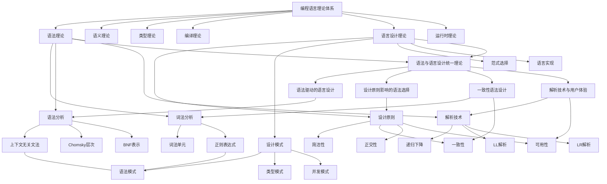

# 编程语言理论统一总论

 (v2.0)

## 目录

- [编程语言理论统一总论](#编程语言理论统一总论)
  - [目录](#目录)
  - [概述](#概述)
  - [1. 编程语言统一模型 (PLUM)](#1-编程语言统一模型-plum)
    - [1.1 PLUM 核心框架](#11-plum-核心框架)
    - [1.2 PLUM 的三要素](#12-plum-的三要素)
    - [1.3 核心概念](#13-核心概念)
      - [语言设计原则](#语言设计原则)
      - [语言分类 (基于PLUM)](#语言分类-基于plum)
  - [2. 核心理论详解](#2-核心理论详解)
    - [2.1 语法 (Syntax)](#21-语法-syntax)
    - [2.2 静态语义 (Statics / Type System)](#22-静态语义-statics--type-system)
    - [2.3 动态语义 (Dynamics / Operational Semantics)](#23-动态语义-dynamics--operational-semantics)
  - [3. 基本概念](#3-基本概念)
    - [3.1 类型理论](#31-类型理论)
  - [4. 核心理论](#4-核心理论)
    - [4.1 编译器理论](#41-编译器理论)
    - [4.2 运行时理论](#42-运行时理论)
    - [4.3 并发理论](#43-并发理论)
  - [5. 应用领域](#5-应用领域)
    - [5.1 语言设计](#51-语言设计)
    - [5.2 编译器开发](#52-编译器开发)
    - [5.3 程序分析](#53-程序分析)
    - [5.4 软件工程](#54-软件工程)
  - [6. 发展趋势](#6-发展趋势)
    - [6.1 函数式编程](#61-函数式编程)
    - [6.2 并发编程](#62-并发编程)
    - [6.3 类型系统](#63-类型系统)
    - [6.4 性能优化](#64-性能优化)
  - [7. 总结](#7-总结)

## 概述

编程语言理论（PLT）是研究编程语言的设计、实现、分析和应用的数学分支。本统一理论的核心是**编程语言统一模型（PLUM）**，它将任何编程语言都视为由三个相互关联的部分组成的系统：

1. **语法 (Syntax)**: 程序的形式和结构。
2. **静态语义 (Statics)**: 程序的编译时属性，主要是类型系统。
3. **动态语义 (Dynamics)**: 程序的运行时行为，即如何执行。

本理论旨在为所有编程语言提供一个统一的、形式化的分析框架。

## 1. 编程语言统一模型 (PLUM)

### 1.1 PLUM 核心框架

PLUM 将编程语言的生命周期形式化为一个清晰的流程：源代码首先被解析为抽象语法树（AST），然后经过静态类型检查，最后在某种执行模型下进行求值。

```mermaid
graph TD
    subgraph PLUM [编程语言统一模型]
        A[源代码 (String)] -- 解析 (Parsing) --> B(抽象语法树 AST);
        B -- 类型检查 (Type Checking) --> C{类型化的 AST};
        C -- 求值 (Evaluation) --> D[结果 (Value)];
        
        subgraph Static Semantics [静态语义]
            C
        end

        subgraph Dynamic Semantics [动态语义]
            D
        end
    end

    E[语法 (Syntax)] -- 定义 --> B;
    F[类型系统 (Type System)] -- 定义 --> C;
    G[操作语义 (Operational Semantics)] -- 定义 --> D;
    
    style B fill:#f9f,stroke:#333,stroke-width:2px
    style C fill:#ccf,stroke:#333,stroke-width:2px
    style D fill:#cfc,stroke:#333,stroke-width:2px

```

### 1.2 PLUM 的三要素

**1. 语法 (Syntax)**
语法定义了"什么是合法的程序文本？"。它直接构建于**统一形式语言理论 (ULM)** 之上，通常使用上下文无关文法 (CFG) 来描述，其产物是抽象语法树 (AST)。
$$ \text{Source Code} \xrightarrow{\text{Parse}} \text{AST} $$

**2. 静态语义 (Statics / Type System)**
静态语义定义了"哪些合法的程序是行为良好 (well-behaved) 的？"。它在程序运行前进行检查，最核心的就是**类型系统**。类型检查的过程可以被形式化为一个判断：
$$ \Gamma \vdash e : T $$
这个判断的含义是："在上下文 $ \Gamma $ (一个变量到类型的映射) 中，表达式 $ e $ 的类型为 $ T $"。一个没有类型的程序被认为是无意义的。

**3. 动态语义 (Dynamics / Operational Semantics)**
动态语义定义了"一个行为良好的程序如何执行？"。它描述了程序的求值过程，最常用的方法是**操作语义**，其判断形式如下：
$$ \sigma, e \rightarrow \sigma', v $$
含义是："在状态（环境） $ \sigma $ 中，表达式 $ e $ 求值后，状态变为 $ \sigma' $，结果为 $ v $"。

### 1.3 核心概念

#### 语言设计原则

- **安全性 (Safety)**: "行为良好的程序不会出错"。这是通过静态语义（类型系统）保证的。
- **表达力 (Expressiveness)**: 语言能够方便、清晰地表达复杂的思想。
- **组合性 (Compositionality)**: 语言的各个部分可以被组合起来，且组合体的含义由其部分的含义决定。
- **抽象性 (Abstraction)**: 语言提供隐藏实现细节的能力。

#### 语言分类 (基于PLUM)

- **静态类型 vs. 动态类型**: 静态语义（类型检查）发生在编译时还是运行时。
- **强类型 vs. 弱类型**: 类型系统对隐式转换的容忍程度。
- **求值策略 (Evaluation Strategy)**: 动态语义的具体规则，如传值调用 (call-by-value) vs. 传名调用 (call-by-name)。

## 2. 核心理论详解

### 2.1 语法 (Syntax)

编程语言的语法是**形式语言**的一个实例。我们使用上一章的 `ULM` 来定义它。

**上下文无关文法 (CFG) 是基石:**
$$ G = (V, \Sigma, P, S) $$

- **$V$ (非终结符)**: `Expression`, `Statement`, `Type` 等。
- **$\Sigma$ (终结符)**: `if`, `+`, `(`, `identifier`, `number` 等。
- **$P$ (产生式)**: 定义了语法的递归结构。
- **$S$ (开始符号)**: `Program` 或 `Module`。

**抽象语法树 (AST):**
解析过程将源代码字符串转换为 AST，这是后续所有分析的基础。

```rust
// 表达式的AST定义 (与形式语言理论中的ADT同构)
#[derive(Debug, Clone)]
pub enum Expression {
    Literal(Value),
    Variable(String),
    BinaryOp(Box<Expression>, Operator, Box<Expression>),
    If(Box<Expression>, Box<Expression>, Box<Expression>),
    // ... 其他构造
}

#[derive(Debug, Clone, PartialEq)]
pub enum Type {
    Int,
    Bool,
}

#[derive(Debug, Clone)]
pub enum Value {
    Int(i32),
    Bool(bool),
}

#[derive(Debug, Clone)]
pub enum Operator {
    Add,
    Multiply,
    LessThan,
}

type TypeEnvironment = std::collections::HashMap<String, Type>;

```

### 2.2 静态语义 (Statics / Type System)

静态语义定义了"哪些合法的程序是行为良好 (well-behaved) 的？"。它在程序运行前进行检查，最核心的就是**类型系统**。类型检查的过程可以被形式化为一个判断：
$$ \Gamma \vdash e : T $$
这个判断的含义是："在上下文 $ \Gamma $ (一个变量到类型的映射) 中，表达式 $ e $ 的类型为 $ T $"。一个没有类型的程序被认为是无意义的。

**类型检查规则示例:**

- **(T-Int)**: $ \Gamma \vdash \text{Int}(i) : \text{Int} $
- **(T-Bool)**: $ \Gamma \vdash \text{Bool}(b) : \text{Bool} $
- **(T-Var)**: $ \frac{x:T \in \Gamma}{\Gamma \vdash x : T} $
- **(T-Op)**: $ \frac{\Gamma \vdash e_1 : \text{Int} \quad \Gamma \vdash e_2 : \text{Int}}{\Gamma \vdash e_1 + e_2 : \text{Int}} $
- **(T-If)**: $ \frac{\Gamma \vdash e_1 : \text{Bool} \quad \Gamma \vdash e_2 : T \quad \Gamma \vdash e_3 : T}{\Gamma \vdash \text{if } e_1 \text{ then } e_2 \text{ else } e_3 : T} $

**Rust 实现思路:**

```rust
fn type_of(env: &TypeEnvironment, expr: &Expression) -> Result<Type, String> {
    match expr {
        Expression::Literal(Value::Int(_)) => Ok(Type::Int),
        Expression::Literal(Value::Bool(_)) => Ok(Type::Bool),
        Expression::Variable(name) => env.get(name).cloned().ok_or(format!("Variable {} not found", name)),
        Expression::BinaryOp(l, op, r) => {
            let t1 = type_of(env, l)?;
            let t2 = type_of(env, r)?;
            match op {
                Operator::Add | Operator::Multiply => {
                    if t1 == Type::Int && t2 == Type::Int { Ok(Type::Int) } 
                    else { Err("Binary operands must be integers".to_string()) }
                },
                Operator::LessThan => {
                    if t1 == Type::Int && t2 == Type::Int { Ok(Type::Bool) } 
                    else { Err("Comparison operands must be integers".to_string()) }
                }
            }
        },
        Expression::If(cond, then_branch, else_branch) => {
            if type_of(env, cond)? != Type::Bool {
                return Err("If condition must be a boolean".to_string());
            }
            let t1 = type_of(env, then_branch)?;
            let t2 = type_of(env, else_branch)?;
            if t1 != t2 {
                return Err("If branches must have the same type".to_string());
            }
            Ok(t1)
        }
    }
}
```

### 2.3 动态语义 (Dynamics / Operational Semantics)

动态语义定义了"一个行为良好的程序如何执行？"。它描述了程序的求值过程，最常用的方法是**操作语义**，其判断形式如下：
$$ \sigma, e \rightarrow \sigma', v $$
含义是："在状态（环境） $ \sigma $ 中，表达式 $ e $ 求值后，状态变为 $ \sigma' $，结果为 $ v $"。

**求值规则示例:**

- **(E-Int)**: $ \sigma, \text{Int}(i) \rightarrow \sigma, \text{Int}(i) $
- **(E-Op)**: $ \frac{\sigma, e_1 \rightarrow \sigma', v_1 \quad \sigma', e_2 \rightarrow \sigma'', v_2}{\sigma, e_1 + e_2 \rightarrow \sigma'', v_1 + v_2} $
- **(E-If-True)**: $ \frac{\sigma, e_1 \rightarrow \sigma', \text{Bool(true)} \quad \sigma', e_2 \rightarrow \sigma'', v}{\sigma, \text{if } e_1 \text{ then } e_2 \text{ else } e_3 \rightarrow \sigma'', v} $

**Rust 实现思路 (无状态副作用):**

```rust
fn eval(expr: &Expression) -> Result<Value, String> {
    match expr {
        Expression::Literal(v) => Ok(v.clone()),
        Expression::Variable(name) => Err(format!("Cannot evaluate free variable {}", name)), // 假设无环境
        Expression::BinaryOp(l, op, r) => {
            let v1 = eval(l)?;
            let v2 = eval(r)?;
            match (v1, v2, op) {
                (Value::Int(i1), Value::Int(i2), Operator::Add) => Ok(Value::Int(i1 + i2)),
                (Value.Int(i1), Value::Int(i2), Operator::Multiply) => Ok(Value::Int(i1 * i2)),
                (Value::Int(i1), Value::Int(i2), Operator::LessThan) => Ok(Value::Bool(i1 < i2)),
                _ => Err("Type mismatch during evaluation".to_string())
            }
        },
        Expression::If(cond, then_branch, else_branch) => {
            match eval(cond)? {
                Value::Bool(true) => eval(then_branch),
                Value::Bool(false) => eval(else_branch),
                _ => Err("If condition must evaluate to a boolean".to_string())
            }
        }
    }
}
```

## 3. 基本概念

### 3.1 类型理论

**类型系统：**
$$TypeSystem = (Types, Subtyping, TypeChecking)$$

**类型推导：**
$$\Gamma \vdash e : \tau$$

**多态性：**
$$\forall \alpha. Expression[\alpha]$$

## 4. 核心理论

### 4.1 编译器理论

编译器是将高级语言转换为机器代码的程序，主要包含以下阶段：

1. **词法分析** - 将源代码转换为词法单元序列
2. **语法分析** - 构建抽象语法树
3. **语义分析** - 类型检查和语义验证
4. **中间代码生成** - 生成中间表示
5. **代码优化** - 优化中间代码
6. **目标代码生成** - 生成目标机器代码

### 4.2 运行时理论

运行时系统负责程序的执行环境，包括：

- **内存管理** - 内存分配和回收
- **垃圾回收** - 自动内存管理
- **异常处理** - 错误处理机制
- **并发支持** - 多线程和异步执行

### 4.3 并发理论

并发编程模型包括：

- **共享内存模型** - 线程间共享内存
- **消息传递模型** - 进程间通过消息通信
- **Actor模型** - 基于消息的并发模型
- **CSP模型** - 通信顺序进程

## 5. 应用领域

### 5.1 语言设计

- 新编程语言的设计和实现
- 领域特定语言(DSL)的开发
- 语言特性的研究和评估

### 5.2 编译器开发

- 编译器前端的实现
- 代码优化技术
- 目标代码生成

### 5.3 程序分析

- 静态程序分析
- 动态程序分析
- 程序验证和测试

### 5.4 软件工程

- 代码质量评估
- 重构和优化
- 软件维护

## 6. 发展趋势

### 6.1 函数式编程

- 不可变数据结构
- 高阶函数和闭包
- 类型系统的发展

### 6.2 并发编程

- 异步编程模型
- 内存模型的研究
- 并发安全性的保证

### 6.3 类型系统

- 依赖类型系统
- 线性类型系统
- 类型推导的改进

### 6.4 性能优化

- 编译时优化
- 运行时优化
- 内存管理的改进

## 7. 总结

编程语言理论为现代软件开发提供了坚实的理论基础。通过深入理解语言设计原则、类型系统、编译技术和运行时机制，我们可以设计出更加高效、安全和易用的编程语言，推动软件技术的不断发展。

随着计算机科学的发展，编程语言理论将继续演进，为新的编程范式和计算模型提供理论支持。


