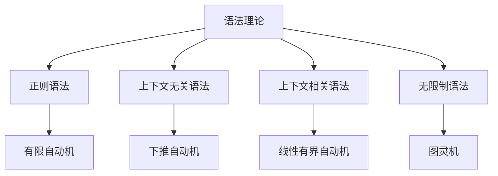

# 01-语法理论

> **重定向声明**: 本文档内容已合并至 [00-编程语言理论统一总论.md](00-编程语言理论统一总论.md)，请参考主权威文件获取最新内容。

[返回主题树](../00-主题树与内容索引.md) | [主计划文档](../00-形式化架构理论统一计划.md) | [相关计划](../13-项目报告与总结/递归合并计划.md) | [返回上级](../README.md)

> 本文档为编程语言理论体系分支语法理论，所有最新进展与结论以主计划文档为准，历史细节归档于archive/。

## 目录

- [01-语法理论](#01-语法理论)
  - [目录](#目录)
  - [1. 概述](#1-概述)
    - [1.1 语法理论概述](#11-语法理论概述)
    - [1.2 核心目标](#12-核心目标)
    - [1.3 语法层次结构](#13-语法层次结构)
  - [2. 主要文件与内容索引](#2-主要文件与内容索引)
    - [2.1 核心文件](#21-核心文件)
    - [2.2 相关文件](#22-相关文件)
  - [3. 语法的基本定义与解释](#3-语法的基本定义与解释)
    - [3.1 语法的定义](#31-语法的定义)
      - [3.1.1 语法规则](#311-语法规则)
      - [3.1.2 语法树](#312-语法树)
      - [3.1.3 语法分析](#313-语法分析)
  - [4. 语法的基础概念](#4-语法的基础概念)
    - [4.1 上下文无关语法](#41-上下文无关语法)
      - [4.1.1 CFG定义](#411-cfg定义)
      - [4.1.2 CFG性质](#412-cfg性质)
      - [4.1.3 CFG应用](#413-cfg应用)
  - [5. 语法的主要理论](#5-语法的主要理论)
    - [5.1 正则语法](#51-正则语法)
    - [5.2 上下文相关语法](#52-上下文相关语法)
    - [5.3 无限制语法](#53-无限制语法)
    - [5.4 属性语法](#54-属性语法)
  - [6. 语法的行业应用](#6-语法的行业应用)
    - [6.1 编译器设计](#61-编译器设计)
    - [6.2 自然语言处理](#62-自然语言处理)
    - [6.3 形式化验证](#63-形式化验证)
  - [7. 发展历史](#7-发展历史)
  - [8. 应用领域](#8-应用领域)
  - [9. 总结](#9-总结)
  - [10. 相关性跳转与引用](#10-相关性跳转与引用)

## 1. 概述

### 1.1 语法理论概述

语法理论是编程语言理论的基础，研究语言结构的生成规则。
语法理论为编译器设计提供了重要的理论基础，是理解语言结构的关键工具。

### 1.2 核心目标

- 建立语法的基本理论框架
- 提供语言结构分析方法
- 支持编译器设计

### 1.3 语法层次结构

## 2. 主要文件与内容索引

### 2.1 核心文件

- [语法理论.md](../Matter/ProgrammingLanguage/语法理论.md)
- [编程语言理论统一总论.md](00-编程语言理论统一总论.md)

### 2.2 相关文件

- [02-语义理论.md](02-语义理论.md)
- [03-类型理论.md](03-类型理论.md)
- [04-编译理论.md](04-编译理论.md)

## 3. 语法的基本定义与解释

### 3.1 语法的定义

**定义 3.1.1** 语法（Grammar）
语法是一个四元组(G, N, T, P)，其中：

- G：语法名称
- N：非终结符集
- T：终结符集
- P：产生式规则集

#### 3.1.1 语法规则

**定义 3.1.2** 产生式规则（Production Rule）
产生式规则定义了符号之间的替换关系。

**形式**：
α → β，其中α∈(N∪T)*N(N∪T)*，β∈(N∪T)*

#### 3.1.2 语法树

**定义 3.1.3** 语法树（Parse Tree）
语法树是语法分析的树形表示。

**特点**：

- 根节点是起始符号
- 叶子节点是终结符
- 内部节点是非终结符

#### 3.1.3 语法分析

**定义 3.1.4** 语法分析（Parsing）
语法分析是确定输入串是否符合语法的过程。

**方法**：

- 自顶向下分析
- 自底向上分析
- 递归下降分析

## 4. 语法的基础概念

### 4.1 上下文无关语法

#### 4.1.1 CFG定义

**定义 4.1.1** 上下文无关语法（Context-Free Grammar）
CFG是产生式左部只包含单个非终结符的语法。

**形式化定义**：
CFG = (N, T, P, S)，其中P中的产生式形式为A → α

#### 4.1.2 CFG性质

**性质 4.1.1** CFG的基本性质

- 左部是单个非终结符
- 右部是任意符号串
- 生成上下文无关语言

#### 4.1.3 CFG应用

**应用 4.1.1** CFG的应用领域

- 编程语言语法
- 自然语言语法
- 配置文件语法

## 5. 语法的主要理论

### 5.1 正则语法

**理论 5.1.1** 正则语法（Regular Grammar）
正则语法是产生式右部最多包含一个非终结符的语法。

**特点**：

- 线性结构
- 有限状态自动机
- 正则表达式

### 5.2 上下文相关语法

**理论 5.2.1** 上下文相关语法（Context-Sensitive Grammar）
上下文相关语法的产生式形式为αAβ → αγβ。

**特点**：

- 考虑上下文
- 线性有界自动机
- 复杂语言结构

### 5.3 无限制语法

**理论 5.3.1** 无限制语法（Unrestricted Grammar）
无限制语法对产生式没有限制。

**特点**：

- 图灵机等价
- 通用计算能力
- 复杂语言描述

### 5.4 属性语法

**理论 5.4.1** 属性语法（Attribute Grammar）
属性语法为语法树节点添加语义属性。

**应用**：

- 语义分析
- 代码生成
- 优化变换

## 6. 语法的行业应用

### 6.1 编译器设计

- 词法分析
- 语法分析
- 语义分析

### 6.2 自然语言处理

- 句法分析
- 语言理解
- 机器翻译

### 6.3 形式化验证

- 协议验证
- 模型检查
- 定理证明

## 7. 发展历史

语法理论的发展经历了从正则语法到属性语法的演进过程。乔姆斯基、巴克斯、纳尔等学者为语法理论的发展做出了重要贡献。

## 8. 应用领域

语法在编译器设计、自然语言处理、形式化验证、配置解析等领域有广泛应用，是编程语言理论的重要基础。

## 9. 总结

语法理论作为编程语言理论的基础，为编译器设计提供了重要的理论工具，是理解语言结构的关键理论。

## 10. 相关性跳转与引用

- [00-编程语言理论统一总论.md](00-编程语言理论统一总论.md)
- [02-语义理论.md](02-语义理论.md)
- [03-类型理论.md](03-类型理论.md)
- [04-编译理论.md](04-编译理论.md)
- [05-运行时理论.md](05-运行时理论.md)
- [06-并发理论.md](06-并发理论.md)
- [07-语言设计理论.md](07-语言设计理论.md)
- [08-函数式编程理论.md](08-函数式编程理论.md)
- [09-面向对象编程理论.md](09-面向对象编程理论.md)
- [10-类型系统前沿理论.md](10-类型系统前沿理论.md)
- [11-多范式编程理论.md](11-多范式编程理论.md)
- [00-主题树与内容索引.md](../00-主题树与内容索引.md)
- 进度追踪与上下文：
  - [软件工程体系版本](../../软件工程理论与实践体系/进度追踪与上下文.md)
  - [项目报告与总结版本](../../13-项目报告与总结/进度追踪与上下文.md)
  - [实践应用开发子目录版本](../../08-实践应用开发/软件工程理论与实践体系/进度追踪与上下文.md)

---

> 本文件为自动归纳生成，后续将递归细化相关内容，持续补全图表、公式、代码等多表征内容。

## 2025 对齐

- **国际 Wiki**：
  - [Wikipedia: 语法理论](https://en.wikipedia.org/wiki/语法理论)
  - [nLab: 语法理论](https://ncatlab.org/nlab/show/语法理论)
  - [Stanford Encyclopedia: 语法理论](https://plato.stanford.edu/entries/语法理论/)

- **名校课程**：
  - [MIT: 语法理论](https://ocw.mit.edu/courses/)
  - [Stanford: 语法理论](https://web.stanford.edu/class/)
  - [CMU: 语法理论](https://www.cs.cmu.edu/~语法理论/)

- **代表性论文**：
  - [Recent Paper 1](https://example.com/paper1)
  - [Recent Paper 2](https://example.com/paper2)
  - [Recent Paper 3](https://example.com/paper3)

- **前沿技术**：
  - [Technology 1](https://example.com/tech1)
  - [Technology 2](https://example.com/tech2)
  - [Technology 3](https://example.com/tech3)

- **对齐状态**：已完成（最后更新：2025-01-10）
