# 01-语言设计理论与原则

[返回主题树](../00-主题树与内容索引.md) | [主计划文档](../00-形式化架构理论统一计划.md) | [相关计划](../递归合并计划.md)

> **重定向声明**: 本文档内容已合并至 [00-编程语言理论统一总论.md](00-编程语言理论统一总论.md)，请参考主权威文件获取最新内容。
> 本文档为编程语言理论体系分支语言设计理论与原则，所有最新进展与结论以主计划文档为准，历史细节归档于archive/。

## 重定向

语言设计理论与原则已与语法理论进行合并，形成统一的理论框架，以便更全面地理解语法与语言设计的关系。

请访问 [语法与语言设计统一理论](01-语法与语言设计统一理论.md) 获取完整内容。

### 主要内容去向

原语言设计理论与原则的主要内容已在统一理论中的以下部分体现：

1. **语言设计核心原则** - 在统一理论的第3节
2. **设计模式** - 在统一理论的第5节
3. **语言范式** - 在统一理论的第6节
4. **语法与设计原则的统一** - 在统一理论的第4节

```mermaid
flowchart TD
    A[形式化架构理论分析项目] --> B1[01-哲学基础理论]
    A --> B2[02-数学理论体系]
    A --> B3[03-形式语言理论体系]
    A --> B4[04-软件架构理论体系]
    A --> B5[05-编程语言理论体系]
    A --> B6[06-形式模型理论体系]
    A --> B7[07-理论统一与整合]
    A --> B8[08-实践应用开发]
    A --> B9[09-索引与导航]
    
    B3 --> C31[00-形式语言理论统一总论]
    B3 --> C32[01-自动机理论]
    B3 --> C33[02-形式语法]
    B3 --> C34[03-语义理论]
    B3 --> C35[04-类型理论]
    B3 --> C36[05-计算理论]
    B3 --> C37[06-语言设计]
    
    B4 --> C41[00-软件架构理论统一总论]
    B4 --> C42[01-架构模式理论]
    B4 --> C43[02-组件理论]
    B4 --> C44[03-接口理论]
    B4 --> C45[04-分层架构理论]
    B4 --> C46[04-云原生架构理论]
    B4 --> C47[05-分布式架构理论]
    B4 --> C48[06-微服务架构理论]
    B4 --> C49[06-WebAssembly架构理论]
    B4 --> C410[07-架构评估理论]
    B4 --> C411[07-工作流架构理论]
    
    B5 --> C51[00-编程语言理论统一总论]
    B5 --> C52[01-语法理论]
    B5 --> C53[01-语言设计理论与原则]
    B5 --> C54[02-语法和语义]
    B5 --> C55[02-语义理论]
    B5 --> C56[03-类型理论]
    B5 --> C57[03-编译器理论]
    B5 --> C58[04-编译理论]
    B5 --> C59[04-类型系统]
    B5 --> C510[05-运行时理论]
    B5 --> C511[06-并发理论]
    B5 --> C512[07-语言设计理论]
    
    B6 --> C61[01-状态机理论]
    B6 --> C62[02-Petri网理论]
    B6 --> C63[03-时序逻辑理论]
    B6 --> C64[04-模型检查理论]
    B6 --> C65[05-自动机理论]
    B6 --> C66[06-进程代数理论]
    B6 --> C67[07-形式化方法理论]
```

