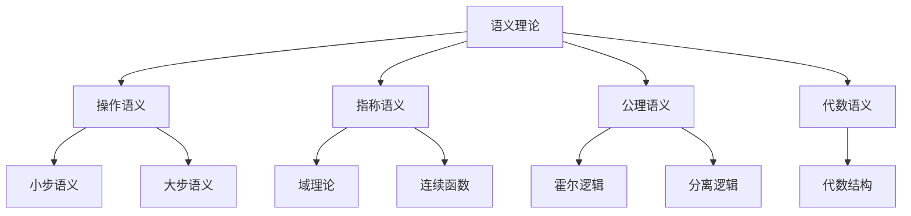

# 02-语义理论

> **重定向声明**: 本文档内容已合并至 [00-编程语言理论统一总论.md](00-编程语言理论统一总论.md)，请参考主权威文件获取最新内容。

[返回主题树](../00-主题树与内容索引.md) | [主计划文档](../00-形式化架构理论统一计划.md) | [相关计划](../递归合并计划.md) | [返回上级](../README.md)

> 本文档为编程语言理论体系分支语义理论，所有最新进展与结论以主计划文档为准，历史细节归档于archive/。

## 目录

- [02-语义理论](#02-语义理论)
  - [目录](#目录)
  - [1. 概述](#1-概述)
    - [1.1 语义理论概述](#11-语义理论概述)
    - [1.2 核心目标](#12-核心目标)
    - [1.3 语义层次结构](#13-语义层次结构)
  - [2. 主要文件与内容索引](#2-主要文件与内容索引)
    - [2.1 核心文件](#21-核心文件)
    - [2.2 相关文件](#22-相关文件)
  - [3. 语义的基本定义与解释](#3-语义的基本定义与解释)
    - [3.1 语义的定义](#31-语义的定义)
      - [3.1.1 操作语义](#311-操作语义)
      - [3.1.2 指称语义](#312-指称语义)
      - [3.1.3 公理语义](#313-公理语义)
  - [4. 语义的基础概念](#4-语义的基础概念)
    - [4.1 操作语义](#41-操作语义)
      - [4.1.1 小步语义](#411-小步语义)
      - [4.1.2 大步语义](#412-大步语义)
      - [4.1.3 自然语义](#413-自然语义)
  - [5. 语义的主要理论](#5-语义的主要理论)
    - [5.1 指称语义](#51-指称语义)
    - [5.2 公理语义](#52-公理语义)
    - [5.3 代数语义](#53-代数语义)
    - [5.4 动作语义](#54-动作语义)
  - [6. 语义的行业应用](#6-语义的行业应用)
    - [6.1 编译器设计](#61-编译器设计)
    - [6.2 程序验证](#62-程序验证)
    - [6.3 语言设计](#63-语言设计)
  - [7. 发展历史](#7-发展历史)
  - [8. 应用领域](#8-应用领域)
  - [9. 总结](#9-总结)
  - [10. 相关性跳转与引用](#10-相关性跳转与引用)

## 1. 概述

### 1.1 语义理论概述

语义理论是研究编程语言含义的学科，为形式化架构理论提供了语言解释的重要工具。语义理论不仅支撑语言理解，也是编译器设计和程序验证的重要理论基础。

### 1.2 核心目标

- 建立语言语义的基本理论框架
- 提供程序行为分析的形式化工具
- 支持编译器设计和程序验证应用

### 1.3 语义层次结构



## 2. 主要文件与内容索引

### 2.1 核心文件

- [语义理论.md](../Matter/ProgrammingLanguage/语义理论.md)
- [编程语言理论统一总论.md](00-编程语言理论统一总论.md)

### 2.2 相关文件

- [01-语法理论.md](01-语法理论.md)
- [03-类型理论.md](03-类型理论.md)
- [04-编译理论.md](04-编译理论.md)

## 3. 语义的基本定义与解释

### 3.1 语义的定义

**定义 3.1.1** 语义（Semantics）
语义是研究编程语言表达式和语句含义的学科。

#### 3.1.1 操作语义

**定义 3.1.2** 操作语义（Operational Semantics）
操作语义通过描述程序的执行步骤来定义语言含义。

**特点**：

- 抽象机器
- 状态转换
- 执行步骤

#### 3.1.2 指称语义

**定义 3.1.3** 指称语义（Denotational Semantics）
指称语义通过数学对象来表示程序的含义。

**特点**：

- 数学函数
- 域理论
- 连续性

#### 3.1.3 公理语义

**定义 3.1.4** 公理语义（Axiomatic Semantics）
公理语义通过逻辑公式来描述程序的性质。

**特点**：

- 霍尔逻辑
- 前置条件
- 后置条件

## 4. 语义的基础概念

### 4.1 操作语义

#### 4.1.1 小步语义

**定义 4.1.1** 小步语义（Small-Step Semantics）
小步语义描述程序的最小执行步骤。

**规则**：

- 表达式求值
- 语句执行
- 状态更新

#### 4.1.2 大步语义

**定义 4.1.2** 大步语义（Big-Step Semantics）
大步语义描述程序的完整执行过程。

**特点**：

- 自然演绎
- 推理规则
- 终止条件

#### 4.1.3 自然语义

**定义 4.1.3** 自然语义（Natural Semantics）
自然语义使用推理规则定义程序含义。

**形式**：

```text
前提1 ... 前提n
───────────────
    结论
```

## 5. 语义的主要理论

### 5.1 指称语义

**理论 5.1.1** 指称语义（Denotational Semantics）
指称语义将程序映射到数学对象。

**特点**：

- 域理论
- 连续函数
- 不动点理论

### 5.2 公理语义

**理论 5.2.1** 公理语义（Axiomatic Semantics）
公理语义使用逻辑公式描述程序性质。

**特点**：

- 霍尔逻辑
- 分离逻辑
- 程序验证

### 5.3 代数语义

**理论 5.3.1** 代数语义（Algebraic Semantics）
代数语义使用代数结构描述程序含义。

**特点**：

- 代数理论
- 同构映射
- 抽象代数

### 5.4 动作语义

**理论 5.4.1** 动作语义（Action Semantics）
动作语义通过动作来描述程序行为。

**特点**：

- 动作理论
- 行为描述
- 模块化

## 6. 语义的行业应用

### 6.1 编译器设计

- 语义分析
- 代码生成
- 优化技术

### 6.2 程序验证

- 形式化验证
- 模型检查
- 定理证明

### 6.3 语言设计

- 语言规范
- 语义定义
- 实现指导

## 7. 发展历史

语义理论的发展经历了从操作语义到指称语义的演进过程。斯科特、斯特拉奇、米尔纳等学者为语义理论的发展做出了重要贡献。

## 8. 应用领域

语义在编译器设计、程序验证、语言设计等领域有广泛应用，是现代编程语言理论的重要基础。

## 9. 总结

语义理论作为编程语言理论的重要分支，为形式化架构理论提供了重要的语言解释工具，是理解程序行为的基础理论。

## 10. 相关性跳转与引用

- [00-编程语言理论统一总论.md](00-编程语言理论统一总论.md)
- [01-语法理论.md](01-语法理论.md)
- [03-类型理论.md](03-类型理论.md)
- [04-编译理论.md](04-编译理论.md)
- [05-运行时理论.md](05-运行时理论.md)
- [06-并发理论.md](06-并发理论.md)
- [00-主题树与内容索引.md](../00-主题树与内容索引.md)
- [进度追踪与上下文.md](../进度追踪与上下文.md)

---

> 本文件为自动归纳生成，后续将递归细化相关内容，持续补全图表、公式、代码等多表征内容。
