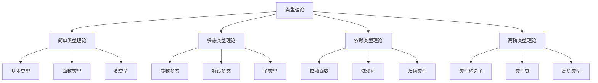

# 03-类型理论

> **重定向声明**: 本文档内容已合并至 [00-编程语言理论统一总论.md](00-编程语言理论统一总论.md)，请参考主权威文件获取最新内容。

[返回主题树](../00-主题树与内容索引.md) | [主计划文档](../00-形式化架构理论统一计划.md) | [相关计划](../13-项目报告与总结/递归合并计划.md) | [返回上级](../README.md)

> 本文档为编程语言理论体系分支类型理论，所有最新进展与结论以主计划文档为准，历史细节归档于archive/。

## 目录

- [03-类型理论](#03-类型理论)
  - [目录](#目录)
  - [1. 概述](#1-概述)
    - [1.1 类型理论概述](#11-类型理论概述)
    - [1.2 核心目标](#12-核心目标)
    - [1.3 类型层次结构](#13-类型层次结构)
  - [2. 主要文件与内容索引](#2-主要文件与内容索引)
    - [2.1 核心文件](#21-核心文件)
    - [2.2 相关文件](#22-相关文件)
  - [3. 类型理论的基本定义与解释](#3-类型理论的基本定义与解释)
    - [3.1 类型的定义](#31-类型的定义)
      - [3.1.1 基本类型](#311-基本类型)
      - [3.1.2 复合类型](#312-复合类型)
      - [3.1.3 高阶类型](#313-高阶类型)
  - [4. 类型理论的基础概念](#4-类型理论的基础概念)
    - [4.1 类型系统](#41-类型系统)
      - [4.1.1 类型检查](#411-类型检查)
      - [4.1.2 类型推导](#412-类型推导)
      - [4.1.3 类型安全](#413-类型安全)
  - [5. 类型理论的主要理论](#5-类型理论的主要理论)
    - [5.1 简单类型理论](#51-简单类型理论)
    - [5.2 多态类型理论](#52-多态类型理论)
    - [5.3 依赖类型理论](#53-依赖类型理论)
    - [5.4 高阶类型理论](#54-高阶类型理论)
  - [6. 类型理论的行业应用](#6-类型理论的行业应用)
    - [6.1 编程语言设计](#61-编程语言设计)
    - [6.2 程序验证](#62-程序验证)
    - [6.3 定理证明](#63-定理证明)
  - [7. 发展历史](#7-发展历史)
  - [8. 应用领域](#8-应用领域)
  - [9. 总结](#9-总结)
  - [10. 相关性跳转与引用](#10-相关性跳转与引用)

## 1. 概述

### 1.1 类型理论概述

类型理论是研究类型系统和类型安全的数学理论，为形式化架构理论提供了类型安全的重要工具。类型理论不仅支撑编程语言设计，也是程序验证和定理证明的重要理论基础。

### 1.2 核心目标

- 建立类型安全的基本理论框架
- 提供类型检查的形式化工具
- 支持编程语言设计和程序验证应用

### 1.3 类型层次结构

## 2. 主要文件与内容索引

### 2.1 核心文件

- [类型理论.md](../Matter/ProgrammingLanguage/类型理论.md)
- [Advanced_Type_Theory_Comprehensive_Deepening.md](../Matter/Theory/Type_Theory_Deepening/Advanced_Type_Theory_Comprehensive_Deepening.md)

### 2.2 相关文件

- [00-编程语言理论统一总论.md](00-编程语言理论统一总论.md)
- [01-语法理论.md](01-语法理论.md)
- [02-语义理论.md](02-语义理论.md)

## 3. 类型理论的基本定义与解释

### 3.1 类型的定义

**定义 3.1.1** 类型（Type）
类型是值的集合，用于分类和约束程序中的值。

#### 3.1.1 基本类型

**定义 3.1.2** 基本类型（Basic Types）
基本类型是类型系统的基础类型。

**例子**：

- Bool：布尔类型
- Int：整数类型
- Float：浮点类型
- String：字符串类型

#### 3.1.2 复合类型

**定义 3.1.3** 复合类型（Compound Types）
复合类型由基本类型组合而成。

**类型**：

- 函数类型：A → B
- 积类型：A × B
- 和类型：A + B
- 列表类型：List A

#### 3.1.3 高阶类型

**定义 3.1.4** 高阶类型（Higher-Order Types）
高阶类型是类型的类型。

**例子**：

- Maybe A：可能包含A或空值
- Either A B：包含A或B
- State S A：状态计算

## 4. 类型理论的基础概念

### 4.1 类型系统

#### 4.1.1 类型检查

**概念 4.1.1** 类型检查（Type Checking）
类型检查验证程序是否符合类型规则。

**方法**：

- 静态类型检查
- 动态类型检查
- 类型推导

#### 4.1.2 类型推导

**概念 4.1.2** 类型推导（Type Inference）
类型推导自动推断表达式的类型。

**算法**：

- Hindley-Milner算法
- 统一算法
- 约束求解

#### 4.1.3 类型安全

**概念 4.1.3** 类型安全（Type Safety）
类型安全确保程序不会出现类型错误。

**性质**：

- 进展性
- 保持性
- 可靠性

## 5. 类型理论的主要理论

### 5.1 简单类型理论

**理论 5.1.1** 简单类型理论（Simply Typed Lambda Calculus）
简单类型理论是类型理论的基础。

**特点**：

- 基本类型
- 函数类型
- 类型检查规则

**语法**：

- 变量：x
- 抽象：λx:A.t
- 应用：t u

### 5.2 多态类型理论

**理论 5.2.1** 多态类型理论（Polymorphic Type Theory）
多态类型理论支持类型参数。

**类型**：

- 参数多态：∀α.A
- 特设多态：重载
- 子类型：A <: B

**系统**：

- System F
- Hindley-Milner系统
- 子类型系统

### 5.3 依赖类型理论

**理论 5.3.1** 依赖类型理论（Dependent Type Theory）
依赖类型理论允许类型依赖值。

**构造**：

- 依赖函数：Πx:A.B(x)
- 依赖积：Σx:A.B(x)
- 归纳类型：data T where

**系统**：

- 构造演算
- 同伦类型论
- 直觉类型论

### 5.4 高阶类型理论

**理论 5.4.1** 高阶类型理论（Higher-Order Type Theory）
高阶类型理论支持类型构造子。

**特征**：

- 类型构造子
- 类型类
- 高阶类型

**应用**：

- Haskell类型系统
- Scala类型系统
- Rust类型系统

## 6. 类型理论的行业应用

### 6.1 编程语言设计

- 类型系统设计
- 类型安全保证
- 类型推导算法

### 6.2 程序验证

- 类型安全验证
- 程序正确性
- 形式化验证

### 6.3 定理证明

- 构造性证明
- 类型即命题
- 证明助手

## 7. 发展历史

类型理论的发展经历了从简单类型到现代类型理论的演进过程。丘奇、柯里、马丁-洛夫、雷诺兹等学者为类型理论的发展做出了重要贡献。

## 8. 应用领域

类型理论在编程语言设计、程序验证、定理证明等领域有广泛应用，是现代计算机科学的重要理论基础。

## 9. 总结

类型理论作为编程语言理论的重要分支，为形式化架构理论提供了重要的类型安全工具，是理解类型系统的基础理论。

## 10. 相关性跳转与引用

- [00-编程语言理论统一总论.md](00-编程语言理论统一总论.md)
- [01-语法理论.md](01-语法理论.md)
- [02-语义理论.md](02-语义理论.md)
- [04-编译理论.md](04-编译理论.md)
- [05-运行时理论.md](05-运行时理论.md)
- [06-并发理论.md](06-并发理论.md)
- [00-主题树与内容索引.md](../00-主题树与内容索引.md)
- 进度追踪与上下文：
  - [软件工程体系版本](../../软件工程理论与实践体系/进度追踪与上下文.md)
  - [项目报告与总结版本](../../13-项目报告与总结/进度追踪与上下文.md)
  - [实践应用开发子目录版本](../../08-实践应用开发/软件工程理论与实践体系/进度追踪与上下文.md)

---

> 本文件为自动归纳生成，后续将递归细化相关内容，持续补全图表、公式、代码等多表征内容。
