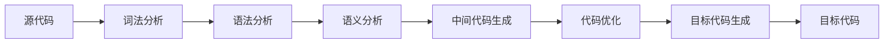

# 编译统一理论

## 1. 概述

### 1.1 定义与范畴

编译理论是研究编程语言编译器设计、实现和优化的系统性理论框架。它涵盖了从源代码到目标代码的完整转换过程，是编程语言理论的核心组成部分。

**形式化定义：**

设 $C$ 为编译器，则：
$$C = (Frontend, Middleend, Backend)$$

其中：

- $Frontend$ 为前端（词法分析、语法分析、语义分析）
- $Middleend$ 为中端（中间代码生成、优化）
- $Backend$ 为后端（目标代码生成、优化）

### 1.2 编译阶段

**编译流水线：**



**各阶段输出：**

- 词法分析：Token流
- 语法分析：抽象语法树（AST）
- 语义分析：类型检查、符号表
- 中间代码：IR表示
- 优化：优化后的IR
- 目标代码：机器代码

## 2. 编译器架构

### 2.1 编译器阶段实现

```rust
// 编译器主结构
pub struct Compiler {
    lexer: Lexer,
    parser: Parser,
    semantic_analyzer: SemanticAnalyzer,
    code_generator: CodeGenerator,
    optimizer: Optimizer,
    target_generator: TargetGenerator,
}

impl Compiler {
    pub fn new() -> Self {
        Self {
            lexer: Lexer::new(),
            parser: Parser::new(),
            semantic_analyzer: SemanticAnalyzer::new(),
            code_generator: CodeGenerator::new(),
            optimizer: Optimizer::new(),
            target_generator: TargetGenerator::new(),
        }
    }
    
    pub fn compile(&mut self, source: &str) -> Result<Vec<u8>, CompilationError> {
        // 1. 词法分析
        let tokens = self.lexer.tokenize(source)?;
        
        // 2. 语法分析
        let ast = self.parser.parse(&tokens)?;
        
        // 3. 语义分析
        let semantic_info = self.semantic_analyzer.analyze(&ast)?;
        
        // 4. 中间代码生成
        let intermediate_code = self.code_generator.generate(&ast, &semantic_info)?;
        
        // 5. 代码优化
        let optimized_code = self.optimizer.optimize(intermediate_code)?;
        
        // 6. 目标代码生成
        let target_code = self.target_generator.generate(&optimized_code)?;
        
        Ok(target_code)
    }
}

#[derive(Debug)]
pub enum CompilationError {
    LexicalError(String),
    SyntaxError(String),
    SemanticError(String),
    CodeGenerationError(String),
    OptimizationError(String),
    TargetGenerationError(String),
}
```

### 2.2 前端和后端

编译器通常分为前端和后端：

```rust
// 编译器前端
pub trait CompilerFrontend {
    fn lexical_analysis(&self, source: &str) -> Result<Vec<Token>, CompilationError>;
    fn syntax_analysis(&self, tokens: &[Token]) -> Result<SyntaxTree, CompilationError>;
    fn semantic_analysis(&self, ast: &SyntaxTree) -> Result<SemanticInfo, CompilationError>;
}

// 编译器后端
pub trait CompilerBackend {
    fn intermediate_code_generation(&self, ast: &SyntaxTree, semantic_info: &SemanticInfo) -> Result<IntermediateCode, CompilationError>;
    fn code_optimization(&self, intermediate_code: IntermediateCode) -> Result<IntermediateCode, CompilationError>;
    fn target_code_generation(&self, intermediate_code: &IntermediateCode) -> Result<TargetCode, CompilationError>;
}

// 语义信息
#[derive(Debug, Clone)]
pub struct SemanticInfo {
    symbol_table: SymbolTable,
    type_info: HashMap<String, Type>,
    scope_info: Vec<Scope>,
}
```

## 3. 编译阶段理论

### 3.1 前端编译

#### 3.1.1 词法分析

词法分析将源代码转换为词法单元（Token）序列。

**形式化定义：**
$$LexicalAnalysis : String \rightarrow [Token]$$

```rust
use std::collections::HashMap;

/// 词法单元
#[derive(Debug, Clone)]
pub enum Token {
    Number(f64),
    Identifier(String),
    Plus,
    Minus,
    Multiply,
    Divide,
    Assign,
    Semicolon,
    LeftParen,
    RightParen,
    LeftBrace,
    RightBrace,
    If,
    Else,
    While,
    Return,
    EOF,
}

/// 词法分析器
pub struct Lexer {
    input: Vec<char>,
    position: usize,
    line: usize,
    column: usize,
}

impl Lexer {
    pub fn new(input: &str) -> Self {
        Self {
            input: input.chars().collect(),
            position: 0,
            line: 1,
            column: 1,
        }
    }
    
    pub fn next_token(&mut self) -> Token {
        self.skip_whitespace();
        
        if self.position >= self.input.len() {
            return Token::EOF;
        }
        
        let current_char = self.input[self.position];
        
        match current_char {
            '0'..='9' => self.read_number(),
            'a'..='z' | 'A'..='Z' | '_' => self.read_identifier(),
            '+' => {
                self.advance();
                Token::Plus
            },
            '-' => {
                self.advance();
                Token::Minus
            },
            '*' => {
                self.advance();
                Token::Multiply
            },
            '/' => {
                self.advance();
                Token::Divide
            },
            '=' => {
                self.advance();
                Token::Assign
            },
            ';' => {
                self.advance();
                Token::Semicolon
            },
            '(' => {
                self.advance();
                Token::LeftParen
            },
            ')' => {
                self.advance();
                Token::RightParen
            },
            '{' => {
                self.advance();
                Token::LeftBrace
            },
            '}' => {
                self.advance();
                Token::RightBrace
            },
            _ => panic!("Unknown character: {} at line {}, column {}", 
                current_char, self.line, self.column),
        }
    }
}
```

#### 3.1.2 语法分析

语法分析将Token序列转换为抽象语法树（AST）。

**形式化定义：**
$$SyntaxAnalysis : [Token] \rightarrow AST$$

```rust
/// 抽象语法树节点
#[derive(Debug, Clone)]
pub enum ASTNode {
    Program(Vec<ASTNode>),
    FunctionDecl {
        name: String,
        params: Vec<String>,
        body: Box<ASTNode>,
    },
    VariableDecl {
        name: String,
        value: Box<ASTNode>,
    },
    BinaryOp {
        left: Box<ASTNode>,
        operator: Operator,
        right: Box<ASTNode>,
    },
    Variable(String),
    Number(f64),
    If {
        condition: Box<ASTNode>,
        then_branch: Box<ASTNode>,
        else_branch: Option<Box<ASTNode>>,
    },
    While {
        condition: Box<ASTNode>,
        body: Box<ASTNode>,
    },
    Block(Vec<ASTNode>),
    Return(Option<Box<ASTNode>>),
}

#[derive(Debug, Clone)]
pub enum Operator {
    Add, Sub, Mul, Div, Assign,
}
```

#### 3.1.3 语义分析

语义分析检查程序的语义正确性，包括类型检查、作用域分析等。

**形式化定义：**
$$SemanticAnalysis : AST \rightarrow TypedAST$$

### 3.2 中端编译

#### 3.2.1 中间代码生成

中间代码是一种与目标机器无关的程序表示形式。

**形式化定义：**
$$IRGeneration : TypedAST \rightarrow IR$$

#### 3.2.2 三地址码

三地址码是一种常见的中间表示形式：

```rust
// 三地址码
#[derive(Debug, Clone)]
pub enum ThreeAddressCode {
    // 赋值: x = y op z
    Assignment(String, String, Option<Operator>, Option<String>),
    
    // 无条件跳转: goto label
    Goto(String),
    
    // 条件跳转: if x goto label
    IfGoto(String, String, String),
    
    // 函数调用: call function_name, args
    FunctionCall(String, Vec<String>),
    
    // 函数返回: return value
    Return(Option<String>),
    
    // 标签: label:
    Label(String),
    
    // 参数传递: param arg
    Param(String),
}
```

#### 3.2.3 代码优化

代码优化通过各种技术提高程序的执行效率。

**形式化定义：**
$$Optimization : IR \rightarrow OptimizedIR$$

常见的优化技术包括：

1. 常量折叠和传播
2. 死代码消除
3. 循环优化
4. 公共子表达式消除
5. 函数内联

### 3.3 后端编译

#### 3.3.1 目标代码生成

目标代码生成将优化后的中间代码转换为特定目标机器的机器代码。

**形式化定义：**
$$CodeGeneration : OptimizedIR \rightarrow TargetCode$$

#### 3.3.2 目标代码优化

目标代码优化针对特定目标机器进行优化。

**形式化定义：**
$$TargetOptimization : TargetCode \rightarrow OptimizedTargetCode$$

## 4. 编译技术的应用

### 4.1 即时编译（JIT）

即时编译在程序运行时将代码编译为机器代码，结合了解释执行和编译执行的优点。

### 4.2 跨平台编译

跨平台编译允许在一个平台上编译生成可在另一个平台上运行的代码。

### 4.3 编译优化技术

现代编译器使用多种优化技术：

1. **数据流分析**：分析程序中数据的流动，用于常量传播、活跃变量分析等
2. **控制流分析**：分析程序的控制流，用于死代码消除、循环优化等
3. **别名分析**：分析指针别名关系，用于优化指针操作
4. **内联优化**：将函数调用替换为函数体，减少函数调用开销
5. **寄存器分配**：将变量分配到寄存器，减少内存访问

## 5. 编译理论与形式语言的关系

编译理论与形式语言理论密切相关：

1. **正则表达式**：用于词法分析
2. **上下文无关文法**：用于语法分析
3. **属性文法**：用于语义分析
4. **类型系统**：用于类型检查和类型推导

## 6. 编译器前沿研究

### 6.1 多语言编译

研究如何在一个编译框架中支持多种编程语言。

### 6.2 并行编译

研究如何利用多核处理器加速编译过程。

### 6.3 自适应优化

研究如何根据程序运行时的行为动态调整优化策略。

### 6.4 形式化验证

研究如何验证编译器实现的正确性，确保编译器不会引入错误。

## 7. 编译理论的实践应用

### 7.1 编译器工具链

现代编译器工具链包括：

1. **预处理器**：处理源代码中的宏和包含指令
2. **编译器前端**：词法分析、语法分析、语义分析
3. **优化器**：进行各种优化
4. **后端**：生成目标代码
5. **链接器**：将多个目标文件链接成可执行文件

### 7.2 编译器基础设施

现代编译器基础设施如LLVM提供了模块化的编译器组件，使开发新语言更加容易。

## 8. 统一视角

编译理论和编译器理论在本质上是同一个研究领域的两个不同侧面：

1. **编译理论**：侧重于编译的形式化基础和理论框架
2. **编译器理论**：侧重于编译器的实际设计和实现

在统一视角下，我们可以将编译过程看作是一系列形式化转换：

$$Source \xrightarrow{词法分析} Tokens \xrightarrow{语法分析} AST \xrightarrow{语义分析} TypedAST \xrightarrow{中间代码生成} IR \xrightarrow{优化} OptimizedIR \xrightarrow{目标代码生成} Target$$

每一步转换都可以用形式化方法描述和验证，确保转换的正确性。

## 9. 结论

编译统一理论将编译理论的形式化基础与编译器理论的实践应用结合起来，为编程语言的设计、实现和优化提供了全面的理论框架和技术支持。通过这种统一视角，我们可以更好地理解编译过程的本质，开发更高效、更可靠的编译器。
