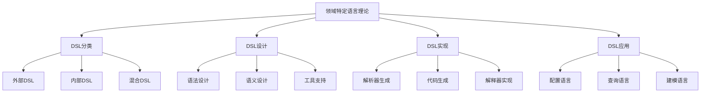

# 05-编程语言理论体系-领域特定语言理论

[返回主题树](../00-主题树与内容索引.md) | [主计划文档](../00-形式化架构理论统一计划.md) | [相关计划](../递归合并计划.md) | [返回上级](../README.md)

> 本文档为编程语言理论体系分支领域特定语言理论，所有最新进展与结论以主计划文档为准，历史细节归档于archive/。

## 目录

- [05-编程语言理论体系-领域特定语言理论](#05-编程语言理论体系-领域特定语言理论)
  - [目录](#目录)
  - [1. 概述](#1-概述)
    - [1.1 领域特定语言理论概述](#11-领域特定语言理论概述)
    - [1.2 核心目标](#12-核心目标)
    - [1.3 DSL层次结构](#13-dsl层次结构)
  - [2. 主要文件与内容索引](#2-主要文件与内容索引)
    - [2.1 核心文件](#21-核心文件)
    - [2.2 相关文件](#22-相关文件)
  - [3. DSL的基本定义与解释](#3-dsl的基本定义与解释)
    - [3.1 DSL的定义](#31-dsl的定义)
      - [3.1.1 领域特定](#311-领域特定)
      - [3.1.2 语言设计](#312-语言设计)
      - [3.1.3 工具支持](#313-工具支持)
  - [4. DSL的基础概念](#4-dsl的基础概念)
    - [4.1 DSL分类](#41-dsl分类)
      - [4.1.1 外部DSL](#411-外部dsl)
      - [4.1.2 内部DSL](#412-内部dsl)
      - [4.1.3 混合DSL](#413-混合dsl)
  - [5. DSL的主要理论](#5-dsl的主要理论)
    - [5.1 DSL设计](#51-dsl设计)
    - [5.2 DSL实现](#52-dsl实现)
    - [5.3 DSL应用](#53-dsl应用)
    - [5.4 DSL工具](#54-dsl工具)
  - [6. DSL的行业应用](#6-dsl的行业应用)
    - [6.1 业务建模](#61-业务建模)
    - [6.2 代码生成](#62-代码生成)
    - [6.3 配置管理](#63-配置管理)
  - [7. 发展历史](#7-发展历史)
  - [8. 应用领域](#8-应用领域)
  - [9. 总结](#9-总结)
  - [10. 相关性跳转与引用](#10-相关性跳转与引用)

## 1. 概述

### 1.1 领域特定语言理论概述

领域特定语言（Domain-Specific Language, DSL）理论是研究为特定领域设计专用语言的理论分支，为形式化架构理论提供了重要的语言设计方法。DSL理论不仅支撑语言设计，也是软件工程、业务建模等领域的重要理论基础。

### 1.2 核心目标

- 建立DSL设计的基本理论框架
- 提供领域语言设计的方法
- 支持业务建模和代码生成应用

### 1.3 DSL层次结构

## 2. 主要文件与内容索引

### 2.1 核心文件

- [领域特定语言理论.md](../Matter/ProgrammingLanguage/领域特定语言理论.md)
- [编程语言理论统一总论.md](00-编程语言理论统一总论.md)

### 2.2 相关文件

- [01-语法理论.md](01-语法理论.md)
- [02-语义理论.md](02-语义理论.md)
- [03-类型理论.md](03-类型理论.md)

## 3. DSL的基本定义与解释

### 3.1 DSL的定义

**定义 3.1.1** 领域特定语言（Domain-Specific Language, DSL）
DSL是为特定领域设计的专用编程语言。

#### 3.1.1 领域特定

**定义 3.1.2** 领域特定（Domain-Specific）
领域特定是指语言专门针对特定问题域设计。

**特点**：

- 专业化
- 简洁性
- 表达力

#### 3.1.2 语言设计

**定义 3.1.3** 语言设计（Language Design）
语言设计是DSL的核心设计过程。

**要素**：

- 语法设计
- 语义设计
- 工具支持

#### 3.1.3 工具支持

**定义 3.1.4** 工具支持（Tool Support）
工具支持是DSL实现和应用的技术支撑。

**工具**：

- 解析器生成器
- 代码生成器
- 开发环境

## 4. DSL的基础概念

### 4.1 DSL分类

#### 4.1.1 外部DSL

**类型 4.1.1** 外部DSL（External DSL）
外部DSL是独立于宿主语言的专用语言。

**特点**：

- 独立语法
- 专用解析器
- 代码生成

**示例**：

- SQL（数据库查询）
- XML（数据交换）
- YAML（配置）

#### 4.1.2 内部DSL

**类型 4.1.2** 内部DSL（Internal DSL）
内部DSL是嵌入在宿主语言中的专用语法。

**特点**：

- 利用宿主语言语法
- 库函数实现
- 类型安全

**示例**：

- LINQ（C#查询）
- jQuery（JavaScript）
- RSpec（Ruby测试）

#### 4.1.3 混合DSL

**类型 4.1.3** 混合DSL（Hybrid DSL）
混合DSL是结合外部和内部DSL特点的语言。

**特点**：

- 部分独立语法
- 部分嵌入语法
- 灵活实现

## 5. DSL的主要理论

### 5.1 DSL设计

**理论 5.1.1** DSL设计（DSL Design）
DSL设计是创建领域特定语言的理论和方法。

**设计原则**：

- 领域专注
- 简洁性
- 可读性
- 工具支持

### 5.2 DSL实现

**理论 5.2.1** DSL实现（DSL Implementation）
DSL实现是将DSL设计转换为可执行系统的过程。

**实现方法**：

- 解析器生成
- 代码生成
- 解释器实现

### 5.3 DSL应用

**理论 5.3.1** DSL应用（DSL Application）
DSL应用是DSL在实际项目中的使用。

**应用领域**：

- 配置语言
- 查询语言
- 建模语言

### 5.4 DSL工具

**理论 5.4.1** DSL工具（DSL Tools）
DSL工具是支持DSL开发和使用的软件工具。

**工具类型**：

- 语言工作台
- 解析器生成器
- 代码生成器

## 6. DSL的行业应用

### 6.1 业务建模

- 业务流程建模
- 业务规则建模
- 业务数据建模

### 6.2 代码生成

- 模板代码生成
- 配置代码生成
- 测试代码生成

### 6.3 配置管理

- 系统配置
- 应用配置
- 部署配置

## 7. 发展历史

DSL理论的发展经历了从简单脚本语言到现代领域特定语言的演进过程。从早期的配置文件到现代的DSL工作台，DSL理论不断丰富和发展。

## 8. 应用领域

DSL在软件工程、业务建模、系统配置、代码生成等领域有广泛应用，为现代软件开发提供了重要的语言设计方法。

## 9. 总结

DSL理论作为编程语言理论的重要分支，为形式化架构理论提供了重要的语言设计方法。DSL理论不仅支撑语言设计，也为现代软件开发提供了重要的理论基础。

## 10. 相关性跳转与引用

- [00-编程语言理论统一总论.md](00-编程语言理论统一总论.md)
- [01-语法理论.md](01-语法理论.md)
- [02-语义理论.md](02-语义理论.md)
- [03-类型理论.md](03-类型理论.md)
- [04-函数式编程理论.md](04-函数式编程理论.md)
- [05-面向对象编程理论.md](05-面向对象编程理论.md)
