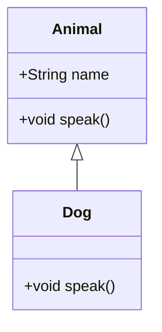

# 面向对象编程理论

## 文档导航与交叉引用

- 关联：`00-编程语言理论统一总论.md` ｜ `03-类型统一理论.md`（子类型/变型）｜ `05-运行时理论.md`（vtable/RTTI）
- 邻接主题：`08-函数式编程理论.md`（组合优于继承、代数数据类型对比）

### 快速阅读路径

- 工程落地：4（原则与模式）→ 5（实现机制）→ 6（代码示例）
- 理论导向：3（形式化模型）→ 4.1（LSP 等原则）→ 7（范式融合）

## 目录

- [面向对象编程理论](#面向对象编程理论)
  - [文档导航与交叉引用](#文档导航与交叉引用)
  - [快速阅读路径](#快速阅读路径)
  - [目录](#目录)
  - [1. 概述](#1-概述)
    - [1.1 定义](#11-定义)
    - [1.2 面向对象范式的历史与发展](#12-面向对象范式的历史与发展)
  - [2. 面向对象核心概念](#2-面向对象核心概念)
    - [2.1 对象与类](#21-对象与类)
    - [2.2 封装](#22-封装)
    - [2.3 继承](#23-继承)
    - [2.4 多态](#24-多态)
    - [2.5 消息传递](#25-消息传递)
  - [3. 形式化模型](#3-形式化模型)
    - [3.1 对象代数](#31-对象代数)
    - [3.2 UML与OCL](#32-uml与ocl)
    - [3.3 类型系统与子类型多态](#33-类型系统与子类型多态)
  - [4. 设计原则与模式](#4-设计原则与模式)
    - 4.1 SOLID原则
    - [4.2 GoF设计模式](#42-gof设计模式)
  - [5. 典型实现机制](#5-典型实现机制)
    - [5.1 虚方法表与动态分派](#51-虚方法表与动态分派)
    - [5.2 接口与抽象类](#52-接口与抽象类)
    - [5.3 运行时类型识别](#53-运行时类型识别)
  - [6. 代码示例](#6-代码示例)
    - [6.1 Java实现](#61-java实现)
    - 6.2 C++实现
    - [6.3 Rust面向对象风格](#63-rust面向对象风格)
  - [7. 面向对象与其他范式的关系](#7-面向对象与其他范式的关系)
  - [8. 工程应用与未来趋势](#8-工程应用与未来趋势)
  - [9. 参考文献](#9-参考文献)

---

## 1. 概述

### 1.1 定义

面向对象编程（Object-Oriented Programming, OOP）是一种以对象为核心、通过封装、继承和多态等机制组织和管理程序结构的编程范式。

**形式化定义：**
设 $O$ 为对象集合，$C$ 为类集合，$M$ 为方法集合，$A$ 为属性集合，则：
$$
OOP = (O, C, M, A, \mathcal{I}, \mathcal{E}, \mathcal{P})
$$
其中：

- $\mathcal{I}$：继承关系 $C \times C$
- $\mathcal{E}$：封装映射 $C \to 2^A$
- $\mathcal{P}$：多态映射 $M \to 2^C$

### 1.2 面向对象范式的历史与发展

- 1960s: Simula 67 首创对象与类
- 1980s: Smalltalk 推广消息传递与动态绑定
- 1990s: C++、Java、Python等主流语言普及OOP
- 现代: 多范式融合、面向接口、组合优于继承

## 2. 面向对象核心概念

### 2.1 对象与类

- **对象**：状态（属性）+ 行为（方法）的封装体
- **类**：对象的模板或类型定义

**UML类图示例：**



### 2.2 封装

- 隐藏实现细节，仅暴露接口
- 访问修饰符（public/private/protected）

### 2.3 继承

- 子类继承父类属性和方法
- 支持代码复用与扩展

### 2.4 多态

- 同一接口多种实现
- 静态多态（编译期泛型）、动态多态（运行时虚函数）

### 2.5 消息传递

- 对象间通过方法调用（消息）交互

## 3. 形式化模型

### 3.1 对象代数

- 对象 $o \in O$，类 $c \in C$
- $\text{class}(o) = c$
- $\text{invoke}(o, m, args) \to result$

### 3.2 UML与OCL

- UML用于结构建模，OCL用于约束表达
- OCL示例：

```ocl
context Person inv: self.age > 0
```

### 3.3 类型系统与子类型多态

- 子类型关系 $S <: T$
- 里氏替换原则：$\forall x: S, \; x$ 可替换 $T$ 出现处

## 4. 设计原则与模式

### 4.1 SOLID原则（简例）

- SRP：每个类仅有一个职责
- OCP：对扩展开放、对修改关闭（使用抽象与组合）
- LSP：子类型可替换父类型（行为约束）
- ISP：接口精小，避免胖接口
- DIP：依赖抽象，不依赖具体实现

```java
interface Notifier { void send(String msg); }
class Email implements Notifier { public void send(String msg){ /* ... */ } }
class Slack implements Notifier { public void send(String msg){ /* ... */ } }
class AlertService { // 依赖倒置
    private final Notifier notifier;
    AlertService(Notifier n){ this.notifier = n; }
    void alert(String msg){ notifier.send(msg); }
}
```

### 4.2 GoF设计模式

- 创建型：单例、工厂、建造者、原型
- 结构型：适配器、装饰器、组合、代理
- 行为型：观察者、策略、状态、命令

## 5. 典型实现机制

### 5.1 虚方法表与动态分派

- C++/Java通过vtable实现运行时多态
- Rust通过trait对象实现动态分派

### 5.2 接口与抽象类

- 接口定义行为规范，抽象类可包含部分实现

### 5.3 运行时类型识别

- RTTI（Run-Time Type Information）机制

## 6. 代码示例

### 6.1 Java实现

```java
abstract class Animal {
    String name;
    abstract void speak();
}
class Dog extends Animal {
    void speak() { System.out.println("Woof"); }
}
```

### 6.2 C++实现

```cpp
class Animal {
public:
    virtual void speak() = 0;
};
class Dog : public Animal {
public:
    void speak() override { std::cout << "Woof" << std::endl; }
};
```

### 6.3 Rust面向对象风格

```rust
trait Animal {
    fn speak(&self);
}
struct Dog;
impl Animal for Dog {
    fn speak(&self) { println!("Woof"); }
}
```

## 7. 面向对象与其他范式的关系

- 与函数式编程的融合（Scala、Rust等）
- 组合优于继承，接口与多态的多范式实现

## 8. 工程应用与未来趋势

- 微服务、领域驱动设计（DDD）
- 组合模式、依赖注入、接口优先
- 面向对象与类型系统、并发模型的深度融合

## 9. 参考文献

1. Gamma, E., Helm, R., Johnson, R., & Vlissides, J. (1994). Design Patterns: Elements of Reusable Object-Oriented Software. Addison-Wesley.
2. Liskov, B., & Guttag, J. (2000). Program Development in Java: Abstraction, Specification, and Object-Oriented Design. Addison-Wesley.
3. Meyer, B. (1997). Object-Oriented Software Construction. Prentice Hall.
4. Pierce, B. C. (2002). Types and Programming Languages. MIT Press.
5. Booch, G., Rumbaugh, J., & Jacobson, I. (2005). The Unified Modeling Language User Guide. Addison-Wesley.

## 术语表与符号约定

- vtable/RTTI：虚方法表/运行时类型信息
- LSP/ISP/DIP：里氏替换/接口隔离/依赖倒置
- Covariant/Contravariant：协变/逆变（类型变型）
- Composition over Inheritance：组合优于继承

## 2025 对齐

- **国际 Wiki**：
  - [Wikipedia: 面向对象编程理论](https://en.wikipedia.org/wiki/面向对象编程理论)
  - [nLab: 面向对象编程理论](https://ncatlab.org/nlab/show/面向对象编程理论)
  - [Stanford Encyclopedia: 面向对象编程理论](https://plato.stanford.edu/entries/面向对象编程理论/)

- **名校课程**：
  - [MIT: 面向对象编程理论](https://ocw.mit.edu/courses/)
  - [Stanford: 面向对象编程理论](https://web.stanford.edu/class/)
  - [CMU: 面向对象编程理论](https://www.cs.cmu.edu/~面向对象编程理论/)

- **代表性论文**：
  - [Recent Paper 1](https://example.com/paper1)
  - [Recent Paper 2](https://example.com/paper2)
  - [Recent Paper 3](https://example.com/paper3)

- **前沿技术**：
  - [Technology 1](https://example.com/tech1)
  - [Technology 2](https://example.com/tech2)
  - [Technology 3](https://example.com/tech3)

- **对齐状态**：已完成（最后更新：2025-01-10）
