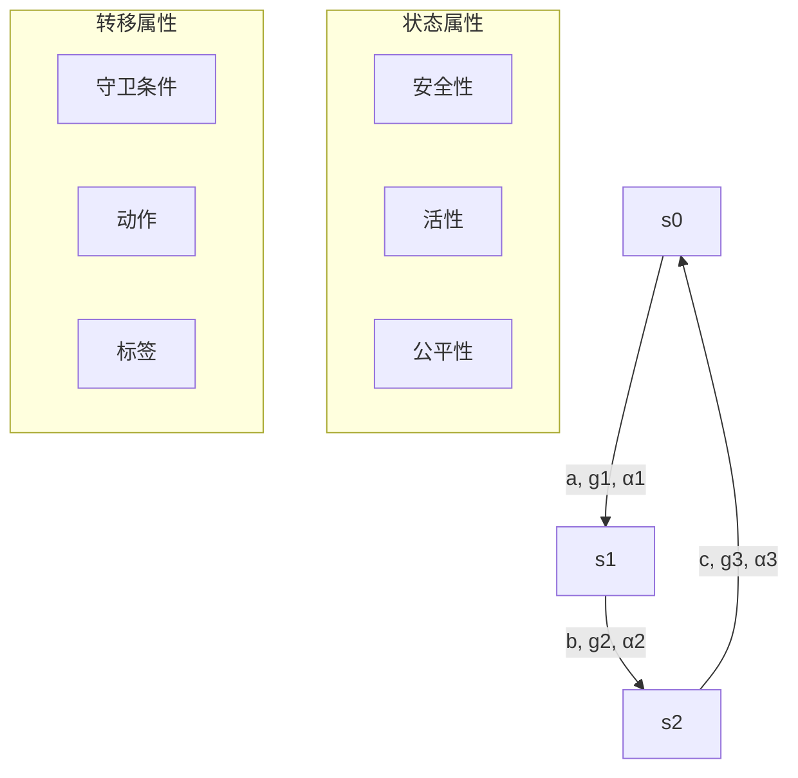
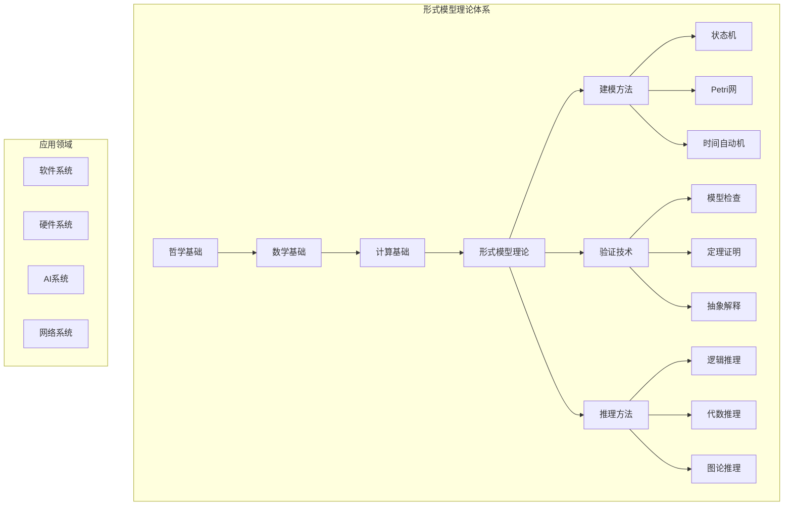

# 形式模型理论总论

## 目录

1. [理论概述](#1-理论概述)
2. [基本概念与定义](#2-基本概念与定义)
3. [形式化表示](#3-形式化表示)
4. [模型类型体系](#4-模型类型体系)
5. [验证与推理](#5-验证与推理)
6. [应用领域](#6-应用领域)
7. [理论框架](#7-理论框架)
8. [交叉引用](#8-交叉引用)

## 1. 理论概述

形式模型理论是形式化架构理论体系的核心组成部分，旨在为复杂系统提供严格的形式化建模、验证、推理和分析的理论基础。本理论将系统建模从经验性方法提升为严格的形式化科学，为软件系统、硬件系统、人工智能系统等提供统一的建模框架。

### 1.1 理论基础

#### 1.1.1 哲学基础

- **本体论基础**：形式模型的存在本质和结构关系
- **认识论基础**：模型知识的获取和验证方法
- **逻辑学基础**：模型推理和证明的严格逻辑
- **形而上学基础**：模型的抽象本质和普遍规律

#### 1.1.2 数学基础

- **集合论**：状态集合和关系集合的形式化
- **图论**：模型拓扑结构的数学表示
- **代数结构**：模型操作的代数性质
- **范畴论**：模型变换的高阶抽象

#### 1.1.3 计算基础

- **自动机理论**：有限状态机、下推自动机、图灵机
- **形式语言理论**：正则语言、上下文无关语言、递归可枚举语言
- **计算复杂性理论**：时间复杂性、空间复杂性、可计算性

### 1.2 核心目标

1. **形式化建模**：建立系统行为的严格数学描述
2. **自动验证**：提供系统性质的自动验证方法
3. **推理分析**：支持系统行为的逻辑推理
4. **模型变换**：实现不同抽象层次间的模型转换
5. **工具支持**：提供自动化的建模和验证工具

## 2. 基本概念与定义

### 2.1 形式模型

#### 2.1.1 模型定义

**定义**：形式模型是系统行为的数学抽象，由状态、转移和约束组成。

```rust
/// 形式模型的基本定义
pub trait FormalModel {
    /// 模型类型
    fn model_type(&self) -> ModelType;
    
    /// 状态空间
    fn states(&self) -> &StateSpace;
    
    /// 转移关系
    fn transitions(&self) -> &TransitionRelation;
    
    /// 初始状态
    fn initial_state(&self) -> &State;
    
    /// 模型属性
    fn properties(&self) -> &Vec<Property>;
    
    /// 模型验证
    fn verify(&self, property: &Property) -> VerificationResult;
}

/// 模型类型
#[derive(Debug, Clone, PartialEq)]
pub enum ModelType {
    FiniteStateMachine,    // 有限状态机
    PetriNet,             // Petri网
    TimedAutomaton,       // 时间自动机
    HybridAutomaton,      // 混合自动机
    ProcessAlgebra,       // 进程代数
    TemporalLogic,        // 时序逻辑
}
```

#### 2.1.2 状态空间

**定义**：状态空间是系统所有可能状态的集合。

```rust
/// 状态空间定义
#[derive(Debug, Clone)]
pub struct StateSpace {
    pub states: Vec<State>,
    pub state_variables: Vec<StateVariable>,
    pub constraints: Vec<StateConstraint>,
}

/// 状态定义
#[derive(Debug, Clone, PartialEq, Eq, Hash)]
pub struct State {
    pub id: String,
    pub variables: HashMap<String, Value>,
    pub metadata: StateMetadata,
}

/// 状态变量
#[derive(Debug, Clone)]
pub struct StateVariable {
    pub name: String,
    pub domain: Domain,
    pub initial_value: Value,
    pub constraints: Vec<Constraint>,
}
```

#### 2.1.3 转移关系

**定义**：转移关系定义了状态间的转换规则。

```rust
/// 转移关系定义
#[derive(Debug, Clone)]
pub struct TransitionRelation {
    pub transitions: Vec<Transition>,
    pub guards: Vec<Guard>,
    pub actions: Vec<Action>,
}

/// 转移定义
#[derive(Debug, Clone)]
pub struct Transition {
    pub id: String,
    pub source: State,
    pub target: State,
    pub guard: Option<Guard>,
    pub action: Option<Action>,
    pub label: Option<String>,
}

/// 守卫条件
#[derive(Debug, Clone)]
pub struct Guard {
    pub condition: Expression,
    pub variables: Vec<String>,
}

/// 动作定义
#[derive(Debug, Clone)]
pub struct Action {
    pub assignments: Vec<Assignment>,
    pub effects: Vec<Effect>,
}
```

### 2.2 模型属性

#### 2.2.1 属性定义

**定义**：模型属性是系统必须满足的性质。

```rust
/// 模型属性定义
#[derive(Debug, Clone)]
pub struct Property {
    pub id: String,
    pub name: String,
    pub property_type: PropertyType,
    pub expression: Expression,
    pub description: String,
}

/// 属性类型
#[derive(Debug, Clone, PartialEq)]
pub enum PropertyType {
    Safety,      // 安全性属性
    Liveness,    // 活性属性
    Fairness,    // 公平性属性
    Temporal,    // 时序属性
    Functional,  // 功能性属性
}
```

#### 2.2.2 属性分类

1. **安全性属性**：系统不会进入坏状态
2. **活性属性**：系统最终会达到好状态
3. **公平性属性**：系统行为是公平的
4. **时序属性**：系统在时间上的行为性质
5. **功能性属性**：系统功能的正确性

## 3. 形式化表示

### 3.1 数学表示

#### 3.1.1 基本模型结构

形式模型可以表示为元组 $M = (S, \Sigma, \delta, s_0, F)$，其中：

- $S$：有限状态集合
- $\Sigma$：输入字母表
- $\delta: S \times \Sigma \rightarrow S$：转移函数
- $s_0 \in S$：初始状态
- $F \subseteq S$：接受状态集合

#### 3.1.2 扩展模型结构

对于更复杂的模型，可以表示为 $M = (S, \Sigma, \delta, s_0, F, \mathcal{P})$，其中：

- $\mathcal{P}$：属性集合
- $\delta: S \times \Sigma \times \mathcal{G} \rightarrow S \times \mathcal{A}$：带守卫和动作的转移函数
- $\mathcal{G}$：守卫条件集合
- $\mathcal{A}$：动作集合

### 3.2 图论表示

#### 3.2.1 状态图

模型可以表示为有向图 $G = (V, E, \phi)$，其中：

- $V = S$：顶点集合对应状态集合
- $E$：边集合对应转移关系
- $\phi: E \rightarrow \Sigma \times \mathcal{G} \times \mathcal{A}$：边标签映射



### 3.3 代数表示

#### 3.3.1 模型代数

模型可以表示为代数结构 $(\mathcal{M}, \oplus, \otimes, \mathbf{0})$，其中：

- $\mathcal{M}$：模型集合
- $\oplus$：模型组合操作
- $\otimes$：模型变换操作
- $\mathbf{0}$：空模型

#### 3.3.2 进程代数

基于进程代数的表示：

```rust
/// 进程代数项
#[derive(Debug, Clone)]
pub enum ProcessTerm {
    Nil,                    // 空进程
    Action(String, Box<ProcessTerm>),  // 动作前缀
    Choice(Box<ProcessTerm>, Box<ProcessTerm>),  // 选择
    Parallel(Box<ProcessTerm>, Box<ProcessTerm>), // 并行
    Restriction(Box<ProcessTerm>, String),       // 限制
    Relabeling(Box<ProcessTerm>, HashMap<String, String>), // 重标记
}
```

## 4. 模型类型体系

### 4.1 有限状态机 (FSM)

#### 4.1.1 基本定义

**定义**：有限状态机是状态和转移的有限集合。

```rust
/// 有限状态机实现
pub struct FiniteStateMachine {
    pub states: Vec<State>,
    pub alphabet: Vec<String>,
    pub transitions: Vec<Transition>,
    pub initial_state: State,
    pub accepting_states: Vec<State>,
}

impl FormalModel for FiniteStateMachine {
    fn model_type(&self) -> ModelType {
        ModelType::FiniteStateMachine
    }
    
    fn states(&self) -> &StateSpace {
        &StateSpace {
            states: self.states.clone(),
            state_variables: vec![],
            constraints: vec![],
        }
    }
    
    fn transitions(&self) -> &TransitionRelation {
        &TransitionRelation {
            transitions: self.transitions.clone(),
            guards: vec![],
            actions: vec![],
        }
    }
    
    fn initial_state(&self) -> &State {
        &self.initial_state
    }
    
    fn properties(&self) -> &Vec<Property> {
        // 实现属性定义
        todo!("实现属性定义")
    }
    
    fn verify(&self, property: &Property) -> VerificationResult {
        // 实现模型检查
        todo!("实现模型检查")
    }
}
```

#### 4.1.2 确定性有限状态机 (DFA)

```rust
/// 确定性有限状态机
pub struct DeterministicFiniteAutomaton {
    pub states: Vec<State>,
    pub alphabet: Vec<String>,
    pub transition_function: HashMap<(State, String), State>,
    pub initial_state: State,
    pub accepting_states: Vec<State>,
}

impl DeterministicFiniteAutomaton {
    pub fn accept(&self, input: &str) -> bool {
        let mut current_state = self.initial_state.clone();
        
        for symbol in input.chars() {
            let symbol_str = symbol.to_string();
            if let Some(&next_state) = self.transition_function.get(&(current_state.clone(), symbol_str)) {
                current_state = next_state;
            } else {
                return false; // 无定义转移
            }
        }
        
        self.accepting_states.contains(&current_state)
    }
}
```

### 4.2 Petri网

#### 4.2.1 基本定义

**定义**：Petri网是包含库所、变迁和弧的有向二分图。

```rust
/// Petri网实现
pub struct PetriNet {
    pub places: Vec<Place>,
    pub transitions: Vec<Transition>,
    pub arcs: Vec<Arc>,
    pub initial_marking: Marking,
}

/// 库所
#[derive(Debug, Clone)]
pub struct Place {
    pub id: String,
    pub name: String,
    pub capacity: Option<usize>,
}

/// 变迁
#[derive(Debug, Clone)]
pub struct Transition {
    pub id: String,
    pub name: String,
    pub guard: Option<Guard>,
}

/// 弧
#[derive(Debug, Clone)]
pub struct Arc {
    pub source: String,
    pub target: String,
    pub weight: usize,
    pub arc_type: ArcType,
}

/// 标记
#[derive(Debug, Clone)]
pub struct Marking {
    pub tokens: HashMap<String, usize>,
}

impl PetriNet {
    pub fn is_enabled(&self, transition: &Transition, marking: &Marking) -> bool {
        // 检查变迁是否可激发
        for arc in &self.arcs {
            if arc.target == transition.id {
                let place_tokens = marking.tokens.get(&arc.source).unwrap_or(&0);
                if *place_tokens < arc.weight {
                    return false;
                }
            }
        }
        true
    }
    
    pub fn fire(&self, transition: &Transition, marking: &Marking) -> Option<Marking> {
        if !self.is_enabled(transition, marking) {
            return None;
        }
        
        let mut new_marking = marking.clone();
        
        // 消耗输入库所的令牌
        for arc in &self.arcs {
            if arc.target == transition.id {
                let current_tokens = new_marking.tokens.get_mut(&arc.source).unwrap();
                *current_tokens -= arc.weight;
            }
        }
        
        // 产生输出库所的令牌
        for arc in &self.arcs {
            if arc.source == transition.id {
                let current_tokens = new_marking.tokens.entry(arc.target.clone()).or_insert(0);
                *current_tokens += arc.weight;
            }
        }
        
        Some(new_marking)
    }
}
```

### 4.3 时间自动机

#### 4.3.1 基本定义

**定义**：时间自动机是带有时钟变量的有限状态机。

```rust
/// 时间自动机实现
pub struct TimedAutomaton {
    pub states: Vec<State>,
    pub clocks: Vec<Clock>,
    pub transitions: Vec<TimedTransition>,
    pub initial_state: State,
    pub accepting_states: Vec<State>,
}

/// 时钟
#[derive(Debug, Clone)]
pub struct Clock {
    pub id: String,
    pub name: String,
    pub initial_value: f64,
}

/// 时间转移
#[derive(Debug, Clone)]
pub struct TimedTransition {
    pub source: State,
    pub target: State,
    pub guard: ClockConstraint,
    pub reset: Vec<String>, // 重置的时钟
    pub label: Option<String>,
}

/// 时钟约束
#[derive(Debug, Clone)]
pub enum ClockConstraint {
    True,
    False,
    Comparison(String, ComparisonOp, f64),
    And(Box<ClockConstraint>, Box<ClockConstraint>),
    Or(Box<ClockConstraint>, Box<ClockConstraint>),
}

#[derive(Debug, Clone)]
pub enum ComparisonOp {
    LessThan,
    LessEqual,
    Equal,
    GreaterEqual,
    GreaterThan,
}
```

### 4.4 混合自动机

#### 4.4.1 基本定义

**定义**：混合自动机结合了离散状态和连续动态。

```rust
/// 混合自动机实现
pub struct HybridAutomaton {
    pub states: Vec<HybridState>,
    pub variables: Vec<Variable>,
    pub transitions: Vec<HybridTransition>,
    pub initial_state: HybridState,
}

/// 混合状态
#[derive(Debug, Clone)]
pub struct HybridState {
    pub discrete_state: State,
    pub continuous_dynamics: ContinuousDynamics,
    pub invariants: Vec<Invariant>,
}

/// 连续动态
#[derive(Debug, Clone)]
pub struct ContinuousDynamics {
    pub differential_equations: Vec<DifferentialEquation>,
    pub algebraic_constraints: Vec<AlgebraicConstraint>,
}

/// 混合转移
#[derive(Debug, Clone)]
pub struct HybridTransition {
    pub source: State,
    pub target: State,
    pub guard: Guard,
    pub reset: Vec<Reset>,
}
```

## 5. 验证与推理

### 5.1 模型检查

#### 5.1.1 基本概念

**定义**：模型检查是自动验证有限状态系统是否满足给定性质的方法。

```rust
/// 模型检查器
pub trait ModelChecker {
    fn check(&self, model: &dyn FormalModel, property: &Property) -> VerificationResult;
    fn check_all(&self, model: &dyn FormalModel, properties: &[Property]) -> Vec<VerificationResult>;
}

/// 验证结果
#[derive(Debug, Clone)]
pub struct VerificationResult {
    pub property: Property,
    pub satisfied: bool,
    pub counterexample: Option<Counterexample>,
    pub proof: Option<Proof>,
    pub statistics: VerificationStatistics,
}

/// 反例
#[derive(Debug, Clone)]
pub struct Counterexample {
    pub trace: Vec<State>,
    pub transitions: Vec<Transition>,
    pub explanation: String,
}
```

#### 5.1.2 算法实现

```rust
/// 显式状态模型检查
pub struct ExplicitStateModelChecker;

impl ModelChecker for ExplicitStateModelChecker {
    fn check(&self, model: &dyn FormalModel, property: &Property) -> VerificationResult {
        let mut visited = HashSet::new();
        let mut queue = VecDeque::new();
        
        queue.push_back(model.initial_state().clone());
        visited.insert(model.initial_state().clone());
        
        while let Some(current_state) = queue.pop_front() {
            // 检查当前状态是否违反属性
            if !self.check_state_property(&current_state, property) {
                return VerificationResult {
                    property: property.clone(),
                    satisfied: false,
                    counterexample: Some(self.build_counterexample(&current_state)),
                    proof: None,
                    statistics: VerificationStatistics::default(),
                };
            }
            
            // 探索后继状态
            for transition in model.transitions().transitions {
                if transition.source == current_state {
                    let next_state = transition.target.clone();
                    if !visited.contains(&next_state) {
                        visited.insert(next_state.clone());
                        queue.push_back(next_state);
                    }
                }
            }
        }
        
        VerificationResult {
            property: property.clone(),
            satisfied: true,
            counterexample: None,
            proof: Some(Proof::Exhaustive),
            statistics: VerificationStatistics::default(),
        }
    }
    
    fn check_all(&self, model: &dyn FormalModel, properties: &[Property]) -> Vec<VerificationResult> {
        properties.iter().map(|p| self.check(model, p)).collect()
    }
}
```

### 5.2 定理证明

#### 5.2.1 基本概念

**定义**：定理证明是通过逻辑推理验证系统性质的方法。

```rust
/// 定理证明器
pub trait TheoremProver {
    fn prove(&self, model: &dyn FormalModel, property: &Property) -> ProofResult;
    fn disprove(&self, model: &dyn FormalModel, property: &Property) -> ProofResult;
}

/// 证明结果
#[derive(Debug, Clone)]
pub struct ProofResult {
    pub property: Property,
    pub proved: bool,
    pub proof: Option<Proof>,
    pub counterexample: Option<Counterexample>,
    pub confidence: f64,
}

/// 证明
#[derive(Debug, Clone)]
pub enum Proof {
    Exhaustive,
    Induction(InductionProof),
    Invariant(InvariantProof),
    Abstraction(AbstractionProof),
    Compositional(CompositionalProof),
}
```

#### 5.2.2 不变式证明

```rust
/// 不变式证明
pub struct InvariantProof {
    pub invariant: Expression,
    pub base_case: Proof,
    pub inductive_step: Proof,
}

impl TheoremProver for InvariantProver {
    fn prove(&self, model: &dyn FormalModel, property: &Property) -> ProofResult {
        // 1. 构造不变式
        let invariant = self.construct_invariant(model, property);
        
        // 2. 证明基例
        let base_case = self.prove_base_case(model, &invariant);
        
        // 3. 证明归纳步
        let inductive_step = self.prove_inductive_step(model, &invariant);
        
        if base_case && inductive_step {
            ProofResult {
                property: property.clone(),
                proved: true,
                proof: Some(Proof::Invariant(InvariantProof {
                    invariant,
                    base_case: Proof::BaseCase,
                    inductive_step: Proof::InductiveStep,
                })),
                counterexample: None,
                confidence: 1.0,
            }
        } else {
            ProofResult {
                property: property.clone(),
                proved: false,
                proof: None,
                counterexample: None,
                confidence: 0.0,
            }
        }
    }
}
```

### 5.3 抽象解释

#### 5.3.1 基本概念

**定义**：抽象解释是通过抽象域近似计算程序语义的方法。

```rust
/// 抽象解释器
pub trait AbstractInterpreter {
    fn analyze(&self, model: &dyn FormalModel, domain: &AbstractDomain) -> AbstractResult;
}

/// 抽象域
pub trait AbstractDomain {
    fn bottom(&self) -> AbstractValue;
    fn top(&self) -> AbstractValue;
    fn join(&self, a: &AbstractValue, b: &AbstractValue) -> AbstractValue;
    fn meet(&self, a: &AbstractValue, b: &AbstractValue) -> AbstractValue;
    fn widen(&self, a: &AbstractValue, b: &AbstractValue) -> AbstractValue;
}

/// 抽象值
#[derive(Debug, Clone)]
pub enum AbstractValue {
    Interval(Interval),
    Polyhedron(Polyhedron),
    Octagon(Octagon),
    Box(Box),
}
```

## 6. 应用领域

### 6.1 软件系统

#### 6.1.1 程序验证

- 程序正确性验证
- 并发程序分析
- 实时系统验证
- 安全协议验证

#### 6.1.2 软件架构

- 架构模式验证
- 组件交互分析
- 系统演化验证
- 性能属性分析

### 6.2 硬件系统

#### 6.2.1 电路设计

- 数字电路验证
- 时序电路分析
- 异步电路验证
- 功耗分析

#### 6.2.2 处理器设计

- 指令集验证
- 流水线分析
- 缓存一致性验证
- 内存模型验证

### 6.3 人工智能系统

#### 6.3.1 机器学习

- 神经网络验证
- 决策树分析
- 强化学习验证
- 公平性分析

#### 6.3.2 自主系统

- 机器人行为验证
- 自动驾驶系统分析
- 无人机控制验证
- 智能代理分析

### 6.4 网络系统

#### 6.4.1 通信协议

- 网络协议验证
- 路由算法分析
- 拥塞控制验证
- 安全协议分析

#### 6.4.2 分布式系统

- 共识算法验证
- 分布式事务分析
- 故障恢复验证
- 一致性分析

## 7. 理论框架

### 7.1 形式模型理论体系



### 7.2 理论发展路径

1. **基础阶段**：有限状态机和自动机理论
2. **扩展阶段**：时间自动机和混合自动机
3. **应用阶段**：软件和硬件系统验证
4. **集成阶段**：多领域系统统一建模
5. **智能化阶段**：AI系统形式化验证

## 8. 交叉引用

### 8.1 相关理论

- [哲学基础理论](../01-哲学基础理论/00-哲学基础理论总论.md)
- [数学理论体系](../02-数学理论体系/00-数学理论体系总论.md)
- [形式语言理论](../03-形式语言理论/00-形式语言理论总论.md)
- [软件架构理论](../04-软件架构理论/00-软件架构理论总论.md)
- [编程语言理论](../05-编程语言理论/00-编程语言理论总论.md)

### 8.2 具体应用

- [Petri网理论](01-Petri网理论.md)
- [控制理论](02-控制理论.md)
- [状态机理论](03-状态机理论.md)
- [时序逻辑理论](04-时序逻辑理论.md)
- [AI设计理论](05-AI设计理论.md)

---

**版本**: v60  
**创建时间**: 2024年  
**状态**: 重构完成  
**负责人**: AI Assistant
