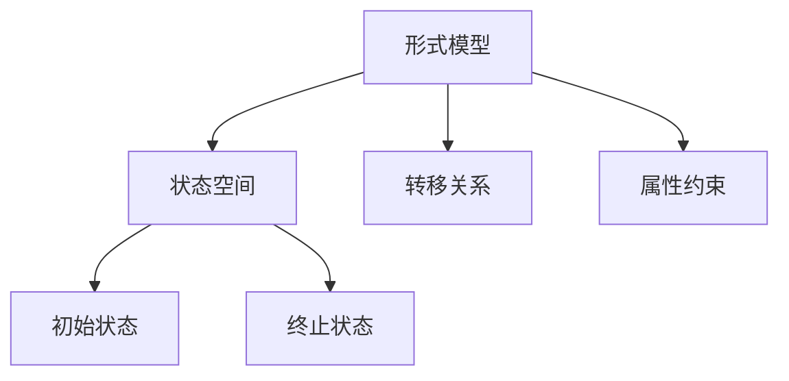

# 形式模型理论总论

## 1. 理论框架

形式模型理论是形式化架构体系的核心，涵盖系统建模、验证、推理与分析等内容。其目标是为复杂系统提供可验证、可推理、可自动化分析的理论基础。

### 1.1 理论基础

- 数学模型：集合论、图论、代数结构
- 逻辑基础：命题逻辑、时序逻辑、模态逻辑
- 计算模型：自动机、Petri网、状态机

### 1.2 主要内容

- 形式化建模方法
- 形式化验证与推理
- 形式模型与软件架构结合

## 2. 基本概念

### 2.1 形式系统

```rust
pub trait FormalSystem {
    fn states(&self) -> Vec<State>;
    fn transitions(&self) -> Vec<Transition>;
    fn initial_state(&self) -> State;
    fn is_valid(&self, state: &State) -> bool;
}
```

### 2.2 形式化验证

```rust
pub trait ModelChecker {
    fn check(&self, model: &dyn FormalSystem, property: &Property) -> bool;
}
```

## 3. 形式化表示

### 3.1 模型结构图



### 3.2 数学表示

形式模型可定义为 $M = (S, T, s_0, P)$，其中：

- $S$：状态集合
- $T$：转移关系
- $s_0$：初始状态
- $P$：性质约束

## 4. 应用领域

- 软件架构建模与分析
- 协议与流程验证
- 安全性与可靠性分析
- 智能系统与AI推理

## 5. 交叉引用

- [哲学基础理论](../01-哲学基础理论/00-哲学基础理论总论.md)
- [数学理论体系](../02-数学理论体系/00-数学理论体系总论.md)
- [形式语言理论](../03-形式语言理论/00-形式语言理论总论.md)
- [软件架构理论](../04-软件架构理论/00-软件架构理论总论.md)
- [理论统一与整合](../07-理论统一与整合/00-理论统一与整合总论.md)

## 6. 导航

- [Petri网理论](01-Petri网理论.md)
- [控制理论](02-控制理论.md)
- [状态机理论](03-状态机理论.md)
- [时序逻辑理论](04-时序逻辑理论.md)
- [AI设计理论](05-AI设计理论.md)
