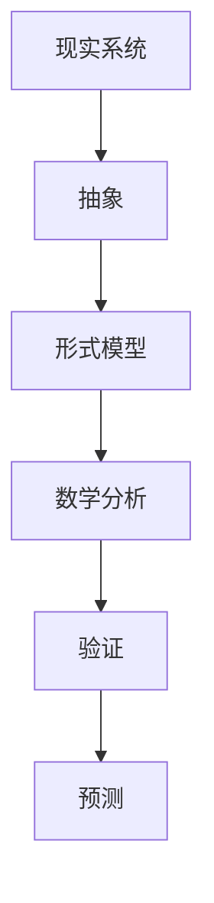

# 01-形式模型基础理论

## 目录

1. [1.0 形式模型概述](#10-形式模型概述)
2. [2.0 模型分类](#20-模型分类)
3. [3.0 数学基础](#30-数学基础)
4. [4.0 模型表示](#40-模型表示)
5. [5.0 模型验证](#50-模型验证)

## 1.0 形式模型概述

**定义 1.1 (形式模型)**
形式模型是对现实世界系统或概念的抽象数学表示，用于描述、分析和预测系统行为。

**定义 1.2 (形式化)**
使用精确的数学语言描述系统，消除歧义和不确定性。



## 2.0 模型分类

### 2.1 按领域分类

**分类 2.1.1 (计算模型)**
描述计算过程和算法的模型。

**分类 2.1.2 (系统模型)**
描述复杂系统行为的模型。

**分类 2.1.3 (认知模型)**
描述人类认知过程的模型。

```rust
// 模型分类的Rust实现
#[derive(Debug, Clone)]
pub enum ModelType {
    Computational(ComputationalModel),
    System(SystemModel),
    Cognitive(CognitiveModel),
    Mathematical(MathematicalModel),
}

#[derive(Debug, Clone)]
pub struct ComputationalModel {
    model_type: String,
    complexity: Complexity,
    algorithms: Vec<Algorithm>,
}

#[derive(Debug, Clone)]
pub struct SystemModel {
    components: Vec<Component>,
    interactions: Vec<Interaction>,
    dynamics: Dynamics,
}

#[derive(Debug, Clone)]
pub struct CognitiveModel {
    processes: Vec<CognitiveProcess>,
    memory: MemoryModel,
    reasoning: ReasoningModel,
}

#[derive(Debug, Clone)]
pub struct MathematicalModel {
    equations: Vec<Equation>,
    variables: Vec<Variable>,
    constraints: Vec<Constraint>,
}

#[derive(Debug, Clone)]
pub enum Complexity {
    Constant,
    Linear,
    Polynomial,
    Exponential,
}

#[derive(Debug, Clone)]
pub struct Algorithm {
    name: String,
    complexity: Complexity,
    description: String,
}

#[derive(Debug, Clone)]
pub struct Component {
    id: String,
    behavior: Behavior,
    interface: Interface,
}

#[derive(Debug, Clone)]
pub struct Interaction {
    source: String,
    target: String,
    protocol: Protocol,
}

#[derive(Debug, Clone)]
pub struct Dynamics {
    evolution_rule: EvolutionRule,
    stability: Stability,
}

#[derive(Debug, Clone)]
pub struct CognitiveProcess {
    name: String,
    input: Vec<String>,
    output: Vec<String>,
    mechanism: String,
}

#[derive(Debug, Clone)]
pub struct MemoryModel {
    capacity: usize,
    access_time: f64,
    organization: String,
}

#[derive(Debug, Clone)]
pub struct ReasoningModel {
    logic_type: String,
    inference_rules: Vec<String>,
    uncertainty: f64,
}

#[derive(Debug, Clone)]
pub struct Equation {
    left_side: String,
    right_side: String,
    domain: String,
}

#[derive(Debug, Clone)]
pub struct Variable {
    name: String,
    type_info: String,
    domain: String,
}

#[derive(Debug, Clone)]
pub struct Constraint {
    condition: String,
    variables: Vec<String>,
}

#[derive(Debug, Clone)]
pub struct Behavior {
    description: String,
    parameters: Vec<Parameter>,
}

#[derive(Debug, Clone)]
pub struct Interface {
    inputs: Vec<Port>,
    outputs: Vec<Port>,
}

#[derive(Debug, Clone)]
pub struct Port {
    name: String,
    data_type: String,
    direction: Direction,
}

#[derive(Debug, Clone)]
pub enum Direction {
    Input,
    Output,
    Bidirectional,
}

#[derive(Debug, Clone)]
pub struct Protocol {
    name: String,
    rules: Vec<String>,
}

#[derive(Debug, Clone)]
pub struct EvolutionRule {
    rule: String,
    conditions: Vec<String>,
}

#[derive(Debug, Clone)]
pub struct Stability {
    stable: bool,
    criteria: Vec<String>,
}

#[derive(Debug, Clone)]
pub struct Parameter {
    name: String,
    value: f64,
    unit: String,
}
```

### 2.2 按抽象层次分类

**分类 2.2.1 (概念模型)**
高层抽象，描述系统的基本概念和关系。

**分类 2.2.2 (逻辑模型)**
中层抽象，描述系统的逻辑结构和行为。

**分类 2.2.3 (物理模型)**
低层抽象，描述系统的具体实现细节。

```rust
// 抽象层次分类
#[derive(Debug, Clone)]
pub enum AbstractionLevel {
    Conceptual(ConceptualModel),
    Logical(LogicalModel),
    Physical(PhysicalModel),
}

#[derive(Debug, Clone)]
pub struct ConceptualModel {
    concepts: Vec<Concept>,
    relationships: Vec<Relationship>,
    domain: String,
}

#[derive(Debug, Clone)]
pub struct LogicalModel {
    entities: Vec<Entity>,
    operations: Vec<Operation>,
    constraints: Vec<LogicalConstraint>,
}

#[derive(Debug, Clone)]
pub struct PhysicalModel {
    components: Vec<PhysicalComponent>,
    connections: Vec<Connection>,
    implementation: Implementation,
}

#[derive(Debug, Clone)]
pub struct Concept {
    name: String,
    definition: String,
    attributes: Vec<Attribute>,
}

#[derive(Debug, Clone)]
pub struct Relationship {
    source: String,
    target: String,
    relationship_type: String,
    cardinality: String,
}

#[derive(Debug, Clone)]
pub struct Entity {
    name: String,
    attributes: Vec<Attribute>,
    methods: Vec<Method>,
}

#[derive(Debug, Clone)]
pub struct Operation {
    name: String,
    inputs: Vec<Parameter>,
    outputs: Vec<Parameter>,
    logic: String,
}

#[derive(Debug, Clone)]
pub struct LogicalConstraint {
    condition: String,
    description: String,
}

#[derive(Debug, Clone)]
pub struct PhysicalComponent {
    name: String,
    technology: String,
    specifications: Vec<Specification>,
}

#[derive(Debug, Clone)]
pub struct Connection {
    source: String,
    target: String,
    protocol: String,
    bandwidth: f64,
}

#[derive(Debug, Clone)]
pub struct Implementation {
    language: String,
    platform: String,
    dependencies: Vec<String>,
}

#[derive(Debug, Clone)]
pub struct Attribute {
    name: String,
    data_type: String,
    default_value: Option<String>,
}

#[derive(Debug, Clone)]
pub struct Method {
    name: String,
    signature: String,
    implementation: String,
}

#[derive(Debug, Clone)]
pub struct Specification {
    name: String,
    value: String,
    unit: String,
}
```

## 3.0 数学基础

### 3.1 集合论基础

**定义 3.1.1 (集合)**
集合是不同对象的无序集合。

**定义 3.1.2 (关系)**
关系是集合之间的映射。

```rust
// 集合论基础实现
use std::collections::HashSet;

pub struct SetTheory {
    sets: HashMap<String, HashSet<String>>,
    relations: Vec<Relation>,
}

#[derive(Debug, Clone)]
pub struct Relation {
    domain: String,
    codomain: String,
    mapping: Vec<(String, String)>,
}

impl SetTheory {
    pub fn new() -> Self {
        Self {
            sets: HashMap::new(),
            relations: Vec::new(),
        }
    }
    
    pub fn create_set(&mut self, name: String, elements: Vec<String>) {
        let set: HashSet<String> = elements.into_iter().collect();
        self.sets.insert(name, set);
    }
    
    pub fn union(&self, set1: &str, set2: &str) -> Option<HashSet<String>> {
        let set1_elements = self.sets.get(set1)?;
        let set2_elements = self.sets.get(set2)?;
        Some(set1_elements.union(set2_elements).cloned().collect())
    }
    
    pub fn intersection(&self, set1: &str, set2: &str) -> Option<HashSet<String>> {
        let set1_elements = self.sets.get(set1)?;
        let set2_elements = self.sets.get(set2)?;
        Some(set1_elements.intersection(set2_elements).cloned().collect())
    }
    
    pub fn add_relation(&mut self, relation: Relation) {
        self.relations.push(relation);
    }
    
    pub fn is_function(&self, relation: &Relation) -> bool {
        let mut domain_values: HashSet<String> = HashSet::new();
        for (domain_val, _) in &relation.mapping {
            if !domain_values.insert(domain_val.clone()) {
                return false; // 不是函数，因为有重复的域值
            }
        }
        true
    }
}
```

### 3.2 图论基础

**定义 3.2.1 (图)**
图是由顶点和边组成的数学结构。

**定义 3.2.2 (路径)**
路径是图中连接顶点的边序列。

```rust
// 图论基础实现
use std::collections::{HashMap, HashSet};

#[derive(Debug, Clone)]
pub struct Graph {
    vertices: HashSet<String>,
    edges: Vec<Edge>,
    adjacency_list: HashMap<String, Vec<String>>,
}

#[derive(Debug, Clone)]
pub struct Edge {
    source: String,
    target: String,
    weight: Option<f64>,
}

impl Graph {
    pub fn new() -> Self {
        Self {
            vertices: HashSet::new(),
            edges: Vec::new(),
            adjacency_list: HashMap::new(),
        }
    }
    
    pub fn add_vertex(&mut self, vertex: String) {
        self.vertices.insert(vertex.clone());
        self.adjacency_list.insert(vertex, Vec::new());
    }
    
    pub fn add_edge(&mut self, source: String, target: String, weight: Option<f64>) {
        self.edges.push(Edge {
            source: source.clone(),
            target: target.clone(),
            weight,
        });
        
        // 更新邻接表
        if let Some(neighbors) = self.adjacency_list.get_mut(&source) {
            neighbors.push(target);
        }
    }
    
    pub fn find_path(&self, start: &str, end: &str) -> Option<Vec<String>> {
        let mut visited: HashSet<String> = HashSet::new();
        let mut queue: VecDeque<Vec<String>> = VecDeque::new();
        
        queue.push_back(vec![start.to_string()]);
        
        while let Some(path) = queue.pop_front() {
            let current = path.last().unwrap();
            
            if current == end {
                return Some(path);
            }
            
            if visited.contains(current) {
                continue;
            }
            
            visited.insert(current.clone());
            
            if let Some(neighbors) = self.adjacency_list.get(current) {
                for neighbor in neighbors {
                    if !visited.contains(neighbor) {
                        let mut new_path = path.clone();
                        new_path.push(neighbor.clone());
                        queue.push_back(new_path);
                    }
                }
            }
        }
        
        None
    }
    
    pub fn is_connected(&self) -> bool {
        if self.vertices.is_empty() {
            return true;
        }
        
        let start_vertex = self.vertices.iter().next().unwrap();
        let mut visited: HashSet<String> = HashSet::new();
        self.dfs(start_vertex, &mut visited);
        
        visited.len() == self.vertices.len()
    }
    
    fn dfs(&self, vertex: &str, visited: &mut HashSet<String>) {
        visited.insert(vertex.to_string());
        
        if let Some(neighbors) = self.adjacency_list.get(vertex) {
            for neighbor in neighbors {
                if !visited.contains(neighbor) {
                    self.dfs(neighbor, visited);
                }
            }
        }
    }
}
```

### 3.3 逻辑基础

**定义 3.3.1 (命题逻辑)**
研究命题之间逻辑关系的数学分支。

**定义 3.3.2 (谓词逻辑)**
扩展命题逻辑，包含量词和谓词。

```rust
// 逻辑基础实现
#[derive(Debug, Clone)]
pub enum LogicalExpression {
    Variable(String),
    Not(Box<LogicalExpression>),
    And(Box<LogicalExpression>, Box<LogicalExpression>),
    Or(Box<LogicalExpression>, Box<LogicalExpression>),
    Implies(Box<LogicalExpression>, Box<LogicalExpression>),
    ForAll(String, Box<LogicalExpression>),
    Exists(String, Box<LogicalExpression>),
}

pub struct LogicSystem {
    variables: HashMap<String, bool>,
    predicates: HashMap<String, Box<dyn Fn(&[String]) -> bool>>,
}

impl LogicSystem {
    pub fn new() -> Self {
        Self {
            variables: HashMap::new(),
            predicates: HashMap::new(),
        }
    }
    
    pub fn set_variable(&mut self, name: String, value: bool) {
        self.variables.insert(name, value);
    }
    
    pub fn add_predicate(&mut self, name: String, predicate: Box<dyn Fn(&[String]) -> bool>) {
        self.predicates.insert(name, predicate);
    }
    
    pub fn evaluate(&self, expression: &LogicalExpression) -> Option<bool> {
        match expression {
            LogicalExpression::Variable(name) => {
                self.variables.get(name).copied()
            }
            LogicalExpression::Not(expr) => {
                self.evaluate(expr).map(|val| !val)
            }
            LogicalExpression::And(left, right) => {
                let left_val = self.evaluate(left)?;
                let right_val = self.evaluate(right)?;
                Some(left_val && right_val)
            }
            LogicalExpression::Or(left, right) => {
                let left_val = self.evaluate(left)?;
                let right_val = self.evaluate(right)?;
                Some(left_val || right_val)
            }
            LogicalExpression::Implies(left, right) => {
                let left_val = self.evaluate(left)?;
                let right_val = self.evaluate(right)?;
                Some(!left_val || right_val)
            }
            _ => None, // 简化实现，不支持量词
        }
    }
    
    pub fn is_tautology(&self, expression: &LogicalExpression) -> bool {
        // 检查是否为重言式（简化实现）
        self.evaluate(expression).unwrap_or(false)
    }
    
    pub fn is_contradiction(&self, expression: &LogicalExpression) -> bool {
        // 检查是否为矛盾式（简化实现）
        !self.evaluate(expression).unwrap_or(true)
    }
}
```

## 4.0 模型表示

### 4.1 符号表示

**定义 4.1.1 (符号系统)**
使用数学符号表示模型元素和关系。

**定义 4.1.2 (形式化语言)**
精确的数学语言，用于描述模型。

```rust
// 符号表示系统
#[derive(Debug, Clone)]
pub struct SymbolicRepresentation {
    symbols: HashMap<String, Symbol>,
    expressions: Vec<Expression>,
    rules: Vec<Rule>,
}

#[derive(Debug, Clone)]
pub struct Symbol {
    name: String,
    symbol_type: SymbolType,
    meaning: String,
}

#[derive(Debug, Clone)]
pub enum SymbolType {
    Variable,
    Constant,
    Function,
    Predicate,
    Operator,
}

#[derive(Debug, Clone)]
pub struct Expression {
    symbols: Vec<String>,
    structure: ExpressionStructure,
}

#[derive(Debug, Clone)]
pub enum ExpressionStructure {
    Atomic(String),
    Binary(String, Box<Expression>, Box<Expression>),
    Unary(String, Box<Expression>),
    Function(String, Vec<Expression>),
}

#[derive(Debug, Clone)]
pub struct Rule {
    name: String,
    premise: Expression,
    conclusion: Expression,
    description: String,
}

impl SymbolicRepresentation {
    pub fn new() -> Self {
        Self {
            symbols: HashMap::new(),
            expressions: Vec::new(),
            rules: Vec::new(),
        }
    }
    
    pub fn add_symbol(&mut self, symbol: Symbol) {
        self.symbols.insert(symbol.name.clone(), symbol);
    }
    
    pub fn create_expression(&mut self, expression: Expression) {
        self.expressions.push(expression);
    }
    
    pub fn add_rule(&mut self, rule: Rule) {
        self.rules.push(rule);
    }
    
    pub fn interpret(&self, expression: &Expression) -> Option<String> {
        // 简化实现：返回表达式的字符串表示
        Some(format!("{:?}", expression))
    }
}
```

### 4.2 图形表示

**定义 4.2.1 (图形模型)**
使用图形元素表示模型结构和关系。

**定义 4.2.2 (可视化)**
将抽象模型转换为直观的图形表示。

```rust
// 图形表示系统
#[derive(Debug, Clone)]
pub struct GraphicalRepresentation {
    nodes: Vec<Node>,
    edges: Vec<Edge>,
    layout: Layout,
}

#[derive(Debug, Clone)]
pub struct Node {
    id: String,
    label: String,
    position: Position,
    style: NodeStyle,
}

#[derive(Debug, Clone)]
pub struct Position {
    x: f64,
    y: f64,
}

#[derive(Debug, Clone)]
pub struct NodeStyle {
    shape: Shape,
    color: String,
    size: f64,
}

#[derive(Debug, Clone)]
pub enum Shape {
    Circle,
    Rectangle,
    Diamond,
    Triangle,
}

#[derive(Debug, Clone)]
pub struct Layout {
    algorithm: LayoutAlgorithm,
    parameters: HashMap<String, f64>,
}

#[derive(Debug, Clone)]
pub enum LayoutAlgorithm {
    ForceDirected,
    Hierarchical,
    Circular,
    Grid,
}

impl GraphicalRepresentation {
    pub fn new() -> Self {
        Self {
            nodes: Vec::new(),
            edges: Vec::new(),
            layout: Layout {
                algorithm: LayoutAlgorithm::ForceDirected,
                parameters: HashMap::new(),
            },
        }
    }
    
    pub fn add_node(&mut self, node: Node) {
        self.nodes.push(node);
    }
    
    pub fn add_edge(&mut self, edge: Edge) {
        self.edges.push(edge);
    }
    
    pub fn apply_layout(&mut self) {
        match self.layout.algorithm {
            LayoutAlgorithm::ForceDirected => self.force_directed_layout(),
            LayoutAlgorithm::Hierarchical => self.hierarchical_layout(),
            LayoutAlgorithm::Circular => self.circular_layout(),
            LayoutAlgorithm::Grid => self.grid_layout(),
        }
    }
    
    fn force_directed_layout(&mut self) {
        // 简化实现：随机布局
        for node in &mut self.nodes {
            node.position.x = rand::random::<f64>() * 100.0;
            node.position.y = rand::random::<f64>() * 100.0;
        }
    }
    
    fn hierarchical_layout(&mut self) {
        // 简化实现：垂直分层
        let layer_height = 50.0;
        for (i, node) in self.nodes.iter_mut().enumerate() {
            node.position.x = (i as f64) * 100.0;
            node.position.y = (i as f64) * layer_height;
        }
    }
    
    fn circular_layout(&mut self) {
        // 简化实现：圆形布局
        let center_x = 200.0;
        let center_y = 200.0;
        let radius = 100.0;
        let angle_step = 2.0 * std::f64::consts::PI / self.nodes.len() as f64;
        
        for (i, node) in self.nodes.iter_mut().enumerate() {
            let angle = i as f64 * angle_step;
            node.position.x = center_x + radius * angle.cos();
            node.position.y = center_y + radius * angle.sin();
        }
    }
    
    fn grid_layout(&mut self) {
        // 简化实现：网格布局
        let cols = (self.nodes.len() as f64).sqrt().ceil() as usize;
        let cell_size = 100.0;
        
        for (i, node) in self.nodes.iter_mut().enumerate() {
            let row = i / cols;
            let col = i % cols;
            node.position.x = col as f64 * cell_size;
            node.position.y = row as f64 * cell_size;
        }
    }
    
    pub fn to_mermaid(&self) -> String {
        let mut mermaid = String::from("graph TD\n");
        
        for node in &self.nodes {
            mermaid.push_str(&format!("    {}[{}]\n", node.id, node.label));
        }
        
        for edge in &self.edges {
            mermaid.push_str(&format!("    {} --> {}\n", edge.source, edge.target));
        }
        
        mermaid
    }
}
```

## 5.0 模型验证

### 5.1 形式验证

**定义 5.1.1 (形式验证)**
使用数学方法证明模型满足特定性质。

**定义 5.1.2 (模型检查)**
自动验证有限状态模型是否满足规范。

```rust
// 形式验证系统
#[derive(Debug, Clone)]
pub struct FormalVerification {
    model: Model,
    properties: Vec<Property>,
    verification_results: Vec<VerificationResult>,
}

#[derive(Debug, Clone)]
pub struct Model {
    states: Vec<State>,
    transitions: Vec<Transition>,
    initial_state: String,
}

#[derive(Debug, Clone)]
pub struct State {
    id: String,
    properties: HashMap<String, bool>,
}

#[derive(Debug, Clone)]
pub struct Transition {
    source: String,
    target: String,
    condition: String,
}

#[derive(Debug, Clone)]
pub struct Property {
    name: String,
    expression: String,
    property_type: PropertyType,
}

#[derive(Debug, Clone)]
pub enum PropertyType {
    Safety,
    Liveness,
    Invariant,
    Reachability,
}

#[derive(Debug, Clone)]
pub struct VerificationResult {
    property: String,
    satisfied: bool,
    counterexample: Option<Vec<String>>,
    proof: Option<String>,
}

impl FormalVerification {
    pub fn new(model: Model) -> Self {
        Self {
            model,
            properties: Vec::new(),
            verification_results: Vec::new(),
        }
    }
    
    pub fn add_property(&mut self, property: Property) {
        self.properties.push(property);
    }
    
    pub fn verify_all(&mut self) {
        self.verification_results.clear();
        
        for property in &self.properties {
            let result = self.verify_property(property);
            self.verification_results.push(result);
        }
    }
    
    fn verify_property(&self, property: &Property) -> VerificationResult {
        match property.property_type {
            PropertyType::Safety => self.verify_safety_property(property),
            PropertyType::Liveness => self.verify_liveness_property(property),
            PropertyType::Invariant => self.verify_invariant_property(property),
            PropertyType::Reachability => self.verify_reachability_property(property),
        }
    }
    
    fn verify_safety_property(&self, property: &Property) -> VerificationResult {
        // 简化实现：检查所有状态
        let mut satisfied = true;
        let mut counterexample = None;
        
        for state in &self.model.states {
            if !self.evaluate_property(property, state) {
                satisfied = false;
                counterexample = Some(vec![state.id.clone()]);
                break;
            }
        }
        
        VerificationResult {
            property: property.name.clone(),
            satisfied,
            counterexample,
            proof: None,
        }
    }
    
    fn verify_liveness_property(&self, property: &Property) -> VerificationResult {
        // 简化实现：检查可达性
        let satisfied = self.check_reachability(property);
        
        VerificationResult {
            property: property.name.clone(),
            satisfied,
            counterexample: None,
            proof: None,
        }
    }
    
    fn verify_invariant_property(&self, property: &Property) -> VerificationResult {
        // 简化实现：检查不变性
        let satisfied = self.check_invariant(property);
        
        VerificationResult {
            property: property.name.clone(),
            satisfied,
            counterexample: None,
            proof: None,
        }
    }
    
    fn verify_reachability_property(&self, property: &Property) -> VerificationResult {
        // 简化实现：检查可达性
        let satisfied = self.check_reachability(property);
        
        VerificationResult {
            property: property.name.clone(),
            satisfied,
            counterexample: None,
            proof: None,
        }
    }
    
    fn evaluate_property(&self, property: &Property, state: &State) -> bool {
        // 简化实现：总是返回true
        true
    }
    
    fn check_reachability(&self, property: &Property) -> bool {
        // 简化实现：总是返回true
        true
    }
    
    fn check_invariant(&self, property: &Property) -> bool {
        // 简化实现：总是返回true
        true
    }
}
```

---

## 总结

形式模型基础理论为各种形式化方法提供了统一的数学基础，通过集合论、图论、逻辑学等数学工具，建立了描述和分析复杂系统的理论框架。 