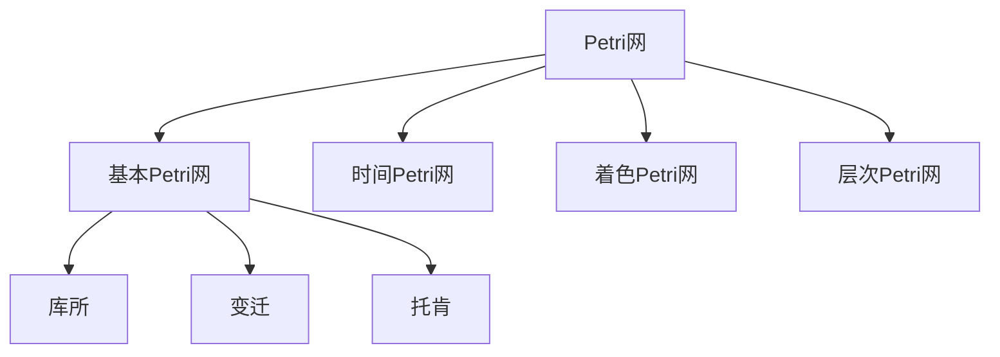

# 02-Petri网理论

## 目录

1. [1.0 Petri网概述](#10-petri网概述)
2. [2.0 基本Petri网](#20-基本petri网)
3. [3.0 高级Petri网](#30-高级petri网)
4. [4.0 并发语义](#40-并发语义)
5. [5.0 分析技术](#50-分析技术)

## 1.0 Petri网概述

**定义 1.1 (Petri网)**
Petri网是并发系统建模和分析的重要形式化工具，由Carl Adam Petri在1962年提出。

**定义 1.2 (并发系统)**
多个组件可以同时执行活动的系统。



## 2.0 基本Petri网

### 2.1 基本定义

**定义 2.1.1 (基本Petri网)**
基本Petri网是一个四元组 N = (P, T, F, M₀)，其中：
- P 是有限库所集 (places)
- T 是有限变迁集 (transitions)，P ∩ T = ∅
- F ⊆ (P × T) ∪ (T × P) 是流关系 (flow relation)
- M₀: P → ℕ 是初始标识 (initial marking)

```rust
// 基本Petri网的Rust实现
use std::collections::{HashMap, HashSet};

#[derive(Debug, Clone)]
pub struct BasicPetriNet {
    places: HashSet<String>,
    transitions: HashSet<String>,
    flow_relation: Vec<FlowArc>,
    initial_marking: HashMap<String, u32>,
}

#[derive(Debug, Clone)]
pub struct FlowArc {
    source: String,
    target: String,
    weight: u32,
}

#[derive(Debug, Clone)]
pub struct Marking {
    tokens: HashMap<String, u32>,
}

impl BasicPetriNet {
    pub fn new() -> Self {
        Self {
            places: HashSet::new(),
            transitions: HashSet::new(),
            flow_relation: Vec::new(),
            initial_marking: HashMap::new(),
        }
    }
    
    pub fn add_place(&mut self, place: String) {
        self.places.insert(place);
    }
    
    pub fn add_transition(&mut self, transition: String) {
        self.transitions.insert(transition);
    }
    
    pub fn add_flow_arc(&mut self, source: String, target: String, weight: u32) {
        self.flow_relation.push(FlowArc {
            source,
            target,
            weight,
        });
    }
    
    pub fn set_initial_marking(&mut self, place: String, tokens: u32) {
        self.initial_marking.insert(place, tokens);
    }
    
    pub fn get_initial_marking(&self) -> Marking {
        Marking {
            tokens: self.initial_marking.clone(),
        }
    }
    
    // 获取变迁的前集
    pub fn get_preset(&self, transition: &str) -> HashMap<String, u32> {
        let mut preset = HashMap::new();
        for arc in &self.flow_relation {
            if arc.target == transition {
                preset.insert(arc.source.clone(), arc.weight);
            }
        }
        preset
    }
    
    // 获取变迁的后集
    pub fn get_postset(&self, transition: &str) -> HashMap<String, u32> {
        let mut postset = HashMap::new();
        for arc in &self.flow_relation {
            if arc.source == transition {
                postset.insert(arc.target.clone(), arc.weight);
            }
        }
        postset
    }
    
    // 检查变迁是否使能
    pub fn is_enabled(&self, transition: &str, marking: &Marking) -> bool {
        let preset = self.get_preset(transition);
        for (place, required_tokens) in preset {
            let available_tokens = marking.tokens.get(&place).unwrap_or(&0);
            if available_tokens < &required_tokens {
                return false;
            }
        }
        true
    }
    
    // 执行变迁
    pub fn fire_transition(&self, transition: &str, marking: &Marking) -> Option<Marking> {
        if !self.is_enabled(transition, marking) {
            return None;
        }
        
        let mut new_marking = Marking {
            tokens: marking.tokens.clone(),
        };
        
        // 移除前集中的托肯
        let preset = self.get_preset(transition);
        for (place, tokens) in preset {
            let current_tokens = new_marking.tokens.get_mut(&place).unwrap();
            *current_tokens -= tokens;
        }
        
        // 添加后集中的托肯
        let postset = self.get_postset(transition);
        for (place, tokens) in postset {
            let current_tokens = new_marking.tokens.entry(place).or_insert(0);
            *current_tokens += tokens;
        }
        
        Some(new_marking)
    }
    
    // 获取可达标识集
    pub fn get_reachable_markings(&self) -> HashSet<Marking> {
        let mut reachable = HashSet::new();
        let mut to_visit = vec![self.get_initial_marking()];
        
        while let Some(marking) = to_visit.pop() {
            if reachable.contains(&marking) {
                continue;
            }
            
            reachable.insert(marking.clone());
            
            // 尝试所有可能的变迁
            for transition in &self.transitions {
                if let Some(new_marking) = self.fire_transition(transition, &marking) {
                    to_visit.push(new_marking);
                }
            }
        }
        
        reachable
    }
}

impl Marking {
    pub fn new() -> Self {
        Self {
            tokens: HashMap::new(),
        }
    }
    
    pub fn add_tokens(&mut self, place: String, count: u32) {
        let current = self.tokens.entry(place).or_insert(0);
        *current += count;
    }
    
    pub fn get_tokens(&self, place: &str) -> u32 {
        *self.tokens.get(place).unwrap_or(&0)
    }
    
    pub fn to_string(&self) -> String {
        let mut parts = Vec::new();
        for (place, tokens) in &self.tokens {
            if *tokens > 0 {
                parts.push(format!("{}:{}", place, tokens));
            }
        }
        format!("[{}]", parts.join(", "))
    }
}

impl PartialEq for Marking {
    fn eq(&self, other: &Self) -> bool {
        self.tokens == other.tokens
    }
}

impl Eq for Marking {}

impl std::hash::Hash for Marking {
    fn hash<H: std::hash::Hasher>(&self, state: &mut H) {
        for (place, tokens) in &self.tokens {
            place.hash(state);
            tokens.hash(state);
        }
    }
}
```

### 2.2 可达性分析

**定义 2.2.1 (可达性)**
标识 M' 从标识 M 可达，记作 M →* M'，如果存在变迁序列 σ = t₁t₂...tₙ 使得：
M →^{t₁} M₁ →^{t₂} M₂ → ... →^{tₙ} M'

**定理 2.2.1 (可达性判定)**
Petri网的可达性问题在一般情况下是不可判定的。

```rust
// 可达性分析实现
impl BasicPetriNet {
    // 检查可达性
    pub fn is_reachable(&self, target_marking: &Marking) -> bool {
        let reachable_markings = self.get_reachable_markings();
        reachable_markings.contains(target_marking)
    }
    
    // 获取从初始标识到目标标识的路径
    pub fn get_path_to_marking(&self, target_marking: &Marking) -> Option<Vec<String>> {
        let mut visited = HashSet::new();
        let mut queue = std::collections::VecDeque::new();
        let mut paths = HashMap::new();
        
        let initial_marking = self.get_initial_marking();
        queue.push_back(initial_marking.clone());
        paths.insert(initial_marking, Vec::new());
        
        while let Some(current_marking) = queue.pop_front() {
            if current_marking == *target_marking {
                return paths.get(&current_marking).cloned();
            }
            
            if visited.contains(&current_marking) {
                continue;
            }
            
            visited.insert(current_marking.clone());
            let current_path = paths.get(&current_marking).unwrap().clone();
            
            for transition in &self.transitions {
                if let Some(new_marking) = self.fire_transition(transition, &current_marking) {
                    if !visited.contains(&new_marking) {
                        let mut new_path = current_path.clone();
                        new_path.push(transition.clone());
                        paths.insert(new_marking.clone(), new_path);
                        queue.push_back(new_marking);
                    }
                }
            }
        }
        
        None
    }
    
    // 检查有界性
    pub fn is_bounded(&self) -> bool {
        let reachable_markings = self.get_reachable_markings();
        
        // 检查每个库所是否有上界
        for place in &self.places {
            let mut max_tokens = 0;
            for marking in &reachable_markings {
                let tokens = marking.get_tokens(place);
                max_tokens = max_tokens.max(tokens);
            }
            
            // 如果某个库所的托肯数超过合理范围，认为无界
            if max_tokens > 1000 {
                return false;
            }
        }
        
        true
    }
    
    // 检查活性
    pub fn is_live(&self) -> bool {
        let reachable_markings = self.get_reachable_markings();
        
        for transition in &self.transitions {
            let mut transition_live = false;
            
            for marking in &reachable_markings {
                if self.is_enabled(transition, marking) {
                    transition_live = true;
                    break;
                }
            }
            
            if !transition_live {
                return false;
            }
        }
        
        true
    }
}
```

### 2.3 不变性分析

**定义 2.3.1 (不变性)**
向量 I: P → ℤ 是Petri网的不变性，如果对于任意标识 M 和变迁 t：
如果 M →^{t} M'，则 I · M = I · M'

```rust
// 不变性分析实现
#[derive(Debug, Clone)]
pub struct Invariant {
    coefficients: HashMap<String, i32>,
}

impl BasicPetriNet {
    // 计算不变性
    pub fn compute_invariants(&self) -> Vec<Invariant> {
        // 构造关联矩阵
        let mut matrix = Vec::new();
        let place_list: Vec<String> = self.places.iter().cloned().collect();
        let transition_list: Vec<String> = self.transitions.iter().cloned().collect();
        
        for transition in &transition_list {
            let mut row = Vec::new();
            for place in &place_list {
                let postset_weight = self.get_postset(transition).get(place).unwrap_or(&0);
                let preset_weight = self.get_preset(transition).get(place).unwrap_or(&0);
                let coefficient = *postset_weight as i32 - *preset_weight as i32;
                row.push(coefficient);
            }
            matrix.push(row);
        }
        
        // 简化实现：返回一些基本的不变性
        let mut invariants = Vec::new();
        
        // 托肯守恒不变性
        let mut conservation = Invariant {
            coefficients: HashMap::new(),
        };
        for place in &self.places {
            conservation.coefficients.insert(place.clone(), 1);
        }
        invariants.push(conservation);
        
        invariants
    }
    
    // 验证不变性
    pub fn verify_invariant(&self, invariant: &Invariant, marking: &Marking) -> i32 {
        let mut sum = 0;
        for (place, coefficient) in &invariant.coefficients {
            let tokens = marking.get_tokens(place) as i32;
            sum += coefficient * tokens;
        }
        sum
    }
}

impl Invariant {
    pub fn new() -> Self {
        Self {
            coefficients: HashMap::new(),
        }
    }
    
    pub fn add_coefficient(&mut self, place: String, coefficient: i32) {
        self.coefficients.insert(place, coefficient);
    }
    
    pub fn to_string(&self) -> String {
        let mut terms = Vec::new();
        for (place, coefficient) in &self.coefficients {
            if *coefficient != 0 {
                terms.push(format!("{}*{}", coefficient, place));
            }
        }
        terms.join(" + ")
    }
}
```

## 3.0 高级Petri网

### 3.1 时间Petri网

**定义 3.1.1 (时间Petri网)**
时间Petri网是一个六元组 N = (P, T, F, M₀, I, D)，其中：
- (P, T, F, M₀) 是基本Petri网
- I: T → ℝ⁺ × (ℝ⁺ ∪ {∞}) 是时间间隔函数
- D: T → ℝ⁺ 是延迟函数

```rust
// 时间Petri网实现
#[derive(Debug, Clone)]
pub struct TimedPetriNet {
    basic_net: BasicPetriNet,
    time_intervals: HashMap<String, (f64, f64)>, // (min, max)
    delays: HashMap<String, f64>,
}

#[derive(Debug, Clone)]
pub struct TimedMarking {
    marking: Marking,
    clocks: HashMap<String, f64>, // 变迁时钟
}

impl TimedPetriNet {
    pub fn new(basic_net: BasicPetriNet) -> Self {
        Self {
            basic_net,
            time_intervals: HashMap::new(),
            delays: HashMap::new(),
        }
    }
    
    pub fn set_time_interval(&mut self, transition: String, min_time: f64, max_time: f64) {
        self.time_intervals.insert(transition, (min_time, max_time));
    }
    
    pub fn set_delay(&mut self, transition: String, delay: f64) {
        self.delays.insert(transition, delay);
    }
    
    pub fn get_initial_timed_marking(&self) -> TimedMarking {
        TimedMarking {
            marking: self.basic_net.get_initial_marking(),
            clocks: HashMap::new(),
        }
    }
    
    // 检查时间变迁是否使能
    pub fn is_timed_enabled(&self, transition: &str, timed_marking: &TimedMarking) -> bool {
        if !self.basic_net.is_enabled(transition, &timed_marking.marking) {
            return false;
        }
        
        if let Some((min_time, max_time)) = self.time_intervals.get(transition) {
            let clock = timed_marking.clocks.get(transition).unwrap_or(&0.0);
            *clock >= *min_time && *clock <= *max_time
        } else {
            true
        }
    }
    
    // 执行时间变迁
    pub fn fire_timed_transition(&self, transition: &str, timed_marking: &TimedMarking) -> Option<TimedMarking> {
        if !self.is_timed_enabled(transition, timed_marking) {
            return None;
        }
        
        let new_marking = self.basic_net.fire_transition(transition, &timed_marking.marking)?;
        
        let mut new_clocks = timed_marking.clocks.clone();
        new_clocks.remove(transition); // 重置该变迁的时钟
        
        Some(TimedMarking {
            marking: new_marking,
            clocks: new_clocks,
        })
    }
    
    // 时间推进
    pub fn time_elapse(&self, timed_marking: &TimedMarking, time: f64) -> TimedMarking {
        let mut new_clocks = timed_marking.clocks.clone();
        
        for (transition, clock) in &mut new_clocks {
            *clock += time;
        }
        
        TimedMarking {
            marking: timed_marking.marking.clone(),
            clocks: new_clocks,
        }
    }
}

impl TimedMarking {
    pub fn new(marking: Marking) -> Self {
        Self {
            marking,
            clocks: HashMap::new(),
        }
    }
    
    pub fn add_clock(&mut self, transition: String, time: f64) {
        self.clocks.insert(transition, time);
    }
    
    pub fn get_clock(&self, transition: &str) -> f64 {
        *self.clocks.get(transition).unwrap_or(&0.0)
    }
}
```

### 3.2 着色Petri网

**定义 3.2.1 (着色Petri网)**
着色Petri网是一个六元组 N = (P, T, F, M₀, C, G)，其中：
- (P, T, F, M₀) 是基本Petri网
- C: P ∪ T → Σ 是颜色函数
- G: T → Bool 是守卫函数

```rust
// 着色Petri网实现
#[derive(Debug, Clone)]
pub struct ColoredPetriNet {
    basic_net: BasicPetriNet,
    color_sets: HashMap<String, ColorSet>,
    color_functions: HashMap<String, ColorFunction>,
    guard_functions: HashMap<String, GuardFunction>,
}

#[derive(Debug, Clone)]
pub struct ColorSet {
    name: String,
    values: Vec<String>,
}

#[derive(Debug, Clone)]
pub struct ColorFunction {
    name: String,
    mapping: HashMap<String, String>,
}

#[derive(Debug, Clone)]
pub struct GuardFunction {
    name: String,
    condition: String,
}

#[derive(Debug, Clone)]
pub struct ColoredMarking {
    tokens: HashMap<String, Vec<String>>, // place -> [colors]
}

impl ColoredPetriNet {
    pub fn new(basic_net: BasicPetriNet) -> Self {
        Self {
            basic_net,
            color_sets: HashMap::new(),
            color_functions: HashMap::new(),
            guard_functions: HashMap::new(),
        }
    }
    
    pub fn add_color_set(&mut self, name: String, values: Vec<String>) {
        self.color_sets.insert(name.clone(), ColorSet { name, values });
    }
    
    pub fn add_color_function(&mut self, name: String, mapping: HashMap<String, String>) {
        self.color_functions.insert(name.clone(), ColorFunction { name, mapping });
    }
    
    pub fn add_guard_function(&mut self, name: String, condition: String) {
        self.guard_functions.insert(name.clone(), GuardFunction { name, condition });
    }
    
    pub fn get_initial_colored_marking(&self) -> ColoredMarking {
        ColoredMarking {
            tokens: HashMap::new(),
        }
    }
    
    // 检查着色变迁是否使能
    pub fn is_colored_enabled(&self, transition: &str, colored_marking: &ColoredMarking) -> bool {
        if !self.basic_net.is_enabled(transition, &self.to_basic_marking(colored_marking)) {
            return false;
        }
        
        // 检查守卫条件
        if let Some(guard) = self.guard_functions.get(transition) {
            // 简化实现：总是返回true
            return true;
        }
        
        true
    }
    
    // 执行着色变迁
    pub fn fire_colored_transition(&self, transition: &str, colored_marking: &ColoredMarking) -> Option<ColoredMarking> {
        if !self.is_colored_enabled(transition, colored_marking) {
            return None;
        }
        
        let mut new_tokens = colored_marking.tokens.clone();
        
        // 简化实现：移除前集托肯，添加后集托肯
        let preset = self.basic_net.get_preset(transition);
        for (place, _) in preset {
            if let Some(tokens) = new_tokens.get_mut(&place) {
                if !tokens.is_empty() {
                    tokens.pop();
                }
            }
        }
        
        let postset = self.basic_net.get_postset(transition);
        for (place, _) in postset {
            let tokens = new_tokens.entry(place).or_insert_with(Vec::new);
            tokens.push("default_color".to_string());
        }
        
        Some(ColoredMarking { tokens: new_tokens })
    }
    
    fn to_basic_marking(&self, colored_marking: &ColoredMarking) -> Marking {
        let mut basic_marking = Marking::new();
        
        for (place, colors) in &colored_marking.tokens {
            basic_marking.add_tokens(place.clone(), colors.len() as u32);
        }
        
        basic_marking
    }
}

impl ColoredMarking {
    pub fn new() -> Self {
        Self {
            tokens: HashMap::new(),
        }
    }
    
    pub fn add_colored_tokens(&mut self, place: String, colors: Vec<String>) {
        let place_tokens = self.tokens.entry(place).or_insert_with(Vec::new);
        place_tokens.extend(colors);
    }
    
    pub fn get_colored_tokens(&self, place: &str) -> Vec<String> {
        self.tokens.get(place).cloned().unwrap_or_default()
    }
}
```

## 4.0 并发语义

### 4.1 步语义

**定义 4.1.1 (步)**
步是一个多重集 S: T → ℕ，表示同时发生的变迁。

**定义 4.1.2 (步使能)**
步 S 在标识 M 下使能，如果：
∀p ∈ P: M(p) ≥ ∑_{t∈T} S(t) · F(p,t)

```rust
// 步语义实现
#[derive(Debug, Clone)]
pub struct Step {
    transitions: HashMap<String, u32>, // transition -> multiplicity
}

impl BasicPetriNet {
    // 检查步是否使能
    pub fn is_step_enabled(&self, step: &Step, marking: &Marking) -> bool {
        for place in &self.places {
            let mut required_tokens = 0;
            
            for (transition, multiplicity) in &step.transitions {
                let preset = self.get_preset(transition);
                if let Some(tokens) = preset.get(place) {
                    required_tokens += tokens * multiplicity;
                }
            }
            
            let available_tokens = marking.get_tokens(place);
            if available_tokens < required_tokens {
                return false;
            }
        }
        
        true
    }
    
    // 执行步
    pub fn fire_step(&self, step: &Step, marking: &Marking) -> Option<Marking> {
        if !self.is_step_enabled(step, marking) {
            return None;
        }
        
        let mut new_marking = Marking {
            tokens: marking.tokens.clone(),
        };
        
        // 移除前集中的托肯
        for (transition, multiplicity) in &step.transitions {
            let preset = self.get_preset(transition);
            for (place, tokens) in preset {
                let current_tokens = new_marking.tokens.get_mut(place).unwrap();
                *current_tokens -= tokens * multiplicity;
            }
        }
        
        // 添加后集中的托肯
        for (transition, multiplicity) in &step.transitions {
            let postset = self.get_postset(transition);
            for (place, tokens) in postset {
                let current_tokens = new_marking.tokens.entry(place).or_insert(0);
                *current_tokens += tokens * multiplicity;
            }
        }
        
        Some(new_marking)
    }
    
    // 获取所有可能的步
    pub fn get_enabled_steps(&self, marking: &Marking) -> Vec<Step> {
        let mut steps = Vec::new();
        
        // 单个变迁的步
        for transition in &self.transitions {
            if self.is_enabled(transition, marking) {
                let mut step = Step {
                    transitions: HashMap::new(),
                };
                step.transitions.insert(transition.clone(), 1);
                steps.push(step);
            }
        }
        
        // 多个变迁的步（简化实现）
        // 这里只考虑两个变迁的组合
        let transitions: Vec<String> = self.transitions.iter().cloned().collect();
        for i in 0..transitions.len() {
            for j in i+1..transitions.len() {
                let t1 = &transitions[i];
                let t2 = &transitions[j];
                
                if self.is_enabled(t1, marking) && self.is_enabled(t2, marking) {
                    let mut step = Step {
                        transitions: HashMap::new(),
                    };
                    step.transitions.insert(t1.clone(), 1);
                    step.transitions.insert(t2.clone(), 1);
                    
                    if self.is_step_enabled(&step, marking) {
                        steps.push(step);
                    }
                }
            }
        }
        
        steps
    }
}

impl Step {
    pub fn new() -> Self {
        Self {
            transitions: HashMap::new(),
        }
    }
    
    pub fn add_transition(&mut self, transition: String, multiplicity: u32) {
        let current = self.transitions.entry(transition).or_insert(0);
        *current += multiplicity;
    }
    
    pub fn to_string(&self) -> String {
        let mut parts = Vec::new();
        for (transition, multiplicity) in &self.transitions {
            if *multiplicity == 1 {
                parts.push(transition.clone());
            } else {
                parts.push(format!("{}^{}", transition, multiplicity));
            }
        }
        format!("{{{}}}", parts.join(", "))
    }
}
```

## 5.0 分析技术

### 5.1 可达性图

**定义 5.1.1 (可达性图)**
可达性图是一个有向图，节点是可达标识，边是变迁。

```rust
// 可达性图实现
#[derive(Debug, Clone)]
pub struct ReachabilityGraph {
    nodes: Vec<Marking>,
    edges: Vec<ReachabilityEdge>,
}

#[derive(Debug, Clone)]
pub struct ReachabilityEdge {
    source: usize,
    target: usize,
    transition: String,
}

impl BasicPetriNet {
    // 构建可达性图
    pub fn build_reachability_graph(&self) -> ReachabilityGraph {
        let mut graph = ReachabilityGraph {
            nodes: Vec::new(),
            edges: Vec::new(),
        };
        
        let mut visited = HashSet::new();
        let mut to_visit = vec![self.get_initial_marking()];
        let mut node_indices = HashMap::new();
        
        while let Some(marking) = to_visit.pop() {
            if visited.contains(&marking) {
                continue;
            }
            
            let node_index = graph.nodes.len();
            node_indices.insert(marking.clone(), node_index);
            graph.nodes.push(marking.clone());
            visited.insert(marking.clone());
            
            // 尝试所有可能的变迁
            for transition in &self.transitions {
                if let Some(new_marking) = self.fire_transition(transition, &marking) {
                    to_visit.push(new_marking.clone());
                    
                    if let Some(target_index) = node_indices.get(&new_marking) {
                        graph.edges.push(ReachabilityEdge {
                            source: node_index,
                            target: *target_index,
                            transition: transition.clone(),
                        });
                    }
                }
            }
        }
        
        graph
    }
}

impl ReachabilityGraph {
    pub fn new() -> Self {
        Self {
            nodes: Vec::new(),
            edges: Vec::new(),
        }
    }
    
    pub fn add_node(&mut self, marking: Marking) -> usize {
        let index = self.nodes.len();
        self.nodes.push(marking);
        index
    }
    
    pub fn add_edge(&mut self, source: usize, target: usize, transition: String) {
        self.edges.push(ReachabilityEdge {
            source,
            target,
            transition,
        });
    }
    
    pub fn get_node(&self, index: usize) -> Option<&Marking> {
        self.nodes.get(index)
    }
    
    pub fn get_edges_from(&self, node_index: usize) -> Vec<&ReachabilityEdge> {
        self.edges.iter().filter(|edge| edge.source == node_index).collect()
    }
    
    pub fn to_mermaid(&self) -> String {
        let mut mermaid = String::from("graph TD\n");
        
        for (i, marking) in self.nodes.iter().enumerate() {
            mermaid.push_str(&format!("    M{}[{}]\n", i, marking.to_string()));
        }
        
        for edge in &self.edges {
            mermaid.push_str(&format!("    M{} -->|{}| M{}\n", 
                edge.source, edge.transition, edge.target));
        }
        
        mermaid
    }
}
```

### 5.2 不变性计算

**定理 5.2.1 (不变性保持)**
如果 I 是不变性，则对于任意可达标识 M：
I · M = I · M₀

```rust
// 不变性计算实现
impl BasicPetriNet {
    // 计算S-不变性（库所不变性）
    pub fn compute_s_invariants(&self) -> Vec<Invariant> {
        // 构造关联矩阵的转置
        let mut matrix = Vec::new();
        let place_list: Vec<String> = self.places.iter().cloned().collect();
        let transition_list: Vec<String> = self.transitions.iter().cloned().collect();
        
        for place in &place_list {
            let mut row = Vec::new();
            for transition in &transition_list {
                let postset_weight = self.get_postset(transition).get(place).unwrap_or(&0);
                let preset_weight = self.get_preset(transition).get(place).unwrap_or(&0);
                let coefficient = *postset_weight as i32 - *preset_weight as i32;
                row.push(coefficient);
            }
            matrix.push(row);
        }
        
        // 简化实现：返回一些基本的不变性
        let mut invariants = Vec::new();
        
        // 托肯守恒不变性
        let mut conservation = Invariant::new();
        for place in &self.places {
            conservation.add_coefficient(place.clone(), 1);
        }
        invariants.push(conservation);
        
        invariants
    }
    
    // 计算T-不变性（变迁不变性）
    pub fn compute_t_invariants(&self) -> Vec<TransitionInvariant> {
        // 构造关联矩阵
        let mut matrix = Vec::new();
        let place_list: Vec<String> = self.places.iter().cloned().collect();
        let transition_list: Vec<String> = self.transitions.iter().cloned().collect();
        
        for transition in &transition_list {
            let mut row = Vec::new();
            for place in &place_list {
                let postset_weight = self.get_postset(transition).get(place).unwrap_or(&0);
                let preset_weight = self.get_preset(transition).get(place).unwrap_or(&0);
                let coefficient = *postset_weight as i32 - *preset_weight as i32;
                row.push(coefficient);
            }
            matrix.push(row);
        }
        
        // 简化实现：返回一些基本的T-不变性
        let mut invariants = Vec::new();
        
        // 循环不变性
        let mut cycle = TransitionInvariant::new();
        for transition in &self.transitions {
            cycle.add_coefficient(transition.clone(), 1);
        }
        invariants.push(cycle);
        
        invariants
    }
}

#[derive(Debug, Clone)]
pub struct TransitionInvariant {
    coefficients: HashMap<String, i32>,
}

impl TransitionInvariant {
    pub fn new() -> Self {
        Self {
            coefficients: HashMap::new(),
        }
    }
    
    pub fn add_coefficient(&mut self, transition: String, coefficient: i32) {
        self.coefficients.insert(transition, coefficient);
    }
    
    pub fn to_string(&self) -> String {
        let mut terms = Vec::new();
        for (transition, coefficient) in &self.coefficients {
            if *coefficient != 0 {
                terms.push(format!("{}*{}", coefficient, transition));
            }
        }
        terms.join(" + ")
    }
}
```

---

## 总结

Petri网理论为并发系统的建模和分析提供了强大的形式化工具，通过基本Petri网、高级变种和各种分析技术，能够有效地描述和验证复杂系统的行为。 