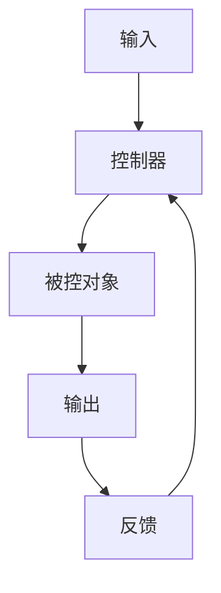

# 控制理论

## 1. 理论基础

控制理论研究系统的动态行为及其调节方法，是自动化、机器人、工业系统等领域的核心理论。

### 1.1 基本概念

- 控制系统（Control System）
- 开环与闭环控制
- 稳定性、可控性、可观测性

## 2. 控制系统建模

```rust
pub struct ControlSystem {
    pub states: Vec<State>,
    pub inputs: Vec<Input>,
    pub outputs: Vec<Output>,
    pub dynamics: Dynamics,
}

pub struct Dynamics {
    pub equations: Vec<Equation>,
}

pub struct Equation {
    pub lhs: String,
    pub rhs: String,
}
```

## 3. 分析方法

- 稳定性分析
- 时域与频域分析
- 状态空间法
- 鲁棒性分析

## 4. 应用场景

- 自动化生产线
- 机器人控制
- 智能交通系统
- 航空航天

## 5. 形式化表示



## 6. 交叉引用

- [形式模型理论总论](00-形式模型理论总论.md)
- [Petri网理论](01-Petri网理论.md)
- [状态机理论](03-状态机理论.md)

## 7. 导航

- [返回形式模型理论总论](00-形式模型理论总论.md)
- [Petri网理论](01-Petri网理论.md)
- [状态机理论](03-状态机理论.md)
