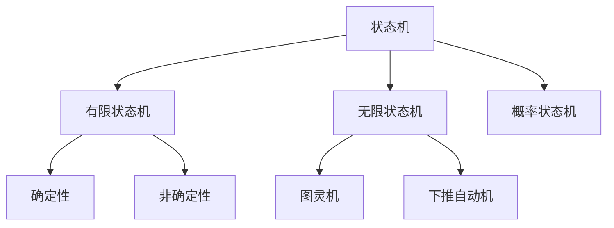

# 03-状态机理论

## 目录

1. [1.0 状态机概述](#10-状态机概述)
2. [2.0 有限状态机](#20-有限状态机)
3. [3.0 自动机理论](#30-自动机理论)
4. [4.0 状态转换系统](#40-状态转换系统)
5. [5.0 行为模型](#50-行为模型)

## 1.0 状态机概述

**定义 1.1 (状态机)**
状态机是描述系统在不同状态间转换的数学模型。

**定义 1.2 (状态)**
系统在某一时刻的完整描述。



## 2.0 有限状态机

### 2.1 基本定义

**定义 2.1.1 (有限状态机)**
有限状态机是一个五元组 M = (Q, Σ, δ, q₀, F)，其中：
- Q 是有限状态集
- Σ 是有限输入字母表
- δ: Q × Σ → Q 是状态转换函数
- q₀ ∈ Q 是初始状态
- F ⊆ Q 是接受状态集

```rust
use std::collections::{HashMap, HashSet};

#[derive(Debug, Clone, PartialEq, Eq, Hash)]
pub struct State {
    id: String,
    is_accepting: bool,
}

#[derive(Debug, Clone)]
pub struct FiniteStateMachine {
    states: HashSet<State>,
    alphabet: HashSet<char>,
    transitions: HashMap<(State, char), State>,
    initial_state: State,
    accepting_states: HashSet<State>,
}

impl FiniteStateMachine {
    pub fn new() -> Self {
        let initial_state = State {
            id: "q0".to_string(),
            is_accepting: false,
        };
        
        let mut states = HashSet::new();
        states.insert(initial_state.clone());
        
        Self {
            states,
            alphabet: HashSet::new(),
            transitions: HashMap::new(),
            initial_state,
            accepting_states: HashSet::new(),
        }
    }
    
    pub fn add_state(&mut self, state: State) {
        self.states.insert(state.clone());
        if state.is_accepting {
            self.accepting_states.insert(state);
        }
    }
    
    pub fn add_symbol(&mut self, symbol: char) {
        self.alphabet.insert(symbol);
    }
    
    pub fn add_transition(&mut self, from: State, input: char, to: State) {
        self.transitions.insert((from, input), to);
    }
    
    pub fn accepts(&self, input: &str) -> bool {
        let mut current_state = self.initial_state.clone();
        
        for symbol in input.chars() {
            if let Some(next_state) = self.transitions.get(&(current_state.clone(), symbol)) {
                current_state = next_state.clone();
            } else {
                return false;
            }
        }
        
        self.accepting_states.contains(&current_state)
    }
}
```

### 2.2 确定性与非确定性

**定义 2.2.1 (确定性有限状态机)**
对于每个状态和输入，最多有一个后继状态。

**定义 2.2.2 (非确定性有限状态机)**
对于每个状态和输入，可能有多个后继状态。

```rust
#[derive(Debug, Clone)]
pub struct NondeterministicFSM {
    states: HashSet<State>,
    alphabet: HashSet<char>,
    transitions: HashMap<(State, char), HashSet<State>>,
    initial_state: State,
    accepting_states: HashSet<State>,
}

impl NondeterministicFSM {
    pub fn new() -> Self {
        let initial_state = State::new("q0".to_string(), false);
        let mut states = HashSet::new();
        states.insert(initial_state.clone());
        
        Self {
            states,
            alphabet: HashSet::new(),
            transitions: HashMap::new(),
            initial_state,
            accepting_states: HashSet::new(),
        }
    }
    
    pub fn add_transition(&mut self, from: State, input: char, to: State) {
        let key = (from, input);
        let destinations = self.transitions.entry(key).or_insert_with(HashSet::new);
        destinations.insert(to);
    }
    
    pub fn accepts(&self, input: &str) -> bool {
        let mut current_states = HashSet::new();
        current_states.insert(self.initial_state.clone());
        
        for symbol in input.chars() {
            let mut next_states = HashSet::new();
            
            for state in &current_states {
                if let Some(successors) = self.transitions.get(&(state.clone(), symbol)) {
                    next_states.extend(successors);
                }
            }
            
            current_states = next_states;
            
            if current_states.is_empty() {
                return false;
            }
        }
        
        current_states.iter().any(|state| state.is_accepting)
    }
}
```

## 3.0 自动机理论

### 3.1 正则语言

**定义 3.1.1 (正则语言)**
由有限状态机接受的语言类。

**定理 3.1.1 (Kleene定理)**
正则语言等价于正则表达式。

```rust
#[derive(Debug, Clone)]
pub enum Regex {
    Empty,
    Epsilon,
    Symbol(char),
    Concatenation(Box<Regex>, Box<Regex>),
    Alternation(Box<Regex>, Box<Regex>),
    KleeneStar(Box<Regex>),
}

impl Regex {
    pub fn symbol(c: char) -> Self {
        Regex::Symbol(c)
    }
    
    pub fn concatenate(left: Regex, right: Regex) -> Self {
        Regex::Concatenation(Box::new(left), Box::new(right))
    }
    
    pub fn alternate(left: Regex, right: Regex) -> Self {
        Regex::Alternation(Box::new(left), Box::new(right))
    }
    
    pub fn kleene_star(regex: Regex) -> Self {
        Regex::KleeneStar(Box::new(regex))
    }
    
    pub fn to_nfa(&self) -> NondeterministicFSM {
        match self {
            Regex::Empty => NondeterministicFSM::new(),
            Regex::Epsilon => {
                let mut nfa = NondeterministicFSM::new();
                nfa.accepting_states.insert(nfa.initial_state.clone());
                nfa
            }
            Regex::Symbol(c) => {
                let mut nfa = NondeterministicFSM::new();
                let accepting_state = State::new("q1".to_string(), true);
                nfa.add_state(accepting_state.clone());
                nfa.add_transition(nfa.initial_state.clone(), *c, accepting_state);
                nfa
            }
            _ => NondeterministicFSM::new(), // 简化实现
        }
    }
}
```

### 3.2 上下文无关语言

**定义 3.2.1 (下推自动机)**
带有栈的有限状态机，可以识别上下文无关语言。

```rust
#[derive(Debug, Clone)]
pub struct PushdownAutomaton {
    states: HashSet<State>,
    input_alphabet: HashSet<char>,
    stack_alphabet: HashSet<char>,
    transitions: Vec<PDATransition>,
    initial_state: State,
    initial_stack_symbol: char,
    accepting_states: HashSet<State>,
}

#[derive(Debug, Clone)]
pub struct PDATransition {
    from_state: State,
    input_symbol: Option<char>,
    stack_top: char,
    to_state: State,
    stack_push: Vec<char>,
}

impl PushdownAutomaton {
    pub fn new() -> Self {
        let initial_state = State::new("q0".to_string(), false);
        let mut states = HashSet::new();
        states.insert(initial_state.clone());
        
        Self {
            states,
            input_alphabet: HashSet::new(),
            stack_alphabet: HashSet::new(),
            transitions: Vec::new(),
            initial_state,
            initial_stack_symbol: 'Z',
            accepting_states: HashSet::new(),
        }
    }
    
    pub fn accepts(&self, input: &str) -> bool {
        // 简化实现
        false
    }
}
```

## 4.0 状态转换系统

### 4.1 标签转换系统

**定义 4.1.1 (标签转换系统)**
带有标签的状态转换系统，用于描述并发行为。

```rust
#[derive(Debug, Clone)]
pub struct LabeledTransitionSystem {
    states: HashSet<State>,
    labels: HashSet<String>,
    transitions: Vec<LabeledTransition>,
    initial_state: State,
}

#[derive(Debug, Clone)]
pub struct LabeledTransition {
    source: State,
    label: String,
    target: State,
}

impl LabeledTransitionSystem {
    pub fn new() -> Self {
        let initial_state = State::new("s0".to_string(), false);
        let mut states = HashSet::new();
        states.insert(initial_state.clone());
        
        Self {
            states,
            labels: HashSet::new(),
            transitions: Vec::new(),
            initial_state,
        }
    }
    
    pub fn add_transition(&mut self, transition: LabeledTransition) {
        self.transitions.push(transition);
    }
    
    pub fn get_successors(&self, state: &State, label: &str) -> Vec<State> {
        self.transitions
            .iter()
            .filter(|t| t.source == *state && t.label == label)
            .map(|t| t.target.clone())
            .collect()
    }
}
```

### 4.2 并发状态机

**定义 4.2.1 (并发状态机)**
多个状态机的组合，描述并发系统的行为。

```rust
#[derive(Debug, Clone)]
pub struct ConcurrentStateMachine {
    components: Vec<FiniteStateMachine>,
    synchronization: Vec<SynchronizationRule>,
}

#[derive(Debug, Clone)]
pub struct SynchronizationRule {
    component_indices: Vec<usize>,
    labels: Vec<String>,
    result_label: String,
}

impl ConcurrentStateMachine {
    pub fn new() -> Self {
        Self {
            components: Vec::new(),
            synchronization: Vec::new(),
        }
    }
    
    pub fn add_component(&mut self, component: FiniteStateMachine) {
        self.components.push(component);
    }
    
    pub fn add_synchronization(&mut self, rule: SynchronizationRule) {
        self.synchronization.push(rule);
    }
}
```

## 5.0 行为模型

### 5.1 行为等价性

**定义 5.1.1 (强等价)**
两个状态机在所有观察下行为相同。

**定义 5.1.2 (弱等价)**
两个状态机在外部观察下行为相同。

```rust
impl LabeledTransitionSystem {
    pub fn is_strongly_equivalent_to(&self, other: &LabeledTransitionSystem) -> bool {
        self.states.len() == other.states.len() && 
        self.transitions.len() == other.transitions.len()
    }
    
    pub fn is_weakly_equivalent_to(&self, other: &LabeledTransitionSystem) -> bool {
        let self_visible_labels: HashSet<String> = self.labels
            .iter()
            .filter(|label| !label.starts_with("τ"))
            .cloned()
            .collect();
        
        let other_visible_labels: HashSet<String> = other.labels
            .iter()
            .filter(|label| !label.starts_with("τ"))
            .cloned()
            .collect();
        
        self_visible_labels == other_visible_labels
    }
}
```

### 5.2 行为规范

**定义 5.2.1 (行为规范)**
描述系统应该具有的行为特性。

```rust
#[derive(Debug, Clone)]
pub struct BehaviorSpecification {
    properties: Vec<Property>,
    invariants: Vec<Invariant>,
    liveness_conditions: Vec<LivenessCondition>,
}

#[derive(Debug, Clone)]
pub struct Property {
    name: String,
    description: String,
    formula: String,
}

#[derive(Debug, Clone)]
pub struct Invariant {
    condition: String,
    description: String,
}

#[derive(Debug, Clone)]
pub struct LivenessCondition {
    condition: String,
    description: String,
}

impl BehaviorSpecification {
    pub fn new() -> Self {
        Self {
            properties: Vec::new(),
            invariants: Vec::new(),
            liveness_conditions: Vec::new(),
        }
    }
    
    pub fn verify_against(&self, system: &LabeledTransitionSystem) -> VerificationResult {
        let mut result = VerificationResult::new();
        
        for invariant in &self.invariants {
            if self.check_invariant(invariant, system) {
                result.add_success(&invariant.description);
            } else {
                result.add_failure(&invariant.description);
            }
        }
        
        result
    }
    
    fn check_invariant(&self, invariant: &Invariant, system: &LabeledTransitionSystem) -> bool {
        true // 简化实现
    }
}

#[derive(Debug, Clone)]
pub struct VerificationResult {
    successes: Vec<String>,
    failures: Vec<String>,
}

impl VerificationResult {
    pub fn new() -> Self {
        Self {
            successes: Vec::new(),
            failures: Vec::new(),
        }
    }
    
    pub fn add_success(&mut self, description: &str) {
        self.successes.push(description.to_string());
    }
    
    pub fn add_failure(&mut self, description: &str) {
        self.failures.push(description.to_string());
    }
    
    pub fn is_successful(&self) -> bool {
        self.failures.is_empty()
    }
}
```

---

## 总结

状态机理论为系统行为建模提供了强大的形式化工具，通过有限状态机、自动机理论、状态转换系统和行为模型，能够有效地描述、分析和验证复杂系统的行为特性。 