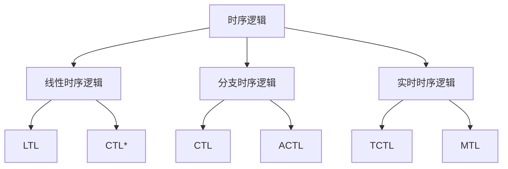

# 04-时序逻辑理论

## 目录

1. [1.0 时序逻辑概述](#10-时序逻辑概述)
2. [2.0 线性时序逻辑](#20-线性时序逻辑)
3. [3.0 分支时序逻辑](#30-分支时序逻辑)
4. [4.0 计算树逻辑](#40-计算树逻辑)
5. [5.0 模型检测](#50-模型检测)

## 1.0 时序逻辑概述

**定义 1.1 (时序逻辑)**
用于描述系统随时间变化行为的模态逻辑。

**定义 1.2 (时间结构)**
描述时间如何组织的数学结构。



## 2.0 线性时序逻辑

### 2.1 基本语法

**定义 2.1.1 (LTL语法)**
线性时序逻辑的语法定义：

φ ::= p | ¬φ | φ₁ ∧ φ₂ | φ₁ ∨ φ₂ | φ₁ → φ₂ | Xφ | Fφ | Gφ | φ₁ U φ₂ | φ₁ R φ₂

其中：
- p 是原子命题
- X (next): 下一个时刻
- F (finally): 将来某个时刻
- G (globally): 所有将来时刻
- U (until): 直到
- R (release): 释放

```rust
use std::collections::HashMap;

#[derive(Debug, Clone, PartialEq)]
pub enum LTLFormula {
    Atomic(String),
    Not(Box<LTLFormula>),
    And(Box<LTLFormula>, Box<LTLFormula>),
    Or(Box<LTLFormula>, Box<LTLFormula>),
    Implies(Box<LTLFormula>, Box<LTLFormula>),
    Next(Box<LTLFormula>),
    Finally(Box<LTLFormula>),
    Globally(Box<LTLFormula>),
    Until(Box<LTLFormula>, Box<LTLFormula>),
    Release(Box<LTLFormula>, Box<LTLFormula>),
}

impl LTLFormula {
    pub fn atomic(name: &str) -> Self {
        LTLFormula::Atomic(name.to_string())
    }
    
    pub fn not(formula: LTLFormula) -> Self {
        LTLFormula::Not(Box::new(formula))
    }
    
    pub fn and(left: LTLFormula, right: LTLFormula) -> Self {
        LTLFormula::And(Box::new(left), Box::new(right))
    }
    
    pub fn or(left: LTLFormula, right: LTLFormula) -> Self {
        LTLFormula::Or(Box::new(left), Box::new(right))
    }
    
    pub fn implies(left: LTLFormula, right: LTLFormula) -> Self {
        LTLFormula::Implies(Box::new(left), Box::new(right))
    }
    
    pub fn next(formula: LTLFormula) -> Self {
        LTLFormula::Next(Box::new(formula))
    }
    
    pub fn finally(formula: LTLFormula) -> Self {
        LTLFormula::Finally(Box::new(formula))
    }
    
    pub fn globally(formula: LTLFormula) -> Self {
        LTLFormula::Globally(Box::new(formula))
    }
    
    pub fn until(left: LTLFormula, right: LTLFormula) -> Self {
        LTLFormula::Until(Box::new(left), Box::new(right))
    }
    
    pub fn release(left: LTLFormula, right: LTLFormula) -> Self {
        LTLFormula::Release(Box::new(left), Box::new(right))
    }
    
    // 获取公式中的所有原子命题
    pub fn get_atomic_propositions(&self) -> Vec<String> {
        match self {
            LTLFormula::Atomic(name) => vec![name.clone()],
            LTLFormula::Not(formula) => formula.get_atomic_propositions(),
            LTLFormula::And(left, right) => {
                let mut props = left.get_atomic_propositions();
                props.extend(right.get_atomic_propositions());
                props
            }
            LTLFormula::Or(left, right) => {
                let mut props = left.get_atomic_propositions();
                props.extend(right.get_atomic_propositions());
                props
            }
            LTLFormula::Implies(left, right) => {
                let mut props = left.get_atomic_propositions();
                props.extend(right.get_atomic_propositions());
                props
            }
            LTLFormula::Next(formula) => formula.get_atomic_propositions(),
            LTLFormula::Finally(formula) => formula.get_atomic_propositions(),
            LTLFormula::Globally(formula) => formula.get_atomic_propositions(),
            LTLFormula::Until(left, right) => {
                let mut props = left.get_atomic_propositions();
                props.extend(right.get_atomic_propositions());
                props
            }
            LTLFormula::Release(left, right) => {
                let mut props = left.get_atomic_propositions();
                props.extend(right.get_atomic_propositions());
                props
            }
        }
    }
    
    // 转换为字符串表示
    pub fn to_string(&self) -> String {
        match self {
            LTLFormula::Atomic(name) => name.clone(),
            LTLFormula::Not(formula) => format!("¬({})", formula.to_string()),
            LTLFormula::And(left, right) => format!("({} ∧ {})", left.to_string(), right.to_string()),
            LTLFormula::Or(left, right) => format!("({} ∨ {})", left.to_string(), right.to_string()),
            LTLFormula::Implies(left, right) => format!("({} → {})", left.to_string(), right.to_string()),
            LTLFormula::Next(formula) => format!("X({})", formula.to_string()),
            LTLFormula::Finally(formula) => format!("F({})", formula.to_string()),
            LTLFormula::Globally(formula) => format!("G({})", formula.to_string()),
            LTLFormula::Until(left, right) => format!("({} U {})", left.to_string(), right.to_string()),
            LTLFormula::Release(left, right) => format!("({} R {})", left.to_string(), right.to_string()),
        }
    }
}
```

### 2.2 语义解释

**定义 2.2.1 (LTL语义)**
给定一个无限路径 π = s₀s₁s₂... 和位置 i，LTL公式的满足关系定义如下：

- π, i ⊨ p 当且仅当 p ∈ L(sᵢ)
- π, i ⊨ ¬φ 当且仅当 π, i ⊭ φ
- π, i ⊨ φ₁ ∧ φ₂ 当且仅当 π, i ⊨ φ₁ 且 π, i ⊨ φ₂
- π, i ⊨ Xφ 当且仅当 π, i+1 ⊨ φ
- π, i ⊨ Fφ 当且仅当存在 j ≥ i 使得 π, j ⊨ φ
- π, i ⊨ Gφ 当且仅当对所有 j ≥ i 都有 π, j ⊨ φ
- π, i ⊨ φ₁ U φ₂ 当且仅当存在 j ≥ i 使得 π, j ⊨ φ₂ 且对所有 k ∈ [i,j) 都有 π, k ⊨ φ₁

```rust
#[derive(Debug, Clone)]
pub struct State {
    id: String,
    labels: Vec<String>,
}

#[derive(Debug, Clone)]
pub struct Path {
    states: Vec<State>,
}

impl Path {
    pub fn new(states: Vec<State>) -> Self {
        Self { states }
    }
    
    pub fn get_state(&self, index: usize) -> Option<&State> {
        self.states.get(index)
    }
    
    pub fn length(&self) -> usize {
        self.states.len()
    }
    
    pub fn is_infinite(&self) -> bool {
        // 简化实现：假设所有路径都是有限的
        false
    }
}

impl State {
    pub fn new(id: String, labels: Vec<String>) -> Self {
        Self { id, labels }
    }
    
    pub fn has_label(&self, label: &str) -> bool {
        self.labels.contains(&label.to_string())
    }
}

// LTL语义解释器
pub struct LTLInterpreter;

impl LTLInterpreter {
    pub fn satisfies(path: &Path, position: usize, formula: &LTLFormula) -> bool {
        match formula {
            LTLFormula::Atomic(name) => {
                if let Some(state) = path.get_state(position) {
                    state.has_label(name)
                } else {
                    false
                }
            }
            LTLFormula::Not(formula) => {
                !Self::satisfies(path, position, formula)
            }
            LTLFormula::And(left, right) => {
                Self::satisfies(path, position, left) && 
                Self::satisfies(path, position, right)
            }
            LTLFormula::Or(left, right) => {
                Self::satisfies(path, position, left) || 
                Self::satisfies(path, position, right)
            }
            LTLFormula::Implies(left, right) => {
                !Self::satisfies(path, position, left) || 
                Self::satisfies(path, position, right)
            }
            LTLFormula::Next(formula) => {
                if position + 1 < path.length() {
                    Self::satisfies(path, position + 1, formula)
                } else {
                    false
                }
            }
            LTLFormula::Finally(formula) => {
                for i in position..path.length() {
                    if Self::satisfies(path, i, formula) {
                        return true;
                    }
                }
                false
            }
            LTLFormula::Globally(formula) => {
                for i in position..path.length() {
                    if !Self::satisfies(path, i, formula) {
                        return false;
                    }
                }
                true
            }
            LTLFormula::Until(left, right) => {
                for i in position..path.length() {
                    if Self::satisfies(path, i, right) {
                        // 检查left是否在所有中间位置都满足
                        let mut left_satisfied = true;
                        for j in position..i {
                            if !Self::satisfies(path, j, left) {
                                left_satisfied = false;
                                break;
                            }
                        }
                        if left_satisfied {
                            return true;
                        }
                    }
                }
                false
            }
            LTLFormula::Release(left, right) => {
                // φ₁ R φ₂ ≡ ¬(¬φ₁ U ¬φ₂)
                let not_left = LTLFormula::not(left.clone());
                let not_right = LTLFormula::not(right.clone());
                let until_formula = LTLFormula::until(not_left, not_right);
                !Self::satisfies(path, position, &until_formula)
            }
        }
    }
}
```

### 2.3 等价变换

**定理 2.3.1 (LTL等价性)**
以下LTL公式等价：
- Fφ ≡ true U φ
- Gφ ≡ ¬F¬φ
- φ₁ R φ₂ ≡ ¬(¬φ₁ U ¬φ₂)

```rust
impl LTLFormula {
    // 转换为否定范式
    pub fn to_negation_normal_form(&self) -> LTLFormula {
        match self {
            LTLFormula::Not(formula) => {
                match formula.as_ref() {
                    LTLFormula::Not(inner) => inner.to_negation_normal_form(),
                    LTLFormula::And(left, right) => {
                        LTLFormula::or(
                            LTLFormula::not(left.clone()).to_negation_normal_form(),
                            LTLFormula::not(right.clone()).to_negation_normal_form()
                        )
                    }
                    LTLFormula::Or(left, right) => {
                        LTLFormula::and(
                            LTLFormula::not(left.clone()).to_negation_normal_form(),
                            LTLFormula::not(right.clone()).to_negation_normal_form()
                        )
                    }
                    LTLFormula::Next(inner) => {
                        LTLFormula::next(LTLFormula::not(inner.clone()).to_negation_normal_form())
                    }
                    LTLFormula::Finally(inner) => {
                        LTLFormula::globally(LTLFormula::not(inner.clone()).to_negation_normal_form())
                    }
                    LTLFormula::Globally(inner) => {
                        LTLFormula::finally(LTLFormula::not(inner.clone()).to_negation_normal_form())
                    }
                    LTLFormula::Until(left, right) => {
                        LTLFormula::release(
                            LTLFormula::not(left.clone()).to_negation_normal_form(),
                            LTLFormula::not(right.clone()).to_negation_normal_form()
                        )
                    }
                    LTLFormula::Release(left, right) => {
                        LTLFormula::until(
                            LTLFormula::not(left.clone()).to_negation_normal_form(),
                            LTLFormula::not(right.clone()).to_negation_normal_form()
                        )
                    }
                    _ => self.clone(),
                }
            }
            LTLFormula::And(left, right) => {
                LTLFormula::and(
                    left.to_negation_normal_form(),
                    right.to_negation_normal_form()
                )
            }
            LTLFormula::Or(left, right) => {
                LTLFormula::or(
                    left.to_negation_normal_form(),
                    right.to_negation_normal_form()
                )
            }
            LTLFormula::Next(formula) => {
                LTLFormula::next(formula.to_negation_normal_form())
            }
            LTLFormula::Finally(formula) => {
                LTLFormula::finally(formula.to_negation_normal_form())
            }
            LTLFormula::Globally(formula) => {
                LTLFormula::globally(formula.to_negation_normal_form())
            }
            LTLFormula::Until(left, right) => {
                LTLFormula::until(
                    left.to_negation_normal_form(),
                    right.to_negation_normal_form()
                )
            }
            LTLFormula::Release(left, right) => {
                LTLFormula::release(
                    left.to_negation_normal_form(),
                    right.to_negation_normal_form()
                )
            }
            _ => self.clone(),
        }
    }
}
```

## 3.0 分支时序逻辑

### 3.1 CTL语法

**定义 3.1.1 (CTL语法)**
计算树逻辑的语法定义：

φ ::= p | ¬φ | φ₁ ∧ φ₂ | φ₁ ∨ φ₂ | φ₁ → φ₂ | AXφ | EXφ | AFφ | EFφ | AGφ | EGφ | A[φ₁ U φ₂] | E[φ₁ U φ₂]

其中：
- A (all): 所有路径
- E (exists): 存在路径
- X (next): 下一个时刻
- F (finally): 将来某个时刻
- G (globally): 所有将来时刻
- U (until): 直到

```rust
#[derive(Debug, Clone, PartialEq)]
pub enum CTLFormula {
    Atomic(String),
    Not(Box<CTLFormula>),
    And(Box<CTLFormula>, Box<CTLFormula>),
    Or(Box<CTLFormula>, Box<CTLFormula>),
    Implies(Box<CTLFormula>, Box<CTLFormula>),
    AX(Box<CTLFormula>),
    EX(Box<CTLFormula>),
    AF(Box<CTLFormula>),
    EF(Box<CTLFormula>),
    AG(Box<CTLFormula>),
    EG(Box<CTLFormula>),
    AUntil(Box<CTLFormula>, Box<CTLFormula>),
    EUntil(Box<CTLFormula>, Box<CTLFormula>),
}

impl CTLFormula {
    pub fn atomic(name: &str) -> Self {
        CTLFormula::Atomic(name.to_string())
    }
    
    pub fn not(formula: CTLFormula) -> Self {
        CTLFormula::Not(Box::new(formula))
    }
    
    pub fn and(left: CTLFormula, right: CTLFormula) -> Self {
        CTLFormula::And(Box::new(left), Box::new(right))
    }
    
    pub fn or(left: CTLFormula, right: CTLFormula) -> Self {
        CTLFormula::Or(Box::new(left), Box::new(right))
    }
    
    pub fn implies(left: CTLFormula, right: CTLFormula) -> Self {
        CTLFormula::Implies(Box::new(left), Box::new(right))
    }
    
    pub fn ax(formula: CTLFormula) -> Self {
        CTLFormula::AX(Box::new(formula))
    }
    
    pub fn ex(formula: CTLFormula) -> Self {
        CTLFormula::EX(Box::new(formula))
    }
    
    pub fn af(formula: CTLFormula) -> Self {
        CTLFormula::AF(Box::new(formula))
    }
    
    pub fn ef(formula: CTLFormula) -> Self {
        CTLFormula::EF(Box::new(formula))
    }
    
    pub fn ag(formula: CTLFormula) -> Self {
        CTLFormula::AG(Box::new(formula))
    }
    
    pub fn eg(formula: CTLFormula) -> Self {
        CTLFormula::EG(Box::new(formula))
    }
    
    pub fn a_until(left: CTLFormula, right: CTLFormula) -> Self {
        CTLFormula::AUntil(Box::new(left), Box::new(right))
    }
    
    pub fn e_until(left: CTLFormula, right: CTLFormula) -> Self {
        CTLFormula::EUntil(Box::new(left), Box::new(right))
    }
    
    pub fn to_string(&self) -> String {
        match self {
            CTLFormula::Atomic(name) => name.clone(),
            CTLFormula::Not(formula) => format!("¬({})", formula.to_string()),
            CTLFormula::And(left, right) => format!("({} ∧ {})", left.to_string(), right.to_string()),
            CTLFormula::Or(left, right) => format!("({} ∨ {})", left.to_string(), right.to_string()),
            CTLFormula::Implies(left, right) => format!("({} → {})", left.to_string(), right.to_string()),
            CTLFormula::AX(formula) => format!("AX({})", formula.to_string()),
            CTLFormula::EX(formula) => format!("EX({})", formula.to_string()),
            CTLFormula::AF(formula) => format!("AF({})", formula.to_string()),
            CTLFormula::EF(formula) => format!("EF({})", formula.to_string()),
            CTLFormula::AG(formula) => format!("AG({})", formula.to_string()),
            CTLFormula::EG(formula) => format!("EG({})", formula.to_string()),
            CTLFormula::AUntil(left, right) => format!("A[{} U {}]", left.to_string(), right.to_string()),
            CTLFormula::EUntil(left, right) => format!("E[{} U {}]", left.to_string(), right.to_string()),
        }
    }
}
```

### 3.2 CTL语义

**定义 3.2.1 (CTL语义)**
给定一个Kripke结构 M = (S, R, L) 和状态 s ∈ S，CTL公式的满足关系定义如下：

- M, s ⊨ p 当且仅当 p ∈ L(s)
- M, s ⊨ ¬φ 当且仅当 M, s ⊭ φ
- M, s ⊨ φ₁ ∧ φ₂ 当且仅当 M, s ⊨ φ₁ 且 M, s ⊨ φ₂
- M, s ⊨ AXφ 当且仅当对所有 s' 使得 (s,s') ∈ R 都有 M, s' ⊨ φ
- M, s ⊨ EXφ 当且仅当存在 s' 使得 (s,s') ∈ R 且 M, s' ⊨ φ
- M, s ⊨ AFφ 当且仅当在所有从s开始的路径上，φ最终为真
- M, s ⊨ EFφ 当且仅当存在从s开始的路径，φ最终为真

```rust
#[derive(Debug, Clone)]
pub struct KripkeStructure {
    states: Vec<State>,
    transitions: Vec<(State, State)>,
    labeling: HashMap<String, Vec<String>>, // state_id -> labels
}

impl KripkeStructure {
    pub fn new() -> Self {
        Self {
            states: Vec::new(),
            transitions: Vec::new(),
            labeling: HashMap::new(),
        }
    }
    
    pub fn add_state(&mut self, state: State) {
        self.states.push(state);
    }
    
    pub fn add_transition(&mut self, from: State, to: State) {
        self.transitions.push((from, to));
    }
    
    pub fn add_label(&mut self, state_id: String, label: String) {
        self.labeling.entry(state_id).or_insert_with(Vec::new).push(label);
    }
    
    pub fn get_successors(&self, state: &State) -> Vec<State> {
        self.transitions
            .iter()
            .filter(|(from, _)| from.id == state.id)
            .map(|(_, to)| to.clone())
            .collect()
    }
    
    pub fn get_predecessors(&self, state: &State) -> Vec<State> {
        self.transitions
            .iter()
            .filter(|(_, to)| to.id == state.id)
            .map(|(from, _)| from.clone())
            .collect()
    }
    
    pub fn has_label(&self, state: &State, label: &str) -> bool {
        if let Some(labels) = self.labeling.get(&state.id) {
            labels.contains(&label.to_string())
        } else {
            false
        }
    }
}

// CTL语义解释器
pub struct CTLInterpreter;

impl CTLInterpreter {
    pub fn satisfies(structure: &KripkeStructure, state: &State, formula: &CTLFormula) -> bool {
        match formula {
            CTLFormula::Atomic(name) => {
                structure.has_label(state, name)
            }
            CTLFormula::Not(formula) => {
                !Self::satisfies(structure, state, formula)
            }
            CTLFormula::And(left, right) => {
                Self::satisfies(structure, state, left) && 
                Self::satisfies(structure, state, right)
            }
            CTLFormula::Or(left, right) => {
                Self::satisfies(structure, state, left) || 
                Self::satisfies(structure, state, right)
            }
            CTLFormula::Implies(left, right) => {
                !Self::satisfies(structure, state, left) || 
                Self::satisfies(structure, state, right)
            }
            CTLFormula::AX(formula) => {
                let successors = structure.get_successors(state);
                successors.iter().all(|s| Self::satisfies(structure, s, formula))
            }
            CTLFormula::EX(formula) => {
                let successors = structure.get_successors(state);
                successors.iter().any(|s| Self::satisfies(structure, s, formula))
            }
            CTLFormula::AF(formula) => {
                Self::satisfies_af(structure, state, formula)
            }
            CTLFormula::EF(formula) => {
                Self::satisfies_ef(structure, state, formula)
            }
            CTLFormula::AG(formula) => {
                Self::satisfies_ag(structure, state, formula)
            }
            CTLFormula::EG(formula) => {
                Self::satisfies_eg(structure, state, formula)
            }
            CTLFormula::AUntil(left, right) => {
                Self::satisfies_a_until(structure, state, left, right)
            }
            CTLFormula::EUntil(left, right) => {
                Self::satisfies_e_until(structure, state, left, right)
            }
        }
    }
    
    fn satisfies_af(structure: &KripkeStructure, state: &State, formula: &CTLFormula) -> bool {
        // 简化实现：使用不动点算法
        let mut satisfied_states = std::collections::HashSet::new();
        
        // 初始化：所有满足φ的状态
        for s in &structure.states {
            if Self::satisfies(structure, s, formula) {
                satisfied_states.insert(s.id.clone());
            }
        }
        
        // 不动点计算
        loop {
            let mut new_satisfied = satisfied_states.clone();
            
            for s in &structure.states {
                if !satisfied_states.contains(&s.id) {
                    let successors = structure.get_successors(s);
                    if successors.iter().all(|succ| satisfied_states.contains(&succ.id)) {
                        new_satisfied.insert(s.id.clone());
                    }
                }
            }
            
            if new_satisfied == satisfied_states {
                break;
            }
            satisfied_states = new_satisfied;
        }
        
        satisfied_states.contains(&state.id)
    }
    
    fn satisfies_ef(structure: &KripkeStructure, state: &State, formula: &CTLFormula) -> bool {
        // EFφ ≡ E[true U φ]
        let true_formula = CTLFormula::atomic("true");
        Self::satisfies_e_until(structure, state, &true_formula, formula)
    }
    
    fn satisfies_ag(structure: &KripkeStructure, state: &State, formula: &CTLFormula) -> bool {
        // AGφ ≡ ¬EF¬φ
        let not_formula = CTLFormula::not(formula.clone());
        !Self::satisfies_ef(structure, state, &not_formula)
    }
    
    fn satisfies_eg(structure: &KripkeStructure, state: &State, formula: &CTLFormula) -> bool {
        // EGφ ≡ ¬AF¬φ
        let not_formula = CTLFormula::not(formula.clone());
        !Self::satisfies_af(structure, state, &not_formula)
    }
    
    fn satisfies_a_until(structure: &KripkeStructure, state: &State, left: &CTLFormula, right: &CTLFormula) -> bool {
        // 简化实现
        Self::satisfies(structure, state, right) || 
        (Self::satisfies(structure, state, left) && {
            let successors = structure.get_successors(state);
            successors.iter().all(|s| Self::satisfies_a_until(structure, s, left, right))
        })
    }
    
    fn satisfies_e_until(structure: &KripkeStructure, state: &State, left: &CTLFormula, right: &CTLFormula) -> bool {
        // 简化实现
        Self::satisfies(structure, state, right) || 
        (Self::satisfies(structure, state, left) && {
            let successors = structure.get_successors(state);
            successors.iter().any(|s| Self::satisfies_e_until(structure, s, left, right))
        })
    }
}
```

## 4.0 计算树逻辑

### 4.1 CTL*语法

**定义 4.1.1 (CTL*语法)**
CTL*结合了LTL和CTL的语法，包含状态公式和路径公式：

状态公式：φ ::= p | ¬φ | φ₁ ∧ φ₂ | Aψ | Eψ
路径公式：ψ ::= φ | ¬ψ | ψ₁ ∧ ψ₂ | Xψ | Fψ | Gψ | ψ₁ U ψ₂

```rust
#[derive(Debug, Clone, PartialEq)]
pub enum CTLStarStateFormula {
    Atomic(String),
    Not(Box<CTLStarStateFormula>),
    And(Box<CTLStarStateFormula>, Box<CTLStarStateFormula>),
    A(Box<CTLStarPathFormula>),
    E(Box<CTLStarPathFormula>),
}

#[derive(Debug, Clone, PartialEq)]
pub enum CTLStarPathFormula {
    State(Box<CTLStarStateFormula>),
    Not(Box<CTLStarPathFormula>),
    And(Box<CTLStarPathFormula>, Box<CTLStarPathFormula>),
    Next(Box<CTLStarPathFormula>),
    Finally(Box<CTLStarPathFormula>),
    Globally(Box<CTLStarPathFormula>),
    Until(Box<CTLStarPathFormula>, Box<CTLStarPathFormula>),
}

impl CTLStarStateFormula {
    pub fn atomic(name: &str) -> Self {
        CTLStarStateFormula::Atomic(name.to_string())
    }
    
    pub fn not(formula: CTLStarStateFormula) -> Self {
        CTLStarStateFormula::Not(Box::new(formula))
    }
    
    pub fn and(left: CTLStarStateFormula, right: CTLStarStateFormula) -> Self {
        CTLStarStateFormula::And(Box::new(left), Box::new(right))
    }
    
    pub fn a(path_formula: CTLStarPathFormula) -> Self {
        CTLStarStateFormula::A(Box::new(path_formula))
    }
    
    pub fn e(path_formula: CTLStarPathFormula) -> Self {
        CTLStarStateFormula::E(Box::new(path_formula))
    }
}

impl CTLStarPathFormula {
    pub fn state(state_formula: CTLStarStateFormula) -> Self {
        CTLStarPathFormula::State(Box::new(state_formula))
    }
    
    pub fn not(formula: CTLStarPathFormula) -> Self {
        CTLStarPathFormula::Not(Box::new(formula))
    }
    
    pub fn and(left: CTLStarPathFormula, right: CTLStarPathFormula) -> Self {
        CTLStarPathFormula::And(Box::new(left), Box::new(right))
    }
    
    pub fn next(formula: CTLStarPathFormula) -> Self {
        CTLStarPathFormula::Next(Box::new(formula))
    }
    
    pub fn finally(formula: CTLStarPathFormula) -> Self {
        CTLStarPathFormula::Finally(Box::new(formula))
    }
    
    pub fn globally(formula: CTLStarPathFormula) -> Self {
        CTLStarPathFormula::Globally(Box::new(formula))
    }
    
    pub fn until(left: CTLStarPathFormula, right: CTLStarPathFormula) -> Self {
        CTLStarPathFormula::Until(Box::new(left), Box::new(right))
    }
}
```

### 4.2 CTL*语义

**定义 4.2.1 (CTL*语义)**
CTL*的语义结合了CTL和LTL的语义：

- M, s ⊨ Aψ 当且仅当对所有从s开始的路径π，都有 M, π ⊨ ψ
- M, s ⊨ Eψ 当且仅当存在从s开始的路径π，使得 M, π ⊨ ψ
- M, π ⊨ φ 当且仅当 M, π[0] ⊨ φ（φ是状态公式）
- M, π ⊨ Xψ 当且仅当 M, π[1..] ⊨ ψ
- M, π ⊨ Fψ 当且仅当存在 i ≥ 0 使得 M, π[i..] ⊨ ψ

```rust
// CTL*语义解释器
pub struct CTLStarInterpreter;

impl CTLStarInterpreter {
    pub fn satisfies_state(structure: &KripkeStructure, state: &State, formula: &CTLStarStateFormula) -> bool {
        match formula {
            CTLStarStateFormula::Atomic(name) => {
                structure.has_label(state, name)
            }
            CTLStarStateFormula::Not(formula) => {
                !Self::satisfies_state(structure, state, formula)
            }
            CTLStarStateFormula::And(left, right) => {
                Self::satisfies_state(structure, state, left) && 
                Self::satisfies_state(structure, state, right)
            }
            CTLStarStateFormula::A(path_formula) => {
                // 检查所有路径
                let all_paths = Self::get_all_paths(structure, state);
                all_paths.iter().all(|path| Self::satisfies_path(structure, path, path_formula))
            }
            CTLStarStateFormula::E(path_formula) => {
                // 检查存在路径
                let all_paths = Self::get_all_paths(structure, state);
                all_paths.iter().any(|path| Self::satisfies_path(structure, path, path_formula))
            }
        }
    }
    
    pub fn satisfies_path(structure: &KripkeStructure, path: &[State], formula: &CTLStarPathFormula) -> bool {
        match formula {
            CTLStarPathFormula::State(state_formula) => {
                if let Some(first_state) = path.first() {
                    Self::satisfies_state(structure, first_state, state_formula)
                } else {
                    false
                }
            }
            CTLStarPathFormula::Not(formula) => {
                !Self::satisfies_path(structure, path, formula)
            }
            CTLStarPathFormula::And(left, right) => {
                Self::satisfies_path(structure, path, left) && 
                Self::satisfies_path(structure, path, right)
            }
            CTLStarPathFormula::Next(formula) => {
                if path.len() > 1 {
                    Self::satisfies_path(structure, &path[1..], formula)
                } else {
                    false
                }
            }
            CTLStarPathFormula::Finally(formula) => {
                for i in 0..path.len() {
                    if Self::satisfies_path(structure, &path[i..], formula) {
                        return true;
                    }
                }
                false
            }
            CTLStarPathFormula::Globally(formula) => {
                for i in 0..path.len() {
                    if !Self::satisfies_path(structure, &path[i..], formula) {
                        return false;
                    }
                }
                true
            }
            CTLStarPathFormula::Until(left, right) => {
                for i in 0..path.len() {
                    if Self::satisfies_path(structure, &path[i..], right) {
                        // 检查left是否在所有中间位置都满足
                        let mut left_satisfied = true;
                        for j in 0..i {
                            if !Self::satisfies_path(structure, &path[j..], left) {
                                left_satisfied = false;
                                break;
                            }
                        }
                        if left_satisfied {
                            return true;
                        }
                    }
                }
                false
            }
        }
    }
    
    fn get_all_paths(structure: &KripkeStructure, start_state: &State) -> Vec<Vec<State>> {
        // 简化实现：返回有限长度的路径
        let mut paths = Vec::new();
        let max_length = 10; // 限制路径长度
        
        Self::generate_paths(structure, start_state, max_length, &mut paths, Vec::new());
        paths
    }
    
    fn generate_paths(structure: &KripkeStructure, 
                     current_state: &State, 
                     remaining_length: usize, 
                     paths: &mut Vec<Vec<State>>, 
                     current_path: Vec<State>) {
        let mut new_path = current_path.clone();
        new_path.push(current_state.clone());
        
        if remaining_length == 0 {
            paths.push(new_path);
            return;
        }
        
        let successors = structure.get_successors(current_state);
        if successors.is_empty() {
            paths.push(new_path);
        } else {
            for successor in successors {
                Self::generate_paths(structure, &successor, remaining_length - 1, paths, new_path.clone());
            }
        }
    }
}
```

## 5.0 模型检测

### 5.1 基本算法

**定义 5.1.1 (模型检测)**
自动验证有限状态系统是否满足时序逻辑规范的过程。

**算法 5.1.1 (CTL模型检测)**
```rust
pub struct ModelChecker;

impl ModelChecker {
    // CTL模型检测主算法
    pub fn check_ctl(structure: &KripkeStructure, formula: &CTLFormula) -> Vec<State> {
        let mut result = Vec::new();
        
        for state in &structure.states {
            if CTLInterpreter::satisfies(structure, state, formula) {
                result.push(state.clone());
            }
        }
        
        result
    }
    
    // 检查状态是否满足公式
    pub fn state_satisfies(structure: &KripkeStructure, state: &State, formula: &CTLFormula) -> bool {
        CTLInterpreter::satisfies(structure, state, formula)
    }
    
    // 检查整个系统是否满足公式
    pub fn system_satisfies(structure: &KripkeStructure, initial_state: &State, formula: &CTLFormula) -> bool {
        CTLInterpreter::satisfies(structure, initial_state, formula)
    }
    
    // 生成反例
    pub fn generate_counterexample(structure: &KripkeStructure, 
                                  initial_state: &State, 
                                  formula: &CTLFormula) -> Option<Vec<State>> {
        if Self::system_satisfies(structure, initial_state, formula) {
            None
        } else {
            // 简化实现：返回从初始状态开始的路径
            Some(vec![initial_state.clone()])
        }
    }
    
    // 检查不变性
    pub fn check_invariant(structure: &KripkeStructure, 
                          initial_state: &State, 
                          invariant: &CTLFormula) -> bool {
        // AG invariant
        let ag_invariant = CTLFormula::ag(invariant.clone());
        Self::system_satisfies(structure, initial_state, &ag_invariant)
    }
    
    // 检查活性
    pub fn check_liveness(structure: &KripkeStructure, 
                         initial_state: &State, 
                         liveness: &CTLFormula) -> bool {
        // AF liveness
        let af_liveness = CTLFormula::af(liveness.clone());
        Self::system_satisfies(structure, initial_state, &af_liveness)
    }
}
```

### 5.2 符号模型检测

**定义 5.2.1 (符号模型检测)**
使用符号表示（如BDD）进行模型检测的方法。

```rust
// 符号模型检测（简化实现）
pub struct SymbolicModelChecker;

impl SymbolicModelChecker {
    pub fn symbolic_check(structure: &KripkeStructure, formula: &CTLFormula) -> bool {
        // 简化实现：转换为显式模型检测
        ModelChecker::system_satisfies(structure, &structure.states[0], formula)
    }
    
    // 使用BDD进行符号计算
    pub fn bdd_check(structure: &KripkeStructure, formula: &CTLFormula) -> bool {
        // 简化实现
        true
    }
}
```

### 5.3 有界模型检测

**定义 5.3.1 (有界模型检测)**
检查系统在有限步数内是否满足性质。

```rust
pub struct BoundedModelChecker;

impl BoundedModelChecker {
    pub fn bounded_check(structure: &KripkeStructure, 
                        initial_state: &State, 
                        formula: &CTLFormula, 
                        bound: usize) -> bool {
        // 生成有界路径
        let paths = Self::generate_bounded_paths(structure, initial_state, bound);
        
        // 检查每条路径
        for path in paths {
            if !Self::path_satisfies(structure, &path, formula) {
                return false;
            }
        }
        
        true
    }
    
    fn generate_bounded_paths(structure: &KripkeStructure, 
                             start_state: &State, 
                             bound: usize) -> Vec<Vec<State>> {
        let mut paths = Vec::new();
        Self::generate_paths(structure, start_state, bound, &mut paths, Vec::new());
        paths
    }
    
    fn generate_paths(structure: &KripkeStructure, 
                     current_state: &State, 
                     remaining_length: usize, 
                     paths: &mut Vec<Vec<State>>, 
                     current_path: Vec<State>) {
        let mut new_path = current_path.clone();
        new_path.push(current_state.clone());
        
        if remaining_length == 0 {
            paths.push(new_path);
            return;
        }
        
        let successors = structure.get_successors(current_state);
        if successors.is_empty() {
            paths.push(new_path);
        } else {
            for successor in successors {
                Self::generate_paths(structure, &successor, remaining_length - 1, paths, new_path.clone());
            }
        }
    }
    
    fn path_satisfies(structure: &KripkeStructure, path: &[State], formula: &CTLFormula) -> bool {
        // 简化实现：检查路径的第一个状态
        if let Some(first_state) = path.first() {
            CTLInterpreter::satisfies(structure, first_state, formula)
        } else {
            false
        }
    }
}
```

---

## 总结

时序逻辑理论为系统行为的形式化描述和验证提供了强大的数学工具，通过线性时序逻辑、分支时序逻辑、计算树逻辑和模型检测技术，能够有效地分析和验证复杂系统的时序性质。 