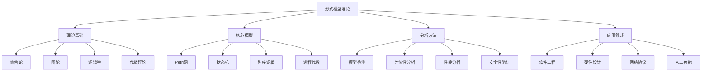

# 05-形式模型理论总结

## 目录

1. [1.0 形式模型理论概述](#10-形式模型理论概述)
2. [2.0 理论基础](#20-理论基础)
3. [3.0 核心模型](#30-核心模型)
4. [4.0 分析方法](#40-分析方法)
5. [5.0 应用领域](#50-应用领域)
6. [6.0 发展趋势](#60-发展趋势)

## 1.0 形式模型理论概述

**定义 1.1 (形式模型理论)**
研究系统行为形式化描述、分析和验证的数学理论体系。

**定义 1.2 (形式模型)**
用数学语言精确描述系统结构和行为的抽象表示。



## 2.0 理论基础

### 2.1 数学基础

**定理 2.1.1 (形式化基础)**
形式模型理论建立在以下数学基础之上：
- 集合论：提供基本的数据结构
- 图论：描述系统结构关系
- 逻辑学：定义系统行为规范
- 代数理论：提供操作语义

```rust
// 数学基础的数据结构表示
use std::collections::{HashMap, HashSet};

#[derive(Debug, Clone)]
pub struct MathematicalFoundation {
    sets: HashMap<String, HashSet<String>>,
    graphs: Vec<Graph>,
    logical_formulas: Vec<LogicalFormula>,
    algebraic_structures: Vec<AlgebraicStructure>,
}

#[derive(Debug, Clone)]
pub struct Graph {
    nodes: HashSet<String>,
    edges: Vec<(String, String)>,
}

#[derive(Debug, Clone)]
pub struct LogicalFormula {
    name: String,
    formula: String,
    semantics: String,
}

#[derive(Debug, Clone)]
pub struct AlgebraicStructure {
    name: String,
    operations: Vec<String>,
    axioms: Vec<String>,
}

impl MathematicalFoundation {
    pub fn new() -> Self {
        Self {
            sets: HashMap::new(),
            graphs: Vec::new(),
            logical_formulas: Vec::new(),
            algebraic_structures: Vec::new(),
        }
    }
    
    pub fn add_set(&mut self, name: String, elements: HashSet<String>) {
        self.sets.insert(name, elements);
    }
    
    pub fn add_graph(&mut self, graph: Graph) {
        self.graphs.push(graph);
    }
    
    pub fn add_formula(&mut self, formula: LogicalFormula) {
        self.logical_formulas.push(formula);
    }
    
    pub fn add_algebraic_structure(&mut self, structure: AlgebraicStructure) {
        self.algebraic_structures.push(structure);
    }
}
```

### 2.2 形式化方法

**定义 2.2.1 (形式化方法)**
使用数学语言精确描述和验证系统的方法。

**原则 2.2.1 (形式化原则)**
1. 精确性：使用无歧义的数学语言
2. 抽象性：关注本质特征，忽略细节
3. 可验证性：支持自动或半自动验证
4. 可组合性：支持模块化构建

```rust
#[derive(Debug, Clone)]
pub struct FormalMethod {
    name: String,
    description: String,
    mathematical_basis: String,
    verification_techniques: Vec<String>,
}

impl FormalMethod {
    pub fn new(name: String, description: String, mathematical_basis: String) -> Self {
        Self {
            name,
            description,
            mathematical_basis,
            verification_techniques: Vec::new(),
        }
    }
    
    pub fn add_verification_technique(&mut self, technique: String) {
        self.verification_techniques.push(technique);
    }
    
    pub fn is_precise(&self) -> bool {
        // 检查是否使用精确的数学语言
        self.mathematical_basis.contains("数学") || 
        self.mathematical_basis.contains("逻辑")
    }
    
    pub fn is_abstract(&self) -> bool {
        // 检查是否具有抽象性
        self.description.contains("抽象") || 
        self.description.contains("本质")
    }
    
    pub fn is_verifiable(&self) -> bool {
        // 检查是否支持验证
        !self.verification_techniques.is_empty()
    }
}
```

## 3.0 核心模型

### 3.1 Petri网模型

**定义 3.1.1 (Petri网)**
用于描述和分析并发系统的图形化数学建模工具。

**特性 3.1.1 (Petri网特性)**
- 并发性：支持多个事件同时发生
- 非确定性：支持多种可能的执行路径
- 分布性：支持分布式系统建模
- 层次性：支持系统层次化描述

```rust
// Petri网核心概念总结
#[derive(Debug, Clone)]
pub struct PetriNetSummary {
    basic_concepts: Vec<String>,
    advanced_features: Vec<String>,
    analysis_methods: Vec<String>,
    applications: Vec<String>,
}

impl PetriNetSummary {
    pub fn new() -> Self {
        Self {
            basic_concepts: vec![
                "库所(Place)".to_string(),
                "变迁(Transition)".to_string(),
                "标记(Marking)".to_string(),
                "弧(Arc)".to_string(),
                "点火(Firing)".to_string(),
            ],
            advanced_features: vec![
                "颜色Petri网".to_string(),
                "时间Petri网".to_string(),
                "随机Petri网".to_string(),
                "层次Petri网".to_string(),
                "对象Petri网".to_string(),
            ],
            analysis_methods: vec![
                "可达性分析".to_string(),
                "不变性分析".to_string(),
                "活性分析".to_string(),
                "有界性分析".to_string(),
                "性能分析".to_string(),
            ],
            applications: vec![
                "并发系统建模".to_string(),
                "工作流分析".to_string(),
                "协议验证".to_string(),
                "性能评估".to_string(),
                "死锁检测".to_string(),
            ],
        }
    }
    
    pub fn get_basic_concepts(&self) -> &Vec<String> {
        &self.basic_concepts
    }
    
    pub fn get_advanced_features(&self) -> &Vec<String> {
        &self.advanced_features
    }
    
    pub fn get_analysis_methods(&self) -> &Vec<String> {
        &self.analysis_methods
    }
    
    pub fn get_applications(&self) -> &Vec<String> {
        &self.applications
    }
}
```

### 3.2 状态机模型

**定义 3.2.1 (状态机)**
描述系统在不同状态间转换的数学模型。

**分类 3.2.1 (状态机分类)**
- 有限状态机：状态集有限
- 无限状态机：状态集无限
- 确定性状态机：转换函数确定
- 非确定性状态机：转换函数非确定

```rust
// 状态机模型总结
#[derive(Debug, Clone)]
pub struct StateMachineSummary {
    types: Vec<StateMachineType>,
    properties: Vec<String>,
    analysis_techniques: Vec<String>,
    implementation_methods: Vec<String>,
}

#[derive(Debug, Clone)]
pub struct StateMachineType {
    name: String,
    description: String,
    characteristics: Vec<String>,
    applications: Vec<String>,
}

impl StateMachineSummary {
    pub fn new() -> Self {
        Self {
            types: vec![
                StateMachineType {
                    name: "有限状态机".to_string(),
                    description: "状态集有限的自动机".to_string(),
                    characteristics: vec![
                        "状态集有限".to_string(),
                        "输入字母表有限".to_string(),
                        "转换函数确定".to_string(),
                    ],
                    applications: vec![
                        "语言识别".to_string(),
                        "协议建模".to_string(),
                        "控制系统".to_string(),
                    ],
                },
                StateMachineType {
                    name: "下推自动机".to_string(),
                    description: "带有栈的有限状态机".to_string(),
                    characteristics: vec![
                        "具有栈存储".to_string(),
                        "识别上下文无关语言".to_string(),
                        "更强的表达能力".to_string(),
                    ],
                    applications: vec![
                        "语法分析".to_string(),
                        "编译器设计".to_string(),
                        "自然语言处理".to_string(),
                    ],
                },
            ],
            properties: vec![
                "确定性".to_string(),
                "非确定性".to_string(),
                "等价性".to_string(),
                "最小化".to_string(),
                "可接受性".to_string(),
            ],
            analysis_techniques: vec![
                "等价性检查".to_string(),
                "最小化算法".to_string(),
                "语言包含".to_string(),
                "空性检查".to_string(),
                "无限性检查".to_string(),
            ],
            implementation_methods: vec![
                "表格驱动".to_string(),
                "状态模式".to_string(),
                "事件驱动".to_string(),
                "反应式编程".to_string(),
            ],
        }
    }
}
```

### 3.3 时序逻辑模型

**定义 3.3.1 (时序逻辑)**
用于描述系统随时间变化行为的模态逻辑。

**分支 3.3.1 (时序逻辑分支)**
- 线性时序逻辑：描述单条执行路径
- 分支时序逻辑：描述多条可能的执行路径
- 实时时序逻辑：考虑时间约束
- 概率时序逻辑：考虑概率行为

```rust
// 时序逻辑总结
#[derive(Debug, Clone)]
pub struct TemporalLogicSummary {
    logics: Vec<TemporalLogic>,
    operators: Vec<String>,
    semantics: Vec<String>,
    verification_methods: Vec<String>,
}

#[derive(Debug, Clone)]
pub struct TemporalLogic {
    name: String,
    description: String,
    operators: Vec<String>,
    applications: Vec<String>,
}

impl TemporalLogicSummary {
    pub fn new() -> Self {
        Self {
            logics: vec![
                TemporalLogic {
                    name: "线性时序逻辑(LTL)".to_string(),
                    description: "描述单条执行路径的时序性质".to_string(),
                    operators: vec![
                        "X (next)".to_string(),
                        "F (finally)".to_string(),
                        "G (globally)".to_string(),
                        "U (until)".to_string(),
                        "R (release)".to_string(),
                    ],
                    applications: vec![
                        "程序验证".to_string(),
                        "协议规范".to_string(),
                        "系统需求".to_string(),
                    ],
                },
                TemporalLogic {
                    name: "计算树逻辑(CTL)".to_string(),
                    description: "描述分支时间结构的时序性质".to_string(),
                    operators: vec![
                        "AX, EX (next)".to_string(),
                        "AF, EF (finally)".to_string(),
                        "AG, EG (globally)".to_string(),
                        "AU, EU (until)".to_string(),
                    ],
                    applications: vec![
                        "模型检测".to_string(),
                        "系统验证".to_string(),
                        "性质规范".to_string(),
                    ],
                },
                TemporalLogic {
                    name: "CTL*".to_string(),
                    description: "结合LTL和CTL的通用时序逻辑".to_string(),
                    operators: vec![
                        "状态公式".to_string(),
                        "路径公式".to_string(),
                        "混合表达".to_string(),
                    ],
                    applications: vec![
                        "复杂系统建模".to_string(),
                        "高级验证".to_string(),
                        "理论研究".to_string(),
                    ],
                },
            ],
            operators: vec![
                "命题逻辑运算符".to_string(),
                "时序运算符".to_string(),
                "路径量词".to_string(),
                "状态量词".to_string(),
            ],
            semantics: vec![
                "Kripke结构语义".to_string(),
                "路径语义".to_string(),
                "不动点语义".to_string(),
                "游戏语义".to_string(),
            ],
            verification_methods: vec![
                "模型检测".to_string(),
                "定理证明".to_string(),
                "抽象解释".to_string(),
                "符号执行".to_string(),
            ],
        }
    }
}
```

## 4.0 分析方法

### 4.1 模型检测

**定义 4.1.1 (模型检测)**
自动验证有限状态系统是否满足时序逻辑规范的过程。

**算法 4.1.1 (模型检测算法)**
```rust
#[derive(Debug, Clone)]
pub struct ModelCheckingSummary {
    algorithms: Vec<ModelCheckingAlgorithm>,
    techniques: Vec<String>,
    tools: Vec<String>,
    challenges: Vec<String>,
}

#[derive(Debug, Clone)]
pub struct ModelCheckingAlgorithm {
    name: String,
    description: String,
    complexity: String,
    applicability: Vec<String>,
}

impl ModelCheckingSummary {
    pub fn new() -> Self {
        Self {
            algorithms: vec![
                ModelCheckingAlgorithm {
                    name: "显式状态模型检测".to_string(),
                    description: "显式枚举所有状态进行验证".to_string(),
                    complexity: "O(|S| × |φ|)".to_string(),
                    applicability: vec![
                        "小规模系统".to_string(),
                        "精确验证".to_string(),
                        "反例生成".to_string(),
                    ],
                },
                ModelCheckingAlgorithm {
                    name: "符号模型检测".to_string(),
                    description: "使用符号表示进行验证".to_string(),
                    complexity: "O(|φ| × log|S|)".to_string(),
                    applicability: vec![
                        "大规模系统".to_string(),
                        "状态空间压缩".to_string(),
                        "BDD表示".to_string(),
                    ],
                },
                ModelCheckingAlgorithm {
                    name: "有界模型检测".to_string(),
                    description: "在有限步数内进行验证".to_string(),
                    complexity: "O(k × |φ|)".to_string(),
                    applicability: vec![
                        "无限状态系统".to_string(),
                        "SAT求解".to_string(),
                        "反例生成".to_string(),
                    ],
                },
            ],
            techniques: vec![
                "状态空间探索".to_string(),
                "不动点计算".to_string(),
                "抽象精化".to_string(),
                "反例引导抽象精化".to_string(),
                "组合验证".to_string(),
            ],
            tools: vec![
                "SPIN".to_string(),
                "NuSMV".to_string(),
                "UPPAAL".to_string(),
                "PRISM".to_string(),
                "CBMC".to_string(),
            ],
            challenges: vec![
                "状态空间爆炸".to_string(),
                "无限状态系统".to_string(),
                "实时约束".to_string(),
                "概率系统".to_string(),
                "参数化系统".to_string(),
            ],
        }
    }
}
```

### 4.2 等价性分析

**定义 4.2.1 (等价性)**
两个系统在某种观察下行为相同。

**类型 4.2.1 (等价性类型)**
- 强等价：在所有观察下行为相同
- 弱等价：在外部观察下行为相同
- 互模拟：结构化的等价关系
- 迹等价：执行迹相同

```rust
#[derive(Debug, Clone)]
pub struct EquivalenceAnalysis {
    types: Vec<EquivalenceType>,
    algorithms: Vec<String>,
    applications: Vec<String>,
    properties: Vec<String>,
}

#[derive(Debug, Clone)]
pub struct EquivalenceType {
    name: String,
    definition: String,
    characteristics: Vec<String>,
    verification_method: String,
}

impl EquivalenceAnalysis {
    pub fn new() -> Self {
        Self {
            types: vec![
                EquivalenceType {
                    name: "强等价".to_string(),
                    definition: "在所有观察下行为相同".to_string(),
                    characteristics: vec![
                        "最严格的等价关系".to_string(),
                        "保持所有行为细节".to_string(),
                        "适用于精确验证".to_string(),
                    ],
                    verification_method: "互模拟检查".to_string(),
                },
                EquivalenceType {
                    name: "弱等价".to_string(),
                    definition: "在外部观察下行为相同".to_string(),
                    characteristics: vec![
                        "忽略内部动作".to_string(),
                        "关注外部接口".to_string(),
                        "适用于系统集成".to_string(),
                    ],
                    verification_method: "观察等价检查".to_string(),
                },
                EquivalenceType {
                    name: "互模拟".to_string(),
                    definition: "结构化的等价关系".to_string(),
                    characteristics: vec![
                        "保持分支结构".to_string(),
                        "支持组合性".to_string(),
                        "适用于模块化验证".to_string(),
                    ],
                    verification_method: "互模拟算法".to_string(),
                },
            ],
            algorithms: vec![
                "互模拟算法".to_string(),
                "观察等价算法".to_string(),
                "迹等价算法".to_string(),
                "测试等价算法".to_string(),
            ],
            applications: vec![
                "系统优化".to_string(),
                "模块替换".to_string(),
                "协议验证".to_string(),
                "编译器优化".to_string(),
            ],
            properties: vec![
                "自反性".to_string(),
                "对称性".to_string(),
                "传递性".to_string(),
                "同余性".to_string(),
            ],
        }
    }
}
```

## 5.0 应用领域

### 5.1 软件工程

**应用 5.1.1 (软件工程应用)**
- 程序验证：确保程序满足规范
- 模型驱动开发：基于模型的软件开发
- 测试生成：自动生成测试用例
- 重构验证：确保重构后行为一致

```rust
#[derive(Debug, Clone)]
pub struct SoftwareEngineeringApplications {
    areas: Vec<ApplicationArea>,
    benefits: Vec<String>,
    challenges: Vec<String>,
    tools: Vec<String>,
}

#[derive(Debug, Clone)]
pub struct ApplicationArea {
    name: String,
    description: String,
    techniques: Vec<String>,
    examples: Vec<String>,
}

impl SoftwareEngineeringApplications {
    pub fn new() -> Self {
        Self {
            areas: vec![
                ApplicationArea {
                    name: "程序验证".to_string(),
                    description: "验证程序是否满足形式化规范".to_string(),
                    techniques: vec![
                        "模型检测".to_string(),
                        "定理证明".to_string(),
                        "抽象解释".to_string(),
                        "符号执行".to_string(),
                    ],
                    examples: vec![
                        "并发程序验证".to_string(),
                        "实时系统验证".to_string(),
                        "安全协议验证".to_string(),
                    ],
                },
                ApplicationArea {
                    name: "模型驱动开发".to_string(),
                    description: "基于形式化模型的软件开发方法".to_string(),
                    techniques: vec![
                        "UML建模".to_string(),
                        "状态机建模".to_string(),
                        "Petri网建模".to_string(),
                        "代码生成".to_string(),
                    ],
                    examples: vec![
                        "嵌入式系统开发".to_string(),
                        "实时系统开发".to_string(),
                        "安全关键系统".to_string(),
                    ],
                },
            ],
            benefits: vec![
                "提高软件质量".to_string(),
                "减少缺陷".to_string(),
                "降低开发成本".to_string(),
                "支持重用".to_string(),
            ],
            challenges: vec![
                "学习成本高".to_string(),
                "工具支持有限".to_string(),
                "性能开销".to_string(),
                "表达能力限制".to_string(),
            ],
            tools: vec![
                "SPIN".to_string(),
                "NuSMV".to_string(),
                "FDR".to_string(),
                "TLA+".to_string(),
                "Alloy".to_string(),
            ],
        }
    }
}
```

### 5.2 硬件设计

**应用 5.2.1 (硬件设计应用)**
- 电路验证：验证数字电路设计
- 协议验证：验证通信协议实现
- 时序分析：分析时序约束
- 功耗分析：分析功耗特性

```rust
#[derive(Debug, Clone)]
pub struct HardwareDesignApplications {
    areas: Vec<HardwareArea>,
    verification_methods: Vec<String>,
    analysis_techniques: Vec<String>,
    tools: Vec<String>,
}

#[derive(Debug, Clone)]
pub struct HardwareArea {
    name: String,
    description: String,
    models: Vec<String>,
    verification_approaches: Vec<String>,
}

impl HardwareDesignApplications {
    pub fn new() -> Self {
        Self {
            areas: vec![
                HardwareArea {
                    name: "数字电路验证".to_string(),
                    description: "验证数字电路的功能正确性".to_string(),
                    models: vec![
                        "有限状态机".to_string(),
                        "Petri网".to_string(),
                        "时序逻辑".to_string(),
                    ],
                    verification_approaches: vec![
                        "形式验证".to_string(),
                        "仿真验证".to_string(),
                        "等价性检查".to_string(),
                    ],
                },
                HardwareArea {
                    name: "协议验证".to_string(),
                    description: "验证硬件协议的正确性".to_string(),
                    models: vec![
                        "状态机模型".to_string(),
                        "Petri网模型".to_string(),
                        "时序逻辑规范".to_string(),
                    ],
                    verification_approaches: vec![
                        "模型检测".to_string(),
                        "定理证明".to_string(),
                        "协议分析".to_string(),
                    ],
                },
            ],
            verification_methods: vec![
                "形式验证".to_string(),
                "仿真验证".to_string(),
                "等价性检查".to_string(),
                "时序分析".to_string(),
            ],
            analysis_techniques: vec![
                "静态时序分析".to_string(),
                "动态时序分析".to_string(),
                "功耗分析".to_string(),
                "可靠性分析".to_string(),
            ],
            tools: vec![
                "ModelSim".to_string(),
                "FormalCheck".to_string(),
                "Synopsys VCS".to_string(),
                "Cadence Incisive".to_string(),
            ],
        }
    }
}
```

## 6.0 发展趋势

### 6.1 技术趋势

**趋势 6.1.1 (技术发展趋势)**
- 自动化程度提高：更多自动化工具和方法
- 表达能力增强：支持更复杂的系统建模
- 性能优化：提高验证和分析效率
- 集成化：与其他技术方法集成

```rust
#[derive(Debug, Clone)]
pub struct DevelopmentTrends {
    technical_trends: Vec<TechnicalTrend>,
    application_trends: Vec<String>,
    research_directions: Vec<String>,
    challenges: Vec<String>,
}

#[derive(Debug, Clone)]
pub struct TechnicalTrend {
    name: String,
    description: String,
    impact: String,
    timeline: String,
}

impl DevelopmentTrends {
    pub fn new() -> Self {
        Self {
            technical_trends: vec![
                TechnicalTrend {
                    name: "自动化验证".to_string(),
                    description: "提高验证过程的自动化程度".to_string(),
                    impact: "降低验证成本，提高效率".to_string(),
                    timeline: "短期".to_string(),
                },
                TechnicalTrend {
                    name: "机器学习集成".to_string(),
                    description: "将机器学习技术集成到形式化方法中".to_string(),
                    impact: "提高抽象和优化能力".to_string(),
                    timeline: "中期".to_string(),
                },
                TechnicalTrend {
                    name: "量子计算验证".to_string(),
                    description: "开发适用于量子系统的验证方法".to_string(),
                    impact: "支持量子系统开发".to_string(),
                    timeline: "长期".to_string(),
                },
            ],
            application_trends: vec![
                "人工智能系统验证".to_string(),
                "物联网系统建模".to_string(),
                "区块链协议验证".to_string(),
                "自动驾驶系统验证".to_string(),
            ],
            research_directions: vec![
                "无限状态系统验证".to_string(),
                "实时系统建模".to_string(),
                "概率系统分析".to_string(),
                "参数化系统验证".to_string(),
            ],
            challenges: vec![
                "状态空间爆炸问题".to_string(),
                "表达能力限制".to_string(),
                "工具易用性".to_string(),
                "性能优化".to_string(),
            ],
        }
    }
}
```

### 6.2 未来展望

**展望 6.2.1 (未来发展方向)**
- 智能化：集成人工智能技术
- 可扩展性：支持更大规模系统
- 易用性：降低使用门槛
- 标准化：建立统一标准

```rust
#[derive(Debug, Clone)]
pub struct FutureProspects {
    intelligent_verification: Vec<String>,
    scalability_improvements: Vec<String>,
    usability_enhancements: Vec<String>,
    standardization_efforts: Vec<String>,
}

impl FutureProspects {
    pub fn new() -> Self {
        Self {
            intelligent_verification: vec![
                "智能抽象生成".to_string(),
                "自动反例分析".to_string(),
                "学习型验证策略".to_string(),
                "自适应参数调优".to_string(),
            ],
            scalability_improvements: vec![
                "分布式验证".to_string(),
                "增量验证".to_string(),
                "分层验证".to_string(),
                "组合验证".to_string(),
            ],
            usability_enhancements: vec![
                "可视化建模".to_string(),
                "自然语言规范".to_string(),
                "智能辅助工具".to_string(),
                "集成开发环境".to_string(),
            ],
            standardization_efforts: vec![
                "建模语言标准".to_string(),
                "验证协议标准".to_string(),
                "工具接口标准".to_string(),
                "结果格式标准".to_string(),
            ],
        }
    }
}
```

---

## 总结

形式模型理论为复杂系统的形式化描述、分析和验证提供了坚实的数学基础。通过Petri网、状态机、时序逻辑等核心模型，结合模型检测、等价性分析等方法，能够有效地解决软件工程、硬件设计等领域中的关键问题。随着技术的不断发展，形式模型理论将在智能化、可扩展性、易用性等方面取得重要进展，为构建更可靠、更安全的系统提供有力支持。 