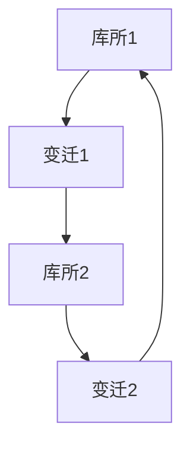

# Petri网理论

## 1. 理论基础

Petri网是一种描述并发、同步、分布式系统的数学建模工具，广泛应用于工作流、协议、控制系统等领域。

### 1.1 基本元素

- 库所（Place）
- 变迁（Transition）
- 弧（Arc）
- 标记（Token）

## 2. 形式化定义

```rust
pub struct PetriNet {
    pub places: Vec<Place>,
    pub transitions: Vec<Transition>,
    pub arcs: Vec<Arc>,
    pub marking: Marking,
}

pub struct Place { pub id: String, pub label: String }
pub struct Transition { pub id: String, pub label: String }
pub struct Arc { pub source: String, pub target: String }
pub struct Marking { pub tokens: HashMap<String, u32> }
```

## 3. 分析方法

- 可达性分析
- 死锁检测
- 活性分析
- 有界性分析

## 4. 应用场景

- 工作流建模
- 通信协议
- 并发控制
- 系统安全分析

## 5. 形式化表示



## 6. 交叉引用

- [形式模型理论总论](00-形式模型理论总论.md)
- [控制理论](02-控制理论.md)
- [状态机理论](03-状态机理论.md)
- [工作流架构理论](../04-软件架构理论/07-工作流架构理论.md)

## 7. 导航

- [返回形式模型理论总论](00-形式模型理论总论.md)
- [控制理论](02-控制理论.md)
- [状态机理论](03-状态机理论.md)
