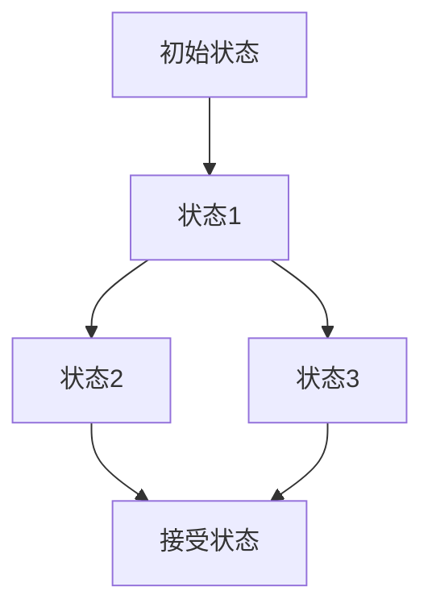

# 状态机理论

## 1. 理论基础

状态机理论用于描述系统的离散动态行为，是形式化建模、协议分析、编译器等领域的基础。

### 1.1 状态机类型

- 有限状态机（FSM）
- 推理自动机（PDA）
- 图灵机（TM）

## 2. 形式化定义

```rust
pub struct StateMachine {
    pub states: Vec<State>,
    pub alphabet: Vec<Symbol>,
    pub transitions: Vec<Transition>,
    pub initial_state: State,
    pub accepting_states: Vec<State>,
}

pub struct Transition {
    pub from: State,
    pub to: State,
    pub symbol: Symbol,
}
```

## 3. 分析方法

- 可达性分析
- 等价性判定
- 最小化算法
- 死锁检测

## 4. 应用场景

- 协议建模
- 编译器设计
- 控制系统
- 交互式系统

## 5. 形式化表示



## 6. 交叉引用

- [形式模型理论总论](00-形式模型理论总论.md)
- [Petri网理论](01-Petri网理论.md)
- [控制理论](02-控制理论.md)

## 7. 导航

- [返回形式模型理论总论](00-形式模型理论总论.md)
- [Petri网理论](01-Petri网理论.md)
- [控制理论](02-控制理论.md)
