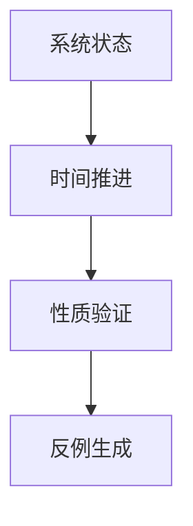

# 时序逻辑理论

## 1. 理论基础

时序逻辑理论用于描述和推理系统随时间变化的性质，是形式化验证、模型检测等领域的核心理论。

### 1.1 时序逻辑类型

- 线性时序逻辑（LTL）
- 分支时序逻辑（CTL）
- μ-演算

## 2. 形式化定义

```rust
pub enum TemporalOperator {
    X,  // 下一步
    F,  // 未来
    G,  // 全局
    U,  // 直到
}

pub struct TemporalFormula {
    pub operator: TemporalOperator,
    pub operand: Box<Formula>,
}

pub struct Formula {
    pub expr: String,
}
```

## 3. 分析方法

- 模型检测
- 性质验证
- 反例生成
- 复杂性分析

## 4. 应用场景

- 并发系统验证
- 协议正确性分析
- 安全性与活性验证
- 嵌入式系统

## 5. 形式化表示



## 6. 交叉引用

- [形式模型理论总论](00-形式模型理论总论.md)
- [状态机理论](03-状态机理论.md)
- [AI设计理论](05-AI设计理论.md)

## 7. 导航

- [返回形式模型理论总论](00-形式模型理论总论.md)
- [状态机理论](03-状态机理论.md)
- [AI设计理论](05-AI设计理论.md)
