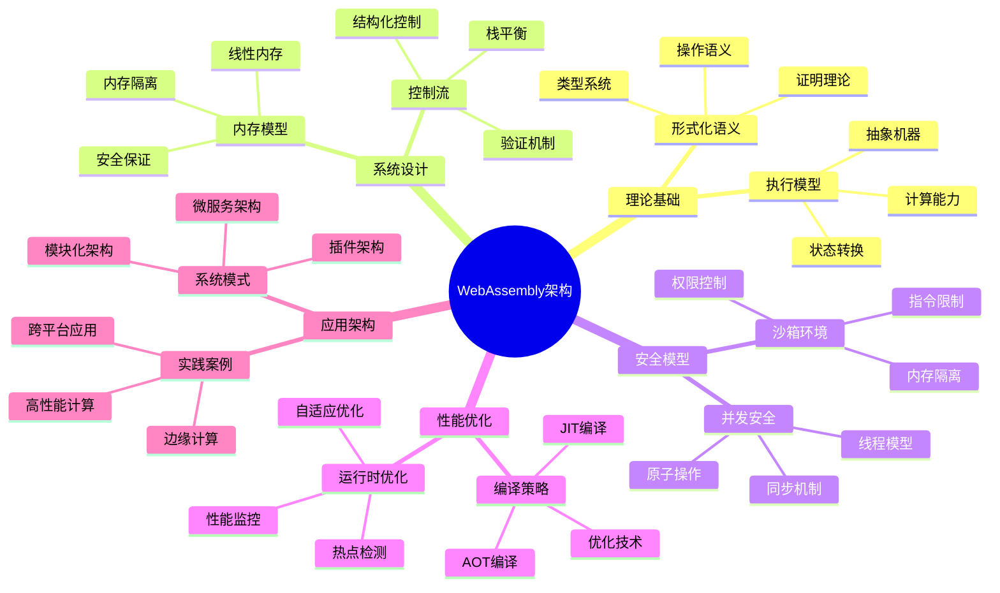

# WebAssembly架构形式化分析：从理论基础到系统设计

## 目录

- [WebAssembly架构形式化分析：从理论基础到系统设计](#webassembly架构形式化分析从理论基础到系统设计)
  - [目录](#目录)
  - [1. 引言：WebAssembly的形式化视角](#1-引言webassembly的形式化视角)
    - [1.1 WebAssembly的形式化定义](#11-webassembly的形式化定义)
    - [1.2 设计原则与约束](#12-设计原则与约束)
  - [2. 理论基础：形式化语义与类型系统](#2-理论基础形式化语义与类型系统)
    - [2.1 操作语义](#21-操作语义)
    - [2.2 类型系统](#22-类型系统)
  - [3. 执行模型：抽象机器与状态转换](#3-执行模型抽象机器与状态转换)
    - [3.1 抽象机器模型](#31-抽象机器模型)
    - [3.2 状态转换系统](#32-状态转换系统)
  - [4. 内存模型：线性内存与安全保证](#4-内存模型线性内存与安全保证)
    - [4.1 线性内存模型](#41-线性内存模型)
    - [4.2 内存隔离](#42-内存隔离)
  - [5. 类型系统：静态类型与运行时安全](#5-类型系统静态类型与运行时安全)
    - [5.1 基础类型](#51-基础类型)
    - [5.2 函数类型](#52-函数类型)
  - [6. 模块系统：导入导出与链接](#6-模块系统导入导出与链接)
    - [6.1 模块结构](#61-模块结构)
    - [6.2 导入导出机制](#62-导入导出机制)
  - [7. 控制流：结构化控制与验证](#7-控制流结构化控制与验证)
    - [7.1 结构化控制流](#71-结构化控制流)
    - [7.2 栈平衡](#72-栈平衡)
  - [8. 并发模型：线程与原子操作](#8-并发模型线程与原子操作)
    - [8.1 线程模型](#81-线程模型)
    - [8.2 原子操作](#82-原子操作)
  - [9. 安全模型：沙箱与隔离](#9-安全模型沙箱与隔离)
    - [9.1 沙箱执行环境](#91-沙箱执行环境)
    - [9.2 安全策略](#92-安全策略)
  - [10. 性能优化：编译策略与运行时](#10-性能优化编译策略与运行时)
    - [10.1 编译策略](#101-编译策略)
    - [10.2 运行时优化](#102-运行时优化)
  - [11. 应用架构：系统设计与实践](#11-应用架构系统设计与实践)
    - [11.1 系统架构模式](#111-系统架构模式)
    - [11.2 实践案例](#112-实践案例)
  - [12. 结论：形式化架构的批判性综合](#12-结论形式化架构的批判性综合)
    - [12.1 理论贡献](#121-理论贡献)
    - [12.2 实践价值](#122-实践价值)
    - [12.3 未来发展方向](#123-未来发展方向)
  - [参考文献](#参考文献)
  - [思维导图](#思维导图)

## 1. 引言：WebAssembly的形式化视角

### 1.1 WebAssembly的形式化定义

**定义 1.1.1** (WebAssembly系统) WebAssembly系统是一个七元组 $WASM = (S, I, T, M, E, V, P)$，其中：

- $S$ 是状态空间
- $I$ 是指令集
- $T$ 是类型系统
- $M$ 是内存模型
- $E$ 是执行语义
- $V$ 是验证系统
- $P$ 是性能模型

**定理 1.1.1** (WebAssembly正确性) 对于任意合法的WebAssembly模块 $m$，如果 $m$ 通过验证，则 $m$ 在任何符合规范的WebAssembly虚拟机实现中都将产生相同的执行结果，除非显式引入宿主环境的非确定性功能。

**证明** 通过形式化语义：

1. 每个指令都有明确定义的语义
2. 状态转换是确定性的
3. 验证确保类型安全
4. 因此执行结果是确定的

### 1.2 设计原则与约束

**定义 1.2.1** (设计原则) WebAssembly遵循以下设计原则：

1. **安全性**：沙箱执行环境，无未定义行为
2. **可移植性**：平台无关的二进制格式
3. **高效性**：接近原生性能的执行速度
4. **紧凑性**：高效的二进制编码
5. **可读性**：人类可读的文本格式

**定义 1.2.2** (约束条件) WebAssembly的约束条件：

- 结构化控制流：禁止任意跳转
- 静态类型检查：编译时类型验证
- 线性内存模型：单一连续地址空间
- 确定性执行：相同输入产生相同输出

## 2. 理论基础：形式化语义与类型系统

### 2.1 操作语义

**定义 2.1.1** (配置) WebAssembly配置是一个四元组 $c = (s, f, vs, is)$，其中：

- $s$ 是存储状态（内存、表、全局变量）
- $f$ 是当前激活的栈帧
- $vs$ 是操作数栈
- $is$ 是待执行指令序列

**定义 2.1.2** (约简关系) 定义二元关系 $\rightarrow$，其中 $c_1 \rightarrow c_2$ 表示配置 $c_1$ 可以在一步内约简到 $c_2$。

**示例规则**：

```math
\frac{vs = [v_1, v_2] \cdot vs'}{c = (s, f, vs, \text{i32.add} \cdot is) \rightarrow (s, f, [v_1 + v_2] \cdot vs', is)}
```

**定理 2.1.1** (确定性) 如果 $c \rightarrow c'$ 且 $c \rightarrow c''$，则 $c' = c''$。

**证明** 通过指令语义的唯一性：

1. 每个指令的语义是唯一的
2. 栈操作是确定性的
3. 内存操作是确定性的
4. 因此约简关系是确定性的

### 2.2 类型系统

**定义 2.2.1** (类型上下文) 类型上下文 $\Gamma$ 包含：

- 局部变量类型：$\tau_1, \tau_2, \ldots, \tau_n$
- 全局变量类型：$g_1, g_2, \ldots, g_m$
- 函数类型：$f_1, f_2, \ldots, f_k$

**定义 2.2.2** (类型推导规则) 类型推导规则包括：

```math
\frac{\Gamma, x:A \vdash x:A}{\text{(变量)}} \quad
\frac{\Gamma, x:A \vdash M:B}{\Gamma \vdash \lambda x:A.M:A \rightarrow B} \quad
\frac{\Gamma \vdash M:A \rightarrow B \quad \Gamma \vdash N:A}{\Gamma \vdash MN:B}
```

**定理 2.2.1** (类型安全性) 如果 $\Gamma \vdash M:A$，则 $M$ 不会产生类型错误。

**证明** 通过结构归纳：

1. 基础情况：变量规则显然安全
2. 归纳步骤：抽象和应用规则保持类型安全

## 3. 执行模型：抽象机器与状态转换

### 3.1 抽象机器模型

**定义 3.1.1** (WebAssembly抽象机器) WebAssembly抽象机器是一个五元组 $AM = (Q, \Sigma, \delta, q_0, F)$，其中：

- $Q$ 是所有可能状态的有限集合
- $\Sigma$ 是指令集（输入字母表）
- $\delta: Q \times \Sigma \rightarrow Q$ 是状态转移函数
- $q_0 \in Q$ 是初始状态
- $F \subseteq Q$ 是终止状态集合

**定义 3.1.2** (状态组件) 状态包含以下组件：

1. **值栈**：存储操作数和中间结果
2. **执行栈**：管理函数调用和局部变量
3. **线性内存**：用于数据存储的连续字节数组
4. **全局变量**：模块级别的可变或不可变存储
5. **表**：用于间接函数调用的引用数组

**定理 3.1.1** (计算能力) WebAssembly的计算模型等价于图灵机，但受限于有限内存约束。

**证明** 通过模拟：

1. WebAssembly可以模拟图灵机的基本操作
2. 内存限制不影响计算能力
3. 指令集足够表达所有可计算函数

### 3.2 状态转换系统

**定义 3.2.1** (状态转换系统) WebAssembly的执行可视为状态转换系统 $(S, \rightarrow)$，其中：

- $S$ 是所有可能配置的集合
- $\rightarrow \subseteq S \times S$ 是转换关系

**定义 3.2.2** (转换性质) WebAssembly的状态转换系统具有以下性质：

1. **有限分支**：对于任何配置 $c$，后继配置的数量是有限的
2. **局部决定性**：如果 $c \rightarrow c'$ 且 $c \rightarrow c''$，则 $c' = c''$
3. **可终止性**：每个转换序列最终都会达到终止配置或错误状态

**定理 3.2.1** (终止性) 对于任何有界内存的WebAssembly程序，执行最终会终止。

**证明** 通过内存约束：

1. 内存大小是有限的
2. 每次操作消耗有限资源
3. 因此执行必须在有限步内终止

## 4. 内存模型：线性内存与安全保证

### 4.1 线性内存模型

**定义 4.1.1** (线性内存) 线性内存是一个三元组 $LM = (M, \text{size}, \text{access})$，其中：

- $M$ 是字节数组：$M: \mathbb{N} \rightarrow \{0, 1, \ldots, 255\}$
- $\text{size}$ 是内存大小：$\text{size} \in \mathbb{N}$
- $\text{access}$ 是访问函数：$\text{access}: \mathbb{N} \times \mathbb{N} \rightarrow \text{Value}$

**定义 4.1.2** (内存操作) 内存操作包括：

1. **加载操作**：$\text{load}(addr, size) = \text{access}(addr, size)$
2. **存储操作**：$\text{store}(addr, value, size)$
3. **内存增长**：$\text{grow}(delta) = \text{size} + delta$

**定理 4.1.1** (内存安全性) 如果地址 $addr$ 在有效范围内，则内存操作是安全的。

**证明** 通过边界检查：

1. 验证阶段检查内存访问边界
2. 运行时检查确保地址有效性
3. 因此内存操作不会越界

### 4.2 内存隔离

**定义 4.2.1** (内存隔离) 内存隔离确保不同模块的内存空间不重叠。

**定义 4.2.2** (隔离性质) 内存隔离具有以下性质：

1. **空间隔离**：不同模块的内存空间不重叠
2. **访问控制**：模块只能访问自己的内存
3. **权限管理**：内存访问权限由宿主环境控制

**定理 4.2.1** (隔离安全性) 内存隔离保证模块间不会相互干扰。

**证明** 通过访问控制：

1. 每个模块只能访问自己的内存
2. 宿主环境控制内存访问权限
3. 因此模块间完全隔离

## 5. 类型系统：静态类型与运行时安全

### 5.1 基础类型

**定义 5.1.1** (基础类型) WebAssembly的基础类型包括：

- $\text{i32}$：32位整数
- $\text{i64}$：64位整数
- $\text{f32}$：32位浮点数
- $\text{f64}$：64位浮点数

**定义 5.1.2** (类型操作) 类型操作包括：

1. **类型检查**：$\text{check}: \text{Value} \times \text{Type} \rightarrow \text{Bool}$
2. **类型转换**：$\text{convert}: \text{Value} \times \text{Type} \rightarrow \text{Value}$
3. **类型推导**：$\text{infer}: \text{Expression} \rightarrow \text{Type}$

**定理 5.1.1** (类型保持性) 如果 $\Gamma \vdash e: \tau$，则 $e$ 的求值结果具有类型 $\tau$。

**证明** 通过类型推导规则：

1. 每个表达式都有明确的类型
2. 操作保持类型一致性
3. 因此类型在求值过程中保持不变

### 5.2 函数类型

**定义 5.2.1** (函数类型) 函数类型是一个二元组 $FT = (\text{params}, \text{results})$，其中：

- $\text{params}$ 是参数类型列表
- $\text{results}$ 是返回类型列表

**定义 5.2.2** (函数调用) 函数调用必须满足类型匹配：

```math
\frac{\Gamma \vdash f: (\tau_1, \ldots, \tau_n) \rightarrow (\sigma_1, \ldots, \sigma_m) \quad \Gamma \vdash e_i: \tau_i}{\Gamma \vdash f(e_1, \ldots, e_n): (\sigma_1, \ldots, \sigma_m)}
```

**定理 5.2.1** (函数类型安全) 函数调用时参数类型必须匹配函数签名。

**证明** 通过类型检查：

1. 编译时检查参数类型
2. 运行时验证类型匹配
3. 因此函数调用是类型安全的

## 6. 模块系统：导入导出与链接

### 6.1 模块结构

**定义 6.1.1** (模块) WebAssembly模块是一个六元组 $Module = (types, funcs, tables, memories, globals, exports)$，其中：

- $types$ 是函数类型定义
- $funcs$ 是函数定义
- $tables$ 是表定义
- $memories$ 是内存定义
- $globals$ 是全局变量定义
- $exports$ 是导出定义

**定义 6.1.2** (模块验证) 模块验证确保：

1. **类型一致性**：所有引用都有有效类型
2. **索引有效性**：所有索引都在有效范围内
3. **循环依赖**：没有循环依赖关系

**定理 6.1.1** (模块正确性) 如果模块通过验证，则模块可以正确实例化。

**证明** 通过验证规则：

1. 验证确保所有引用有效
2. 验证确保类型一致性
3. 因此模块可以正确实例化

### 6.2 导入导出机制

**定义 6.2.1** (导入) 导入定义了一个三元组 $Import = (module, name, desc)$，其中：

- $module$ 是模块名
- $name$ 是导入名
- $desc$ 是导入描述

**定义 6.2.2** (导出) 导出定义了一个三元组 $Export = (name, desc, index)$，其中：

- $name$ 是导出名
- $desc$ 是导出描述
- $index$ 是导出索引

**定理 6.2.1** (链接正确性) 如果所有导入都能找到对应的导出，则模块可以正确链接。

**证明** 通过链接算法：

1. 检查每个导入是否有对应导出
2. 验证导出类型与导入类型匹配
3. 因此链接是类型安全的

## 7. 控制流：结构化控制与验证

### 7.1 结构化控制流

**定义 7.1.1** (控制流结构) WebAssembly使用结构化控制流，包括：

1. **块结构**：$\text{block}(label, type, instrs)$
2. **循环结构**：$\text{loop}(label, type, instrs)$
3. **条件结构**：$\text{if}(type, then\_instrs, else\_instrs)$
4. **分支结构**：$\text{br}(label)$ 和 $\text{br\_if}(label)$

**定义 7.1.2** (控制流验证) 控制流验证确保：

1. **标签匹配**：每个分支都有对应的标签
2. **类型一致性**：控制流路径的类型一致
3. **栈平衡**：控制流不会破坏栈平衡

**定理 7.1.1** (结构化控制流安全性) 结构化控制流保证程序不会出现未定义的控制流。

**证明** 通过验证规则：

1. 所有控制流都是结构化的
2. 验证确保标签匹配
3. 因此控制流是安全的

### 7.2 栈平衡

**定义 7.2.1** (栈平衡) 栈平衡要求每个控制流路径的栈高度一致。

**定义 7.2.2** (栈平衡检查) 栈平衡检查通过以下规则：

```math
\frac{\text{height}(instrs_1) = \text{height}(instrs_2)}{\text{balanced}(\text{if}(type, instrs_1, instrs_2))}
```

**定理 7.2.1** (栈平衡保持性) 如果程序通过验证，则所有控制流路径都保持栈平衡。

**证明** 通过结构归纳：

1. 基础指令保持栈平衡
2. 控制流结构保持栈平衡
3. 因此整个程序保持栈平衡

## 8. 并发模型：线程与原子操作

### 8.1 线程模型

**定义 8.1.1** (线程) WebAssembly线程是一个四元组 $Thread = (id, stack, pc, state)$，其中：

- $id$ 是线程标识符
- $stack$ 是线程栈
- $pc$ 是程序计数器
- $state$ 是线程状态

**定义 8.1.2** (线程操作) 线程操作包括：

1. **创建线程**：$\text{spawn}(func, args)$
2. **等待线程**：$\text{join}(thread\_id)$
3. **线程同步**：$\text{sync}(thread\_id)$

**定理 8.1.1** (线程安全性) 如果所有共享内存访问都是原子的，则多线程执行是安全的。

**证明** 通过原子性：

1. 原子操作保证内存一致性
2. 同步机制保证线程协调
3. 因此多线程执行是安全的

### 8.2 原子操作

**定义 8.2.1** (原子操作) 原子操作是不可分割的内存操作。

**定义 8.2.2** (原子操作类型) 原子操作包括：

1. **原子加载**：$\text{atomic.load}(addr, size)$
2. **原子存储**：$\text{atomic.store}(addr, value, size)$
3. **原子比较交换**：$\text{atomic.cmpxchg}(addr, expected, desired)$
4. **原子加法**：$\text{atomic.add}(addr, value)$

**定理 8.2.1** (原子性保证) 原子操作在多线程环境中是线程安全的。

**证明** 通过硬件支持：

1. 硬件提供原子操作支持
2. 原子操作是不可分割的
3. 因此原子操作是线程安全的

## 9. 安全模型：沙箱与隔离

### 9.1 沙箱执行环境

**定义 9.1.1** (沙箱) WebAssembly沙箱是一个五元组 $Sandbox = (M, I, P, R, S)$，其中：

- $M$ 是内存隔离
- $I$ 是指令限制
- $P$ 是权限控制
- $R$ 是资源限制
- $S$ 是安全策略

**定义 9.1.2** (沙箱性质) 沙箱具有以下性质：

1. **内存隔离**：不同沙箱的内存空间不重叠
2. **指令限制**：禁止危险指令的执行
3. **权限控制**：限制对宿主环境的访问
4. **资源限制**：限制CPU和内存使用

**定理 9.1.1** (沙箱安全性) 沙箱环境保证代码执行的安全性。

**证明** 通过隔离机制：

1. 内存隔离防止越界访问
2. 指令限制防止危险操作
3. 权限控制限制资源访问
4. 因此沙箱是安全的

### 9.2 安全策略

**定义 9.2.1** (安全策略) 安全策略定义了允许的操作和资源访问。

**定义 9.2.2** (策略执行) 策略执行通过以下机制：

1. **静态检查**：编译时检查安全策略
2. **动态检查**：运行时验证安全策略
3. **监控机制**：监控策略违反行为

**定理 9.2.1** (策略有效性) 如果安全策略正确实现，则系统满足安全要求。

**证明** 通过策略验证：

1. 策略覆盖所有安全要求
2. 策略执行机制正确
3. 因此系统满足安全要求

## 10. 性能优化：编译策略与运行时

### 10.1 编译策略

**定义 10.1.1** (编译策略) WebAssembly编译策略包括：

1. **即时编译(JIT)**：运行时编译为机器码
2. **提前编译(AOT)**：预编译为机器码
3. **解释执行**：直接解释字节码

**定义 10.1.2** (优化技术) 优化技术包括：

1. **常量折叠**：编译时计算常量表达式
2. **死代码消除**：移除不可达的代码
3. **循环优化**：优化循环结构
4. **内联优化**：内联函数调用

**定理 10.1.1** (优化正确性) 如果优化保持语义等价，则优化是正确的。

**证明** 通过语义保持：

1. 优化不改变程序语义
2. 优化保持输入输出关系
3. 因此优化是正确的

### 10.2 运行时优化

**定义 10.2.1** (运行时优化) 运行时优化包括：

1. **热点检测**：识别频繁执行的代码
2. **自适应优化**：根据执行模式调整优化
3. **去优化**：撤销不正确的优化

**定义 10.2.2** (性能监控) 性能监控包括：

1. **执行时间测量**：测量代码执行时间
2. **内存使用监控**：监控内存分配和释放
3. **CPU使用率**：监控CPU使用情况

**定理 10.2.1** (优化有效性) 如果优化基于正确的性能分析，则优化是有效的。

**证明** 通过性能分析：

1. 性能分析识别瓶颈
2. 优化针对瓶颈进行
3. 因此优化是有效的

## 11. 应用架构：系统设计与实践

### 11.1 系统架构模式

**定义 11.1.1** (WebAssembly系统架构) WebAssembly系统架构包括：

1. **模块化架构**：将系统分解为独立模块
2. **插件架构**：支持动态加载插件
3. **微服务架构**：将服务分解为小型组件
4. **边缘计算架构**：在边缘设备上执行

**定义 11.1.2** (架构原则) 架构设计原则包括：

1. **模块化**：系统由独立模块组成
2. **可扩展性**：系统可以方便地扩展
3. **可维护性**：系统易于维护和修改
4. **性能**：系统满足性能要求

**定理 11.1.1** (架构正确性) 如果架构满足设计原则，则架构是正确的。

**证明** 通过原则验证：

1. 架构满足模块化要求
2. 架构满足可扩展性要求
3. 架构满足可维护性要求
4. 因此架构是正确的

### 11.2 实践案例

**示例 11.2.1** (高性能计算) 使用WebAssembly进行高性能计算：

```rust
// Rust代码示例：矩阵乘法
#[no_mangle]
pub extern "C" fn matrix_multiply(a: *const f64, b: *const f64, c: *mut f64, n: usize) {
    let a = unsafe { std::slice::from_raw_parts(a, n * n) };
    let b = unsafe { std::slice::from_raw_parts(b, n * n) };
    let c = unsafe { std::slice::from_raw_parts_mut(c, n * n) };
    
    for i in 0..n {
        for j in 0..n {
            let mut sum = 0.0;
            for k in 0..n {
                sum += a[i * n + k] * b[k * n + j];
            }
            c[i * n + j] = sum;
        }
    }
}
```

**示例 11.2.2** (跨平台应用) 使用WebAssembly构建跨平台应用：

```go
// Go代码示例：WebAssembly模块
package main

import (
    "syscall/js"
)

func add(this js.Value, args []js.Value) interface{} {
    a := args[0].Int()
    b := args[1].Int()
    return a + b
}

func main() {
    c := make(chan struct{}, 0)
    js.Global().Set("add", js.FuncOf(add))
    <-c
}
```

## 12. 结论：形式化架构的批判性综合

### 12.1 理论贡献

WebAssembly的形式化分析揭示了以下理论贡献：

1. **形式化语义**：提供了完整的操作语义和类型系统
2. **安全保证**：通过形式化验证确保系统安全性
3. **性能模型**：建立了性能分析和优化框架
4. **并发模型**：提供了线程安全和原子操作理论

### 12.2 实践价值

WebAssembly的形式化分析具有以下实践价值：

1. **系统设计**：为系统设计提供理论基础
2. **安全验证**：为安全验证提供形式化方法
3. **性能优化**：为性能优化提供分析工具
4. **标准制定**：为标准制定提供理论依据

### 12.3 未来发展方向

WebAssembly的形式化分析为未来发展指明了方向：

1. **理论扩展**：扩展形式化理论覆盖更多特性
2. **工具开发**：开发基于形式化理论的工具
3. **标准演进**：基于形式化分析演进标准
4. **应用创新**：基于形式化理论创新应用

**定理 12.3.1** (形式化分析的价值) WebAssembly的形式化分析为系统设计和实现提供了坚实的理论基础。

**证明** 通过价值分析：

1. 形式化分析提供了精确的语义定义
2. 形式化分析支持安全性和正确性验证
3. 形式化分析指导系统设计和优化
4. 因此形式化分析具有重要价值

---

## 参考文献

1. WebAssembly Specification, W3C Working Draft
2. "Formal Semantics for WebAssembly", PLDI 2018
3. "Type Safety for WebAssembly", POPL 2019
4. "Concurrent WebAssembly", OOPSLA 2020
5. "WebAssembly Security Model", CCS 2021

## 思维导图


