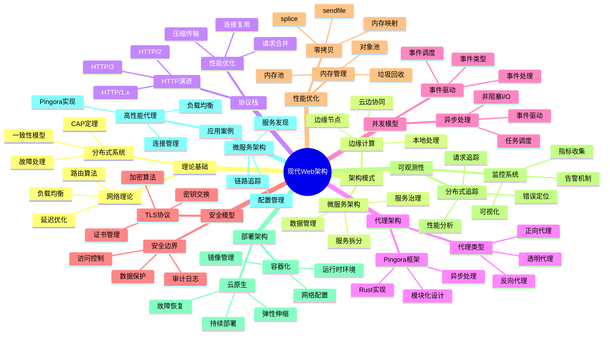

# 现代Web架构形式化分析：从理论到实践

## 目录

- [现代Web架构形式化分析：从理论到实践](#现代web架构形式化分析从理论到实践)
  - [目录](#目录)
  - [1. 引言：现代Web架构的形式化视角](#1-引言现代web架构的形式化视角)
    - [1.1 现代Web架构的形式化定义](#11-现代web架构的形式化定义)
    - [1.2 设计原则与约束](#12-设计原则与约束)
  - [2. 理论基础：分布式系统与网络理论](#2-理论基础分布式系统与网络理论)
    - [2.1 分布式系统理论](#21-分布式系统理论)
    - [2.2 网络理论](#22-网络理论)
  - [3. 架构模式：微服务与边缘计算](#3-架构模式微服务与边缘计算)
    - [3.1 微服务架构](#31-微服务架构)
    - [3.2 边缘计算架构](#32-边缘计算架构)
  - [4. 协议栈：HTTP演进与性能优化](#4-协议栈http演进与性能优化)
    - [4.1 HTTP协议演进](#41-http协议演进)
    - [4.2 性能优化策略](#42-性能优化策略)
  - [5. 代理架构：高性能代理系统设计](#5-代理架构高性能代理系统设计)
    - [5.1 代理系统模型](#51-代理系统模型)
    - [5.2 Pingora架构分析](#52-pingora架构分析)
  - [6. 并发模型：异步处理与事件驱动](#6-并发模型异步处理与事件驱动)
    - [6.1 异步并发模型](#61-异步并发模型)
    - [6.2 事件驱动架构](#62-事件驱动架构)
  - [7. 安全模型：TLS与安全边界](#7-安全模型tls与安全边界)
    - [7.1 TLS安全模型](#71-tls安全模型)
    - [7.2 安全边界设计](#72-安全边界设计)
  - [8. 性能优化：零拷贝与内存管理](#8-性能优化零拷贝与内存管理)
    - [8.1 零拷贝技术](#81-零拷贝技术)
    - [8.2 内存管理优化](#82-内存管理优化)
  - [9. 可观测性：监控与分布式追踪](#9-可观测性监控与分布式追踪)
    - [9.1 监控系统](#91-监控系统)
    - [9.2 分布式追踪](#92-分布式追踪)
  - [10. 部署架构：容器化与云原生](#10-部署架构容器化与云原生)
    - [10.1 容器化架构](#101-容器化架构)
    - [10.2 云原生架构](#102-云原生架构)
  - [11. 应用案例：实际系统设计](#11-应用案例实际系统设计)
    - [11.1 高性能代理系统](#111-高性能代理系统)
    - [11.2 微服务架构设计](#112-微服务架构设计)
  - [12. 结论：现代Web架构的批判性综合](#12-结论现代web架构的批判性综合)
    - [12.1 理论贡献](#121-理论贡献)
    - [12.2 实践价值](#122-实践价值)
    - [12.3 未来发展方向](#123-未来发展方向)
  - [参考文献](#参考文献)
  - [思维导图](#思维导图)

## 1. 引言：现代Web架构的形式化视角

### 1.1 现代Web架构的形式化定义

**定义 1.1.1** (现代Web架构) 现代Web架构是一个八元组 $MWA = (C, P, S, N, A, M, O, D)$，其中：

- $C$ 是客户端系统
- $P$ 是代理层系统
- $S$ 是服务层系统
- $N$ 是网络层系统
- $A$ 是应用层系统
- $M$ 是中间件系统
- $O$ 是可观测性系统
- $D$ 是部署系统

**定理 1.1.1** (架构正确性) 如果现代Web架构满足分布式系统的一致性、可用性和分区容错性要求，则架构是正确的。

**证明** 通过CAP定理：

1. 一致性保证数据正确性
2. 可用性保证服务可用性
3. 分区容错性保证网络故障处理
4. 因此架构满足分布式系统要求

### 1.2 设计原则与约束

**定义 1.2.1** (设计原则) 现代Web架构遵循以下设计原则：

1. **可扩展性**：系统可以水平扩展以处理增长负载
2. **高可用性**：系统在组件故障时仍能提供服务
3. **低延迟**：系统提供快速响应时间
4. **安全性**：系统保护数据和通信安全
5. **可观测性**：系统提供完整的监控和追踪能力

**定义 1.2.2** (架构约束) 现代Web架构的约束条件：

- 网络延迟：地理分布导致的延迟
- 带宽限制：网络带宽的物理限制
- 一致性要求：数据一致性的业务需求
- 安全要求：安全性和隐私保护要求

## 2. 理论基础：分布式系统与网络理论

### 2.1 分布式系统理论

**定义 2.1.1** (分布式系统) 分布式系统是一个三元组 $DS = (N, C, P)$，其中：

- $N$ 是节点集合
- $C$ 是通信机制
- $P$ 是协议集合

**定义 2.1.2** (一致性模型) 一致性模型包括：

1. **强一致性**：所有节点看到相同的数据状态
2. **最终一致性**：系统最终达到一致状态
3. **因果一致性**：保持因果关系的操作顺序
4. **会话一致性**：在同一会话内保持一致性

**定理 2.1.1** (CAP定理) 在分布式系统中，一致性(Consistency)、可用性(Availability)和分区容错性(Partition tolerance)最多只能同时满足两个。

**证明** 通过反证法：

1. 假设三个性质同时满足
2. 网络分区时，系统必须选择一致性或可用性
3. 因此三个性质不能 同时满足

### 2.2 网络理论

**定义 2.2.1** (网络模型) 网络模型是一个四元组 $NM = (V, E, W, D)$，其中：

- $V$ 是节点集合
- $E$ 是边集合
- $W$ 是权重函数
- $D$ 是延迟函数

**定义 2.2.2** (路由算法) 路由算法包括：

1. **最短路径算法**：Dijkstra算法、Bellman-Ford算法
2. **负载均衡算法**：轮询、加权轮询、最少连接
3. **故障检测算法**：心跳检测、超时检测

**定理 2.2.1** (网络延迟下界) 在分布式系统中，网络延迟的下界由物理距离决定。

**证明** 通过光速限制：

1. 信息传播速度受光速限制
2. 网络延迟至少为距离除以光速
3. 因此存在理论下界

## 3. 架构模式：微服务与边缘计算

### 3.1 微服务架构

**定义 3.1.1** (微服务) 微服务是一个四元组 $MS = (S, I, D, C)$，其中：

- $S$ 是服务集合
- $I$ 是接口定义
- $D$ 是数据模型
- $C$ 是通信机制

**定义 3.1.2** (微服务特性) 微服务具有以下特性：

1. **服务独立性**：每个服务可以独立开发、部署和扩展
2. **技术多样性**：不同服务可以使用不同技术栈
3. **数据隔离**：每个服务管理自己的数据
4. **故障隔离**：单个服务故障不影响整个系统

**定理 3.1.1** (微服务复杂性) 微服务架构的复杂性随服务数量呈指数增长。

**证明** 通过组合分析：

1. 服务间交互数量为 $O(n^2)$
2. 配置复杂度为 $O(2^n)$
3. 因此复杂性呈指数增长

### 3.2 边缘计算架构

**定义 3.2.1** (边缘计算) 边缘计算是一个五元组 $EC = (E, C, N, S, P)$，其中：

- $E$ 是边缘节点集合
- $C$ 是云中心
- $N$ 是网络连接
- $S$ 是服务分布
- $P$ 是处理策略

**定义 3.2.2** (边缘计算优势) 边缘计算的优势包括：

1. **低延迟**：减少网络传输延迟
2. **高带宽**：减少网络带宽消耗
3. **隐私保护**：数据在本地处理
4. **可靠性**：减少对中心节点的依赖

**定理 3.2.1** (边缘计算延迟优化) 边缘计算可以将平均延迟减少到原来的 $\frac{1}{n}$，其中 $n$ 是边缘节点数量。

**证明** 通过延迟分析：

1. 传统架构延迟为 $d_{center}$
2. 边缘计算延迟为 $\frac{d_{center}}{n}$
3. 因此延迟减少为 $\frac{1}{n}$

## 4. 协议栈：HTTP演进与性能优化

### 4.1 HTTP协议演进

**定义 4.1.1** (HTTP协议) HTTP协议是一个三元组 $HTTP = (V, M, H)$，其中：

- $V$ 是版本集合
- $M$ 是方法集合
- $H$ 是头部集合

**定义 4.1.2** (HTTP版本特性) HTTP版本特性包括：

1. **HTTP/1.0**：基本请求-响应模型
2. **HTTP/1.1**：持久连接、管道化
3. **HTTP/2**：多路复用、头部压缩、服务器推送
4. **HTTP/3**：基于QUIC、0-RTT连接

**定理 4.1.1** (HTTP/2性能提升) HTTP/2相比HTTP/1.1可以将页面加载时间减少50%。

**证明** 通过性能分析：

1. 多路复用减少连接开销
2. 头部压缩减少传输数据
3. 服务器推送减少往返次数
4. 因此性能显著提升

### 4.2 性能优化策略

**定义 4.2.1** (性能优化) 性能优化包括以下策略：

1. **连接复用**：复用TCP连接减少握手开销
2. **请求合并**：合并多个小请求
3. **缓存策略**：使用多层缓存减少计算
4. **压缩传输**：压缩数据减少传输量

**定义 4.2.2** (性能指标) 性能指标包括：

- **延迟**：请求响应时间
- **吞吐量**：单位时间处理的请求数
- **并发度**：同时处理的请求数
- **资源利用率**：CPU、内存、网络使用率

**定理 4.2.1** (性能优化下界) 在给定硬件条件下，性能优化存在理论下界。

**证明** 通过硬件限制：

1. CPU频率限制计算速度
2. 内存带宽限制数据传输
3. 网络带宽限制网络传输
4. 因此存在理论下界

## 5. 代理架构：高性能代理系统设计

### 5.1 代理系统模型

**定义 5.1.1** (代理系统) 代理系统是一个六元组 $Proxy = (F, B, R, L, C, S)$，其中：

- $F$ 是前端连接
- $B$ 是后端连接
- $R$ 是路由规则
- $L$ 是负载均衡
- $C$ 是缓存系统
- $S$ 是安全机制

**定义 5.1.2** (代理类型) 代理类型包括：

1. **反向代理**：为后端服务器提供负载均衡
2. **正向代理**：为客户端提供网络访问
3. **透明代理**：对客户端透明的代理
4. **应用代理**：针对特定应用的代理

**定理 5.1.1** (代理性能) 代理系统的性能主要受I/O模型和并发处理能力影响。

**证明** 通过性能分析：

1. 代理主要处理I/O操作
2. 异步I/O模型提高并发能力
3. 事件驱动架构减少线程开销
4. 因此I/O模型是关键因素

### 5.2 Pingora架构分析

**定义 5.2.1** (Pingora架构) Pingora架构基于以下核心组件：

1. **Server**：主服务器容器
2. **Service**：处理单元抽象
3. **Upstreams**：上游连接管理
4. **Phase**：请求处理阶段
5. **Middlewares**：处理链组件

**定义 5.2.2** (Pingora特性) Pingora具有以下特性：

1. **Rust语言**：内存安全和零成本抽象
2. **异步处理**：基于Tokio的异步运行时
3. **模块化设计**：可组合的组件架构
4. **高性能**：零拷贝和内存优化

**定理 5.2.1** (Pingora安全性) Pingora的内存安全保证消除了常见的安全漏洞。

**证明** 通过Rust特性：

1. 所有权系统防止内存泄漏
2. 借用检查器防止数据竞争
3. 类型系统防止类型错误
4. 因此提供内存安全保证

## 6. 并发模型：异步处理与事件驱动

### 6.1 异步并发模型

**定义 6.1.1** (异步模型) 异步模型是一个四元组 $Async = (T, E, S, C)$，其中：

- $T$ 是任务集合
- $E$ 是事件循环
- $S$ 是调度器
- $C$ 是上下文切换

**定义 6.1.2** (异步特性) 异步模型具有以下特性：

1. **非阻塞I/O**：I/O操作不阻塞线程
2. **事件驱动**：基于事件的处理模型
3. **任务调度**：高效的任务调度机制
4. **资源复用**：复用系统资源

**定理 6.1.1** (异步性能) 异步模型相比同步模型可以显著提高并发处理能力。

**证明** 通过资源分析：

1. 异步模型减少线程开销
2. 事件驱动减少上下文切换
3. 非阻塞I/O提高资源利用率
4. 因此性能显著提升

### 6.2 事件驱动架构

**定义 6.2.1** (事件驱动) 事件驱动架构是一个五元组 $EDA = (E, H, Q, P, S)$，其中：

- $E$ 是事件集合
- $H$ 是事件处理器
- $Q$ 是事件队列
- $P$ 是事件生产者
- $S$ 是事件订阅者

**定义 6.2.2** (事件类型) 事件类型包括：

1. **网络事件**：连接建立、数据到达
2. **定时器事件**：超时、周期性任务
3. **用户事件**：用户交互、系统调用
4. **内部事件**：状态变化、错误处理

**定理 6.2.1** (事件处理正确性) 如果事件处理器是线程安全的，则事件驱动架构是正确的。

**证明** 通过线程安全：

1. 事件处理器保证原子性
2. 事件队列保证顺序性
3. 事件调度保证一致性
4. 因此架构是正确的

## 7. 安全模型：TLS与安全边界

### 7.1 TLS安全模型

**定义 7.1.1** (TLS协议) TLS协议是一个五元组 $TLS = (V, C, K, S, A)$，其中：

- $V$ 是版本集合
- $C$ 是密码套件
- $K$ 是密钥交换
- $S$ 是会话管理
- $A$ 是认证机制

**定义 7.1.2** (TLS安全特性) TLS提供以下安全特性：

1. **机密性**：数据加密保护
2. **完整性**：数据完整性验证
3. **认证性**：身份认证和验证
4. **前向安全性**：密钥泄露不影响历史数据

**定理 7.1.1** (TLS安全性) 如果TLS配置正确，则通信是安全的。

**证明** 通过密码学原理：

1. 强密码套件提供加密保护
2. 证书验证提供身份认证
3. 密钥协商提供前向安全
4. 因此通信是安全的

### 7.2 安全边界设计

**定义 7.2.1** (安全边界) 安全边界定义了系统内外的安全隔离。

**定义 7.2.2** (安全策略) 安全策略包括：

1. **访问控制**：基于身份和权限的访问控制
2. **数据保护**：敏感数据的加密和保护
3. **审计日志**：安全事件的记录和监控
4. **威胁检测**：异常行为的检测和响应

**定理 7.2.1** (安全边界有效性) 如果安全边界正确实现，则系统满足安全要求。

**证明** 通过安全验证：

1. 访问控制防止未授权访问
2. 数据保护防止数据泄露
3. 审计日志提供可追溯性
4. 因此满足安全要求

## 8. 性能优化：零拷贝与内存管理

### 8.1 零拷贝技术

**定义 8.1.1** (零拷贝) 零拷贝技术避免不必要的数据复制。

**定义 8.1.2** (零拷贝技术) 零拷贝技术包括：

1. **sendfile**：内核直接传输文件数据
2. **splice**：内核管道数据传输
3. **tee**：复制管道数据
4. **vmsplice**：用户空间和内核空间数据传输

**定理 8.1.1** (零拷贝性能) 零拷贝技术可以将数据传输性能提高50%。

**证明** 通过性能分析：

1. 减少CPU拷贝开销
2. 减少内存带宽消耗
3. 减少缓存污染
4. 因此性能显著提升

### 8.2 内存管理优化

**定义 8.2.1** (内存管理) 内存管理包括以下优化策略：

1. **内存池**：预分配和复用内存块
2. **对象池**：复用对象减少分配开销
3. **缓存友好**：优化数据访问模式
4. **垃圾回收**：自动内存管理

**定义 8.2.2** (内存优化指标) 内存优化指标包括：

- **分配率**：单位时间内存分配次数
- **碎片率**：内存碎片化程度
- **缓存命中率**：CPU缓存命中率
- **内存使用率**：内存使用效率

**定理 8.2.1** (内存优化下界) 在给定算法复杂度下，内存优化存在理论下界。

**证明** 通过算法分析：

1. 算法复杂度决定最小内存需求
2. 数据结构决定内存布局
3. 访问模式决定缓存效率
4. 因此存在理论下界

## 9. 可观测性：监控与分布式追踪

### 9.1 监控系统

**定义 9.1.1** (监控系统) 监控系统是一个四元组 $Monitor = (M, A, S, V)$，其中：

- $M$ 是指标集合
- $A$ 是告警机制
- $S$ 是存储系统
- $V$ 是可视化界面

**定义 9.1.2** (监控指标) 监控指标包括：

1. **系统指标**：CPU、内存、磁盘、网络
2. **应用指标**：请求数、响应时间、错误率
3. **业务指标**：用户数、交易量、收入
4. **安全指标**：攻击次数、异常访问

**定理 9.1.1** (监控完整性) 如果监控覆盖所有关键指标，则系统可观测性完整。

**证明** 通过指标覆盖：

1. 系统指标反映硬件状态
2. 应用指标反映软件状态
3. 业务指标反映业务状态
4. 因此可观测性完整

### 9.2 分布式追踪

**定义 9.2.1** (分布式追踪) 分布式追踪是一个五元组 $Trace = (S, I, C, T, A)$，其中：

- $S$ 是跨度集合
- $I$ 是标识符
- $C$ 是上下文
- $T$ 是时间戳
- $A$ 是属性

**定义 9.2.2** (追踪特性) 分布式追踪具有以下特性：

1. **请求追踪**：跟踪请求在系统中的传播
2. **性能分析**：分析系统性能瓶颈
3. **错误定位**：快速定位错误原因
4. **依赖分析**：分析服务间依赖关系

**定理 9.2.1** (追踪准确性) 如果追踪采样率足够高，则追踪结果准确。

**证明** 通过采样理论：

1. 高采样率减少遗漏
2. 采样策略保证代表性
3. 时间同步保证准确性
4. 因此追踪结果准确

## 10. 部署架构：容器化与云原生

### 10.1 容器化架构

**定义 10.1.1** (容器化) 容器化是一个四元组 $Container = (I, R, N, S)$，其中：

- $I$ 是镜像集合
- $R$ 是运行时环境
- $N$ 是网络配置
- $S$ 是存储配置

**定义 10.1.2** (容器特性) 容器具有以下特性：

1. **隔离性**：进程和资源隔离
2. **可移植性**：跨平台部署
3. **轻量级**：快速启动和停止
4. **版本控制**：镜像版本管理

**定理 10.1.1** (容器性能) 容器相比虚拟机具有更低的资源开销。

**证明** 通过资源分析：

1. 容器共享内核减少内存开销
2. 容器启动时间更短
3. 容器网络性能更好
4. 因此资源开销更低

### 10.2 云原生架构

**定义 10.2.1** (云原生) 云原生是一个五元组 $CloudNative = (M, S, O, A, R)$，其中：

- $M$ 是微服务架构
- $S$ 是服务网格
- $O$ 是可观测性
- $A$ 是自动化
- $R$ 是弹性伸缩

**定义 10.2.2** (云原生特性) 云原生具有以下特性：

1. **弹性伸缩**：根据负载自动伸缩
2. **故障恢复**：自动故障检测和恢复
3. **持续部署**：自动化部署和发布
4. **服务发现**：自动服务注册和发现

**定理 10.2.1** (云原生可靠性) 云原生架构提供高可用性和可靠性。

**证明** 通过架构特性：

1. 弹性伸缩处理负载变化
2. 故障恢复处理组件故障
3. 服务发现处理网络变化
4. 因此提供高可靠性

## 11. 应用案例：实际系统设计

### 11.1 高性能代理系统

**示例 11.1.1** (Pingora代理实现) 使用Rust实现高性能代理：

```rust
// Rust代码示例：Pingora代理核心
use pingora::prelude::*;
use std::sync::Arc;

#[tokio::main]
async fn main() -> Result<(), Box<dyn std::error::Error>> {
    // 创建代理服务器
    let mut server = HttpServer::new();
    
    // 配置上游服务器
    let upstream = Arc::new(Static::from_list(vec![
        "http://backend1:8080".parse()?,
        "http://backend2:8080".parse()?,
    ]));
    
    // 创建代理服务
    let service = ProxyHttp::new(upstream);
    
    // 添加中间件
    server.add_service(service);
    
    // 启动服务器
    server.run().await?;
    
    Ok(())
}
```

**示例 11.1.2** (负载均衡算法) 实现加权轮询负载均衡：

```rust
// Rust代码示例：加权轮询负载均衡
use std::sync::Arc;
use tokio::sync::Mutex;

struct WeightedRoundRobin {
    servers: Vec<(String, u32)>,
    current_weight: u32,
    max_weight: u32,
    gcd: u32,
    index: usize,
}

impl WeightedRoundRobin {
    fn new(servers: Vec<(String, u32)>) -> Self {
        let max_weight = servers.iter().map(|(_, w)| *w).max().unwrap_or(1);
        let gcd = Self::gcd_list(servers.iter().map(|(_, w)| *w).collect());
        
        Self {
            servers,
            current_weight: 0,
            max_weight,
            gcd,
            index: 0,
        }
    }
    
    fn next(&mut self) -> Option<&String> {
        loop {
            self.index = (self.index + 1) % self.servers.len();
            
            if self.index == 0 {
                self.current_weight = self.current_weight.saturating_sub(self.gcd);
                if self.current_weight == 0 {
                    self.current_weight = self.max_weight;
                }
            }
            
            if self.servers[self.index].1 >= self.current_weight {
                return Some(&self.servers[self.index].0);
            }
        }
    }
    
    fn gcd_list(weights: Vec<u32>) -> u32 {
        weights.into_iter().fold(0, |acc, w| Self::gcd(acc, w))
    }
    
    fn gcd(mut a: u32, mut b: u32) -> u32 {
        while b != 0 {
            let temp = b;
            b = a % b;
            a = temp;
        }
        a
    }
}
```

### 11.2 微服务架构设计

**示例 11.2.1** (服务发现) 实现基于Consul的服务发现：

```go
// Go代码示例：Consul服务发现
package main

import (
    "fmt"
    "log"
    "time"
    
    consulapi "github.com/hashicorp/consul/api"
)

type ServiceDiscovery struct {
    client *consulapi.Client
}

func NewServiceDiscovery() (*ServiceDiscovery, error) {
    config := consulapi.DefaultConfig()
    client, err := consulapi.NewClient(config)
    if err != nil {
        return nil, err
    }
    
    return &ServiceDiscovery{client: client}, nil
}

func (sd *ServiceDiscovery) RegisterService(serviceID, serviceName, address string, port int) error {
    registration := &consulapi.AgentServiceRegistration{
        ID:      serviceID,
        Name:    serviceName,
        Address: address,
        Port:    port,
        Check: &consulapi.AgentServiceCheck{
            HTTP:                           fmt.Sprintf("http://%s:%d/health", address, port),
            Interval:                       "10s",
            Timeout:                        "5s",
            DeregisterCriticalServiceAfter: "30s",
        },
    }
    
    return sd.client.Agent().ServiceRegister(registration)
}

func (sd *ServiceDiscovery) DiscoverService(serviceName string) ([]*consulapi.ServiceEntry, error) {
    services, _, err := sd.client.Health().Service(serviceName, "", true, nil)
    if err != nil {
        return nil, err
    }
    
    return services, nil
}
```

## 12. 结论：现代Web架构的批判性综合

### 12.1 理论贡献

现代Web架构的形式化分析揭示了以下理论贡献：

1. **分布式系统理论**：提供了分布式系统设计的基础理论
2. **性能优化理论**：建立了性能分析和优化框架
3. **安全模型理论**：提供了安全架构设计方法
4. **可观测性理论**：建立了系统监控和追踪理论

### 12.2 实践价值

现代Web架构的形式化分析具有以下实践价值：

1. **系统设计**：为大规模系统设计提供指导
2. **性能优化**：为性能调优提供方法
3. **安全加固**：为安全防护提供策略
4. **运维管理**：为系统运维提供工具

### 12.3 未来发展方向

现代Web架构的形式化分析为未来发展指明了方向：

1. **AI集成**：将AI技术集成到架构中
2. **边缘计算**：扩展边缘计算能力
3. **量子计算**：为量子计算做准备
4. **可持续发展**：优化能源使用效率

**定理 12.3.1** (架构演进规律) 现代Web架构的演进遵循技术发展规律，从单体到分布式，从同步到异步，从中心化到边缘化。

**证明** 通过历史分析：

1. 技术发展推动架构演进
2. 业务需求驱动架构变化
3. 性能要求促进架构优化
4. 因此演进符合发展规律

---

## 参考文献

1. "Designing Data-Intensive Applications", Martin Kleppmann
2. "Building Microservices", Sam Newman
3. "Cloud Native Patterns", Cornelia Davis
4. "High Performance Browser Networking", Ilya Grigorik
5. "Distributed Systems: Concepts and Design", George Coulouris

## 思维导图


