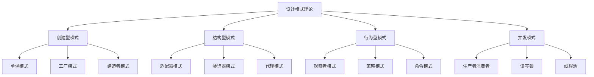

# 06-软件架构理论体系-设计模式理论

[返回主题树](../00-主题树与内容索引.md) | [主计划文档](../00-形式化架构理论统一计划.md) | [相关计划](../递归合并计划.md) | [返回上级](../README.md)

> 本文档为软件架构理论体系分支设计模式理论，所有最新进展与结论以主计划文档为准，历史细节归档于archive/。

## 目录

- [06-软件架构理论体系-设计模式理论](#06-软件架构理论体系-设计模式理论)
  - [1. 概述](#1-概述)
    - [1.1 设计模式理论概述](#11-设计模式理论概述)
    - [1.2 核心目标](#12-核心目标)
    - [1.3 设计模式层次结构](#13-设计模式层次结构)
  - [2. 主要文件与内容索引](#2-主要文件与内容索引)
    - [2.1 核心文件](#21-核心文件)
    - [2.2 相关文件](#22-相关文件)
  - [3. 设计模式的基本定义与解释](#3-设计模式的基本定义与解释)
    - [3.1 设计模式的定义](#31-设计模式的定义)
      - [3.1.1 模式结构](#311-模式结构)
      - [3.1.2 模式分类](#312-模式分类)
      - [3.1.3 模式应用](#313-模式应用)
  - [4. 设计模式的基础概念](#4-设计模式的基础概念)
    - [4.1 创建型模式](#41-创建型模式)
      - [4.1.1 单例模式](#411-单例模式)
      - [4.1.2 工厂模式](#412-工厂模式)
      - [4.1.3 建造者模式](#413-建造者模式)
  - [5. 设计模式的主要理论](#5-设计模式的主要理论)
    - [5.1 结构型模式](#51-结构型模式)
    - [5.2 行为型模式](#52-行为型模式)
    - [5.3 并发模式](#53-并发模式)
    - [5.4 架构模式](#54-架构模式)
  - [6. 设计模式的行业应用](#6-设计模式的行业应用)
    - [6.1 软件开发](#61-软件开发)
    - [6.2 系统设计](#62-系统设计)
    - [6.3 框架设计](#63-框架设计)
  - [7. 发展历史](#7-发展历史)
  - [8. 应用领域](#8-应用领域)
  - [9. 总结](#9-总结)
  - [10. 相关性跳转与引用](#10-相关性跳转与引用)

## 1. 概述

### 1.1 设计模式理论概述

设计模式是解决软件设计中常见问题的可重用解决方案，为形式化架构理论提供了设计实践的重要工具。设计模式不仅支撑软件设计，也是软件工程和系统架构的重要理论基础。

### 1.2 核心目标

- 建立软件设计的基本理论框架
- 提供可重用设计解决方案
- 支持软件工程和系统架构应用

### 1.3 设计模式层次结构

## 2. 主要文件与内容索引

### 2.1 核心文件

- [设计模式理论.md](../Matter/Software/DesignPattern/设计模式理论.md)
- [design_pattern_01.md](../Matter/Software/DesignPattern/design_pattern_01.md)
- [design_pattern_02.md](../Matter/Software/DesignPattern/design_pattern_02.md)

### 2.2 相关文件

- [00-软件架构理论统一总论.md](00-软件架构理论统一总论.md)
- [02-架构模式理论.md](02-架构模式理论.md)
- [04-分布式系统理论.md](04-分布式系统理论.md)

## 3. 设计模式的基本定义与解释

### 3.1 设计模式的定义

**定义 3.1.1** 设计模式（Design Pattern）
设计模式是解决软件设计中常见问题的可重用解决方案。

#### 3.1.1 模式结构

**定义 3.1.2** 模式结构
每个设计模式包含以下要素：
- 模式名称
- 问题描述
- 解决方案
- 效果分析

#### 3.1.2 模式分类

**定义 3.1.3** 模式分类
设计模式按目的分为：
- 创建型模式
- 结构型模式
- 行为型模式

#### 3.1.3 模式应用

**定义 3.1.4** 模式应用
设计模式的应用原则：
- 识别问题
- 选择模式
- 实现模式
- 验证效果

## 4. 设计模式的基础概念

### 4.1 创建型模式

#### 4.1.1 单例模式

**模式 4.1.1** 单例模式（Singleton Pattern）
确保一个类只有一个实例，并提供全局访问点。

**特点**：
- 私有构造函数
- 静态实例
- 延迟初始化

**应用场景**：
- 数据库连接
- 日志记录器
- 配置管理器

#### 4.1.2 工厂模式

**模式 4.1.2** 工厂模式（Factory Pattern）
定义一个创建对象的接口，让子类决定实例化哪个类。

**类型**：
- 简单工厂
- 工厂方法
- 抽象工厂

#### 4.1.3 建造者模式

**模式 4.1.3** 建造者模式（Builder Pattern）
将一个复杂对象的构建与表示分离。

**特点**：
- 分步构建
- 链式调用
- 参数验证

## 5. 设计模式的主要理论

### 5.1 结构型模式

**理论 5.1.1** 结构型模式（Structural Patterns）
结构型模式关注类和对象的组合。

**主要模式**：
- 适配器模式
- 装饰器模式
- 代理模式
- 外观模式
- 桥接模式
- 组合模式

### 5.2 行为型模式

**理论 5.2.1** 行为型模式（Behavioral Patterns）
行为型模式关注对象间的通信。

**主要模式**：
- 观察者模式
- 策略模式
- 命令模式
- 状态模式
- 模板方法模式
- 迭代器模式

### 5.3 并发模式

**理论 5.3.1** 并发模式（Concurrency Patterns）
并发模式解决多线程和分布式系统中的问题。

**主要模式**：
- 生产者消费者
- 读写锁
- 线程池
- 领导者跟随者
- 工作窃取

### 5.4 架构模式

**理论 5.4.1** 架构模式（Architectural Patterns）
架构模式定义系统的高级结构。

**主要模式**：
- MVC模式
- MVP模式
- MVVM模式
- 微服务模式
- 事件驱动模式

## 6. 设计模式的行业应用

### 6.1 软件开发

- 代码重构
- 系统设计
- 框架开发

### 6.2 系统设计

- 架构设计
- 模块设计
- 接口设计

### 6.3 框架设计

- 框架架构
- 插件系统
- 扩展机制

## 7. 发展历史

设计模式理论的发展经历了从GoF四人组到现代软件架构的演进过程。伽马、赫尔姆、约翰逊、维利赛德斯等学者为设计模式理论的发展做出了重要贡献。

## 8. 应用领域

设计模式在软件开发、系统设计、框架设计等领域有广泛应用，是现代软件工程的重要理论基础。

## 9. 总结

设计模式理论作为软件架构理论的重要分支，为形式化架构理论提供了重要的设计实践工具，是理解软件设计的基础理论。

## 10. 相关性跳转与引用

- [00-软件架构理论统一总论.md](00-软件架构理论统一总论.md)
- [02-架构模式理论.md](02-架构模式理论.md)
- [04-分布式系统理论.md](04-分布式系统理论.md)
- [05-微服务理论.md](05-微服务理论.md)
- [06-云原生理论.md](06-云原生理论.md)
- [00-主题树与内容索引.md](../00-主题树与内容索引.md)
- [进度追踪与上下文.md](../进度追踪与上下文.md)

---

> 本文件为自动归纳生成，后续将递归细化相关内容，持续补全图表、公式、代码等多表征内容。
