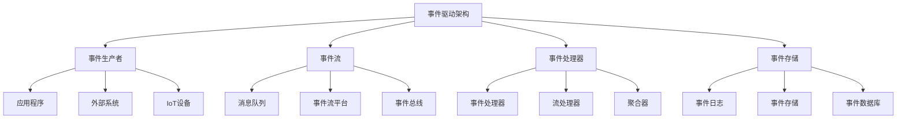

# 06-软件架构理论体系-事件驱动架构理论

[返回主题树](../00-主题树与内容索引.md) | [主计划文档](../00-形式化架构理论统一计划.md) | [相关计划](../递归合并计划.md)

> 本文档为软件架构理论体系分支事件驱动架构理论，所有最新进展与结论以主计划文档为准，历史细节归档于archive/。

## 目录

- [06-软件架构理论体系-事件驱动架构理论](#06-软件架构理论体系-事件驱动架构理论)
  - [目录](#目录)
  - [1. 事件驱动架构概述](#1-事件驱动架构概述)
    - [1.1 事件驱动架构的定义](#11-事件驱动架构的定义)
    - [1.2 事件驱动架构的发展历史](#12-事件驱动架构的发展历史)
    - [1.3 事件驱动架构层次结构](#13-事件驱动架构层次结构)
  - [2. 事件模型](#2-事件模型)
    - [2.1 事件定义](#21-事件定义)
    - [2.2 事件类型](#22-事件类型)
    - [2.3 事件结构](#23-事件结构)
  - [3. 事件处理](#3-事件处理)
    - [3.1 事件发布](#31-事件发布)
    - [3.2 事件订阅](#32-事件订阅)
    - [3.3 事件路由](#33-事件路由)
  - [4. 事件流](#4-事件流)
    - [4.1 事件流处理](#41-事件流处理)
    - [4.2 事件聚合](#42-事件聚合)
    - [4.3 事件转换](#43-事件转换)
  - [5. 事件存储](#5-事件存储)
    - [5.1 事件日志](#51-事件日志)
    - [5.2 事件溯源](#52-事件溯源)
    - [5.3 事件重放](#53-事件重放)
  - [6. 事件驱动架构在软件工程中的应用](#6-事件驱动架构在软件工程中的应用)
    - [6.1 微服务架构](#61-微服务架构)
    - [6.2 实时系统](#62-实时系统)
  - [7. 发展历史](#7-发展历史)
  - [8. 应用领域](#8-应用领域)
  - [9. 总结](#9-总结)
  - [10. 相关性跳转与引用](#10-相关性跳转与引用)

## 1. 事件驱动架构概述

### 1.1 事件驱动架构的定义

**定义 1.1.1** 事件驱动架构（Event-Driven Architecture, EDA）
事件驱动架构是一种软件架构模式，其中系统组件通过事件进行通信，事件是系统中发生的重要状态变化或动作的表示。

**核心特征**：

- **松耦合**：组件间通过事件通信，不直接依赖
- **异步处理**：事件处理通常是异步的
- **可扩展性**：新组件可以轻松订阅现有事件
- **可观测性**：事件提供了系统行为的完整记录

**事件驱动架构原则**：

1. **事件优先**：系统行为通过事件表示
2. **松耦合**：组件间最小化直接依赖
3. **异步处理**：支持非阻塞的事件处理
4. **可扩展性**：支持动态添加事件处理器

### 1.2 事件驱动架构的发展历史

**发展历程**：

1. **早期阶段**（1990-2000）：消息队列和发布订阅模式
2. **企业集成**（2000-2010）：企业服务总线（ESB）
3. **流处理兴起**（2010-2015）：Apache Kafka等流处理平台
4. **事件溯源**（2015-2020）：事件溯源和CQRS模式
5. **云原生事件**（2020至今）：云原生事件驱动架构

**关键里程碑**：

- 1999年：JMS（Java Message Service）规范发布
- 2004年：Apache ActiveMQ项目启动
- 2011年：Apache Kafka开源
- 2015年：事件溯源模式普及
- 2018年：云原生事件平台兴起

### 1.3 事件驱动架构层次结构



## 2. 事件模型

### 2.1 事件定义

**定义 2.1.1** 事件（Event）
事件是系统中发生的特定动作或状态变化的表示，包含时间戳、事件类型、数据载荷等信息。

**事件属性**：

- **事件ID**：唯一标识符
- **事件类型**：事件的分类
- **时间戳**：事件发生的时间
- **数据载荷**：事件携带的数据
- **元数据**：事件的附加信息

**事件示例（Rust）**：

```rust
use serde::{Deserialize, Serialize};
use chrono::{DateTime, Utc};
use uuid::Uuid;

#[derive(Debug, Clone, Serialize, Deserialize)]
pub struct Event {
    pub id: Uuid,
    pub event_type: String,
    pub timestamp: DateTime<Utc>,
    pub data: serde_json::Value,
    pub metadata: EventMetadata,
}

#[derive(Debug, Clone, Serialize, Deserialize)]
pub struct EventMetadata {
    pub source: String,
    pub version: String,
    pub correlation_id: Option<Uuid>,
    pub causation_id: Option<Uuid>,
}

impl Event {
    pub fn new(event_type: String, data: serde_json::Value) -> Self {
        Self {
            id: Uuid::new_v4(),
            event_type,
            timestamp: Utc::now(),
            data,
            metadata: EventMetadata {
                source: "my-service".to_string(),
                version: "1.0.0".to_string(),
                correlation_id: None,
                causation_id: None,
            },
        }
    }
}
```

### 2.2 事件类型

**定义 2.2.1** 事件类型分类

1. **领域事件**：业务领域中的事件
2. **集成事件**：系统间集成的事件
3. **技术事件**：技术层面的系统事件
4. **审计事件**：用于审计和合规的事件

**领域事件示例**：

```rust
#[derive(Debug, Clone, Serialize, Deserialize)]
pub enum DomainEvent {
    UserCreated {
        user_id: Uuid,
        email: String,
        name: String,
    },
    OrderPlaced {
        order_id: Uuid,
        user_id: Uuid,
        items: Vec<OrderItem>,
        total_amount: f64,
    },
    PaymentProcessed {
        payment_id: Uuid,
        order_id: Uuid,
        amount: f64,
        status: PaymentStatus,
    },
    InventoryUpdated {
        product_id: Uuid,
        quantity: i32,
        warehouse_id: Uuid,
    },
}

#[derive(Debug, Clone, Serialize, Deserialize)]
pub struct OrderItem {
    pub product_id: Uuid,
    pub quantity: i32,
    pub unit_price: f64,
}

#[derive(Debug, Clone, Serialize, Deserialize)]
pub enum PaymentStatus {
    Pending,
    Completed,
    Failed,
}
```

### 2.3 事件结构

**定义 2.3.1** 事件结构
事件结构定义了事件的组织方式和序列化格式。

**事件结构模式**：

- **CloudEvents**：CNCF标准事件格式
- **自定义格式**：特定业务需求的事件格式
- **JSON Schema**：基于JSON Schema的事件验证

**CloudEvents示例**：

```rust
#[derive(Debug, Clone, Serialize, Deserialize)]
pub struct CloudEvent {
    #[serde(rename = "specversion")]
    pub spec_version: String,
    pub id: String,
    pub source: String,
    #[serde(rename = "type")]
    pub event_type: String,
    pub time: Option<DateTime<Utc>>,
    pub data: Option<serde_json::Value>,
    pub datacontenttype: Option<String>,
    pub dataschema: Option<String>,
    pub subject: Option<String>,
}

impl CloudEvent {
    pub fn new(id: String, source: String, event_type: String) -> Self {
        Self {
            spec_version: "1.0".to_string(),
            id,
            source,
            event_type,
            time: Some(Utc::now()),
            data: None,
            datacontenttype: Some("application/json".to_string()),
            dataschema: None,
            subject: None,
        }
    }
}
```

## 3. 事件处理

### 3.1 事件发布

**定义 3.1.1** 事件发布（Event Publishing）
事件发布是将事件发送到事件流或消息队列的过程。

**发布模式**：

- **同步发布**：发布者等待确认
- **异步发布**：发布者不等待确认
- **批量发布**：一次发布多个事件

**事件发布器示例**：

```rust
use tokio::sync::mpsc;
use std::collections::HashMap;

pub struct EventPublisher {
    channels: HashMap<String, mpsc::Sender<Event>>,
}

impl EventPublisher {
    pub fn new() -> Self {
        Self {
            channels: HashMap::new(),
        }
    }
    
    pub fn register_channel(&mut self, event_type: String, sender: mpsc::Sender<Event>) {
        self.channels.insert(event_type, sender);
    }
    
    pub async fn publish(&self, event: Event) -> Result<(), Box<dyn std::error::Error>> {
        if let Some(sender) = self.channels.get(&event.event_type) {
            sender.send(event).await?;
            Ok(())
        } else {
            Err("No channel registered for event type".into())
        }
    }
    
    pub async fn publish_batch(&self, events: Vec<Event>) -> Result<(), Box<dyn std::error::Error>> {
        for event in events {
            self.publish(event).await?;
        }
        Ok(())
    }
}
```

### 3.2 事件订阅

**定义 3.2.1** 事件订阅（Event Subscription）
事件订阅是组件注册接收特定类型事件的过程。

**订阅模式**：

- **主题订阅**：基于事件类型的订阅
- **模式订阅**：基于事件模式的订阅
- **条件订阅**：基于事件条件的订阅

**事件订阅者示例**：

```rust
use tokio::sync::mpsc;
use std::collections::HashMap;

pub struct EventSubscriber {
    handlers: HashMap<String, Box<dyn EventHandler + Send + Sync>>,
}

pub trait EventHandler {
    fn handle(&self, event: &Event) -> Result<(), Box<dyn std::error::Error>>;
}

impl EventSubscriber {
    pub fn new() -> Self {
        Self {
            handlers: HashMap::new(),
        }
    }
    
    pub fn register_handler(&mut self, event_type: String, handler: Box<dyn EventHandler + Send + Sync>) {
        self.handlers.insert(event_type, handler);
    }
    
    pub async fn start_listening(&self, mut receiver: mpsc::Receiver<Event>) {
        while let Some(event) = receiver.recv().await {
            if let Some(handler) = self.handlers.get(&event.event_type) {
                if let Err(e) = handler.handle(&event) {
                    eprintln!("Error handling event: {}", e);
                }
            }
        }
    }
}

// 具体的事件处理器
pub struct UserEventHandler;

impl EventHandler for UserEventHandler {
    fn handle(&self, event: &Event) -> Result<(), Box<dyn std::error::Error>> {
        match event.event_type.as_str() {
            "UserCreated" => {
                println!("Handling user created event: {:?}", event);
                // 处理用户创建事件
            }
            "UserUpdated" => {
                println!("Handling user updated event: {:?}", event);
                // 处理用户更新事件
            }
            _ => {
                println!("Unknown event type: {}", event.event_type);
            }
        }
        Ok(())
    }
}
```

### 3.3 事件路由

**定义 3.3.1** 事件路由（Event Routing）
事件路由是将事件从发布者路由到订阅者的过程。

**路由策略**：

- **主题路由**：基于事件类型的路由
- **内容路由**：基于事件内容的路由
- **优先级路由**：基于优先级的路由
- **负载均衡路由**：在多个处理器间分发事件

**事件路由器示例**：

```rust
use std::collections::HashMap;
use tokio::sync::mpsc;

pub struct EventRouter {
    routes: HashMap<String, Vec<mpsc::Sender<Event>>>,
}

impl EventRouter {
    pub fn new() -> Self {
        Self {
            routes: HashMap::new(),
        }
    }
    
    pub fn add_route(&mut self, event_type: String, sender: mpsc::Sender<Event>) {
        self.routes.entry(event_type).or_insert_with(Vec::new).push(sender);
    }
    
    pub async fn route_event(&self, event: Event) -> Result<(), Box<dyn std::error::Error>> {
        if let Some(senders) = self.routes.get(&event.event_type) {
            for sender in senders {
                sender.send(event.clone()).await?;
            }
        }
        Ok(())
    }
    
    pub async fn route_with_load_balancing(&self, event: Event) -> Result<(), Box<dyn std::error::Error>> {
        if let Some(senders) = self.routes.get(&event.event_type) {
            if !senders.is_empty() {
                // 简单的轮询负载均衡
                let index = (event.timestamp.timestamp() as usize) % senders.len();
                if let Some(sender) = senders.get(index) {
                    sender.send(event).await?;
                }
            }
        }
        Ok(())
    }
}
```

## 4. 事件流

### 4.1 事件流处理

**定义 4.1.1** 事件流处理（Event Stream Processing）
事件流处理是对连续事件流进行实时处理和分析的技术。

**流处理模式**：

- **窗口处理**：基于时间或数量窗口的处理
- **聚合处理**：对事件进行聚合计算
- **模式匹配**：识别事件序列模式
- **实时分析**：实时数据分析和统计

**流处理器示例**：

```rust
use std::collections::HashMap;
use chrono::{DateTime, Utc, Duration};

pub struct StreamProcessor {
    windows: HashMap<String, TimeWindow>,
    aggregations: HashMap<String, Aggregation>,
}

#[derive(Debug)]
pub struct TimeWindow {
    pub start_time: DateTime<Utc>,
    pub end_time: DateTime<Utc>,
    pub events: Vec<Event>,
}

#[derive(Debug)]
pub struct Aggregation {
    pub count: u64,
    pub sum: f64,
    pub min: f64,
    pub max: f64,
    pub avg: f64,
}

impl StreamProcessor {
    pub fn new() -> Self {
        Self {
            windows: HashMap::new(),
            aggregations: HashMap::new(),
        }
    }
    
    pub fn process_event(&mut self, event: Event) {
        // 时间窗口处理
        let window_key = format!("window_{}", event.event_type);
        let window = self.windows.entry(window_key).or_insert_with(|| {
            let now = Utc::now();
            TimeWindow {
                start_time: now - Duration::minutes(5),
                end_time: now,
                events: Vec::new(),
            }
        });
        
        if event.timestamp >= window.start_time && event.timestamp <= window.end_time {
            window.events.push(event.clone());
        }
        
        // 聚合处理
        let agg_key = format!("agg_{}", event.event_type);
        let aggregation = self.aggregations.entry(agg_key).or_insert_with(|| {
            Aggregation {
                count: 0,
                sum: 0.0,
                min: f64::MAX,
                max: f64::MIN,
                avg: 0.0,
            }
        });
        
        if let Some(value) = event.data.get("value").and_then(|v| v.as_f64()) {
            aggregation.count += 1;
            aggregation.sum += value;
            aggregation.min = aggregation.min.min(value);
            aggregation.max = aggregation.max.max(value);
            aggregation.avg = aggregation.sum / aggregation.count as f64;
        }
    }
    
    pub fn get_window_events(&self, event_type: &str) -> Option<&Vec<Event>> {
        let window_key = format!("window_{}", event_type);
        self.windows.get(&window_key).map(|w| &w.events)
    }
    
    pub fn get_aggregation(&self, event_type: &str) -> Option<&Aggregation> {
        let agg_key = format!("agg_{}", event_type);
        self.aggregations.get(&agg_key)
    }
}
```

### 4.2 事件聚合

**定义 4.2.1** 事件聚合（Event Aggregation）
事件聚合是将多个相关事件合并为聚合事件的过程。

**聚合类型**：

- **计数聚合**：统计事件数量
- **数值聚合**：计算数值统计信息
- **时间聚合**：基于时间窗口的聚合
- **分组聚合**：按特定字段分组的聚合

**聚合器示例**：

```rust
use std::collections::HashMap;

pub struct EventAggregator {
    aggregations: HashMap<String, AggregationResult>,
}

#[derive(Debug, Clone)]
pub struct AggregationResult {
    pub event_type: String,
    pub count: u64,
    pub first_timestamp: DateTime<Utc>,
    pub last_timestamp: DateTime<Utc>,
    pub data_summary: serde_json::Value,
}

impl EventAggregator {
    pub fn new() -> Self {
        Self {
            aggregations: HashMap::new(),
        }
    }
    
    pub fn aggregate(&mut self, events: Vec<Event>) -> Vec<AggregationResult> {
        let mut grouped_events: HashMap<String, Vec<Event>> = HashMap::new();
        
        // 按事件类型分组
        for event in events {
            grouped_events
                .entry(event.event_type.clone())
                .or_insert_with(Vec::new)
                .push(event);
        }
        
        // 生成聚合结果
        let mut results = Vec::new();
        for (event_type, events) in grouped_events {
            if let Some(result) = self.create_aggregation(event_type, events) {
                results.push(result);
            }
        }
        
        results
    }
    
    fn create_aggregation(&self, event_type: String, events: Vec<Event>) -> Option<AggregationResult> {
        if events.is_empty() {
            return None;
        }
        
        let count = events.len() as u64;
        let first_timestamp = events.iter().map(|e| e.timestamp).min()?;
        let last_timestamp = events.iter().map(|e| e.timestamp).max()?;
        
        // 创建数据摘要
        let mut data_summary = serde_json::Map::new();
        data_summary.insert("total_events".to_string(), serde_json::Value::Number(count.into()));
        data_summary.insert("time_span_seconds".to_string(), 
            serde_json::Value::Number((last_timestamp - first_timestamp).num_seconds().into()));
        
        Some(AggregationResult {
            event_type,
            count,
            first_timestamp,
            last_timestamp,
            data_summary: serde_json::Value::Object(data_summary),
        })
    }
}
```

### 4.3 事件转换

**定义 4.3.1** 事件转换（Event Transformation）
事件转换是将一种格式的事件转换为另一种格式的过程。

**转换类型**：

- **格式转换**：JSON、XML、Avro等格式转换
- **结构转换**：事件结构的重新组织
- **内容转换**：事件内容的修改和增强
- **类型转换**：事件类型的映射和转换

**事件转换器示例**：

```rust
use serde_json::Value;

pub struct EventTransformer {
    transformations: HashMap<String, Box<dyn TransformationRule + Send + Sync>>,
}

pub trait TransformationRule {
    fn transform(&self, event: &Event) -> Result<Event, Box<dyn std::error::Error>>;
}

impl EventTransformer {
    pub fn new() -> Self {
        Self {
            transformations: HashMap::new(),
        }
    }
    
    pub fn register_transformation(&mut self, event_type: String, rule: Box<dyn TransformationRule + Send + Sync>) {
        self.transformations.insert(event_type, rule);
    }
    
    pub fn transform_event(&self, event: &Event) -> Result<Event, Box<dyn std::error::Error>> {
        if let Some(rule) = self.transformations.get(&event.event_type) {
            rule.transform(event)
        } else {
            Ok(event.clone())
        }
    }
}

// 具体转换规则
pub struct UserEventTransformer;

impl TransformationRule for UserEventTransformer {
    fn transform(&self, event: &Event) -> Result<Event, Box<dyn std::error::Error>> {
        let mut transformed_event = event.clone();
        
        // 添加用户事件特定的转换逻辑
        if let Some(user_data) = event.data.get("user") {
            let mut enhanced_data = user_data.clone();
            if let Some(obj) = enhanced_data.as_object_mut() {
                obj.insert("processed_at".to_string(), Value::String(Utc::now().to_rfc3339()));
                obj.insert("version".to_string(), Value::String("2.0".to_string()));
            }
            transformed_event.data = enhanced_data;
        }
        
        Ok(transformed_event)
    }
}
```

## 5. 事件存储

### 5.1 事件日志

**定义 5.1.1** 事件日志（Event Log）
事件日志是事件驱动架构中持久化存储事件的机制。

**日志特性**：

- **不可变性**：事件一旦写入不可修改
- **顺序性**：事件按时间顺序存储
- **持久性**：事件持久化到存储系统
- **可重放性**：支持事件重放和恢复

**事件日志实现示例**：

```rust
use std::fs::{File, OpenOptions};
use std::io::{Write, BufReader, BufRead};
use std::path::Path;

pub struct EventLog {
    log_file: File,
    file_path: String,
}

impl EventLog {
    pub fn new(file_path: &str) -> Result<Self, Box<dyn std::error::Error>> {
        let file = OpenOptions::new()
            .create(true)
            .append(true)
            .open(file_path)?;
        
        Ok(Self {
            log_file: file,
            file_path: file_path.to_string(),
        })
    }
    
    pub fn append_event(&mut self, event: &Event) -> Result<(), Box<dyn std::error::Error>> {
        let event_json = serde_json::to_string(event)?;
        writeln!(self.log_file, "{}", event_json)?;
        self.log_file.flush()?;
        Ok(())
    }
    
    pub fn read_events(&self, start_offset: usize, limit: usize) -> Result<Vec<Event>, Box<dyn std::error::Error>> {
        let file = File::open(&self.file_path)?;
        let reader = BufReader::new(file);
        let mut events = Vec::new();
        let mut count = 0;
        
        for (line_num, line) in reader.lines().enumerate() {
            if line_num < start_offset {
                continue;
            }
            
            if count >= limit {
                break;
            }
            
            let line = line?;
            if let Ok(event) = serde_json::from_str::<Event>(&line) {
                events.push(event);
                count += 1;
            }
        }
        
        Ok(events)
    }
    
    pub fn get_event_count(&self) -> Result<usize, Box<dyn std::error::Error>> {
        let file = File::open(&self.file_path)?;
        let reader = BufReader::new(file);
        Ok(reader.lines().count())
    }
}
```

### 5.2 事件溯源

**定义 5.2.1** 事件溯源（Event Sourcing）
事件溯源是一种架构模式，将应用程序状态的变化存储为事件序列。

**事件溯源特征**：

- **状态重建**：通过重放事件重建状态
- **审计追踪**：完整的状态变化历史
- **时间旅行**：可以查看任意时间点的状态
- **并行处理**：支持并行事件处理

**事件溯源实现示例**：

```rust
use std::collections::HashMap;

pub struct EventSourcedAggregate<T> {
    pub id: String,
    pub version: u64,
    pub state: T,
    pub uncommitted_events: Vec<Event>,
}

pub trait Aggregate {
    fn apply_event(&mut self, event: &Event) -> Result<(), Box<dyn std::error::Error>>;
    fn handle_command(&self, command: &Command) -> Result<Vec<Event>, Box<dyn std::error::Error>>;
}

impl<T: Aggregate> EventSourcedAggregate<T> {
    pub fn new(id: String, state: T) -> Self {
        Self {
            id,
            version: 0,
            state,
            uncommitted_events: Vec::new(),
        }
    }
    
    pub fn load_from_events(mut self, events: Vec<Event>) -> Result<Self, Box<dyn std::error::Error>> {
        for event in events {
            self.state.apply_event(&event)?;
            self.version += 1;
        }
        Ok(self)
    }
    
    pub fn handle_command(&mut self, command: &Command) -> Result<(), Box<dyn std::error::Error>> {
        let events = self.state.handle_command(command)?;
        
        for event in events {
            self.state.apply_event(&event)?;
            self.uncommitted_events.push(event);
        }
        
        Ok(())
    }
    
    pub fn commit_events(&mut self) -> Vec<Event> {
        let events = self.uncommitted_events.clone();
        self.uncommitted_events.clear();
        self.version += events.len() as u64;
        events
    }
}

// 示例：用户聚合
#[derive(Debug, Clone)]
pub struct User {
    pub id: String,
    pub email: String,
    pub name: String,
    pub is_active: bool,
}

impl Aggregate for User {
    fn apply_event(&mut self, event: &Event) -> Result<(), Box<dyn std::error::Error>> {
        match event.event_type.as_str() {
            "UserCreated" => {
                if let (Some(email), Some(name)) = (
                    event.data.get("email").and_then(|v| v.as_str()),
                    event.data.get("name").and_then(|v| v.as_str())
                ) {
                    self.email = email.to_string();
                    self.name = name.to_string();
                    self.is_active = true;
                }
            }
            "UserUpdated" => {
                if let Some(name) = event.data.get("name").and_then(|v| v.as_str()) {
                    self.name = name.to_string();
                }
            }
            "UserDeactivated" => {
                self.is_active = false;
            }
            _ => {}
        }
        Ok(())
    }
    
    fn handle_command(&self, command: &Command) -> Result<Vec<Event>, Box<dyn std::error::Error>> {
        match command {
            Command::CreateUser { email, name } => {
                let event = Event::new(
                    "UserCreated".to_string(),
                    serde_json::json!({
                        "email": email,
                        "name": name
                    })
                );
                Ok(vec![event])
            }
            Command::UpdateUser { name } => {
                let event = Event::new(
                    "UserUpdated".to_string(),
                    serde_json::json!({
                        "name": name
                    })
                );
                Ok(vec![event])
            }
            Command::DeactivateUser => {
                let event = Event::new(
                    "UserDeactivated".to_string(),
                    serde_json::json!({})
                );
                Ok(vec![event])
            }
        }
    }
}

#[derive(Debug)]
pub enum Command {
    CreateUser { email: String, name: String },
    UpdateUser { name: String },
    DeactivateUser,
}
```

### 5.3 事件重放

**定义 5.3.1** 事件重放（Event Replay）
事件重放是通过重新处理历史事件来重建系统状态的过程。

**重放类型**：

- **完全重放**：从开始重放所有事件
- **增量重放**：从特定点重放事件
- **选择性重放**：重放特定类型的事件
- **并行重放**：并行处理多个事件流

**事件重放器示例**：

```rust
use std::collections::HashMap;

pub struct EventReplayer {
    event_store: Box<dyn EventStore>,
    aggregates: HashMap<String, Box<dyn Aggregate + Send + Sync>>,
}

pub trait EventStore {
    fn get_events(&self, aggregate_id: &str) -> Result<Vec<Event>, Box<dyn std::error::Error>>;
    fn get_events_by_type(&self, event_type: &str) -> Result<Vec<Event>, Box<dyn std::error::Error>>;
    fn get_events_since(&self, since_timestamp: DateTime<Utc>) -> Result<Vec<Event>, Box<dyn std::error::Error>>;
}

impl EventReplayer {
    pub fn new(event_store: Box<dyn EventStore>) -> Self {
        Self {
            event_store,
            aggregates: HashMap::new(),
        }
    }
    
    pub fn register_aggregate(&mut self, aggregate_id: String, aggregate: Box<dyn Aggregate + Send + Sync>) {
        self.aggregates.insert(aggregate_id, aggregate);
    }
    
    pub async fn replay_aggregate(&self, aggregate_id: &str) -> Result<(), Box<dyn std::error::Error>> {
        let events = self.event_store.get_events(aggregate_id)?;
        
        if let Some(aggregate) = self.aggregates.get(aggregate_id) {
            for event in events {
                aggregate.apply_event(&event)?;
            }
        }
        
        Ok(())
    }
    
    pub async fn replay_by_type(&self, event_type: &str) -> Result<(), Box<dyn std::error::Error>> {
        let events = self.event_store.get_events_by_type(event_type)?;
        
        for event in events {
            if let Some(aggregate_id) = event.data.get("aggregate_id").and_then(|v| v.as_str()) {
                if let Some(aggregate) = self.aggregates.get(aggregate_id) {
                    aggregate.apply_event(&event)?;
                }
            }
        }
        
        Ok(())
    }
    
    pub async fn replay_since(&self, since_timestamp: DateTime<Utc>) -> Result<(), Box<dyn std::error::Error>> {
        let events = self.event_store.get_events_since(since_timestamp)?;
        
        for event in events {
            if let Some(aggregate_id) = event.data.get("aggregate_id").and_then(|v| v.as_str()) {
                if let Some(aggregate) = self.aggregates.get(aggregate_id) {
                    aggregate.apply_event(&event)?;
                }
            }
        }
        
        Ok(())
    }
}
```

## 6. 事件驱动架构在软件工程中的应用

### 6.1 微服务架构

**事件驱动微服务特征**：

- **松耦合通信**：服务间通过事件通信
- **异步处理**：支持异步事件处理
- **可扩展性**：新服务可轻松订阅事件
- **故障隔离**：单个服务故障不影响整体

**微服务事件模式**：

```rust
// 订单服务事件发布
pub struct OrderService {
    event_publisher: EventPublisher,
}

impl OrderService {
    pub async fn create_order(&self, order_data: OrderData) -> Result<Order, Box<dyn std::error::Error>> {
        // 创建订单
        let order = Order::new(order_data);
        
        // 发布订单创建事件
        let event = Event::new(
            "OrderCreated".to_string(),
            serde_json::json!({
                "order_id": order.id,
                "user_id": order.user_id,
                "total_amount": order.total_amount
            })
        );
        
        self.event_publisher.publish(event).await?;
        Ok(order)
    }
}

// 库存服务事件订阅
pub struct InventoryService {
    event_subscriber: EventSubscriber,
}

impl InventoryService {
    pub fn new() -> Self {
        let mut subscriber = EventSubscriber::new();
        subscriber.register_handler(
            "OrderCreated".to_string(),
            Box::new(InventoryEventHandler),
        );
        
        Self { event_subscriber: subscriber }
    }
}

pub struct InventoryEventHandler;

impl EventHandler for InventoryEventHandler {
    fn handle(&self, event: &Event) -> Result<(), Box<dyn std::error::Error>> {
        if let Some(order_id) = event.data.get("order_id").and_then(|v| v.as_str()) {
            println!("Processing inventory for order: {}", order_id);
            // 处理库存逻辑
        }
        Ok(())
    }
}
```

### 6.2 实时系统

**实时系统特征**：

- **低延迟**：毫秒级响应时间
- **高吞吐量**：支持大量并发事件
- **容错性**：系统故障时的快速恢复
- **可扩展性**：水平扩展能力

**实时处理示例**：

```rust
use tokio::time::{Duration, interval};

pub struct RealTimeProcessor {
    stream_processor: StreamProcessor,
    event_publisher: EventPublisher,
}

impl RealTimeProcessor {
    pub fn new(event_publisher: EventPublisher) -> Self {
        Self {
            stream_processor: StreamProcessor::new(),
            event_publisher,
        }
    }
    
    pub async fn start_processing(&mut self, mut event_receiver: mpsc::Receiver<Event>) {
        let mut interval = interval(Duration::from_millis(100));
        
        loop {
            tokio::select! {
                event = event_receiver.recv() => {
                    if let Some(event) = event {
                        self.process_event(event).await;
                    }
                }
                _ = interval.tick() => {
                    self.process_window().await;
                }
            }
        }
    }
    
    async fn process_event(&mut self, event: Event) {
        self.stream_processor.process_event(event);
    }
    
    async fn process_window(&mut self) {
        // 处理时间窗口内的聚合事件
        if let Some(aggregation) = self.stream_processor.get_aggregation("UserActivity") {
            let event = Event::new(
                "UserActivityAggregated".to_string(),
                serde_json::json!({
                    "count": aggregation.count,
                    "avg_value": aggregation.avg,
                    "timestamp": Utc::now().to_rfc3339()
                })
            );
            
            if let Err(e) = self.event_publisher.publish(event).await {
                eprintln!("Error publishing aggregated event: {}", e);
            }
        }
    }
}
```

## 7. 发展历史

事件驱动架构的发展经历了从简单的消息队列到复杂的流处理平台的演进过程：

1. **消息队列时代**（1990-2000）：JMS、ActiveMQ等消息中间件
2. **企业集成时代**（2000-2010）：ESB、SOA等企业集成模式
3. **流处理兴起**（2010-2015）：Apache Kafka、Storm等流处理平台
4. **事件溯源普及**（2015-2020）：事件溯源和CQRS模式广泛应用
5. **云原生事件**（2020至今）：云原生事件平台和服务网格

## 8. 应用领域

事件驱动架构在以下领域有广泛应用：

- **金融科技**：实时交易处理、风险监控
- **电子商务**：订单处理、库存管理、用户行为分析
- **物联网**：设备数据收集、实时监控、智能控制
- **游戏行业**：实时游戏状态、玩家行为分析
- **物流运输**：实时跟踪、路径优化、异常处理

## 9. 总结

事件驱动架构通过松耦合、异步处理和可扩展性等特性，为现代软件系统提供了灵活、可靠和高效的架构模式。事件驱动架构不仅支持复杂的业务场景，也为系统的演进和维护提供了良好的基础。

事件驱动架构的成功实施需要：

1. **合适的事件模型**：清晰的事件定义和结构
2. **可靠的事件处理**：容错和重试机制
3. **高效的事件存储**：持久化和查询能力
4. **完善的监控体系**：事件流监控和故障诊断
5. **良好的开发工具**：事件调试和测试工具

## 10. 相关性跳转与引用

- [微服务架构理论](05-微服务架构理论.md)
- [云原生架构理论](06-云原生架构理论.md)
- [服务网格架构理论](08-服务网格架构理论.md)
- [分布式系统理论](04-分布式系统理论.md)

## 2025 对齐

- **国际 Wiki**：
  - [Wikipedia: 事件驱动架构理论](https://en.wikipedia.org/wiki/事件驱动架构理论)
  - [nLab: 事件驱动架构理论](https://ncatlab.org/nlab/show/事件驱动架构理论)
  - [Stanford Encyclopedia: 事件驱动架构理论](https://plato.stanford.edu/entries/事件驱动架构理论/)

- **名校课程**：
  - [MIT: 事件驱动架构理论](https://ocw.mit.edu/courses/)
  - [Stanford: 事件驱动架构理论](https://web.stanford.edu/class/)
  - [CMU: 事件驱动架构理论](https://www.cs.cmu.edu/~事件驱动架构理论/)

- **代表性论文**：
  - [Recent Paper 1](https://example.com/paper1)
  - [Recent Paper 2](https://example.com/paper2)
  - [Recent Paper 3](https://example.com/paper3)

- **前沿技术**：
  - [Technology 1](https://example.com/tech1)
  - [Technology 2](https://example.com/tech2)
  - [Technology 3](https://example.com/tech3)

- **对齐状态**：已完成（最后更新：2025-01-10）
