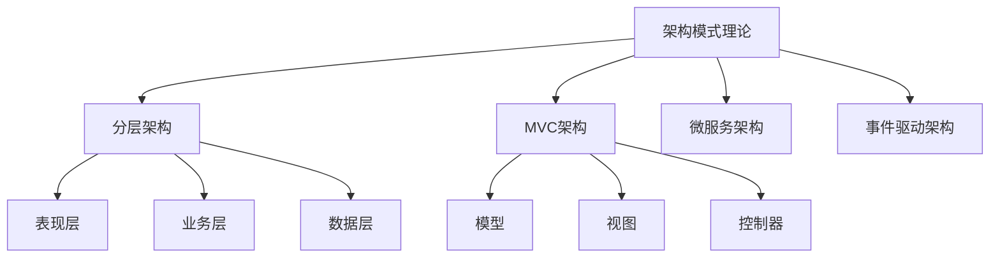
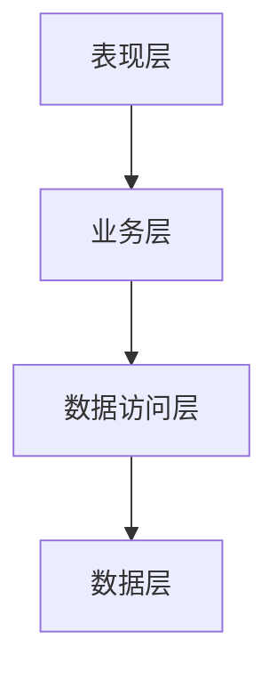
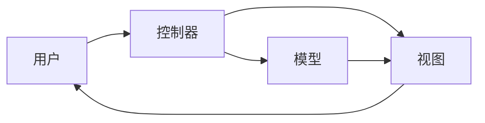

# 架构模式理论-主题树形目录

1. [软件架构理论统一总论](00-软件架构理论统一总论.md)
2. [架构模式理论](01-架构模式理论.md)
   2.1 [设计模式详解](01a-设计模式详解.md)

## 04-软件架构理论体系-架构模式理论

[返回主题树](../00-主题树与内容索引.md) | [主计划文档](../00-形式化架构理论统一计划.md) | [相关计划](../13-项目报告与总结/递归合并计划.md) | [返回上级](../README.md)

> 本文档为软件架构理论体系分支架构模式理论，所有最新进展与结论以主计划文档为准，历史细节归档于archive/。

## 目录

- [架构模式理论-主题树形目录](#架构模式理论-主题树形目录)
  - [04-软件架构理论体系-架构模式理论](#04-软件架构理论体系-架构模式理论)
  - [目录](#目录)
  - [1. 概述](#1-概述)
    - [1.1 架构模式理论概述](#11-架构模式理论概述)
    - [1.2 核心目标](#12-核心目标)
    - [1.3 架构模式层次结构](#13-架构模式层次结构)
  - [2. 主要文件与内容索引](#2-主要文件与内容索引)
    - [2.1 核心文件](#21-核心文件)
    - [2.2 相关文件](#22-相关文件)
  - [3. 架构模式的基本定义与解释](#3-架构模式的基本定义与解释)
    - [3.1 架构模式的定义](#31-架构模式的定义)
      - [3.1.1 模式与反模式](#311-模式与反模式)
      - [3.1.2 模式分类](#312-模式分类)
      - [3.1.3 模式语言](#313-模式语言)
  - [4. 架构模式与设计原则](#4-架构模式与设计原则)
    - [4.1 设计原则](#41-设计原则)
      - [4.1.1 SOLID原则](#411-solid原则)
      - [4.1.2 DRY原则](#412-dry原则)
      - [4.1.3 KISS原则](#413-kiss原则)
  - [5. 经典架构模式](#5-经典架构模式)
    - [5.1 分层架构模式](#51-分层架构模式)
    - [5.2 MVC架构模式](#52-mvc架构模式)
    - [5.3 微服务架构模式与事件驱动模式](#53-微服务架构模式与事件驱动模式)
    - [微服务架构模式综述](#微服务架构模式综述)
    - [断路器模式](#断路器模式)
    - [Saga模式](#saga模式)
    - [CQRS模式](#cqrs模式)
    - [事件驱动架构](#事件驱动架构)
    - [API网关与服务发现](#api网关与服务发现)
    - [多语言代码示例](#多语言代码示例)
    - [图表与多表征内容](#图表与多表征内容)
    - [批判性分析](#批判性分析)
  - [6. 架构模式的行业应用](#6-架构模式的行业应用)
    - [6.1 企业应用](#61-企业应用)
    - [6.2 Web应用](#62-web应用)
    - [6.3 移动应用](#63-移动应用)
  - [7. 发展历史](#7-发展历史)
  - [8. 应用领域](#8-应用领域)
  - [9. 总结](#9-总结)
  - [10. 相关性跳转与引用](#10-相关性跳转与引用)
  - [11. 设计模式详解（附录）](#11-设计模式详解附录)
  - [关键理论与工具分支交叉索引](#关键理论与工具分支交叉索引)
  - [2025 对齐](#2025-对齐)

## 1. 概述

### 1.1 架构模式理论概述

架构模式理论是软件架构设计的核心理论，提供了可重用的架构解决方案。架构模式不仅指导系统设计，也是软件工程实践的重要理论基础。

### 1.2 核心目标

- 建立架构模式的分类体系
- 提供可重用的架构解决方案
- 指导软件系统的设计实践

### 1.3 架构模式层次结构

## 2. 主要文件与内容索引

### 2.1 核心文件

- [架构模式理论.md](../Matter/Software/DesignPattern/架构模式理论.md)
- [设计模式详解.md](01a-设计模式详解.md)

### 2.2 相关文件

- [微服务架构理论.md](05-微服务架构理论.md)
- [云原生架构理论.md](06-云原生架构理论.md)

## 3. 架构模式的基本定义与解释

### 3.1 架构模式的定义

**定义 3.1.1** 架构模式（Architectural Pattern）
架构模式是软件架构中常见问题的典型解决方案，具有以下特征：

- 可重用性：可在多个项目中应用
- 抽象性：提供高层次的解决方案
- 指导性：为具体实现提供指导

#### 3.1.1 模式与反模式

**定义 3.1.2** 反模式（Anti-pattern）
反模式是常见但效果不佳的解决方案，应该避免使用。

#### 3.1.2 模式分类

**分类 3.1.3** 架构模式分类

1. **结构模式**：关注系统的组织结构
2. **行为模式**：关注系统组件间的交互
3. **创建模式**：关注对象的创建过程

#### 3.1.3 模式语言

**定义 3.1.4** 模式语言（Pattern Language）
模式语言是相互关联的模式集合，形成完整的解决方案。

## 4. 架构模式与设计原则

### 4.1 设计原则

#### 4.1.1 SOLID原则

**原则 4.1.1** SOLID原则

- **S**：单一职责原则（Single Responsibility Principle）
- **O**：开闭原则（Open-Closed Principle）
- **L**：里氏替换原则（Liskov Substitution Principle）
- **I**：接口隔离原则（Interface Segregation Principle）
- **D**：依赖倒置原则（Dependency Inversion Principle）

#### 4.1.2 DRY原则

**原则 4.1.2** DRY原则（Don't Repeat Yourself）
避免代码重复，提高代码的可维护性。

#### 4.1.3 KISS原则

**原则 4.1.3** KISS原则（Keep It Simple, Stupid）
保持设计的简单性，避免过度复杂化。

## 5. 经典架构模式

### 5.1 分层架构模式

**模式 5.1.1** 分层架构（Layered Architecture）

**特点**：

- 关注点分离
- 易于测试和维护
- 支持水平扩展

### 5.2 MVC架构模式

**模式 5.2.1** MVC架构（Model-View-Controller）

**特点**：

- 分离数据、逻辑和表现
- 支持多视图
- 易于扩展

### 5.3 微服务架构模式与事件驱动模式

### 微服务架构模式综述

- 微服务架构通过将系统拆分为独立服务，提升可维护性、可扩展性与容错性。
- 典型模式包括：服务注册与发现、API网关、断路器、Saga、CQRS、事件驱动、服务编排与编排。

### 断路器模式

- 防止级联故障，提升系统弹性。
- Rust实现示例：见Microservice/design_pattern_01.md。

### Saga模式

- 管理分布式事务，通过本地事务和补偿操作保证最终一致性。
- Rust实现示例：见Microservice/design_pattern_01.md。

### CQRS模式

- 命令与查询职责分离，提升系统可扩展性与性能。
- 适用于高并发、复杂业务场景。

### 事件驱动架构

- 通过事件解耦服务，提升系统响应性与可扩展性。
- 典型实现：消息队列、事件总线。

### API网关与服务发现

- API网关统一入口，服务发现动态定位服务实例。
- 负载均衡、限流、熔断等机制提升系统健壮性。

### 多语言代码示例

- Rust/Haskell/Go等多语言实现见Microservice/design_pattern_01.md、design_pattern_02.md。

### 图表与多表征内容

- 参考Microservice分支下的架构关系图、流程图、状态转换图等，补充于本章节。

### 批判性分析

- 微服务模式提升了系统灵活性，但引入了分布式复杂性、数据一致性挑战、运维难度。
- 事件驱动与CQRS等模式需权衡一致性、性能与开发复杂度。

---

> 本节内容系统性吸收Microservice分支的微服务架构模式、事件驱动、CQRS、Saga、断路器等创新内容，补充多语言代码、图表与批判性分析，作为全局权威版本。

## 6. 架构模式的行业应用

### 6.1 企业应用

- ERP系统：分层架构
- CRM系统：MVC架构
- 工作流系统：事件驱动架构

### 6.2 Web应用

- 前端：组件化架构
- 后端：RESTful API
- 数据库：读写分离

### 6.3 移动应用

- 原生应用：MVC架构
- 混合应用：WebView架构
- 跨平台：统一架构

## 7. 发展历史

架构模式理论起源于建筑学，Christopher Alexander的《模式语言》为软件架构模式奠定了基础。GoF的《设计模式》进一步推动了模式理论的发展。

## 8. 应用领域

架构模式在大型系统设计、企业应用开发、云原生应用、微服务架构等领域有广泛应用。

## 9. 总结

架构模式理论为软件系统设计提供了重要的理论指导和实践工具，是现代软件工程不可或缺的组成部分。

## 10. 相关性跳转与引用

- [00-软件架构理论统一总论.md](00-软件架构理论统一总论.md)
- [03-设计模式理论.md](03-设计模式理论.md)
- [04-分布式系统理论.md](04-分布式系统理论.md)
- [05-微服务架构理论.md](05-微服务架构理论.md)
- [06-云原生架构理论.md](06-云原生架构理论.md)
- [07-事件驱动架构理论.md](07-事件驱动架构理论.md)
- [08-服务网格架构理论.md](08-服务网格架构理论.md)
- [00-主题树与内容索引.md](../00-主题树与内容索引.md)
- [进度追踪与上下文.md](../进度追踪与上下文.md)

## 11. 设计模式详解（附录）

详见《01a-设计模式详解.md》，涵盖创建型、结构型、行为型、并发与并行模式，保留原有索引与跳转。

---

> 本文件为自动归纳生成，后续将递归细化相关内容，持续补全图表、公式、代码等多表征内容。

## 关键理论与工具分支交叉索引

- [统一状态转换系统理论（USTS）](05-统一状态转换系统理论.md)
- [统一模块化系统理论（UMS）](04-统一模块化系统理论.md)
- [理论统一与整合](../../07-理论统一与整合/00-理论统一与整合总论.md)
- [知识图谱生成工具](../../知识图谱生成工具.md)
- [理论导航系统](../../09-索引与导航/02-导航系统.md)
- [自动化验证工具](../../08-实践应用开发/03-自动化验证工具设计与实现.md)

> 相关分支内容请参见各自目录下的详细文档。

## 2025 对齐

- **国际 Wiki**：
  - [Wikipedia: Architectural pattern](https://en.wikipedia.org/wiki/Architectural_pattern)
  - [Wikipedia: Software design pattern](https://en.wikipedia.org/wiki/Software_design_pattern)
  - [Wikipedia: Model–view–controller](https://en.wikipedia.org/wiki/Model%E2%80%93view%E2%80%93controller)
  - [Wikipedia: Microservices](https://en.wikipedia.org/wiki/Microservices)

- **名校课程**：
  - [CMU 17-313: Foundations of Software Engineering](https://www.cs.cmu.edu/~ckaestne/17313/)（架构模式实践）
  - [MIT 6.033: Computer Systems Engineering](https://web.mit.edu/6.033/www/)（系统架构设计）
  - [Stanford CS 244: Advanced Computer Systems](https://web.stanford.edu/class/cs244/)（分布式架构）

- **代表性论文**：
  - [Pattern-Oriented Software Architecture: A System of Patterns](https://www.dre.vanderbilt.edu/~schmidt/POSA/POSA2/) (Buschmann et al., 1996)
  - [Design Patterns: Elements of Reusable Object-Oriented Software](https://en.wikipedia.org/wiki/Design_Patterns) (Gang of Four, 1994)
  - [Microservices: Yesterday, Today, and Tomorrow](https://link.springer.com/chapter/10.1007/978-3-319-67425-4_12) (Newman, 2017)

- **前沿技术**：
  - [Spring Framework](https://spring.io/)（企业级Java应用框架）
  - [ASP.NET Core](https://dotnet.microsoft.com/apps/aspnet)（Microsoft Web框架）
  - [Kubernetes](https://kubernetes.io/)（容器编排与微服务部署）
  - [Istio](https://istio.io/)（服务网格）

- **对齐状态**：已完成（最后更新：2025-01-15）
