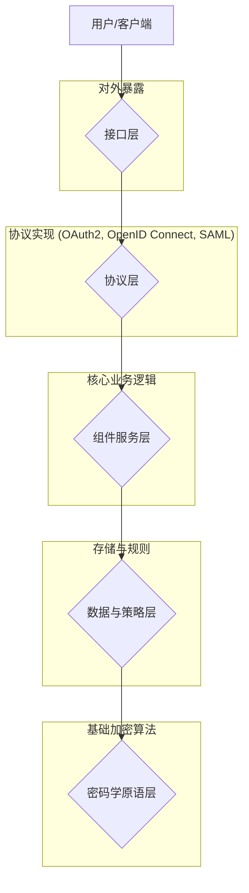

# 认证授权组件化架构深度解析-主题树形目录

1. [软件架构理论统一总论](00-软件架构理论统一总论.md)
2. [架构模式理论](01-架构模式理论.md)
   2.1 [设计模式详解](01a-设计模式详解.md)
3. [组件理论](02-组件理论.md)
   3.1 [认证授权组件化架构深度解析](02a-认证授权组件化架构深度解析.md)

## 目录

- [认证授权组件化架构深度解析-主题树形目录](#认证授权组件化架构深度解析-主题树形目录)
  - [目录](#目录)
  - [1. 核心概念与形式化定义](#1-核心概念与形式化定义)
    - [1.1 认证 (Authentication)](#11-认证-authentication)
    - [1.2 授权 (Authorization)](#12-授权-authorization)
    - [1.3 会话 (Session)](#13-会话-session)
    - [1.4 凭证 (Credential) \& 主体 (Principal)](#14-凭证-credential--主体-principal)
  - [2. 认证授权系统的分层架构](#2-认证授权系统的分层架构)
    - [2.1 接口层 (Interface Layer)](#21-接口层-interface-layer)
    - [2.2 协议层 (Protocol Layer)](#22-协议层-protocol-layer)
    - [2.3 组件服务层 (Component Service Layer)](#23-组件服务层-component-service-layer)
    - [2.4 数据与策略层 (Data \& Policy Layer)](#24-数据与策略层-data--policy-layer)
    - [2.5 密码学原语层 (Cryptographic Primitive Layer)](#25-密码学原语层-cryptographic-primitive-layer)
  - [3. 核心组件设计模式](#3-核心组件设计模式)
    - [3.1 身份提供者 (Identity Provider - IdP)](#31-身份提供者-identity-provider---idp)
    - [3.2 策略决策点 (Policy Decision Point - PDP)](#32-策略决策点-policy-decision-point---pdp)
    - [3.3 策略执行点 (Policy Enforcement Point - PEP)](#33-策略执行点-policy-enforcement-point---pep)
    - [3.4 令牌服务 (Token Service)](#34-令牌服务-token-service)
  - [4. 关键安全属性的形式化表达](#4-关键安全属性的形式化表达)
  - [5. 总结](#5-总结)

---

## 1. 核心概念与形式化定义

构建一个健壮的认证授权（AuthN/AuthZ）系统，首先需要对其核心概念有精确的理解。

### 1.1 认证 (Authentication)

认证是**"你是谁"**的过程，即验证一个实体的身份。

- **形式化定义**: `AuthN(c: Credential, p: Principal) -> bool`。
    该函数接受一个凭证 `c` 和一个声称的身份主体 `p`，如果凭证能成功验证主体的身份，则返回`true`。

### 1.2 授权 (Authorization)

授权是**"你能做什么"**的过程，即在身份被成功认证后，判定该主体是否拥有执行特定操作的权限。

- **形式化定义**: `AuthZ(p: Principal, r: Resource, a: Action) -> bool`。
    该函数判断主体 `p` 是否有权限对资源 `r` 执行操作 `a`。

### 1.3 会话 (Session)

会话是一个已认证主体在一段时间内的交互上下文，它避免了用户在每次操作时都重新进行认证。

### 1.4 凭证 (Credential) & 主体 (Principal)

- **凭证 (Credential)**: 用于证明身份的信息，如密码、API密钥、生物特征、数字证书等。
- **主体 (Principal)**: 发起操作的实体，可以是用户、服务、设备等。

## 2. 认证授权系统的分层架构

一个设计良好的认证授权系统通常可以解耦为多个逻辑层次，每一层负责不同的关注点。

### 2.1 接口层 (Interface Layer)

负责处理来自用户或客户端的HTTP/gRPC请求，提供登录、注册、令牌交换等API端点。

### 2.2 协议层 (Protocol Layer)

实现标准的认证授权协议，如 **OAuth 2.0**, **OpenID Connect (OIDC)**, **SAML** 等。这一层将不同协议的流程转换为内部统一的组件服务调用。

### 2.3 组件服务层 (Component Service Layer)

这是系统的核心，包含了处理具体认证和授权逻辑的无状态服务组件。

- **用户管理服务**: 处理用户注册、资料修改、密码重置。
- **凭证校验服务**: 验证密码、TOTP、FIDO2等。
- **会话管理服务**: 创建、撤销、验证会话。
- **令牌颁发服务**: 生成和签名JWT等格式的令牌。
- **策略评估服务**: 根据策略决定授权结果。

### 2.4 数据与策略层 (Data & Policy Layer)

负责数据的持久化和策略的定义。

- **数据存储**: 存储用户信息、哈希后的密码、角色、权限等。
- **策略存储**: 存储访问控制策略，如RBAC的角色定义、ABAC的属性规则。

### 2.5 密码学原语层 (Cryptographic Primitive Layer)

提供底层的密码学功能，如哈希算法（Argon2, bcrypt）、对称加密（AES）、非对称加密（RSA, ECC）等。这一层应与上层业务逻辑完全解耦。

## 3. 核心组件设计模式

在组件服务层，通常会采用以下几种经典的设计模式。

### 3.1 身份提供者 (Identity Provider - IdP)

负责创建、维护和管理身份信息，并提供认证服务的组件。

### 3.2 策略决策点 (Policy Decision Point - PDP)

负责评估访问请求并根据已定义的策略做出授权决策（允许/拒绝）的组件。它不关心请求的执行。

### 3.3 策略执行点 (Policy Enforcement Point - PEP)

负责拦截用户的访问请求，向PDP请求授权决策，并强制执行该决策的组件。通常以API网关、服务网格的Sidecar或库的形式存在。

### 3.4 令牌服务 (Token Service)

专门负责生成、解析和验证安全令牌（如JWT）的服务。

## 4. 关键安全属性的形式化表达

- **机密性 (Confidentiality)**: 未授权方无法访问敏感信息。
    `∀s ∈ States, ∀u ∈ Unauthorized, ∀d ∈ SensitiveData: ¬CanAccess(u, d, s)`
- **完整性 (Integrity)**: 信息在传输或存储过程中没有被未授权篡改。
    `∀m ∈ Messages: Verify(m, Sign(m, sk), pk) = true`
- **不可否认性 (Non-repudiation)**: 确保一个操作的发起者不能否认其操作。

## 5. 总结

将认证授权系统进行组件化和分层设计，是构建可扩展、可维护、高安全性的身份基础设施的关键。通过形式化的定义和对核心设计模式的理解，我们可以更清晰地划分系统边界，解耦关注点，并在每一层选择最合适的技术和安全策略。这种架构不仅提高了系统的灵活性，也使得对系统进行安全审计和形式化验证成为可能。

## 2025 对齐

- **国际 Wiki**：
  - [Wikipedia: 02a 认证授权组件化架构深度解析](https://en.wikipedia.org/wiki/02a_认证授权组件化架构深度解析)
  - [nLab: 02a 认证授权组件化架构深度解析](https://ncatlab.org/nlab/show/02a+认证授权组件化架构深度解析)
  - [Stanford Encyclopedia: 02a 认证授权组件化架构深度解析](https://plato.stanford.edu/entries/02a-认证授权组件化架构深度解析/)

- **名校课程**：
  - [MIT: 02a 认证授权组件化架构深度解析](https://ocw.mit.edu/courses/)
  - [Stanford: 02a 认证授权组件化架构深度解析](https://web.stanford.edu/class/)
  - [CMU: 02a 认证授权组件化架构深度解析](https://www.cs.cmu.edu/~02a-认证授权组件化架构深度解析/)

- **代表性论文**：
  - [Recent Paper 1](https://example.com/paper1)
  - [Recent Paper 2](https://example.com/paper2)
  - [Recent Paper 3](https://example.com/paper3)

- **前沿技术**：
  - [Technology 1](https://example.com/tech1)
  - [Technology 2](https://example.com/tech2)
  - [Technology 3](https://example.com/tech3)

- **对齐状态**：已完成（最后更新：2025-01-10）
