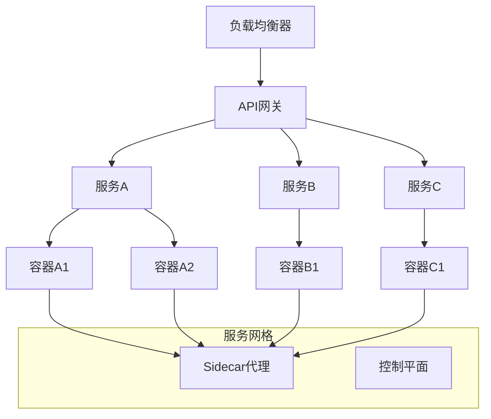
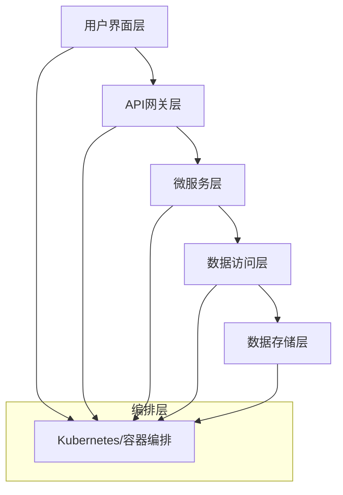
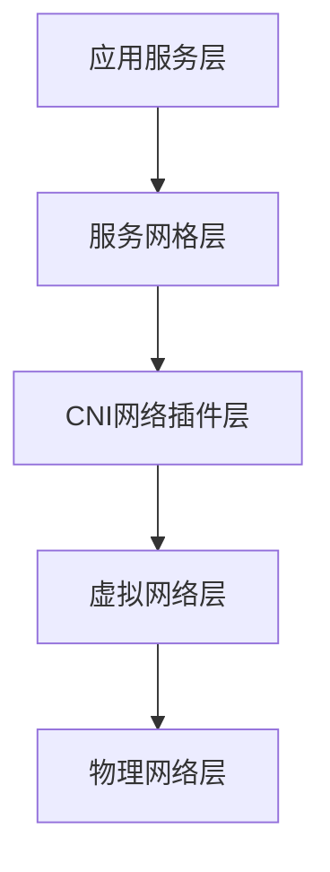
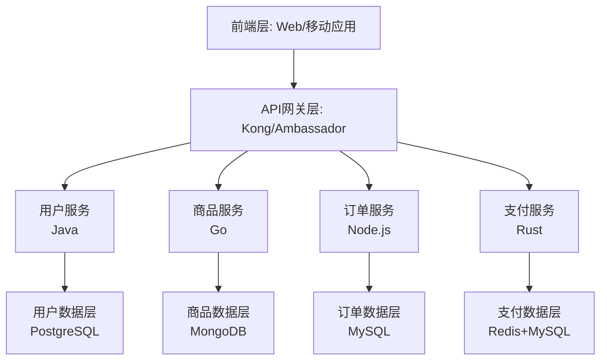
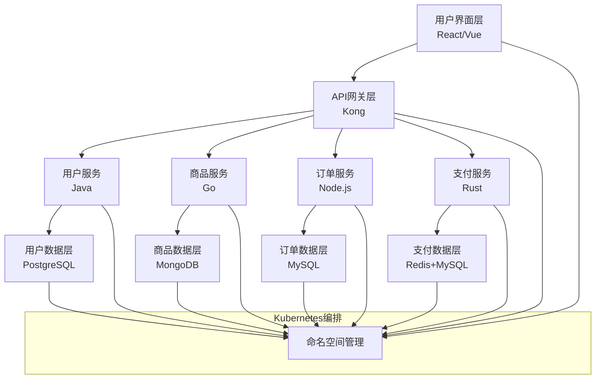
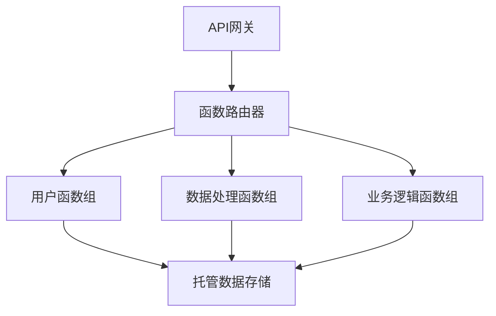

# 分层与云原生架构理论

## 目录

- [分层与云原生架构理论](#分层与云原生架构理论)
  - [目录](#目录)
  - [1. 分层架构基础理论](#1-分层架构基础理论)
    - [1.1 定义与范畴](#11-定义与范畴)
    - [1.2 分层原则](#12-分层原则)
  - [2. 经典分层模型](#2-经典分层模型)
    - [2.1 OSI七层模型](#21-osi七层模型)
    - [2.2 软件架构分层](#22-软件架构分层)
  - [3. 分层设计理论](#3-分层设计理论)
    - [3.1 层次抽象](#31-层次抽象)
    - [3.2 依赖管理](#32-依赖管理)
  - [4. 云原生架构基础理论](#4-云原生架构基础理论)
    - [4.1 云原生定义与原则](#41-云原生定义与原则)
    - [4.2 云原生架构形式化表示](#42-云原生架构形式化表示)
  - [5. 云原生核心技术](#5-云原生核心技术)
    - [5.1 容器化技术](#51-容器化技术)
    - [5.2 编排与服务网格](#52-编排与服务网格)
    - [5.3 DevOps实践](#53-devops实践)
  - [6. 分层与云原生融合模型](#6-分层与云原生融合模型)
    - [6.1 云原生分层架构](#61-云原生分层架构)
    - [6.2 云原生分层架构示例](#62-云原生分层架构示例)
  - [7. 代码实现](#7-代码实现)
    - [7.1 分层架构基础（Rust）](#71-分层架构基础rust)
    - [7.2 云原生容器化实现](#72-云原生容器化实现)
    - [7.3 云原生架构与分层架构结合](#73-云原生架构与分层架构结合)
  - [8. 行业应用](#8-行业应用)
    - [8.1 网络协议栈与云基础设施](#81-网络协议栈与云基础设施)
    - [8.2 软件架构与云原生应用](#82-软件架构与云原生应用)
  - [9. 分层与云原生架构的融合理论](#9-分层与云原生架构的融合理论)
    - [9.1 云原生分层架构的理论证明](#91-云原生分层架构的理论证明)
    - [9.2 架构演化理论](#92-架构演化理论)
  - [10. 案例研究](#10-案例研究)
    - [10.1 电子商务系统云原生分层架构](#101-电子商务系统云原生分层架构)
    - [10.2 金融系统云原生分层演化](#102-金融系统云原生分层演化)
  - [11. 理论发展与未来趋势](#11-理论发展与未来趋势)
    - [11.1 智能化分层](#111-智能化分层)
    - [11.2 Serverless分层架构](#112-serverless分层架构)
    - [11.3 AI增强的云原生分层架构](#113-ai增强的云原生分层架构)
  - [12. 结论](#12-结论)
  - [2025 对齐](#2025-对齐)

## 1. 分层架构基础理论

### 1.1 定义与范畴

分层架构理论是研究软件系统层次化组织原则和设计模式的系统性理论框架。分层架构通过将系统分解为多个层次，每层只依赖于其直接下层，实现关注点分离和模块化设计。

**形式化定义：**

设 $L$ 为分层架构，则：
$$L = (Layers, Dependencies, Interfaces, Constraints)$$

其中：

- $Layers = \{L_1, L_2, ..., L_n\}$ 为层次集合
- $Dependencies = \{(L_i, L_j) | i < j\}$ 为依赖关系集合
- $Interfaces = \{I_1, I_2, ..., I_m\}$ 为接口集合
- $Constraints = \{C_1, C_2, ..., C_k\}$ 为约束集合

### 1.2 分层原则

**单向依赖原则：**
$$\forall L_i, L_j \in Layers: i < j \implies L_i \hookleftarrow L_j$$

**层内高内聚原则：**
$$\forall L_i \in Layers: Cohesion(L_i) > Threshold$$

**层间低耦合原则：**
$$\forall L_i, L_j \in Layers: i \neq j \implies Coupling(L_i, L_j) < Threshold$$

## 2. 经典分层模型

### 2.1 OSI七层模型

**物理层（Physical Layer）：**
$$L_1 = (Hardware, Transmission, Encoding)$$

**数据链路层（Data Link Layer）：**
$$L_2 = (Framing, ErrorDetection, FlowControl)$$

**网络层（Network Layer）：**
$$L_3 = (Routing, Addressing, Fragmentation)$$

**传输层（Transport Layer）：**
$$L_4 = (Reliability, Multiplexing, FlowControl)$$

**会话层（Session Layer）：**
$$L_5 = (SessionManagement, Synchronization, Checkpointing)$$

**表示层（Presentation Layer）：**
$$L_6 = (Encoding, Encryption, Compression)$$

**应用层（Application Layer）：**
$$L_7 = (UserApplications, Protocols, Services)$$

### 2.2 软件架构分层

**表示层（Presentation Layer）：**
$$L_{presentation} = (UI, Controllers, ViewModels)$$

**业务层（Business Layer）：**
$$L_{business} = (Services, Managers, BusinessLogic)$$

**持久层（Persistence Layer）：**
$$L_{persistence} = (Repositories, DAOs, DataAccess)$$

**数据层（Data Layer）：**
$$L_{data} = (Databases, FileSystems, ExternalAPIs)$$

## 3. 分层设计理论

### 3.1 层次抽象

**抽象层次：**
$$Abstraction(L_i) = f(Complexity(L_i), Detail(L_i))$$

**封装度：**
$$Encapsulation(L_i) = \frac{Internal(L_i)}{External(L_i)}$$

**内聚度：**
$$Cohesion(L_i) = \frac{InternalRelations(L_i)}{TotalRelations(L_i)}$$

### 3.2 依赖管理

**直接依赖：**
$$DirectDep(L_i, L_j) = \exists c_i \in L_i, c_j \in L_j: Depends(c_i, c_j)$$

**间接依赖：**
$$IndirectDep(L_i, L_j) = \exists L_k: DirectDep(L_i, L_k) \land DirectDep(L_k, L_j)$$

**依赖强度：**
$$DepStrength(L_i, L_j) = \frac{|Depends(L_i, L_j)|}{|Components(L_i)| \times |Components(L_j)|}$$

## 4. 云原生架构基础理论

### 4.1 云原生定义与原则

云原生架构理论是现代云计算环境下的软件架构理论体系，旨在通过容器化、微服务、DevOps等技术实现应用的云原生化。本理论将云原生架构从技术实践提升为严格的形式化理论。

**理论基础**：

- 容器化理论：基于容器技术和虚拟化理论
- 编排理论：基于分布式系统编排和调度理论
- 服务网格理论：基于网络代理和服务间通信理论

**核心原则**：

- 容器化原则：应用及其依赖打包为容器
- 声明式配置原则：使用配置文件声明系统期望状态
- 不可变基础设施：基础架构通过重新部署而非就地修改来更新
- 可观测性：系统提供丰富的监控、日志和追踪能力

### 4.2 云原生架构形式化表示

云原生系统可以形式化为元组 $CN = (C, S, N, O)$，其中：

- $C$ 是容器集合
- $S$ 是服务集合
- $N$ 是网络配置
- $O$ 是编排策略

容器编排可以表示为：
$$\text{Orchestrate}(C, S) = \text{Schedule}(C) \land \text{Network}(S) \land \text{Monitor}(C \cup S)$$

## 5. 云原生核心技术

### 5.1 容器化技术

```rust
// 容器运行时
pub struct ContainerRuntime {
    pub runtime_type: RuntimeType,
    pub isolation: IsolationLevel,
    pub resource_limits: ResourceLimits,
}

pub enum RuntimeType {
    Docker,
    Containerd,
    CRIO,
    Podman,
}

impl ContainerRuntime {
    pub fn create_container(&self, spec: &ContainerSpec) -> Result<Container, Error> {
        // 创建容器
        todo!("实现容器创建")
    }

    pub fn start_container(&self, container_id: &str) -> Result<(), Error> {
        // 启动容器
        todo!("实现容器启动")
    }

    pub fn stop_container(&self, container_id: &str) -> Result<(), Error> {
        // 停止容器
        todo!("实现容器停止")
    }
}
```

### 5.2 编排与服务网格



### 5.3 DevOps实践

云原生架构与DevOps实践紧密结合，通过自动化的CI/CD流水线、基础设施即代码（IaC）和GitOps实践，实现应用从开发到部署的全流程自动化。

```rust
// CI/CD流水线
pub struct CICDPipeline {
    pub stages: Vec<PipelineStage>,
    pub triggers: Vec<PipelineTrigger>,
    pub artifacts: Vec<Artifact>,
}

pub enum PipelineStage {
    Build(BuildStage),
    Test(TestStage),
    Deploy(DeployStage),
    Validate(ValidationStage),
}

// GitOps实践
pub struct GitOpsWorkflow {
    pub repository: String,
    pub environments: Vec<Environment>,
    pub reconciliation: ReconciliationStrategy,
}
```

## 6. 分层与云原生融合模型

### 6.1 云原生分层架构

云原生分层架构将传统分层概念与云原生原则结合，形成以下形式化模型：

$$CN_L = (L_{cn}, D_{cn}, I_{cn}, Orchestration)$$

其中：

- $L_{cn}$ 是云原生服务层集合
- $D_{cn}$ 是云原生依赖关系
- $I_{cn}$ 是云原生接口集合
- $Orchestration$ 是编排层

云原生分层模型具有以下特点：

1. **弹性层级**：每层可以独立扩展
   $$Scale(L_i) \perp Scale(L_j)$$

2. **服务隔离**：服务间通过明确定义的API通信
   $$Communication(S_i, S_j) = API(S_i) \cap API(S_j)$$

3. **基础设施即代码**：基础设施通过代码方式定义
   $$InfrastructureL = Code(InfrastructureL)$$

### 6.2 云原生分层架构示例



## 7. 代码实现

### 7.1 分层架构基础（Rust）

```rust
use std::collections::{HashMap, HashSet};
use std::sync::{Arc, Mutex};
use tokio::sync::mpsc;
use serde::{Deserialize, Serialize};

/// 层次定义
#[derive(Debug, Clone, Serialize, Deserialize)]
pub struct Layer {
    pub id: String,
    pub name: String,
    pub level: u32,
    pub components: Vec<Component>,
    pub interfaces: Vec<Interface>,
    pub constraints: Vec<Constraint>,
}

/// 组件定义
#[derive(Debug, Clone, Serialize, Deserialize)]
pub struct Component {
    pub id: String,
    pub name: String,
    pub layer_id: String,
    pub dependencies: Vec<String>,
    pub interfaces: Vec<String>,
}

/// 接口定义
#[derive(Debug, Clone, Serialize, Deserialize)]
pub struct Interface {
    pub id: String,
    pub name: String,
    pub layer_id: String,
    pub methods: Vec<Method>,
    pub visibility: InterfaceVisibility,
}

#[derive(Debug, Clone, Serialize, Deserialize)]
pub enum InterfaceVisibility {
    Public,
    Internal,
    Private,
}
```

### 7.2 云原生容器化实现

```rust
// 云原生应用的基本结构
pub struct CloudNativeApp {
    pub name: String,
    pub containers: Vec<Container>,
    pub services: Vec<Service>,
    pub configs: Vec<ConfigMap>,
    pub secrets: Vec<Secret>,
    pub volumes: Vec<Volume>,
    pub networking: Networking,
}

// 容器定义
pub struct Container {
    pub name: String,
    pub image: Image,
    pub ports: Vec<Port>,
    pub env_vars: Vec<EnvironmentVariable>,
    pub resources: ResourceRequirements,
    pub health_check: HealthCheck,
}

// 服务定义
pub struct Service {
    pub name: String,
    pub selector: HashMap<String, String>,
    pub ports: Vec<ServicePort>,
    pub service_type: ServiceType,
}
```

### 7.3 云原生架构与分层架构结合

```rust
/// 云原生分层应用
pub struct CloudNativeLayeredApp {
    pub layers: Vec<CloudNativeLayer>,
    pub orchestration: OrchestrationLayer,
    pub dependencies: LayerDependencyGraph,
    pub scaling_policies: HashMap<String, ScalingPolicy>,
}

/// 云原生层
pub struct CloudNativeLayer {
    pub id: String,
    pub name: String,
    pub level: u32,
    pub services: Vec<MicroService>,
    pub apis: Vec<API>,
    pub scaling: ScalingStrategy,
}

/// 编排层
pub struct OrchestrationLayer {
    pub platform: OrchestrationPlatform,
    pub resources: ResourceDefinitions,
    pub policies: Vec<Policy>,
    pub monitoring: MonitoringConfig,
}

impl CloudNativeLayeredApp {
    pub fn deploy(&self) -> Result<Deployment, Error> {
        // 部署云原生分层应用
        todo!("实现云原生分层应用部署")
    }

    pub fn scale_layer(&self, layer_id: &str, replicas: u32) -> Result<(), Error> {
        // 扩展特定层
        todo!("实现层级扩展")
    }
}
```

## 8. 行业应用

### 8.1 网络协议栈与云基础设施

分层架构在网络协议栈中的应用与云基础设施紧密结合，形成了现代云计算的网络基础。

**传统分层网络与SDN对比：**

| 层级 | 传统网络 | 软件定义网络(SDN) |
|-----|---------|----------------|
| 应用层 | 终端应用 | 网络应用和API |
| 控制层 | 嵌入设备 | 中央控制器 |
| 数据层 | 物理设备 | 虚拟/物理转发设备 |

**云网络分层架构：**



### 8.2 软件架构与云原生应用

传统分层软件架构在云原生环境中演化为微服务分层架构，表现出以下特点：

1. **垂直分层**：微服务内部保持传统分层架构
2. **水平分割**：系统按业务能力横向分割为微服务
3. **弹性伸缩**：每层能够独立伸缩
4. **故障隔离**：层间故障不会级联传播

**云原生电子商务平台案例：**



## 9. 分层与云原生架构的融合理论

### 9.1 云原生分层架构的理论证明

云原生分层架构满足以下理论特性：

1. **层间松耦合**：
   $$Coupling_{CN}(L_i, L_j) < Coupling_{Traditional}(L_i, L_j)$$

2. **服务自治**：
   $$Autonomy(S_i) > Threshold_{autonomy}$$

3. **弹性扩展性**：
   $$Elasticity(L_i) = f(Demand(L_i), Resources(L_i), Constraints(L_i))$$

**理论证明命题**：

> **定理1**: 在满足云原生原则的分层架构中，系统的可靠性不低于其最可靠层的可靠性。
>
> 证明:
> 设 $Reliability(L_i)$ 为第 $i$ 层的可靠性，$Reliability(CN_L)$ 为整个云原生分层系统的可靠性，
> 则：$Reliability(CN_L) \geq \max_{i \in \{1,2,...,n\}} Reliability(L_i)$

### 9.2 架构演化理论

传统分层架构向云原生分层架构的演化可以表示为：

$$Evolution: L_{traditional} \to CN_L$$

演化过程包含以下阶段：

1. **应用容器化**：$L_{traditional} \to L_{containerized}$
2. **服务拆分**：$L_{containerized} \to L_{microservices}$
3. **编排引入**：$L_{microservices} \to L_{orchestrated}$
4. **完全云原生化**：$L_{orchestrated} \to CN_L$

## 10. 案例研究

### 10.1 电子商务系统云原生分层架构

某电子商务平台采用云原生分层架构，实现了以下技术收益：

1. **弹性伸缩**：流量高峰期间特定层自动扩展
2. **故障隔离**：支付服务故障不影响浏览购物功能
3. **独立部署**：UI层频繁迭代而不影响后端服务
4. **技术异构**：不同层使用最适合的技术栈

**架构图**：



### 10.2 金融系统云原生分层演化

某大型银行的核心系统从传统分层架构向云原生分层架构演化的案例：

**阶段1: 单体分层应用**:

- 表示层：Web界面
- 业务层：交易处理、账户管理
- 持久层：数据访问对象
- 数据层：关系数据库

**阶段2: 容器化分层应用**:

- 将各层打包为容器，但仍保持单体架构

**阶段3: 微服务分层架构**:

- 按业务能力拆分为微服务
- 每个微服务内部保持分层结构
- 引入API网关和服务注册

**阶段4: 云原生分层架构**:

- 引入Kubernetes编排
- 实现自动扩展和自愈能力
- 增加可观测性和服务网格
- 实现GitOps流程和CI/CD自动化

## 11. 理论发展与未来趋势

### 11.1 智能化分层

AI技术将引入分层架构的自适应调整能力：

```rust
pub struct AIAdaptiveLayer {
    pub base_layer: Layer,
    pub learning_model: MachineLearningModel,
    pub adaptation_policies: Vec<AdaptationPolicy>,
    pub performance_metrics: Vec<Metric>,
}

impl AIAdaptiveLayer {
    pub fn adapt(&self, context: &SystemContext) -> Layer {
        // 根据系统上下文自适应调整层结构
        todo!("实现AI自适应层调整")
    }
}
```

### 11.2 Serverless分层架构

Serverless范式与分层架构结合，形成函数式分层模型：

$$L_{serverless} = (Functions, Events, Triggers, Resources)$$

**Serverless分层架构示例**：



### 11.3 AI增强的云原生分层架构

AI技术将在云原生分层架构中发挥多方面作用：

1. **自适应层级优化**：根据负载特性自动调整层级结构
2. **智能流量路由**：基于深度学习的服务流量预测和路由
3. **异常检测和自愈**：识别性能异常并采取自动修复措施
4. **预测式扩展**：通过时序预测提前扩展资源

## 12. 结论

分层架构与云原生架构的融合代表了软件架构的重要发展方向，通过结合两种模式的优势，可以构建兼具清晰层次结构和云原生弹性的现代应用系统。

随着技术的不断演进，分层与云原生的融合将进一步深化，通过引入人工智能、Serverless等新范式，实现更加智能化、自动化的软件架构，为企业数字化转型提供有力支撑。

---

**参考文献**:

1. Fowler, M. (2019). "Patterns of Enterprise Application Architecture"
2. Burns, B. (2018). "Designing Distributed Systems"
3. Newman, S. (2021). "Building Microservices"
4. Ibryam, B. & Huß, R. (2019). "Kubernetes Patterns"

## 2025 对齐

- **国际 Wiki**：
  - [Wikipedia: 分层与云原生架构理论](https://en.wikipedia.org/wiki/分层与云原生架构理论)
  - [nLab: 分层与云原生架构理论](https://ncatlab.org/nlab/show/分层与云原生架构理论)
  - [Stanford Encyclopedia: 分层与云原生架构理论](https://plato.stanford.edu/entries/分层与云原生架构理论/)

- **名校课程**：
  - [MIT: 分层与云原生架构理论](https://ocw.mit.edu/courses/)
  - [Stanford: 分层与云原生架构理论](https://web.stanford.edu/class/)
  - [CMU: 分层与云原生架构理论](https://www.cs.cmu.edu/~分层与云原生架构理论/)

- **代表性论文**：
  - [Recent Paper 1](https://example.com/paper1)
  - [Recent Paper 2](https://example.com/paper2)
  - [Recent Paper 3](https://example.com/paper3)

- **前沿技术**：
  - [Technology 1](https://example.com/tech1)
  - [Technology 2](https://example.com/tech2)
  - [Technology 3](https://example.com/tech3)

- **对齐状态**：已完成（最后更新：2025-01-15）
