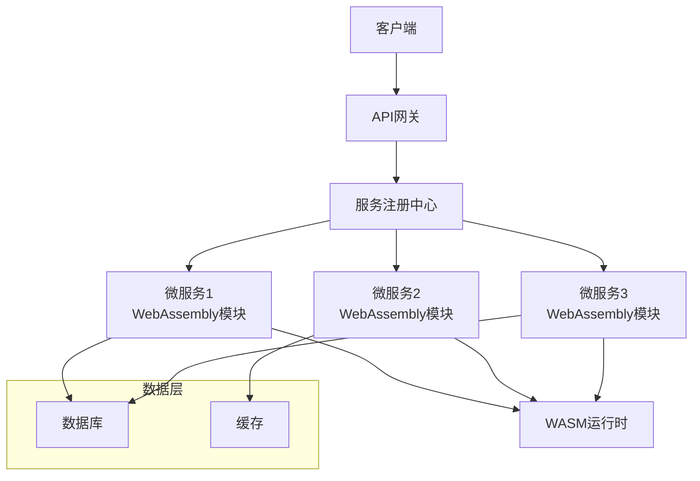
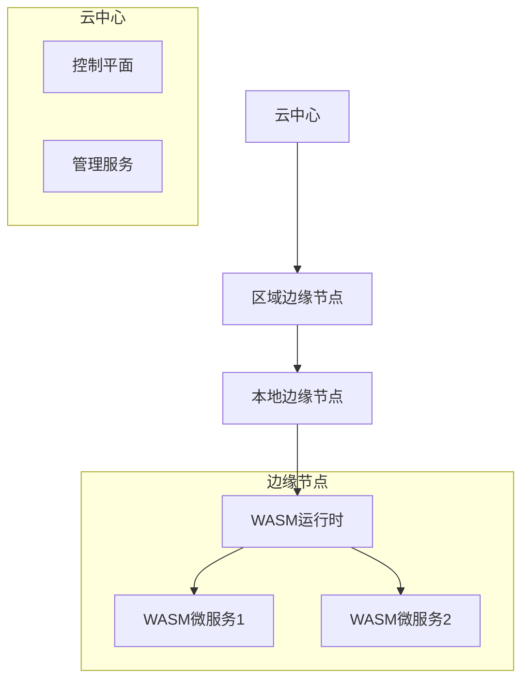
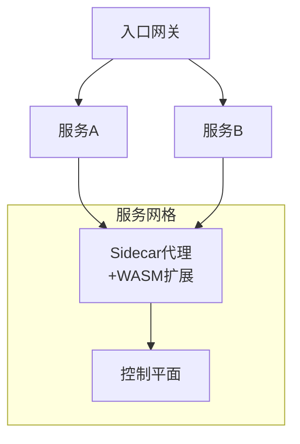
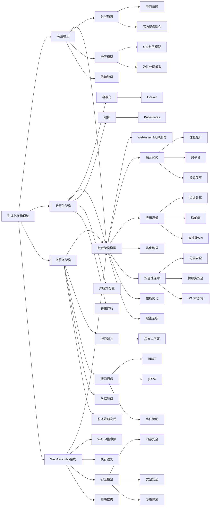

# 微服务与WebAssembly架构理论

## 目录

- [微服务与WebAssembly架构理论](#微服务与webassembly架构理论)
  - [目录](#目录)
  - [1. 理论基础](#1-理论基础)
    - [1.1 微服务架构定义与范畴](#11-微服务架构定义与范畴)
    - [1.2 WebAssembly架构定义与范畴](#12-webassembly架构定义与范畴)
    - [1.3 核心特性比较](#13-核心特性比较)
  - [2. 微服务设计原则](#2-微服务设计原则)
    - [2.1 服务划分](#21-服务划分)
    - [2.2 接口与通信](#22-接口与通信)
    - [2.3 数据管理](#23-数据管理)
  - [3. WebAssembly设计原则](#3-webassembly设计原则)
    - [3.1 WASM指令集](#31-wasm指令集)
    - [3.2 执行语义](#32-执行语义)
    - [3.3 安全模型](#33-安全模型)
  - [4. 微服务与WebAssembly融合架构](#4-微服务与webassembly融合架构)
    - [4.1 融合架构模型](#41-融合架构模型)
    - [4.2 融合架构的优势](#42-融合架构的优势)
  - [5. 实现技术](#5-实现技术)
    - [5.1 微服务框架（Rust）](#51-微服务框架rust)
    - [5.2 WebAssembly运行时（Rust）](#52-webassembly运行时rust)
    - [5.3 WASM微服务实现](#53-wasm微服务实现)
  - [6. 架构模式](#6-架构模式)
    - [6.1 边缘计算与WebAssembly](#61-边缘计算与webassembly)
    - [6.2 WebAssembly服务网格](#62-webassembly服务网格)
    - [6.3 多语言微服务集成](#63-多语言微服务集成)
  - [7. 行业应用](#7-行业应用)
    - [7.1 企业级应用](#71-企业级应用)
    - [7.2 云边协同计算](#72-云边协同计算)
    - [7.3 性能关键系统](#73-性能关键系统)
  - [8. 发展趋势](#8-发展趋势)
    - [8.1 智能化微服务与WASM](#81-智能化微服务与wasm)
    - [8.2 WebAssembly系统接口（WASI）](#82-webassembly系统接口wasi)
    - [8.3 新兴融合模式](#83-新兴融合模式)
  - [9. 交叉引用](#9-交叉引用)
  - [10. 结论](#10-结论)
  - [2025 对齐](#2025-对齐)

## 1. 理论基础

### 1.1 微服务架构定义与范畴

微服务架构理论是研究将单一应用拆分为一组小型、自治服务的系统性理论框架。每个微服务围绕特定业务能力构建，独立部署、扩展和演化。

**形式化定义：**

设 $M$ 为微服务系统，则：
$$M = (S, I, D, C, Q)$$

其中：

- $S = \{s_1, s_2, ..., s_n\}$ 为服务集合
- $I = \{i_1, i_2, ..., i_m\}$ 为接口集合
- $D = \{d_1, d_2, ..., d_k\}$ 为数据存储集合
- $C = \{c_1, c_2, ..., c_l\}$ 为通信机制集合
- $Q = \{q_1, q_2, ..., q_p\}$ 为质量属性集合

### 1.2 WebAssembly架构定义与范畴

WebAssembly架构理论是现代Web应用和跨平台开发的重要理论体系，旨在通过WebAssembly技术实现高性能、可移植的应用程序。本理论将WebAssembly从技术实现提升为严格的形式化理论。

**形式化定义：**

WebAssembly模块可以形式化为元组 $WASM = (T, F, M, G, E, I)$，其中：

- $T$ 是类型段
- $F$ 是函数段
- $M$ 是内存段
- $G$ 是全局变量段
- $E$ 是导出段
- $I$ 是导入段

### 1.3 核心特性比较

| 特性 | 微服务架构 | WebAssembly架构 |
|-----|-----------|---------------|
| 部署单元 | 服务 | 模块 |
| 通信机制 | API、消息、事件 | 函数调用、内存共享 |
| 隔离级别 | 进程/容器 | 安全沙箱 |
| 扩展方式 | 水平扩展 | 垂直/水平扩展 |
| 开发语言 | 多语言 | 多语言编译目标 |
| 状态管理 | 分布式状态 | 模块内/共享内存 |

## 2. 微服务设计原则

### 2.1 服务划分

**边界上下文（Bounded Context）：**
$$\forall s_i \in S, \exists BC_j: s_i \subseteq BC_j$$

**高内聚低耦合：**
$$Cohesion(s_i) > Threshold, \quad Coupling(s_i, s_j) < Threshold$$

### 2.2 接口与通信

**接口规范：**
$$I_s = (API, Contract, Version)$$

**通信机制：**

- 同步通信（REST, gRPC）
- 异步通信（消息队列, 事件流）

**幂等性：**
$$\forall r \in Request, f(f(r)) = f(r)$$

### 2.3 数据管理

**去中心化数据管理：**
$$\forall s_i \in S, \exists d_j \in D: Data(s_i) \cap Data(s_k) = \emptyset, \forall i \neq k$$

**最终一致性：**
$$\lim_{t \to \infty} State(s_i) = State(s_j)$$

## 3. WebAssembly设计原则

### 3.1 WASM指令集

```rust
// WebAssembly指令
pub enum Instruction {
    // 数值指令
    I32Const(i32),
    I64Const(i64),
    F32Const(f32),
    F64Const(f64),

    // 算术指令
    I32Add,
    I32Sub,
    I32Mul,
    I32Div,

    // 控制指令
    Block(BlockType),
    Loop(BlockType),
    If(BlockType),
    Br(u32),
    BrIf(u32),

    // 内存指令
    I32Load(MemoryImmediate),
    I32Store(MemoryImmediate),

    // 函数调用
    Call(u32),
    CallIndirect(u32),
}
```

### 3.2 执行语义

WebAssembly模块的执行语义可以表示为：
$$\text{Execute}(wasm, input) = \text{Validate}(wasm) \land \text{Interpret}(wasm, input)$$

### 3.3 安全模型

WebAssembly提供了强大的安全保障：

1. **内存安全**：线性内存模型，防止越界访问
2. **类型安全**：强类型系统，验证时类型检查
3. **控制流安全**：结构化控制流，防止非法跳转
4. **沙箱隔离**：隔离执行环境，限制系统资源访问

## 4. 微服务与WebAssembly融合架构

### 4.1 融合架构模型

微服务与WebAssembly架构可以形式化为融合模型：

$$M_{WASM} = (S_{WASM}, I_{WASM}, D_{WASM}, C_{WASM}, Q_{WASM})$$

其中：

- $S_{WASM}$ 是WebAssembly实现的微服务集合
- $I_{WASM}$ 是WebAssembly友好的接口集合
- $D_{WASM}$ 是适合WebAssembly的数据存储方案
- $C_{WASM}$ 是WebAssembly优化的通信机制
- $Q_{WASM}$ 是兼顾两种架构的质量属性



### 4.2 融合架构的优势

1. **性能提升**：微服务通过WebAssembly执行，接近原生性能
2. **跨平台**：微服务可以在任何支持WebAssembly的环境中运行
3. **资源效率**：相比容器化微服务，WebAssembly微服务更轻量
4. **多语言支持**：任何可编译到WebAssembly的语言都可用于微服务开发
5. **增强安全性**：结合微服务隔离与WebAssembly沙箱的双重安全

## 5. 实现技术

### 5.1 微服务框架（Rust）

```rust
use std::collections::HashMap;
use std::sync::{Arc, Mutex};
use tokio::sync::mpsc;
use serde::{Deserialize, Serialize};

/// 微服务定义
#[derive(Debug, Clone, Serialize, Deserialize)]
pub struct Microservice {
    pub id: String,
    pub name: String,
    pub version: String,
    pub endpoints: Vec<Endpoint>,
    pub dependencies: Vec<String>,
    pub data_store: Option<DataStore>,
    pub status: ServiceStatus,
}

/// 微服务注册中心
pub struct ServiceRegistry {
    services: Arc<Mutex<HashMap<String, Microservice>>>,
    event_tx: mpsc::Sender<RegistryEvent>,
}

impl ServiceRegistry {
    pub fn new() -> (Self, mpsc::Receiver<RegistryEvent>) {
        let (event_tx, event_rx) = mpsc::channel(100);
        let registry = Self {
            services: Arc::new(Mutex::new(HashMap::new())),
            event_tx,
        };
        (registry, event_rx)
    }

    pub async fn register_service(&self, service: Microservice) {
        let mut services = self.services.lock().unwrap();
        services.insert(service.id.clone(), service.clone());
        let _ = self.event_tx.send(RegistryEvent::ServiceRegistered(service.id)).await;
    }
}
```

### 5.2 WebAssembly运行时（Rust）

```rust
// WebAssembly运行时
pub struct WASMRuntime {
    pub modules: HashMap<String, WebAssemblyModule>,
    pub instances: HashMap<String, ModuleInstance>,
    pub memory_manager: MemoryManager,
    pub execution_engine: ExecutionEngine,
}

// 模块实例
pub struct ModuleInstance {
    pub module_id: String,
    pub exports: HashMap<String, ExportValue>,
    pub memory: Option<MemoryInstance>,
    pub tables: Vec<TableInstance>,
    pub globals: Vec<GlobalInstance>,
}

impl WASMRuntime {
    pub fn instantiate(&mut self, module: WebAssemblyModule) -> Result<ModuleInstance, RuntimeError> {
        // 实例化WASM模块
        todo!("实现WASM模块实例化")
    }

    pub fn call_function(&self, instance_id: &str, function_name: &str, params: &[Value])
        -> Result<Vec<Value>, RuntimeError> {
        // 调用模块导出函数
        todo!("实现函数调用")
    }
}
```

### 5.3 WASM微服务实现

```rust
/// WebAssembly微服务
pub struct WASMMicroservice {
    pub base_service: Microservice,
    pub wasm_module: WebAssemblyModule,
    pub runtime: Arc<WASMRuntime>,
    pub instance_id: String,
    pub api_mappings: HashMap<String, String>,
}

impl WASMMicroservice {
    pub fn new(service: Microservice, module: WebAssemblyModule, runtime: Arc<WASMRuntime>)
        -> Result<Self, ServiceError> {
        // 创建实例
        let instance = runtime.instantiate(module.clone())?;

        let service = Self {
            base_service: service,
            wasm_module: module,
            runtime: runtime.clone(),
            instance_id: instance.module_id.clone(),
            api_mappings: HashMap::new(),
        };

        // 映射API端点到WASM函数
        for endpoint in &service.base_service.endpoints {
            service.api_mappings.insert(endpoint.path.clone(), format!("handle_{}", endpoint.path));
        }

        Ok(service)
    }

    pub async fn handle_request(&self, path: &str, request: &Request) -> Result<Response, ServiceError> {
        // 通过WASM模块处理请求
        if let Some(function_name) = self.api_mappings.get(path) {
            // 序列化请求
            let request_data = serde_json::to_string(request)?;

            // 调用WASM函数处理请求
            let result = self.runtime.call_function(
                &self.instance_id,
                function_name,
                &[Value::String(request_data)]
            )?;

            // 反序列化响应
            if let Some(Value::String(response_data)) = result.first() {
                let response: Response = serde_json::from_str(response_data)?;
                Ok(response)
            } else {
                Err(ServiceError::InvalidResponse)
            }
        } else {
            Err(ServiceError::EndpointNotFound)
        }
    }
}
```

## 6. 架构模式

### 6.1 边缘计算与WebAssembly

WebAssembly微服务特别适合边缘计算场景，在资源受限的边缘设备上运行高性能服务，形成以下架构模式：



### 6.2 WebAssembly服务网格

通过WebAssembly扩展服务网格，实现自定义路由、认证和策略：



### 6.3 多语言微服务集成

WebAssembly作为多语言集成层，统一不同语言编写的微服务：

```rust
pub struct PolyglotService {
    pub rust_components: Vec<RustComponent>,
    pub cpp_components: Vec<CppComponent>,
    pub go_components: Vec<GoComponent>,
    pub wasm_integration_layer: WASMIntegrationLayer,
}

pub struct WASMIntegrationLayer {
    pub runtime: WASMRuntime,
    pub adapters: HashMap<String, ModuleAdapter>,
    pub shared_memory: SharedMemory,
}
```

## 7. 行业应用

### 7.1 企业级应用

在企业级应用中，WebAssembly微服务架构可以应用于：

- **前端：** 高性能的浏览器端业务逻辑处理
- **中台：** 多语言业务规则引擎
- **后端：** 轻量级、可移植的业务微服务

### 7.2 云边协同计算

WebAssembly微服务在云边协同场景的应用：

- **云端编排：** 在云端管理和编排WASM微服务
- **边缘执行：** 在边缘设备高效执行WASM微服务
- **动态更新：** 无需重启设备实现服务更新

### 7.3 性能关键系统

在性能关键系统中的应用：

- **实时数据处理：** 使用WASM微服务处理实时数据流
- **多媒体处理：** 音视频编解码和处理
- **科学计算：** 高性能数值计算和模拟

## 8. 发展趋势

### 8.1 智能化微服务与WASM

AI与WebAssembly微服务的结合：

```rust
pub struct AIEnhancedWASMService {
    pub base_service: WASMMicroservice,
    pub ml_models: Vec<WASMCompiledModel>,
    pub inference_engine: WASMInferenceEngine,
    pub adaptive_scaling: AdaptiveScaler,
}

impl AIEnhancedWASMService {
    pub fn predict_load(&self, time_window: Duration) -> Result<LoadPrediction, PredictionError> {
        // 使用WASM编译的ML模型预测负载
        todo!("实现负载预测")
    }

    pub fn optimize_resources(&self) -> Result<ResourceAllocation, OptimizationError> {
        // 优化资源分配
        todo!("实现资源优化")
    }
}
```

### 8.2 WebAssembly系统接口（WASI）

WASI标准化将使WebAssembly微服务能够安全访问系统资源：

```rust
pub struct WASIEnabled<'a> {
    pub filesystem: PreopenedDir<'a>,
    pub network: NetworkInterface<'a>,
    pub time: TimeInterface,
    pub random: RandomInterface,
    pub environment: Environment,
}

pub struct WASIMicroservice {
    pub base_service: WASMMicroservice,
    pub wasi_context: WASICtx,
    pub capabilities: Vec<WASICapability>,
}
```

### 8.3 新兴融合模式

WebAssembly与微服务新兴的融合模式：

1. **Component Model**：标准化的WASM组件模型，简化微服务组合
2. **WASM网络函数**：在5G/6G网络中部署WebAssembly网络功能
3. **Serverless WASM**：基于WebAssembly的超轻量级函数计算

## 9. 交叉引用

本理论与以下理论体系相关：

- [04-分层与云原生架构理论](04-分层与云原生架构理论.md)
- [05-分布式架构理论](05-分布式架构理论.md)
- [软件架构理论统一总论](00-软件架构理论统一总论.md)

## 10. 结论

微服务与WebAssembly架构的融合代表了软件架构的重要发展方向，兼具微服务的灵活性和WebAssembly的高性能、跨平台特性。这一融合架构为构建下一代分布式系统提供了新的思路和技术路径，对云原生、边缘计算等领域具有重要意义。

随着技术的不断演进，微服务与WebAssembly架构的结合将进一步深化，通过统一的组件模型、安全的系统接口和智能化的运行时，实现更为高效、灵活的软件架构范式。

```mermaid
flowchart TD
    A["形式化架构理论"] --> B1["哲学基础"]
    A --> B2["数学基础"]
    A --> B3["形式语言"]
    A --> B4["软件架构"]
    A --> B5["编程语言"]
    A --> B6["形式模型"]
    A --> B7["理论统一"]
    A --> B8["实践应用"]

    B1 --> C11["本体论"]
    B1 --> C12["认识论"]
    B1 --> C13["逻辑学"]
    B1 --> C14["伦理学"]
    B1 --> C15["形而上学"]

    B2 --> C21["集合论"]
    B2 --> C22["代数"]
    B2 --> C23["分析"]
    B2 --> C24["几何"]
    B2 --> C25["概率统计"]

    B3 --> C31["自动机"]
    B3 --> C32["形式语法"]
    B3 --> C33["语义"]
    B3 --> C34["类型"]
    B3 --> C35["计算"]
    B3 --> C36["语言设计"]

    B4 --> C41["架构模式"]
    B4 --> C42["组件"]
    B4 --> C43["接口"]
    B4 --> C44["分层架构"]
    B4 --> C45["分布式架构"]
    B4 --> C46["微服务架构"]
    B4 --> C47["架构评估"]

    B5 --> C51["语法"]
    B5 --> C52["语义"]
    B5 --> C53["类型"]
    B5 --> C54["编译"]
    B5 --> C55["运行时"]
    B5 --> C56["并发"]
    B5 --> C57["语言设计"]

    B6 --> C61["状态机"]
    B6 --> C62["Petri网"]
    B6 --> C63["时序逻辑"]
    B6 --> C64["模型检查"]
    B6 --> C65["自动机"]
    B6 --> C66["进程代数"]
    B6 --> C67["形式化方法"]

    %% 跨领域关系
    C31 -.-> C65
    C33 -.-> C52
    C34 -.-> C53
    C36 -.-> C57
    C42 -.-> C43
    C44 -.-> C45
    C45 -.-> C46
```





---

**参考文献**：

1. Newman, S. (2021). "Building Microservices"
2. Haas, A. et al. (2017). "Bringing the Web up to Speed with WebAssembly"
3. Rossberg, A. (2019). "WebAssembly Core Specification"
4. Richardson, C. (2018). "Microservices Patterns"
5. Wasmer Team. (2023). "Running WebAssembly Workloads in Micro Service Architecture"

## 2025 对齐

- **国际 Wiki**：
  - [Wikipedia: Microservices](https://en.wikipedia.org/wiki/Microservices)
  - [Wikipedia: WebAssembly](https://en.wikipedia.org/wiki/WebAssembly)
  - [Wikipedia: Service mesh](https://en.wikipedia.org/wiki/Service_mesh)
  - [Wikipedia: Cloud Native Computing Foundation](https://en.wikipedia.org/wiki/Cloud_Native_Computing_Foundation)

- **名校课程**：
  - [MIT 6.824: Distributed Systems](https://pdos.csail.mit.edu/6.824/)（分布式系统与微服务）
  - [CMU 15-445: Database Systems](https://15445.courses.cs.cmu.edu/)（微服务数据管理）
  - [Stanford CS 244: Advanced Computer Systems](https://web.stanford.edu/class/cs244/)（分布式架构）

- **代表性论文**：
  - [Microservices: Yesterday, Today, and Tomorrow](https://link.springer.com/chapter/10.1007/978-3-319-67425-4_12) (Newman, 2017)
  - [Bringing the Web up to Speed with WebAssembly](https://dl.acm.org/doi/10.1145/3062341.3062363) (Haas et al., 2017)
  - [The WebAssembly Component Model](https://component-model.bytecodealliance.org/) (Bytecode Alliance, 2023)

- **前沿技术**：
  - [Kubernetes](https://kubernetes.io/)（容器编排与微服务部署）
  - [Istio](https://istio.io/)（服务网格）
  - [WasmEdge](https://wasmedge.org/)（云原生WebAssembly运行时）
  - [Wasmtime](https://wasmtime.dev/)（WebAssembly运行时）

- **对齐状态**：已完成（最后更新：2025-01-15）
