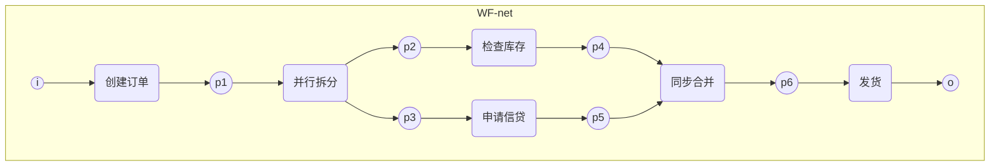

# 工作流架构理论

## 目录

- [工作流架构理论](#工作流架构理论)
  - [目录](#目录)
  - [1. 理论概述](#1-理论概述)
    - [1.1 工作流定义](#11-工作流定义)
    - [1.2 核心概念](#12-核心概念)
  - [2. 形式化基础：Petri网](#2-形式化基础petri网)
    - [2.1 工作流网 (WF-net)](#21-工作流网-wf-net)
    - [2.2 健全性 (Soundness)](#22-健全性-soundness)
  - [3. 核心工作流模式 (Workflow Patterns)](#3-核心工作流模式-workflow-patterns)
    - [3.1 基本控制流模式](#31-基本控制流模式)
    - [3.2 高级控制流模式](#32-高级控制流模式)
    - [3.3 资源与数据模式](#33-资源与数据模式)
    - [3.4 异常处理模式](#34-异常处理模式)
  - [4. 工作流正确性与验证](#4-工作流正确性与验证)
  - [5. 交叉引用](#5-交叉引用)
  - [6. 导航](#6-导航)

## 1. 理论概述

工作流架构理论关注业务流程的建模、自动化与优化，是企业级系统和复杂业务场景中的核心架构理论之一。它旨在将工作流从单纯的工程实践提升为可被严格分析、验证和优化的形式化对象。

### 1.1 工作流定义

工作流管理联盟 (WfMC) 将工作流定义为："能够完全或者部分自动执行的业务过程，在这些过程中，文档、信息或任务按照一组过程规则从一个参与者传递到另一个参与者。"

从形式化角度，一个工作流 `W` 可以被定义为一个五元组：
\[ W = (A, T, D, R, C) \]
其中：

- **A (Activities)**: 活动集合，工作流中的基本执行单元。
- **T (Transitions)**: 活动间的转移关系或依赖关系，定义了流程的结构。
- **D (Data Objects)**: 数据对象集合，在流程中被创建、使用和修改的信息。
- **R (Resources)**: 资源集合，执行活动所需的参与者或系统（如角色、人员、服务）。
- **C (Constraints)**: 约束条件集合，控制流程执行的业务规则和逻辑。

### 1.2 核心概念

- **活动 (Activity)**: 工作流中的一个逻辑步骤。
- **实例 (Instance)**: 一个工作流定义的具体执行。
- **工作项 (Work Item)**: 分配给特定资源（如用户）等待执行的任务。
- **路由 (Routing)**: 定义活动之间转移路径的规则。
- **触发器 (Trigger)**: 启动或推进工作流的事件或条件。

## 2. 形式化基础：Petri网

Petri网是描述和分析并发系统的经典数学工具，也是工作流建模最重要、最强大的形式化基础。它能够精确地捕捉并发、同步、选择等复杂的流程行为。

### 2.1 工作流网 (WF-net)

一个标准Petri网要能正确为工作流建模，必须满足特定结构，这类Petri网被称为**工作流网 (Workflow net, WF-net)**。

**定义**: 一个Petri网是一个工作流网，当且仅当：

1. **唯一入口**: 存在一个唯一的"源"库所 (place) `i`，它没有任何输入弧。
2. **唯一出口**: 存在一个唯一的"汇"库所 (place) `o`，它没有任何输出弧。
3. **连通性**: 如果我们将一个从`o`到`i`的变迁 (transition) 添加到网络中，那么得到的图是强连通的（即每个节点都在从`i`到`o`的路径上）。

### 2.2 健全性 (Soundness)

**健全性**是衡量一个工作流模型是否"行为良好"的核心属性。一个健全的工作流能保证：

- **正确完成**: 对于任何情况，流程最终都能到达表示"完成"的最终状态 `o`。
- **无残留任务**: 当流程完成后，不会在流程内部残留任何未完成的任务。
- **无死锁**: 流程中不存在任何无法被触发的活动（死任务）。

健全性可以通过对WF-net进行可达图分析等形式化方法来严格证明，确保了工作流设计的鲁棒性。

## 3. 核心工作流模式 (Workflow Patterns)

工作流模式是对流程中反复出现的控制、数据、资源和异常处理等问题的通用解决方案的编目。它们由Wil van der Aalst等人提出，已成为描述和比较工作流系统能力的行业标准。

### 3.1 基本控制流模式

- **顺序 (Sequence)**: 任务按严格顺序依次执行。
- **并行分支 (Parallel Split)**: 一条执行路径拆分为多条并行执行的路径。
- **同步 (Synchronization)**: 多条并行路径重新汇合，等待所有路径都完成后再继续。
- **条件选择 (Exclusive Choice)**: 基于条件，从多个执行路径中选择一个执行。
- **简单合并 (Simple Merge)**: 多个可选路径重新汇合，不进行同步。

### 3.2 高级控制流模式

- **多选 (Multi-choice)**: 基于条件，从多个路径中选择一个或多个并行执行。
- **判别器 (Discriminator)**: 等待多个传入分支中的一个完成后立即继续，并忽略后续到达的分支。对于后续到达的分支，它会简单地"消费"掉这些信号，而不会再次触发后续任务。这种模式常用于处理非并行的、竞争性的事件源。
- **任意循环 (Arbitrary Cycles)**: 允许流程图中存在循环结构，实现任务的重复执行。
- **隐式终止 (Implicit Termination)**: 当流程中没有更多任务可执行时，流程实例自动完成，无需到达一个明确的结束节点。

### 3.3 资源与数据模式

- **资源模式**: 定义如何将任务分配给资源。
  - **基于角色分配 (Role-based Allocation)**: 将任务分配给特定角色的所有成员。
  - **推送 vs. 拉取 (Push vs. Pull)**: 系统主动将任务**推送**给用户，或用户从任务列表中**拉取**任务。
- **数据模式**: 定义数据在工作流中的传递和可见性。
  - **块数据 (Block Data)**: 数据仅在流程的特定代码块或子流程中可见。
  - **按引用传递 (Pass by Reference)**: 任务间传递的是数据的引用或指针，而非数据副本。

### 3.4 异常处理模式

- **补偿 (Compensation)**: 如果流程的某个部分失败，则执行一个"补偿任务"来撤销或纠正已完成操作的影响。
- **回滚/向后恢复 (Backward Recovery)**: 将流程状态恢复到失败之前的某个已知安全点。

## 4. 工作流正确性与验证

工作流的正确性是确保其可靠执行的关键。形式化方法可以用来验证以下关键属性：

- **无死锁 (Deadlock-free)**: 系统中不存在任何一组任务相互等待而无法继续执行的情况。
- **无活锁 (Livelock-free)**: 系统不会陷入无限循环的状态转换中而无任何实质性进展。
- **终止性 (Termination)**: 任何一个流程实例都保证能在有限时间内结束。

这些属性可以通过对工作流的Petri网模型进行**状态空间分析**或**模型检测**来自动验证。

## 5. 交叉引用

- **形式化基础**: [自动机统一理论](../03-形式语言理论体系/01-自动机统一理论.md) (Petri网部分), [时序逻辑与模型检测](../03-形式语言理论体系/07-时序逻辑与模型检测.md)
- **架构关联**: [分布式架构理论](05-分布式架构理论.md), [控制理论基础](07-控制理论基础.md)

## 6. 导航

- [返回软件架构理论总论](00-软件架构理论总论.md)
- [设计模式理论](01a-设计模式详解.md)
- [微服务架构理论](06-微服务架构理论.md)
- [组件理论](02-组件理论.md)
- [云原生架构理论](04-云原生架构理论.md)
- [分布式架构理论](05-分布式架构理论.md)
- [WebAssembly架构理论](06-WebAssembly架构理论.md)
- [控制理论基础](07-控制理论基础.md)
