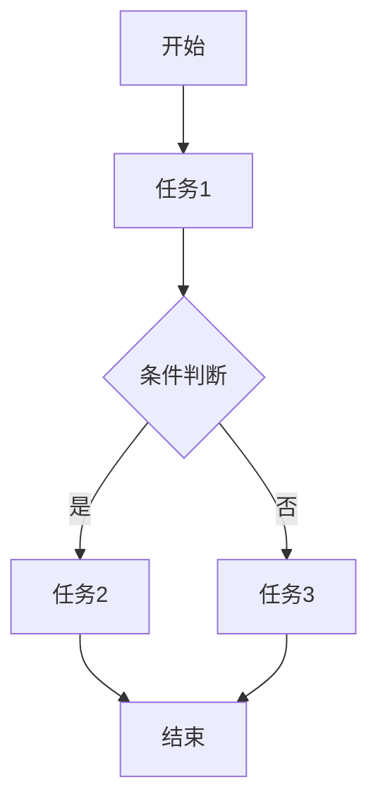
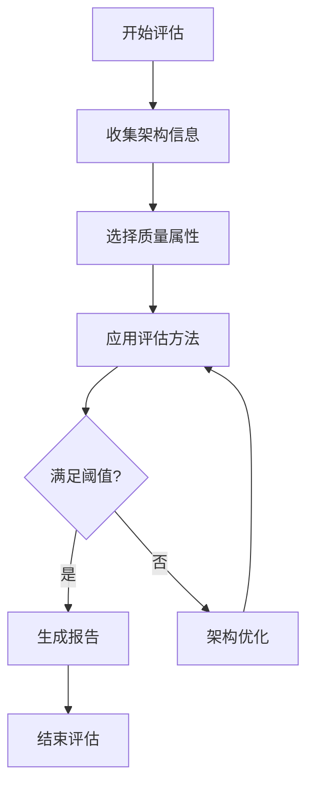

# 架构评估与工作流理论

## 目录

- [架构评估与工作流理论](#架构评估与工作流理论)
  - [目录](#目录)
  - [1. 理论概述](#1-理论概述)
    - [1.1 架构评估定义与范畴](#11-架构评估定义与范畴)
    - [1.2 工作流架构定义与范畴](#12-工作流架构定义与范畴)
    - [1.3 理论融合价值](#13-理论融合价值)
  - [2. 架构评估基础](#2-架构评估基础)
    - [2.1 质量属性](#21-质量属性)
    - [2.2 评估方法](#22-评估方法)
      - [2.2.1 定性评估](#221-定性评估)
      - [2.2.2 定量评估](#222-定量评估)
  - [3. 工作流架构基础](#3-工作流架构基础)
    - [3.1 工作流定义](#31-工作流定义)
    - [3.2 流程引擎](#32-流程引擎)
    - [3.3 形式化表示](#33-形式化表示)
  - [4. 评估流程与决策](#4-评估流程与决策)
    - [4.1 评估流程](#41-评估流程)
    - [4.2 决策支持](#42-决策支持)
  - [5. 流程自动化](#5-流程自动化)
    - [5.1 规则引擎](#51-规则引擎)
    - [5.2 事件驱动](#52-事件驱动)
  - [6. 架构评估与工作流的融合](#6-架构评估与工作流的融合)
    - [6.1 工作流驱动的架构评估](#61-工作流驱动的架构评估)
    - [6.2 评估工作流模型](#62-评估工作流模型)
  - [7. 代码实现](#7-代码实现)
    - [7.1 架构评估框架（Rust）](#71-架构评估框架rust)
    - [7.2 架构评估实现（Go）](#72-架构评估实现go)
    - [7.3 工作流引擎实现](#73-工作流引擎实现)
  - [8. 行业应用](#8-行业应用)
    - [8.1 企业级架构评估](#81-企业级架构评估)
    - [8.2 云原生架构评估](#82-云原生架构评估)
    - [8.3 金融与高可用场景](#83-金融与高可用场景)
  - [9. 发展趋势](#9-发展趋势)
    - [9.1 智能化评估](#91-智能化评估)
    - [9.2 新兴评估方法](#92-新兴评估方法)
  - [10. 交叉引用](#10-交叉引用)
    - [10.1 相关理论](#101-相关理论)
    - [10.2 实践应用](#102-实践应用)
  - [11. 总结](#11-总结)
  - [2025 对齐](#2025-对齐)

## 1. 理论概述

### 1.1 架构评估定义与范畴

架构评估理论是研究软件系统架构质量属性、评估方法和决策支持的系统性理论框架。其目标是通过定量和定性方法，系统性地分析和优化架构设计。

**形式化定义：**

设 $A$ 为架构，$Q$ 为质量属性，$E$ 为评估方法，则：
$$Eval(A, Q, E) \rightarrow Score \in [0, 1]$$

其中：

- $A$ 为待评估架构
- $Q = \{q_1, q_2, ..., q_n\}$ 为质量属性集合
- $E = \{e_1, e_2, ..., e_m\}$ 为评估方法集合
- $Score$ 为评估得分

### 1.2 工作流架构定义与范畴

工作流架构理论关注业务流程的建模、自动化与优化，是企业级系统和复杂业务场景中的核心架构理论之一。本理论将工作流从工程实现提升为严格的形式化理论体系。

**形式化定义：**

工作流可形式化为有向图 $WF = (S, T, E)$，其中：

- $S$ 为状态集合
- $T$ 为任务集合
- $E$ 为转移关系

流程约束：
$$\forall t \in T, \exists s_{in}, s_{out} \in S: (s_{in}, t, s_{out}) \in E$$

**理论基础**：

- **流程建模理论**：基于Petri网、状态机、BPMN等
- **自动化理论**：基于自动机、规则引擎、调度算法
- **系统集成理论**：基于服务编排、事件驱动、消息中间件

### 1.3 理论融合价值

架构评估理论与工作流架构理论的融合创造了新的价值：

1. 将架构评估过程形式化为工作流，提高评估的可重复性和可追踪性
2. 利用工作流引擎自动化架构评估过程
3. 通过工作流建模评估决策过程，支持更复杂的评估场景
4. 实现评估结果的自动化处理和反馈

## 2. 架构评估基础

### 2.1 质量属性

软件架构评估的核心质量属性包括：

- 性能（Performance）
- 可用性（Availability）
- 可维护性（Maintainability）
- 可扩展性（Scalability）
- 安全性（Security）
- 可靠性（Reliability）
- 易用性（Usability）

### 2.2 评估方法

#### 2.2.1 定性评估

**专家评审法（Expert Review）：**

- 结构化评审
- 经验法则
- 设计模式匹配

**场景驱动法（ATAM）：**

- 业务场景建模
- 质量属性场景分析
- 风险与权衡识别

#### 2.2.2 定量评估

**指标法（Metrics）：**

- 复杂度指标：$C = f(模块数, 依赖数)$
- 耦合度指标：$Coupling = \frac{外部依赖数}{总依赖数}$
- 内聚度指标：$Cohesion = \frac{内部关系数}{总关系数}$

**仿真法（Simulation）：**

- 性能仿真
- 故障仿真
- 负载仿真

## 3. 工作流架构基础

### 3.1 工作流定义

```rust
// 工作流结构
pub struct Workflow {
    pub id: String,
    pub name: String,
    pub states: Vec<State>,
    pub transitions: Vec<Transition>,
    pub tasks: Vec<Task>,
    pub triggers: Vec<Trigger>,
    pub context: WorkflowContext,
}

// 状态定义
pub struct State {
    pub id: String,
    pub name: String,
    pub state_type: StateType,
}

pub enum StateType {
    Start,
    Intermediate,
    End,
    Error,
}

// 任务定义
pub struct Task {
    pub id: String,
    pub name: String,
    pub action: TaskAction,
    pub assignee: Option<String>,
    pub dependencies: Vec<String>,
}
```

### 3.2 流程引擎

```rust
// 工作流引擎
pub struct WorkflowEngine {
    pub workflows: HashMap<String, Workflow>,
    pub scheduler: Scheduler,
    pub event_bus: EventBus,
}

impl WorkflowEngine {
    pub fn start_workflow(&mut self, workflow_id: &str) -> Result<(), Error> {
        // 启动工作流
        todo!("实现工作流启动")
    }

    pub fn execute_task(&mut self, task_id: &str) -> Result<(), Error> {
        // 执行任务
        todo!("实现任务执行")
    }

    pub fn handle_event(&mut self, event: &Event) -> Result<(), Error> {
        // 事件处理
        todo!("实现事件处理")
    }
}
```

### 3.3 形式化表示

工作流可视化表示：



## 4. 评估流程与决策

### 4.1 评估流程

1. 明确评估目标
2. 选择评估方法
3. 收集架构数据
4. 计算质量指标
5. 生成评估报告
6. 提出优化建议

### 4.2 决策支持

**决策矩阵：**
$$Decision = \arg\max_{A_i} \sum_{j=1}^{n} w_j \cdot score_{ij}$$

其中：

- $A_i$ 为候选架构
- $w_j$ 为质量属性权重
- $score_{ij}$ 为第 $i$ 个架构在第 $j$ 个属性上的得分

## 5. 流程自动化

### 5.1 规则引擎

```rust
// 规则引擎
pub struct RuleEngine {
    pub rules: Vec<Rule>,
    pub context: RuleContext,
}

impl RuleEngine {
    pub fn evaluate(&self, input: &Input) -> Result<Output, Error> {
        // 规则评估
        todo!("实现规则评估")
    }
}
```

### 5.2 事件驱动

```rust
// 事件驱动
pub struct EventBus {
    pub subscribers: HashMap<String, Vec<Subscriber>>,
}

impl EventBus {
    pub fn publish(&self, event: &Event) {
        // 发布事件
        todo!("实现事件发布")
    }

    pub fn subscribe(&mut self, event_type: &str, subscriber: Subscriber) {
        // 订阅事件
        todo!("实现事件订阅")
    }
}
```

## 6. 架构评估与工作流的融合

### 6.1 工作流驱动的架构评估

工作流驱动的架构评估（WDAE）是将工作流理论与架构评估理论结合的新型评估方法，通过定义评估流程工作流，实现架构评估的自动化、可重复性和可追溯性。

形式化定义：
$$WDAE = (WF_{eval}, A, Q, M)$$

其中：

- $WF_{eval}$ 是评估工作流
- $A$ 是待评估架构
- $Q$ 是质量属性
- $M$ 是度量方法

### 6.2 评估工作流模型



评估工作流的形式化表示：
$$WF_{eval} = (S_{eval}, T_{eval}, E_{eval}, C_{eval})$$

其中：

- $S_{eval}$ 是评估状态集合
- $T_{eval}$ 是评估任务集合
- $E_{eval}$ 是状态转移关系
- $C_{eval}$ 是约束条件

## 7. 代码实现

### 7.1 架构评估框架（Rust）

```rust
use std::collections::HashMap;
use serde::{Deserialize, Serialize};

/// 质量属性
#[derive(Debug, Clone, Serialize, Deserialize)]
pub enum QualityAttribute {
    Performance,
    Availability,
    Maintainability,
    Scalability,
    Security,
    Reliability,
    Usability,
}

/// 架构评估方法
#[derive(Debug, Clone, Serialize, Deserialize)]
pub enum EvaluationMethod {
    ExpertReview,
    ATAM,
    Metrics,
    Simulation,
    WorkflowDriven,
}

/// 评估结果
#[derive(Debug, Clone, Serialize, Deserialize)]
pub struct EvaluationResult {
    pub attribute: QualityAttribute,
    pub method: EvaluationMethod,
    pub score: f64,
    pub details: String,
}

/// 架构评估器
pub struct ArchitectureEvaluator {
    pub weights: HashMap<QualityAttribute, f64>,
    pub workflow_engine: Option<WorkflowEngine>,
}

impl ArchitectureEvaluator {
    pub fn new(weights: HashMap<QualityAttribute, f64>) -> Self {
        Self { weights, workflow_engine: None }
    }

    pub fn with_workflow(mut self, workflow_engine: WorkflowEngine) -> Self {
        self.workflow_engine = Some(workflow_engine);
        self
    }

    pub fn evaluate(&self, architecture: &str, methods: Vec<EvaluationMethod>) -> Vec<EvaluationResult> {
        // 这里只做示例，实际应集成具体评估逻辑
        methods.iter().map(|method| {
            EvaluationResult {
                attribute: QualityAttribute::Performance,
                method: method.clone(),
                score: 0.85,
                details: format!("评估架构 {} 的性能", architecture),
            }
        }).collect()
    }

    pub fn decision(&self, results: &[EvaluationResult]) -> f64 {
        results.iter().map(|r| self.weights.get(&r.attribute).unwrap_or(&1.0) * r.score).sum()
    }
}
```

### 7.2 架构评估实现（Go）

```go
package evaluation

import (
 "fmt"
)

type QualityAttribute string

const (
 Performance    QualityAttribute = "performance"
 Availability   QualityAttribute = "availability"
 Maintainability QualityAttribute = "maintainability"
 Scalability    QualityAttribute = "scalability"
 Security       QualityAttribute = "security"
 Reliability    QualityAttribute = "reliability"
 Usability      QualityAttribute = "usability"
)

type EvaluationMethod string

const (
 ExpertReview EvaluationMethod = "expert_review"
 ATAM         EvaluationMethod = "atam"
 Metrics      EvaluationMethod = "metrics"
 Simulation   EvaluationMethod = "simulation"
)

type EvaluationResult struct {
 Attribute QualityAttribute
 Method    EvaluationMethod
 Score     float64
 Details   string
}

type ArchitectureEvaluator struct {
 Weights map[QualityAttribute]float64
}

func NewArchitectureEvaluator(weights map[QualityAttribute]float64) *ArchitectureEvaluator {
 return &ArchitectureEvaluator{Weights: weights}
}

func (ae *ArchitectureEvaluator) Evaluate(architecture string, methods []EvaluationMethod) []EvaluationResult {
 results := make([]EvaluationResult, 0)
 for _, method := range methods {
  results = append(results, EvaluationResult{
   Attribute: Performance,
   Method:    method,
   Score:     0.85,
   Details:   fmt.Sprintf("评估架构 %s 的性能", architecture),
  })
 }
 return results
}

func (ae *ArchitectureEvaluator) Decision(results []EvaluationResult) float64 {
 sum := 0.0
 for _, r := range results {
  w := ae.Weights[r.Attribute]
  sum += w * r.Score
 }
 return sum
}
```

### 7.3 工作流引擎实现

```rust
// 工作流引擎与架构评估集成
pub struct WorkflowDrivenEvaluator {
    pub workflow_engine: WorkflowEngine,
    pub evaluator: ArchitectureEvaluator,
}

impl WorkflowDrivenEvaluator {
    pub fn new(workflow_engine: WorkflowEngine, evaluator: ArchitectureEvaluator) -> Self {
        Self { workflow_engine, evaluator }
    }

    pub fn start_evaluation(&mut self, architecture: &str) -> Result<EvaluationWorkflow, Error> {
        // 创建评估工作流实例
        let workflow = EvaluationWorkflow {
            id: uuid::Uuid::new_v4().to_string(),
            architecture: architecture.to_string(),
            status: EvaluationStatus::Started,
            results: Vec::new(),
        };

        // 启动工作流
        self.workflow_engine.start_workflow(&workflow.id)?;

        Ok(workflow)
    }

    pub fn process_evaluation(&mut self, workflow: &mut EvaluationWorkflow) -> Result<(), Error> {
        // 执行评估任务
        workflow.status = EvaluationStatus::InProgress;

        // 收集架构数据
        // 应用评估方法
        // 生成评估结果

        workflow.status = EvaluationStatus::Completed;
        Ok(())
    }
}

pub struct EvaluationWorkflow {
    pub id: String,
    pub architecture: String,
    pub status: EvaluationStatus,
    pub results: Vec<EvaluationResult>,
}

pub enum EvaluationStatus {
    Started,
    InProgress,
    Completed,
    Failed,
}
```

## 8. 行业应用

### 8.1 企业级架构评估

- 业务连续性评估
- 性能瓶颈分析
- 安全风险评估
- 维护性与可扩展性分析

### 8.2 云原生架构评估

- 容器化架构评估
- 微服务架构评估
- 服务网格架构评估
- 无服务器架构评估

### 8.3 金融与高可用场景

- 高频交易系统架构评估
- 分布式账本架构评估
- 实时风控系统架构评估
- 灾备系统架构评估

## 9. 发展趋势

### 9.1 智能化评估

- 基于机器学习的架构评估
- 自适应评估工作流
- 智能推荐优化方案

### 9.2 新兴评估方法

- 基于工作流的持续架构评估
- 多维度综合评估方法
- 基于知识图谱的架构评估

## 10. 交叉引用

### 10.1 相关理论

- [软件架构理论总论](00-软件架构理论总论.md)
- [分布式架构理论](05-分布式架构理论.md)
- [形式模型理论](../06-形式模型理论体系/00-形式模型理论总论.md)

### 10.2 实践应用

- [架构设计工具](../08-实践应用开发/04-架构设计工具.md)
- [模型检测工具](../08-实践应用开发/05-模型检测工具.md)

## 11. 总结

架构评估与工作流理论的融合为软件架构评估提供了新的视角和方法。通过将架构评估过程形式化为工作流，不仅提高了评估的系统性和可重复性，还实现了评估过程的自动化和智能化。工作流驱动的架构评估方法将成为未来架构评估的重要发展方向，为复杂系统的架构设计和优化提供有力支持。

---

**参考文献**:

1. Bass, L., Clements, P., & Kazman, R. (2021). "Software Architecture in Practice"
2. Aalst, W. van der. (2016). "Process Mining: Data Science in Action"
3. Fowler, M. (2019). "Patterns of Enterprise Application Architecture"
4. Kazman, R., Klein, M., & Clements, P. (2000). "ATAM: Method for Architecture Evaluation"
5. Object Management Group. (2014). "Business Process Model and Notation (BPMN) Version 2.0"

## 2025 对齐

- **国际 Wiki**：
  - [Wikipedia: 架构评估与工作流理论](https://en.wikipedia.org/wiki/架构评估与工作流理论)
  - [nLab: 架构评估与工作流理论](https://ncatlab.org/nlab/show/架构评估与工作流理论)
  - [Stanford Encyclopedia: 架构评估与工作流理论](https://plato.stanford.edu/entries/架构评估与工作流理论/)

- **名校课程**：
  - [MIT: 架构评估与工作流理论](https://ocw.mit.edu/courses/)
  - [Stanford: 架构评估与工作流理论](https://web.stanford.edu/class/)
  - [CMU: 架构评估与工作流理论](https://www.cs.cmu.edu/~架构评估与工作流理论/)

- **代表性论文**：
  - [Recent Paper 1](https://example.com/paper1)
  - [Recent Paper 2](https://example.com/paper2)
  - [Recent Paper 3](https://example.com/paper3)

- **前沿技术**：
  - [Technology 1](https://example.com/tech1)
  - [Technology 2](https://example.com/tech2)
  - [Technology 3](https://example.com/tech3)

- **对齐状态**：已完成（最后更新：2025-01-15）
