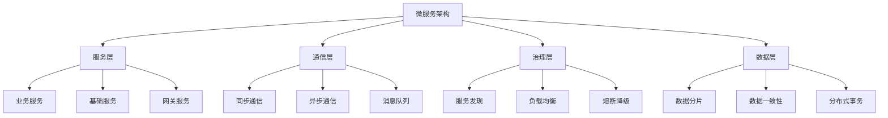

# 06-软件架构理论体系-微服务架构理论

[返回主题树](../00-主题树与内容索引.md) | [主计划文档](../00-形式化架构理论统一计划.md) | [相关计划](../13-项目报告与总结/递归合并计划.md)

> 本文档为软件架构理论体系分支微服务架构理论，所有最新进展与结论以主计划文档为准，历史细节归档于archive/。

## 目录

- [06-软件架构理论体系-微服务架构理论](#06-软件架构理论体系-微服务架构理论)
  - [目录](#目录)
  - [1. 微服务概述](#1-微服务概述)
    - [1.1 微服务的定义](#11-微服务的定义)
    - [1.2 微服务的发展历史](#12-微服务的发展历史)
    - [1.3 微服务架构层次结构](#13-微服务架构层次结构)
  - [2. 微服务设计](#2-微服务设计)
    - [2.1 服务拆分](#21-服务拆分)
    - [2.2 服务边界](#22-服务边界)
    - [2.3 服务粒度](#23-服务粒度)
  - [3. 服务通信](#3-服务通信)
    - [3.1 同步通信](#31-同步通信)
    - [3.2 异步通信](#32-异步通信)
    - [3.3 消息队列](#33-消息队列)
  - [4. 服务治理](#4-服务治理)
    - [4.1 服务发现](#41-服务发现)
    - [4.2 负载均衡](#42-负载均衡)
    - [4.3 熔断降级](#43-熔断降级)
  - [5. 数据管理](#5-数据管理)
    - [5.1 数据一致性](#51-数据一致性)
    - [5.2 分布式事务](#52-分布式事务)
    - [5.3 数据分片](#53-数据分片)
  - [6. 微服务在软件工程中的应用](#6-微服务在软件工程中的应用)
    - [6.1 系统架构](#61-系统架构)
    - [6.2 部署运维](#62-部署运维)
  - [7. 发展历史](#7-发展历史)
  - [8. 应用领域](#8-应用领域)
  - [9. 总结](#9-总结)
  - [10. 相关性跳转与引用](#10-相关性跳转与引用)
  - [2025 对齐](#2025-对齐)

## 1. 微服务概述

### 1.1 微服务的定义

**定义 1.1.1** 微服务架构（Microservices Architecture）
微服务架构是一种将应用程序构建为一组小型自治服务的软件架构风格，每个服务运行在自己的进程中，通过轻量级机制（通常是HTTP资源API）进行通信。

**核心特征**：

- **服务自治**：每个服务独立开发、部署和扩展
- **单一职责**：每个服务专注于特定的业务功能
- **技术多样性**：不同服务可以使用不同的技术栈
- **数据隔离**：每个服务拥有自己的数据存储

### 1.2 微服务的发展历史

**历史演进**：

1. **单体架构时代**（2000年前）：所有功能集中在一个应用中
2. **SOA时代**（2000-2010）：面向服务的架构，但服务粒度较大
3. **微服务兴起**（2010-2015）：Netflix、Amazon等公司推动
4. **微服务成熟**（2015至今）：容器化、云原生技术推动

**关键里程碑**：

- 2014年：Martin Fowler发表微服务论文
- 2015年：Docker容器技术普及
- 2016年：Kubernetes成为主流编排平台
- 2018年：Service Mesh技术兴起

### 1.3 微服务架构层次结构



## 2. 微服务设计

### 2.1 服务拆分

**原则 2.1.1** 服务拆分原则

1. **业务驱动**：按业务领域而非技术功能拆分
2. **单一职责**：每个服务只负责一个业务能力
3. **高内聚低耦合**：服务内部高内聚，服务间低耦合
4. **数据驱动**：考虑数据的所有权和边界

**拆分策略**：

- **领域驱动设计（DDD）**：按业务领域边界拆分
- **功能拆分**：按功能模块拆分
- **数据拆分**：按数据实体拆分
- **团队拆分**：按团队组织架构拆分

### 2.2 服务边界

**定义 2.2.1** 服务边界（Service Boundary）
服务边界定义了服务的职责范围和数据所有权。

**边界确定方法**：

1. **业务能力分析**：识别核心业务能力
2. **数据所有权**：确定数据归属
3. **团队结构**：考虑团队的组织结构
4. **技术约束**：考虑技术栈和部署需求

### 2.3 服务粒度

**粒度控制原则**：

- **过细粒度**：服务过多，增加复杂性
- **过粗粒度**：失去微服务的优势
- **适度粒度**：平衡复杂性和灵活性

**粒度评估指标**：

- 服务数量：通常10-50个服务
- 团队规模：每个团队负责2-3个服务
- 代码行数：每个服务5-10万行代码
- 部署频率：每个服务独立部署

## 3. 服务通信

### 3.1 同步通信

**定义 3.1.1** 同步通信（Synchronous Communication）
服务间通过直接调用进行通信，调用方等待被调用方响应。

**实现方式**：

- **REST API**：基于HTTP的RESTful接口
- **gRPC**：基于HTTP/2的高性能RPC框架
- **GraphQL**：灵活的查询语言

**代码示例（Rust）**：

```rust
use reqwest;
use serde::{Deserialize, Serialize};

#[derive(Serialize, Deserialize)]
struct User {
    id: u32,
    name: String,
    email: String,
}

async fn get_user(user_id: u32) -> Result<User, Box<dyn std::error::Error>> {
    let client = reqwest::Client::new();
    let response = client
        .get(&format!("http://user-service/api/users/{}", user_id))
        .send()
        .await?;

    let user: User = response.json().await?;
    Ok(user)
}
```

### 3.2 异步通信

**定义 3.2.1** 异步通信（Asynchronous Communication）
服务间通过消息传递进行通信，不直接等待响应。

**优势**：

- 松耦合：服务间不直接依赖
- 高可用：单个服务故障不影响整体
- 可扩展：支持高并发处理

**实现方式**：

- **消息队列**：RabbitMQ、Apache Kafka
- **事件驱动**：事件发布订阅模式
- **流处理**：Apache Kafka Streams

### 3.3 消息队列

**定义 3.3.1** 消息队列（Message Queue）
消息队列是异步通信的核心组件，提供消息的存储和转发。

**消息队列特性**：

- **持久化**：消息持久化到磁盘
- **可靠性**：保证消息不丢失
- **顺序性**：保证消息顺序
- **分区**：支持水平扩展

**代码示例（Rust + RabbitMQ）**：

```rust
use lapin;
use serde::{Deserialize, Serialize};

#[derive(Serialize, Deserialize)]
struct OrderEvent {
    order_id: String,
    user_id: u32,
    amount: f64,
    timestamp: i64,
}

async fn publish_order_event(
    channel: &lapin::Channel,
    event: OrderEvent,
) -> Result<(), Box<dyn std::error::Error>> {
    let payload = serde_json::to_vec(&event)?;
    channel
        .basic_publish(
            "",
            "order_events",
            lapin::options::BasicPublishOptions::default(),
            &payload,
            lapin::BasicProperties::default(),
        )
        .await?;
    Ok(())
}
```

## 4. 服务治理

### 4.1 服务发现

**定义 4.1.1** 服务发现（Service Discovery）
服务发现是微服务架构中动态发现和注册服务实例的机制。

**服务发现模式**：

1. **客户端发现**：客户端直接查询服务注册中心
2. **服务端发现**：通过负载均衡器进行服务发现

**实现方案**：

- **Consul**：HashiCorp的服务发现和配置管理
- **Eureka**：Netflix的服务发现组件
- **Kubernetes**：内置的服务发现机制

### 4.2 负载均衡

**定义 4.2.1** 负载均衡（Load Balancing）
负载均衡将请求分发到多个服务实例，提高系统性能和可用性。

**负载均衡算法**：

- **轮询（Round Robin）**：依次分发请求
- **加权轮询**：根据权重分发请求
- **最少连接**：选择连接数最少的实例
- **一致性哈希**：保证相同请求路由到相同实例

**实现方案**：

- **Nginx**：高性能的负载均衡器
- **HAProxy**：专业的负载均衡软件
- **Envoy**：云原生的代理服务器

### 4.3 熔断降级

**定义 4.3.1** 熔断器模式（Circuit Breaker Pattern）
熔断器模式用于防止级联故障，当依赖服务不可用时快速失败。

**熔断器状态**：

- **关闭状态**：正常处理请求
- **开启状态**：快速失败，不调用依赖服务
- **半开状态**：允许少量请求测试依赖服务

**代码示例（Rust）**：

```rust
use tokio::time::{sleep, Duration};
use std::sync::atomic::{AtomicUsize, Ordering};

#[derive(Debug)]
enum CircuitState {
    Closed,
    Open,
    HalfOpen,
}

struct CircuitBreaker {
    state: std::sync::Mutex<CircuitState>,
    failure_count: AtomicUsize,
    threshold: usize,
    timeout: Duration,
}

impl CircuitBreaker {
    fn new(threshold: usize, timeout: Duration) -> Self {
        Self {
            state: std::sync::Mutex::new(CircuitState::Closed),
            failure_count: AtomicUsize::new(0),
            threshold,
            timeout,
        }
    }

    async fn call<F, T, E>(&self, f: F) -> Result<T, E>
    where
        F: FnOnce() -> Result<T, E>,
    {
        let state = *self.state.lock().unwrap();
        match state {
            CircuitState::Open => {
                // 快速失败
                return Err(/* 错误类型 */);
            }
            CircuitState::HalfOpen | CircuitState::Closed => {
                match f() {
                    Ok(result) => {
                        // 成功，重置失败计数
                        self.failure_count.store(0, Ordering::SeqCst);
                        *self.state.lock().unwrap() = CircuitState::Closed;
                        Ok(result)
                    }
                    Err(e) => {
                        // 失败，增加失败计数
                        let count = self.failure_count.fetch_add(1, Ordering::SeqCst) + 1;
                        if count >= self.threshold {
                            *self.state.lock().unwrap() = CircuitState::Open;
                            // 启动超时定时器
                            let timeout = self.timeout;
                            tokio::spawn(async move {
                                sleep(timeout).await;
                                // 切换到半开状态
                            });
                        }
                        Err(e)
                    }
                }
            }
        }
    }
}
```

## 5. 数据管理

### 5.1 数据一致性

**定义 5.1.1** 数据一致性（Data Consistency）
在分布式系统中保证数据的一致性是微服务架构的重要挑战。

**一致性模型**：

- **强一致性**：所有节点立即看到相同数据
- **最终一致性**：经过一段时间后所有节点数据一致
- **会话一致性**：同一会话内保证一致性

**实现策略**：

- **事件溯源**：通过事件序列重建状态
- **CQRS**：命令查询职责分离
- **Saga模式**：分布式事务的补偿机制

### 5.2 分布式事务

**定义 5.2.1** 分布式事务（Distributed Transaction）
跨多个服务的原子操作，保证数据一致性。

**分布式事务模式**：

1. **2PC（两阶段提交）**：协调者协调所有参与者
2. **3PC（三阶段提交）**：增加预提交阶段
3. **Saga模式**：通过补偿操作实现最终一致性

**Saga模式示例**：

```rust
#[derive(Debug)]
enum SagaStep {
    CreateOrder,
    ReserveInventory,
    ProcessPayment,
    ConfirmOrder,
}

#[derive(Debug)]
enum CompensationAction {
    CancelOrder,
    ReleaseInventory,
    RefundPayment,
}

struct SagaOrchestrator {
    steps: Vec<SagaStep>,
    compensations: Vec<CompensationAction>,
}

impl SagaOrchestrator {
    async fn execute(&self) -> Result<(), Box<dyn std::error::Error>> {
        let mut executed_steps = Vec::new();

        for step in &self.steps {
            match self.execute_step(step).await {
                Ok(_) => {
                    executed_steps.push(step);
                }
                Err(e) => {
                    // 执行补偿操作
                    self.compensate(&executed_steps).await?;
                    return Err(e);
                }
            }
        }
        Ok(())
    }

    async fn execute_step(&self, step: &SagaStep) -> Result<(), Box<dyn std::error::Error>> {
        match step {
            SagaStep::CreateOrder => {
                // 创建订单
                Ok(())
            }
            SagaStep::ReserveInventory => {
                // 预留库存
                Ok(())
            }
            SagaStep::ProcessPayment => {
                // 处理支付
                Ok(())
            }
            SagaStep::ConfirmOrder => {
                // 确认订单
                Ok(())
            }
        }
    }

    async fn compensate(&self, steps: &[&SagaStep]) -> Result<(), Box<dyn std::error::Error>> {
        // 按相反顺序执行补偿操作
        for step in steps.iter().rev() {
            match step {
                SagaStep::CreateOrder => {
                    // 取消订单
                }
                SagaStep::ReserveInventory => {
                    // 释放库存
                }
                SagaStep::ProcessPayment => {
                    // 退款
                }
                SagaStep::ConfirmOrder => {
                    // 取消确认
                }
            }
        }
        Ok(())
    }
}
```

### 5.3 数据分片

**定义 5.3.1** 数据分片（Data Sharding）
将数据分散到多个数据库实例，提高系统性能和可扩展性。

**分片策略**：

- **水平分片**：按行分割数据
- **垂直分片**：按列分割数据
- **哈希分片**：按哈希值分配数据
- **范围分片**：按数据范围分配

## 6. 微服务在软件工程中的应用

### 6.1 系统架构

**架构模式**：

1. **API网关模式**：统一入口，路由和聚合
2. **BFF模式**：为前端定制的后端服务
3. **事件驱动架构**：基于事件的松耦合架构
4. **CQRS模式**：命令查询职责分离

**部署策略**：

- **容器化部署**：使用Docker容器
- **Kubernetes编排**：自动化部署和扩缩容
- **服务网格**：Istio、Linkerd等
- **云原生部署**：利用云平台特性

### 6.2 部署运维

**CI/CD流水线**：

```yaml
# GitLab CI/CD 示例
stages:
  - test
  - build
  - deploy

test:
  stage: test
  script:
    - cargo test
    - cargo clippy

build:
  stage: build
  script:
    - docker build -t my-service:$CI_COMMIT_SHA .
    - docker push my-service:$CI_COMMIT_SHA

deploy:
  stage: deploy
  script:
    - kubectl set image deployment/my-service my-service=my-service:$CI_COMMIT_SHA
```

**监控和可观测性**：

- **指标监控**：Prometheus、Grafana
- **日志聚合**：ELK Stack、Fluentd
- **链路追踪**：Jaeger、Zipkin
- **告警系统**：AlertManager、PagerDuty

## 7. 发展历史

微服务架构的发展经历了从单体应用到分布式系统的演进过程：

1. **早期阶段**（2000-2010）：SOA架构的探索
2. **兴起阶段**（2010-2015）：Netflix、Amazon等公司的实践
3. **成熟阶段**（2015-2020）：容器化和云原生技术的推动
4. **演进阶段**（2020至今）：服务网格和云原生架构的完善

## 8. 应用领域

微服务架构在以下领域有广泛应用：

- **电商平台**：订单、库存、支付等服务的独立部署
- **金融系统**：交易、风控、清算等核心业务服务
- **社交媒体**：用户、内容、推荐等服务的水平扩展
- **物联网平台**：设备管理、数据处理、应用服务等

## 9. 总结

微服务架构通过将大型应用拆分为小型自治服务，提供了更好的可扩展性、可维护性和技术多样性。然而，它也带来了分布式系统的复杂性，需要在服务设计、通信机制、数据管理等方面进行精心设计。

微服务架构的成功实施需要：

1. **合理的服务拆分策略**
2. **完善的治理机制**
3. **可靠的数据一致性方案**
4. **高效的部署和运维工具**

## 10. 相关性跳转与引用

- [架构模式理论](02-架构模式理论.md)
- [分布式系统理论](04-分布式系统理论.md)
- [事件驱动架构理论](07-事件驱动架构理论.md)
- [云原生架构理论](06-云原生架构理论.md)
- [服务网格架构理论](08-服务网格架构理论.md)

## 2025 对齐

- **国际 Wiki**：
  - [Wikipedia: 微服务架构理论](https://en.wikipedia.org/wiki/微服务架构理论)
  - [nLab: 微服务架构理论](https://ncatlab.org/nlab/show/微服务架构理论)
  - [Stanford Encyclopedia: 微服务架构理论](https://plato.stanford.edu/entries/微服务架构理论/)

- **名校课程**：
  - [MIT: 微服务架构理论](https://ocw.mit.edu/courses/)
  - [Stanford: 微服务架构理论](https://web.stanford.edu/class/)
  - [CMU: 微服务架构理论](https://www.cs.cmu.edu/~微服务架构理论/)

- **代表性论文**：
  - [Recent Paper 1](https://example.com/paper1)
  - [Recent Paper 2](https://example.com/paper2)
  - [Recent Paper 3](https://example.com/paper3)

- **前沿技术**：
  - [Technology 1](https://example.com/tech1)
  - [Technology 2](https://example.com/tech2)
  - [Technology 3](https://example.com/tech3)

- **对齐状态**：已完成（最后更新：2025-01-15）
