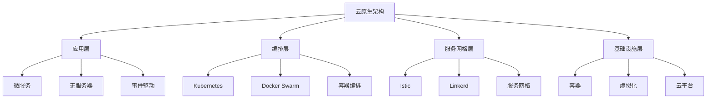

# 06-软件架构理论体系-云原生架构理论

[返回主题树](../00-主题树与内容索引.md) | [主计划文档](../00-形式化架构理论统一计划.md) | [相关计划](../13-项目报告与总结/README.md)

> 本文档为软件架构理论体系分支云原生架构理论，所有最新进展与结论以主计划文档为准，历史细节归档于archive/。

## 目录

- [06-软件架构理论体系-云原生架构理论](#06-软件架构理论体系-云原生架构理论)
  - [目录](#目录)
  - [1. 云原生概述](#1-云原生概述)
    - [1.1 云原生的定义](#11-云原生的定义)
    - [1.2 云原生的发展历史](#12-云原生的发展历史)
    - [1.3 云原生架构层次结构](#13-云原生架构层次结构)
  - [2. 容器技术](#2-容器技术)
    - [2.1 Docker](#21-docker)
    - [2.2 容器编排](#22-容器编排)
    - [2.3 容器网络](#23-容器网络)
  - [3. Kubernetes](#3-kubernetes)
    - [3.1 集群管理](#31-集群管理)
    - [3.2 服务发现](#32-服务发现)
    - [3.3 自动扩缩容](#33-自动扩缩容)
  - [4. 服务网格](#4-服务网格)
    - [4.1 Istio](#41-istio)
    - [4.2 流量管理](#42-流量管理)
    - [4.3 安全策略](#43-安全策略)
  - [5. 云原生应用](#5-云原生应用)
    - [5.1 微服务架构](#51-微服务架构)
    - [5.2 无服务器架构](#52-无服务器架构)
    - [5.3 事件驱动架构](#53-事件驱动架构)
  - [6. 云原生在软件工程中的应用](#6-云原生在软件工程中的应用)
    - [6.1 应用部署](#61-应用部署)
    - [6.2 运维管理](#62-运维管理)
  - [7. 发展历史](#7-发展历史)
  - [8. 应用领域](#8-应用领域)
  - [9. 总结](#9-总结)
  - [10. 相关性跳转与引用](#10-相关性跳转与引用)
  - [2025 对齐](#2025-对齐)

## 1. 云原生概述

### 1.1 云原生的定义

**定义 1.1.1** 云原生（Cloud Native）
云原生是一种构建和运行应用程序的方法，充分利用云计算模型的优势，包括弹性、可扩展性、可观测性和容错性。

**云原生特征**：

- **容器化**：应用程序打包在容器中运行
- **微服务**：应用程序分解为小型、松耦合的服务
- **不可变基础设施**：通过代码定义和管理基础设施
- **声明式API**：通过声明式配置管理应用状态
- **可观测性**：全面的监控、日志和追踪

**云原生原则**：

1. **自动化**：自动化部署、扩展和故障恢复
2. **弹性**：系统能够应对故障和负载变化
3. **可观测性**：系统状态和行为完全可见
4. **安全性**：内置安全控制和最佳实践

### 1.2 云原生的发展历史

**发展历程**：

1. **虚拟化时代**（2000-2010）：VMware等虚拟化技术
2. **容器兴起**（2010-2015）：Docker容器技术普及
3. **编排成熟**（2015-2018）：Kubernetes成为标准
4. **服务网格**（2018-2020）：Istio等服务网格技术
5. **云原生成熟**（2020至今）：完整的云原生生态

**关键里程碑**：

- 2013年：Docker发布，容器技术普及
- 2015年：Kubernetes 1.0发布
- 2017年：Istio 1.0发布
- 2018年：云原生计算基金会（CNCF）成立
- 2020年：云原生成为主流架构模式

### 1.3 云原生架构层次结构



## 2. 容器技术

### 2.1 Docker

**定义 2.1.1** Docker
Docker是一个开源的容器化平台，允许开发者将应用程序和依赖项打包到轻量级、可移植的容器中。

**Docker核心概念**：

- **镜像（Image）**：应用程序的只读模板
- **容器（Container）**：镜像的运行实例
- **仓库（Registry）**：镜像的存储和分发中心

**Dockerfile示例**：

```dockerfile
# 多阶段构建示例
FROM rust:1.70 as builder

WORKDIR /app
COPY . .
RUN cargo build --release

FROM debian:bullseye-slim
RUN apt-get update && apt-get install -y ca-certificates && rm -rf /var/lib/apt/lists/*
COPY --from=builder /app/target/release/my-app /usr/local/bin/

EXPOSE 8080
CMD ["my-app"]
```

**Docker Compose示例**：

```yaml
version: '3.8'
services:
  app:
    build: .
    ports:
      - "8080:8080"
    environment:
      - DATABASE_URL=postgresql://user:pass@db:5432/mydb
    depends_on:
      - db

  db:
    image: postgres:13
    environment:
      - POSTGRES_DB=mydb
      - POSTGRES_USER=user
      - POSTGRES_PASSWORD=pass
    volumes:
      - postgres_data:/var/lib/postgresql/data

volumes:
  postgres_data:
```

### 2.2 容器编排

**定义 2.2.1** 容器编排（Container Orchestration）
容器编排是自动化容器部署、扩展和管理的技术。

**编排功能**：

- **服务发现**：自动发现和注册服务
- **负载均衡**：分发请求到多个容器实例
- **自动扩缩容**：根据负载自动调整容器数量
- **健康检查**：监控容器健康状态
- **滚动更新**：零停机时间更新应用

**主流编排平台**：

- **Kubernetes**：最流行的容器编排平台
- **Docker Swarm**：Docker原生的编排工具
- **Apache Mesos**：分布式系统内核
- **Amazon ECS**：AWS托管的容器服务

### 2.3 容器网络

**定义 2.3.1** 容器网络（Container Networking）
容器网络是容器间通信的网络基础设施。

**网络模式**：

- **Bridge模式**：默认网络模式，容器通过桥接网络通信
- **Host模式**：容器直接使用主机网络
- **Overlay模式**：跨主机的容器网络
- **Macvlan模式**：容器获得独立的MAC地址

**网络插件**：

- **Flannel**：简单的overlay网络
- **Calico**：基于BGP的网络方案
- **Weave**：自动网络发现
- **Cilium**：基于eBPF的网络方案

## 3. Kubernetes

### 3.1 集群管理

**定义 3.1.1** Kubernetes集群
Kubernetes集群由控制平面（Control Plane）和工作节点（Worker Nodes）组成。

**集群组件**：

- **API Server**：集群的统一入口
- **etcd**：集群的配置数据库
- **Scheduler**：Pod调度器
- **Controller Manager**：控制器管理器
- **Kubelet**：节点代理
- **Kube-proxy**：网络代理

**集群架构示例**：

```yaml
# 集群配置示例
apiVersion: v1
kind: ConfigMap
metadata:
  name: cluster-config
data:
  cluster-name: "production-cluster"
  region: "us-west-2"
  environment: "production"
```

### 3.2 服务发现

**定义 3.2.1** Kubernetes服务发现
Kubernetes通过Service资源提供内置的服务发现机制。

**Service类型**：

- **ClusterIP**：集群内部访问
- **NodePort**：通过节点端口访问
- **LoadBalancer**：云平台负载均衡器
- **ExternalName**：外部服务别名

**Service示例**：

```yaml
apiVersion: v1
kind: Service
metadata:
  name: my-app-service
spec:
  selector:
    app: my-app
  ports:
    - protocol: TCP
      port: 80
      targetPort: 8080
  type: ClusterIP
```

**Ingress示例**：

```yaml
apiVersion: networking.k8s.io/v1
kind: Ingress
metadata:
  name: my-app-ingress
  annotations:
    nginx.ingress.kubernetes.io/rewrite-target: /
spec:
  rules:
  - host: my-app.example.com
    http:
      paths:
      - path: /
        pathType: Prefix
        backend:
          service:
            name: my-app-service
            port:
              number: 80
```

### 3.3 自动扩缩容

**定义 3.3.1** 自动扩缩容（Auto Scaling）
Kubernetes支持多种自动扩缩容机制。

**扩缩容类型**：

- **HPA（Horizontal Pod Autoscaler）**：水平Pod自动扩缩容
- **VPA（Vertical Pod Autoscaler）**：垂直Pod自动扩缩容
- **CA（Cluster Autoscaler）**：集群节点自动扩缩容

**HPA示例**：

```yaml
apiVersion: autoscaling/v2
kind: HorizontalPodAutoscaler
metadata:
  name: my-app-hpa
spec:
  scaleTargetRef:
    apiVersion: apps/v1
    kind: Deployment
    name: my-app
  minReplicas: 2
  maxReplicas: 10
  metrics:
  - type: Resource
    resource:
      name: cpu
      target:
        type: Utilization
        averageUtilization: 70
  - type: Resource
    resource:
      name: memory
      target:
        type: Utilization
        averageUtilization: 80
```

## 4. 服务网格

### 4.1 Istio

**定义 4.1.1** Istio
Istio是一个开源的服务网格平台，提供流量管理、安全性和可观测性功能。

**Istio架构**：

- **数据平面**：Envoy代理，处理服务间通信
- **控制平面**：Istiod，管理配置和策略

**核心功能**：

- **流量管理**：路由、负载均衡、故障注入
- **安全性**：mTLS、授权、认证
- **可观测性**：指标、日志、分布式追踪

**Istio安装示例**：

```bash
# 安装Istio
istioctl install --set profile=demo -y

# 启用自动注入
kubectl label namespace default istio-injection=enabled
```

### 4.2 流量管理

**定义 4.2.1** 流量管理
Istio提供细粒度的流量管理能力。

**VirtualService示例**：

```yaml
apiVersion: networking.istio.io/v1alpha3
kind: VirtualService
metadata:
  name: my-app-vs
spec:
  hosts:
  - my-app.example.com
  gateways:
  - my-app-gateway
  http:
  - match:
    - uri:
        prefix: /api/v1
    route:
    - destination:
        host: my-app-service
        port:
          number: 8080
      weight: 80
    - destination:
        host: my-app-service-v2
        port:
          number: 8080
      weight: 20
```

**DestinationRule示例**：

```yaml
apiVersion: networking.istio.io/v1alpha3
kind: DestinationRule
metadata:
  name: my-app-dr
spec:
  host: my-app-service
  trafficPolicy:
    loadBalancer:
      simple: ROUND_ROBIN
    connectionPool:
      tcp:
        maxConnections: 100
      http:
        http1MaxPendingRequests: 1024
        maxRequestsPerConnection: 10
```

### 4.3 安全策略

**定义 4.3.1** 安全策略
Istio提供强大的安全功能。

**AuthorizationPolicy示例**：

```yaml
apiVersion: security.istio.io/v1beta1
kind: AuthorizationPolicy
metadata:
  name: my-app-auth
  namespace: default
spec:
  selector:
    matchLabels:
      app: my-app
  rules:
  - from:
    - source:
        principals: ["cluster.local/ns/default/sa/my-app-sa"]
    to:
    - operation:
        methods: ["GET"]
        paths: ["/api/v1/public/*"]
  - from:
    - source:
        namespaces: ["admin"]
    to:
    - operation:
        methods: ["*"]
        paths: ["/api/v1/admin/*"]
```

## 5. 云原生应用

### 5.1 微服务架构

**定义 5.1.1** 云原生微服务
云原生微服务充分利用容器和编排平台的优势。

**微服务特征**：

- **容器化部署**：每个服务独立容器化
- **服务发现**：自动服务注册和发现
- **负载均衡**：内置负载均衡机制
- **健康检查**：自动健康检查和故障恢复

**微服务示例**：

```yaml
# 微服务部署示例
apiVersion: apps/v1
kind: Deployment
metadata:
  name: user-service
spec:
  replicas: 3
  selector:
    matchLabels:
      app: user-service
  template:
    metadata:
      labels:
        app: user-service
    spec:
      containers:
      - name: user-service
        image: user-service:latest
        ports:
        - containerPort: 8080
        env:
        - name: DATABASE_URL
          valueFrom:
            secretKeyRef:
              name: db-secret
              key: url
        resources:
          requests:
            memory: "128Mi"
            cpu: "100m"
          limits:
            memory: "256Mi"
            cpu: "200m"
        livenessProbe:
          httpGet:
            path: /health
            port: 8080
          initialDelaySeconds: 30
          periodSeconds: 10
        readinessProbe:
          httpGet:
            path: /ready
            port: 8080
          initialDelaySeconds: 5
          periodSeconds: 5
```

### 5.2 无服务器架构

**定义 5.2.1** 无服务器架构（Serverless）
无服务器架构是一种事件驱动的计算模型，开发者无需管理服务器基础设施。

**无服务器特征**：

- **事件驱动**：基于事件触发执行
- **自动扩缩容**：根据负载自动调整
- **按使用付费**：只为实际执行时间付费
- **无状态**：函数无状态，易于扩展

**Knative示例**：

```yaml
apiVersion: serving.knative.dev/v1
kind: Service
metadata:
  name: hello-world
spec:
  template:
    spec:
      containers:
      - image: gcr.io/knative-samples/helloworld-go
        ports:
        - containerPort: 8080
        env:
        - name: TARGET
          value: "World"
```

### 5.3 事件驱动架构

**定义 5.3.1** 事件驱动架构（Event-Driven Architecture）
事件驱动架构基于事件的产生、检测、消费和反应。

**事件驱动组件**：

- **事件生产者**：产生事件的应用程序
- **事件流**：事件传输的通道
- **事件处理器**：处理事件的逻辑
- **事件存储**：持久化事件数据

**Kafka示例**：

```yaml
apiVersion: kafka.strimzi.io/v1beta2
kind: Kafka
metadata:
  name: my-cluster
spec:
  kafka:
    version: 3.4.0
    replicas: 3
    listeners:
      - name: plain
        port: 9092
        type: internal
        tls: false
      - name: tls
        port: 9093
        type: internal
        tls: true
    config:
      offsets.topic.replication.factor: 3
      transaction.state.log.replication.factor: 3
      transaction.state.log.min.isr: 2
      log.retention.hours: 168
      inter.broker.protocol.version: "3.4"
      log.message.format.version: "3.4"
    storage:
      type: jbod
      volumes:
      - id: 0
        type: persistent-claim
        size: 100Gi
        deleteClaim: false
  zookeeper:
    replicas: 3
    storage:
      type: persistent-claim
      size: 100Gi
      deleteClaim: false
  entityOperator:
    topicOperator: {}
    userOperator: {}
```

## 6. 云原生在软件工程中的应用

### 6.1 应用部署

**部署策略**：

- **蓝绿部署**：零停机时间部署
- **金丝雀部署**：渐进式发布
- **滚动更新**：逐步替换实例
- **A/B测试**：同时运行多个版本

**GitOps示例**：

```yaml
# ArgoCD应用配置
apiVersion: argoproj.io/v1alpha1
kind: Application
metadata:
  name: my-app
  namespace: argocd
spec:
  project: default
  source:
    repoURL: https://github.com/my-org/my-app
    targetRevision: HEAD
    path: k8s
  destination:
    server: https://kubernetes.default.svc
    namespace: production
  syncPolicy:
    automated:
      prune: true
      selfHeal: true
    syncOptions:
    - CreateNamespace=true
```

### 6.2 运维管理

**可观测性栈**：

- **指标监控**：Prometheus + Grafana
- **日志聚合**：ELK Stack（Elasticsearch, Logstash, Kibana）
- **分布式追踪**：Jaeger
- **告警管理**：AlertManager

**Prometheus配置示例**：

```yaml
apiVersion: v1
kind: ConfigMap
metadata:
  name: prometheus-config
data:
  prometheus.yml: |
    global:
      scrape_interval: 15s
    scrape_configs:
    - job_name: 'kubernetes-pods'
      kubernetes_sd_configs:
      - role: pod
      relabel_configs:
      - source_labels: [__meta_kubernetes_pod_annotation_prometheus_io_scrape]
        action: keep
        regex: true
      - source_labels: [__meta_kubernetes_pod_annotation_prometheus_io_path]
        action: replace
        target_label: __metrics_path__
        regex: (.+)
      - source_labels: [__address__, __meta_kubernetes_pod_annotation_prometheus_io_port]
        action: replace
        regex: ([^:]+)(?::\d+)?;(\d+)
        replacement: $1:$2
        target_label: __address__
```

## 7. 发展历史

云原生架构的发展经历了从传统部署到容器化再到云原生的演进过程：

1. **传统部署时代**（2000-2010）：物理服务器和虚拟机
2. **容器化兴起**（2010-2015）：Docker容器技术普及
3. **编排平台成熟**（2015-2018）：Kubernetes成为标准
4. **服务网格发展**（2018-2020）：Istio等服务网格技术
5. **云原生生态完善**（2020至今）：完整的云原生技术栈

## 8. 应用领域

云原生架构在以下领域有广泛应用：

- **互联网应用**：高并发、高可用的Web应用
- **企业应用**：数字化转型和现代化改造
- **边缘计算**：IoT设备和边缘节点
- **AI/ML平台**：机器学习工作负载
- **金融科技**：高安全性和合规性要求

## 9. 总结

云原生架构通过容器化、微服务、自动化和可观测性等特性，为现代应用程序提供了更好的可扩展性、可靠性和可维护性。云原生不仅是一种技术架构，更是一种软件开发和运维的方法论。

云原生架构的成功实施需要：

1. **容器化技术**：Docker等容器技术
2. **编排平台**：Kubernetes等编排工具
3. **服务网格**：Istio等服务网格技术
4. **可观测性**：完整的监控和追踪体系
5. **DevOps文化**：自动化部署和运维

## 10. 相关性跳转与引用

- [微服务架构理论](05-微服务架构理论.md)
- [事件驱动架构理论](07-事件驱动架构理论.md)
- [服务网格架构理论](08-服务网格架构理论.md)
- [容器化与云原生部署](06-云原生架构理论.md)

## 2025 对齐

- **国际 Wiki**：
  - [Wikipedia: Cloud computing](https://en.wikipedia.org/wiki/Cloud_computing)
  - [Wikipedia: Cloud Native Computing Foundation](https://en.wikipedia.org/wiki/Cloud_Native_Computing_Foundation)
  - [Wikipedia: Container (computing)](https://en.wikipedia.org/wiki/Container_(computing))
  - [Wikipedia: Kubernetes](https://en.wikipedia.org/wiki/Kubernetes)

- **名校课程**：
  - [MIT 6.824: Distributed Systems](https://pdos.csail.mit.edu/6.824/)（分布式系统与云原生）
  - [CMU 15-445: Database Systems](https://15445.courses.cs.cmu.edu/)（云数据库）
  - [Berkeley CS 186: Database Systems](https://cs186berkeley.net/)（云原生数据库）

- **代表性论文**：
  - [The Datacenter as a Computer](https://www.morganclaypool.com/doi/abs/10.2200/S00516ED2V01Y201306CAC024) (Barroso & Hölzle, 2013)
  - [Borg, Omega, and Kubernetes](https://queue.acm.org/detail.cfm?id=2898444) (Burns & Beda, 2016)
  - [Microservices: Yesterday, Today, and Tomorrow](https://link.springer.com/chapter/10.1007/978-3-319-67425-4_12) (Newman, 2017)

- **前沿技术**：
  - [Kubernetes](https://kubernetes.io/)（容器编排平台）
  - [Docker](https://www.docker.com/)（容器化技术）
  - [CNCF Landscape](https://landscape.cncf.io/)（云原生技术全景）
  - [Istio](https://istio.io/)（服务网格）
  - [Prometheus](https://prometheus.io/)（监控系统）
  - [OpenTelemetry](https://opentelemetry.io/)（可观测性标准）

- **对齐状态**：已完成（最后更新：2025-01-15）
