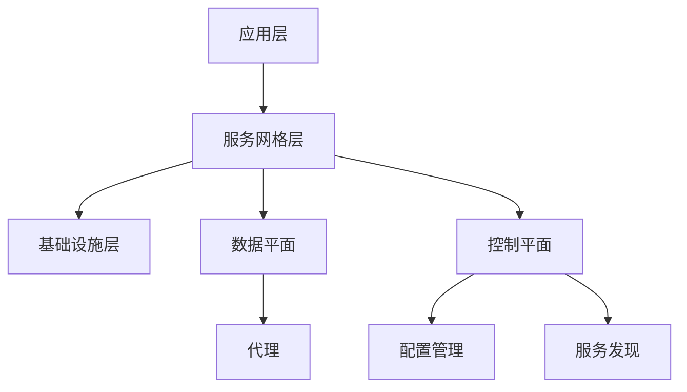

# 06-软件架构理论体系-服务网格架构理论

[返回主题树](../00-主题树与内容索引.md) | [主计划文档](../00-形式化架构理论统一计划.md) | [相关计划](../13-项目报告与总结/递归合并计划.md)

> 本文档为软件架构理论体系分支服务网格架构理论，所有最新进展与结论以主计划文档为准，历史细节归档于archive/。

## 目录

- [06-软件架构理论体系-服务网格架构理论](#06-软件架构理论体系-服务网格架构理论)
  - [目录](#目录)
  - [1. 服务网格概述](#1-服务网格概述)
    - [1.1 服务网格的定义](#11-服务网格的定义)
    - [1.2 服务网格的发展历史](#12-服务网格的发展历史)
  - [2. 数据平面](#2-数据平面)
    - [2.1 代理模式](#21-代理模式)
    - [2.2 流量管理](#22-流量管理)
    - [2.3 负载均衡](#23-负载均衡)
  - [3. 控制平面](#3-控制平面)
    - [3.1 配置管理](#31-配置管理)
    - [3.2 服务发现](#32-服务发现)
    - [3.3 策略执行](#33-策略执行)
  - [4. 服务通信](#4-服务通信)
    - [4.1 服务间通信](#41-服务间通信)
    - [4.2 协议转换](#42-协议转换)
    - [4.3 消息路由](#43-消息路由)
  - [5. 可观测性](#5-可观测性)
    - [5.1 监控指标](#51-监控指标)
    - [5.2 分布式追踪](#52-分布式追踪)
    - [5.3 日志聚合](#53-日志聚合)
  - [6. 服务网格在软件工程中的应用](#6-服务网格在软件工程中的应用)
    - [6.1 微服务架构](#61-微服务架构)
    - [6.2 云原生应用](#62-云原生应用)
  - [7. 总结](#7-总结)
  - [2025 对齐](#2025-对齐)

## 1. 服务网格概述

### 1.1 服务网格的定义

**定义 1.1.1** 服务网格（Service Mesh）
服务网格是处理服务间通信的基础设施层，由数据平面和控制平面组成。

**核心特征**：

- 透明代理：自动注入到服务容器中
- 统一控制：集中化的流量管理
- 可观测性：全面的监控和追踪
- 安全性：内置的安全策略

**架构层次**：



### 1.2 服务网格的发展历史

**发展历程**：

1. **早期阶段**：单体应用时代
2. **微服务兴起**：服务间通信复杂性增加
3. **第一代服务网格**：Linkerd、Istio
4. **现代服务网格**：云原生、Kubernetes集成

## 2. 数据平面

### 2.1 代理模式

**代理模式**：

- Sidecar模式：每个服务实例配备代理
- DaemonSet模式：节点级别的代理
- 透明代理：自动注入和配置

**Rust实现**：

```rust
pub struct ServiceProxy {
    service_name: String,
    service_version: String,
    upstream_services: Vec<UpstreamService>,
    downstream_services: Vec<DownstreamService>,
    traffic_rules: Vec<TrafficRule>,
}

impl ServiceProxy {
    pub fn new(service_name: String, service_version: String) -> Self {
        Self {
            service_name,
            service_version,
            upstream_services: Vec::new(),
            downstream_services: Vec::new(),
            traffic_rules: Vec::new(),
        }
    }

    pub fn handle_incoming_request(&self, request: &HttpRequest) -> Result<HttpResponse, ProxyError> {
        // 应用流量规则
        let modified_request = self.apply_traffic_rules(request)?;

        // 路由到上游服务
        let upstream_service = self.select_upstream_service(&modified_request)?;
        let response = self.forward_to_upstream(upstream_service, &modified_request)?;

        // 应用响应规则
        let modified_response = self.apply_response_rules(response)?;

        Ok(modified_response)
    }

    pub fn handle_outgoing_request(&self, request: &HttpRequest) -> Result<HttpResponse, ProxyError> {
        // 服务发现
        let target_service = self.discover_service(&request.target)?;

        // 负载均衡
        let instance = self.load_balance(target_service)?;

        // 发送请求
        let response = self.send_request(instance, request)?;

        Ok(response)
    }
}
```

### 2.2 流量管理

**流量管理功能**：

- 路由规则：基于路径、头部、权重
- 流量分割：A/B测试、金丝雀发布
- 故障注入：模拟故障场景
- 重试策略：自动重试机制

**Rust实现**：

```rust
pub struct TrafficManager {
    routing_rules: Vec<RoutingRule>,
    traffic_splitting: TrafficSplitting,
    fault_injection: FaultInjection,
    retry_policy: RetryPolicy,
}

impl TrafficManager {
    pub fn apply_routing_rules(&self, request: &HttpRequest) -> Result<HttpRequest, TrafficError> {
        let mut modified_request = request.clone();

        for rule in &self.routing_rules {
            if rule.matches(request) {
                modified_request = rule.apply(modified_request)?;
            }
        }

        Ok(modified_request)
    }

    pub fn split_traffic(&self, request: &HttpRequest) -> Result<ServiceInstance, TrafficError> {
        let split_config = self.traffic_splitting.get_config(request)?;
        let random_value = rand::random::<f64>();

        let mut cumulative_weight = 0.0;
        for (service, weight) in &split_config.services {
            cumulative_weight += weight;
            if random_value <= cumulative_weight {
                return Ok(service.clone());
            }
        }

        Err(TrafficError::NoServiceAvailable)
    }

    pub fn inject_fault(&self, request: &HttpRequest) -> Result<(), FaultError> {
        let fault_config = self.fault_injection.get_config(request)?;

        if rand::random::<f64>() < fault_config.delay_probability {
            std::thread::sleep(Duration::from_millis(fault_config.delay_duration));
        }

        if rand::random::<f64>() < fault_config.error_probability {
            return Err(FaultError::InjectedError);
        }

        Ok(())
    }
}
```

### 2.3 负载均衡

**负载均衡算法**：

- 轮询（Round Robin）
- 加权轮询（Weighted Round Robin）
- 最少连接（Least Connections）
- 一致性哈希（Consistent Hashing）

**Rust实现**：

```rust
pub enum LoadBalancingAlgorithm {
    RoundRobin,
    WeightedRoundRobin,
    LeastConnections,
    ConsistentHashing,
}

pub struct LoadBalancer {
    algorithm: LoadBalancingAlgorithm,
    instances: Vec<ServiceInstance>,
    health_checker: HealthChecker,
}

impl LoadBalancer {
    pub fn select_instance(&mut self, request: &HttpRequest) -> Result<ServiceInstance, LoadBalancingError> {
        let healthy_instances: Vec<_> = self.instances.iter()
            .filter(|instance| self.health_checker.is_healthy(instance))
            .collect();

        if healthy_instances.is_empty() {
            return Err(LoadBalancingError::NoHealthyInstances);
        }

        match self.algorithm {
            LoadBalancingAlgorithm::RoundRobin => {
                self.round_robin_select(&healthy_instances)
            },
            LoadBalancingAlgorithm::WeightedRoundRobin => {
                self.weighted_round_robin_select(&healthy_instances)
            },
            LoadBalancingAlgorithm::LeastConnections => {
                self.least_connections_select(&healthy_instances)
            },
            LoadBalancingAlgorithm::ConsistentHashing => {
                self.consistent_hashing_select(&healthy_instances, request)
            },
        }
    }

    fn round_robin_select(&mut self, instances: &[&ServiceInstance]) -> Result<ServiceInstance, LoadBalancingError> {
        // 简单的轮询实现
        let index = self.current_index % instances.len();
        self.current_index += 1;

        Ok(instances[index].clone())
    }
}
```

## 3. 控制平面

### 3.1 配置管理

**配置管理功能**：

- 配置分发：向代理推送配置
- 配置验证：确保配置正确性
- 配置版本控制：管理配置变更
- 动态配置：运行时配置更新

**Rust实现**：

```rust
pub struct ConfigurationManager {
    config_store: ConfigStore,
    config_validator: ConfigValidator,
    config_distributor: ConfigDistributor,
}

impl ConfigurationManager {
    pub fn update_configuration(&self, service_name: &str, config: &ServiceConfig) -> Result<(), ConfigError> {
        // 验证配置
        self.config_validator.validate(config)?;

        // 存储配置
        self.config_store.store(service_name, config)?;

        // 分发配置
        self.config_distributor.distribute(service_name, config)?;

        Ok(())
    }

    pub fn get_configuration(&self, service_name: &str) -> Result<ServiceConfig, ConfigError> {
        self.config_store.get(service_name)
    }

    pub fn watch_configuration(&self, service_name: &str) -> ConfigWatcher {
        self.config_store.watch(service_name)
    }
}
```

### 3.2 服务发现

**服务发现机制**：

- 服务注册：自动注册服务实例
- 服务发现：查找可用服务
- 健康检查：监控服务状态
- 负载均衡：选择最佳实例

**Rust实现**：

```rust
pub struct ServiceDiscovery {
    registry: ServiceRegistry,
    health_checker: HealthChecker,
    load_balancer: LoadBalancer,
}

impl ServiceDiscovery {
    pub fn register_service(&self, service: &ServiceInstance) -> Result<(), DiscoveryError> {
        self.registry.register(service)?;

        // 启动健康检查
        self.health_checker.start_monitoring(service)?;

        Ok(())
    }

    pub fn discover_service(&self, service_name: &str) -> Result<Vec<ServiceInstance>, DiscoveryError> {
        let instances = self.registry.get_instances(service_name)?;

        // 过滤健康实例
        let healthy_instances: Vec<_> = instances.into_iter()
            .filter(|instance| self.health_checker.is_healthy(instance))
            .collect();

        Ok(healthy_instances)
    }

    pub fn select_instance(&self, service_name: &str, request: &HttpRequest) -> Result<ServiceInstance, DiscoveryError> {
        let instances = self.discover_service(service_name)?;

        if instances.is_empty() {
            return Err(DiscoveryError::NoInstancesAvailable);
        }

        self.load_balancer.select_instance(&instances, request)
    }
}
```

### 3.3 策略执行

**策略执行功能**：

- 安全策略：认证、授权、加密
- 流量策略：限流、熔断、重试
- 监控策略：指标收集、告警
- 合规策略：审计、日志

**Rust实现**：

```rust
pub struct PolicyEnforcer {
    security_policy: SecurityPolicy,
    traffic_policy: TrafficPolicy,
    monitoring_policy: MonitoringPolicy,
    compliance_policy: CompliancePolicy,
}

impl PolicyEnforcer {
    pub fn enforce_security(&self, request: &HttpRequest) -> Result<(), SecurityError> {
        // 认证检查
        self.security_policy.authenticate(request)?;

        // 授权检查
        self.security_policy.authorize(request)?;

        // 加密检查
        self.security_policy.encrypt(request)?;

        Ok(())
    }

    pub fn enforce_traffic_policy(&self, request: &HttpRequest) -> Result<(), TrafficPolicyError> {
        // 限流检查
        self.traffic_policy.check_rate_limit(request)?;

        // 熔断检查
        self.traffic_policy.check_circuit_breaker(request)?;

        // 重试策略
        self.traffic_policy.apply_retry_policy(request)?;

        Ok(())
    }

    pub fn enforce_monitoring(&self, request: &HttpRequest, response: &HttpResponse) {
        // 收集指标
        self.monitoring_policy.collect_metrics(request, response);

        // 检查告警
        self.monitoring_policy.check_alerts(request, response);
    }
}
```

## 4. 服务通信

### 4.1 服务间通信

**通信模式**：

- 同步通信：HTTP、gRPC
- 异步通信：消息队列、事件流
- 双向通信：WebSocket、gRPC流
- 广播通信：发布订阅模式

**Rust实现**：

```rust
pub struct ServiceCommunication {
    http_client: HttpClient,
    grpc_client: GrpcClient,
    message_queue: MessageQueue,
    event_stream: EventStream,
}

impl ServiceCommunication {
    pub async fn synchronous_call(&self, target: &str, request: &Request) -> Result<Response, CommunicationError> {
        match self.detect_protocol(target) {
            Protocol::Http => self.http_client.call(target, request).await,
            Protocol::Grpc => self.grpc_client.call(target, request).await,
            _ => Err(CommunicationError::UnsupportedProtocol),
        }
    }

    pub async fn asynchronous_call(&self, target: &str, message: &Message) -> Result<(), CommunicationError> {
        self.message_queue.send(target, message).await
    }

    pub async fn bidirectional_stream(&self, target: &str) -> Result<BidirectionalStream, CommunicationError> {
        self.grpc_client.create_stream(target).await
    }

    pub async fn broadcast_event(&self, event: &Event) -> Result<(), CommunicationError> {
        self.event_stream.publish(event).await
    }
}
```

### 4.2 协议转换

**协议转换功能**：

- HTTP到gRPC转换
- REST到GraphQL转换
- 消息格式转换
- 协议适配器

**Rust实现**：

```rust
pub struct ProtocolConverter {
    http_to_grpc: HttpToGrpcConverter,
    rest_to_graphql: RestToGraphqlConverter,
    message_converter: MessageConverter,
}

impl ProtocolConverter {
    pub fn convert_http_to_grpc(&self, http_request: &HttpRequest) -> Result<GrpcRequest, ConversionError> {
        self.http_to_grpc.convert(http_request)
    }

    pub fn convert_rest_to_graphql(&self, rest_request: &RestRequest) -> Result<GraphqlRequest, ConversionError> {
        self.rest_to_graphql.convert(rest_request)
    }

    pub fn convert_message_format(&self, message: &Message, target_format: &MessageFormat) -> Result<Message, ConversionError> {
        self.message_converter.convert(message, target_format)
    }
}
```

### 4.3 消息路由

**消息路由功能**：

- 基于内容的路由
- 基于规则的路由
- 动态路由
- 路由策略

**Rust实现**：

```rust
pub struct MessageRouter {
    routing_rules: Vec<RoutingRule>,
    content_based_router: ContentBasedRouter,
    rule_based_router: RuleBasedRouter,
    dynamic_router: DynamicRouter,
}

impl MessageRouter {
    pub fn route_message(&self, message: &Message) -> Result<Vec<String>, RoutingError> {
        let mut targets = Vec::new();

        // 基于内容的路由
        let content_targets = self.content_based_router.route(message)?;
        targets.extend(content_targets);

        // 基于规则的路由
        let rule_targets = self.rule_based_router.route(message)?;
        targets.extend(rule_targets);

        // 动态路由
        let dynamic_targets = self.dynamic_router.route(message)?;
        targets.extend(dynamic_targets);

        Ok(targets)
    }

    pub fn add_routing_rule(&mut self, rule: RoutingRule) {
        self.routing_rules.push(rule);
    }
}
```

## 5. 可观测性

### 5.1 监控指标

**监控指标类型**：

- 业务指标：请求量、成功率、响应时间
- 系统指标：CPU、内存、网络
- 应用指标：JVM、GC、线程
- 基础设施指标：容器、节点、集群

**Rust实现**：

```rust
pub struct MetricsCollector {
    business_metrics: BusinessMetrics,
    system_metrics: SystemMetrics,
    application_metrics: ApplicationMetrics,
    infrastructure_metrics: InfrastructureMetrics,
}

impl MetricsCollector {
    pub fn collect_business_metrics(&self, request: &HttpRequest, response: &HttpResponse) {
        self.business_metrics.record_request_count(request);
        self.business_metrics.record_success_rate(request, response);
        self.business_metrics.record_response_time(request, response);
    }

    pub fn collect_system_metrics(&self) {
        self.system_metrics.record_cpu_usage();
        self.system_metrics.record_memory_usage();
        self.system_metrics.record_network_usage();
    }

    pub fn collect_application_metrics(&self) {
        self.application_metrics.record_thread_count();
        self.application_metrics.record_gc_stats();
        self.application_metrics.record_heap_usage();
    }
}
```

### 5.2 分布式追踪

**分布式追踪功能**：

- 链路追踪：跟踪请求路径
- 性能分析：分析性能瓶颈
- 错误定位：快速定位问题
- 依赖分析：分析服务依赖

**Rust实现**：

```rust
pub struct DistributedTracer {
    trace_collector: TraceCollector,
    span_generator: SpanGenerator,
    trace_context: TraceContext,
}

impl DistributedTracer {
    pub fn start_trace(&self, request: &HttpRequest) -> TraceContext {
        let trace_id = self.generate_trace_id();
        let span_id = self.generate_span_id();

        TraceContext {
            trace_id,
            span_id,
            parent_span_id: None,
        }
    }

    pub fn start_span(&self, name: &str, context: &TraceContext) -> Span {
        let span_id = self.generate_span_id();

        Span {
            trace_id: context.trace_id.clone(),
            span_id,
            parent_span_id: Some(context.span_id.clone()),
            name: name.to_string(),
            start_time: std::time::Instant::now(),
        }
    }

    pub fn end_span(&self, span: &mut Span) {
        span.end_time = Some(std::time::Instant::now());
        self.trace_collector.collect(span);
    }
}
```

### 5.3 日志聚合

**日志聚合功能**：

- 日志收集：收集各服务日志
- 日志解析：解析日志格式
- 日志存储：存储到日志系统
- 日志查询：支持日志检索

**Rust实现**：

```rust
pub struct LogAggregator {
    log_collector: LogCollector,
    log_parser: LogParser,
    log_storage: LogStorage,
    log_query: LogQuery,
}

impl LogAggregator {
    pub fn collect_logs(&self, service_name: &str, logs: &[LogEntry]) -> Result<(), LogError> {
        for log in logs {
            let parsed_log = self.log_parser.parse(log)?;
            self.log_storage.store(service_name, &parsed_log)?;
        }

        Ok(())
    }

    pub fn query_logs(&self, query: &LogQuery) -> Result<Vec<LogEntry>, LogError> {
        self.log_query.execute(query)
    }

    pub fn search_logs(&self, pattern: &str, time_range: &TimeRange) -> Result<Vec<LogEntry>, LogError> {
        self.log_query.search(pattern, time_range)
    }
}
```

## 6. 服务网格在软件工程中的应用

### 6.1 微服务架构

**微服务应用场景**：

- 服务治理：统一的服务管理
- 流量控制：精细的流量管理
- 安全控制：统一的安全策略
- 可观测性：全面的监控体系

**Rust实现**：

```rust
pub struct MicroserviceMesh {
    service_registry: ServiceRegistry,
    traffic_manager: TrafficManager,
    security_manager: SecurityManager,
    observability_manager: ObservabilityManager,
}

impl MicroserviceMesh {
    pub fn deploy_service(&self, service: &Microservice) -> Result<(), MeshError> {
        // 注册服务
        self.service_registry.register(service)?;

        // 配置流量规则
        self.traffic_manager.configure_rules(service)?;

        // 配置安全策略
        self.security_manager.configure_policies(service)?;

        // 配置监控
        self.observability_manager.configure_monitoring(service)?;

        Ok(())
    }

    pub fn manage_traffic(&self, service_name: &str, rules: &[TrafficRule]) -> Result<(), MeshError> {
        self.traffic_manager.update_rules(service_name, rules)
    }
}
```

### 6.2 云原生应用

**云原生特性**：

- 容器化部署：Kubernetes集成
- 自动扩缩容：基于指标的扩缩容
- 服务发现：自动服务发现
- 配置管理：动态配置更新

**Rust实现**：

```rust
pub struct CloudNativeMesh {
    kubernetes_client: KubernetesClient,
    auto_scaler: AutoScaler,
    service_discovery: ServiceDiscovery,
    config_manager: ConfigManager,
}

impl CloudNativeMesh {
    pub fn deploy_to_kubernetes(&self, service: &CloudNativeService) -> Result<(), CloudNativeError> {
        // 创建Kubernetes资源
        self.kubernetes_client.create_deployment(service)?;
        self.kubernetes_client.create_service(service)?;
        self.kubernetes_client.create_config_map(service)?;

        // 配置自动扩缩容
        self.auto_scaler.configure_hpa(service)?;

        // 配置服务发现
        self.service_discovery.configure(service)?;

        Ok(())
    }

    pub fn scale_service(&self, service_name: &str, replicas: u32) -> Result<(), CloudNativeError> {
        self.kubernetes_client.scale_deployment(service_name, replicas)
    }
}
```

## 7. 总结

服务网格架构理论为现代微服务架构提供了重要的基础设施支持。通过数据平面和控制平面的有机结合，服务网格实现了：

1. **统一的服务治理**：提供统一的服务注册、发现、配置管理
2. **精细的流量控制**：支持复杂的路由规则、负载均衡、故障注入
3. **全面的可观测性**：提供完整的监控、追踪、日志体系
4. **强大的安全能力**：内置认证、授权、加密等安全功能

服务网格架构理论与形式化架构理论的其他分支形成了完整的理论体系，为云原生应用和微服务架构提供了坚实的技术基础。

## 2025 对齐

- **国际 Wiki**：
  - [Wikipedia: Service mesh](https://en.wikipedia.org/wiki/Service_mesh)
  - [Wikipedia: Microservices](https://en.wikipedia.org/wiki/Microservices)
  - [Wikipedia: Cloud Native Computing Foundation](https://en.wikipedia.org/wiki/Cloud_Native_Computing_Foundation)
  - [CNCF: Service Mesh](https://www.cncf.io/blog/2017/04/26/service-mesh/)

- **名校课程**：
  - [MIT 6.824: Distributed Systems](https://pdos.csail.mit.edu/6.824/)（分布式系统与服务网格）
  - [CMU 15-445: Database Systems](https://15445.courses.cs.cmu.edu/)（分布式系统基础）
  - [Stanford CS 244: Advanced Computer Systems](https://web.stanford.edu/class/cs244/)（服务网格架构）

- **代表性论文**：
  - [The Service Mesh: What Every Software Engineer Needs to Know about the World's Most Over-Hyped Technology](https://buoyant.io/service-mesh-manifesto/) (Buoyant, 2017)
  - [Envoy: C++ L7 proxy and communication bus](https://www.envoyproxy.io/) (Lyft, 2016)
  - [Istio: A Service Mesh for Microservices](https://istio.io/latest/about/service-mesh/) (Google/IBM/Lyft, 2017)

- **前沿技术**：
  - [Istio](https://istio.io/)（服务网格）
  - [Linkerd](https://linkerd.io/)（轻量级服务网格）
  - [Envoy](https://www.envoyproxy.io/)（高性能代理）
  - [Consul Connect](https://www.consul.io/docs/connect)（服务网格解决方案）
  - [Kuma](https://kuma.io/)（通用服务网格）

- **对齐状态**：已完成（最后更新：2025-01-15）
