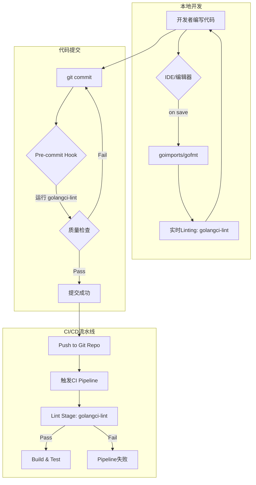

# 1.3 Go代码质量与静态分析

## 目录

- [1.3 Go代码质量与静态分析](#13-go代码质量与静态分析)
  - [目录](#目录)
  - [1. 引言与定义](#1-引言与定义)
  - [2. Go原生工具](#2-go原生工具)
    - [2.1 `go fmt`](#21-go-fmt)
    - [2.2 `go vet`](#22-go-vet)
  - [3. 核心静态分析工具（Linter）](#3-核心静态分析工具linter)
    - [3.1 `staticcheck`](#31-staticcheck)
    - [3.2 `golangci-lint`](#32-golangci-lint)
    - [3.3 `revive`](#33-revive)
  - [4. 自动化集成与实践](#4-自动化集成与实践)
    - [4.1 VSCode集成](#41-vscode集成)
    - [4.2 Git Pre-commit Hooks](#42-git-pre-commit-hooks)
    - [4.3 CI/CD流水线集成](#43-cicd流水线集成)
  - [5. 配置示例](#5-配置示例)
    - [5.1 `golangci-lint` 配置文件 (`.golangci.yml`)](#51-golangci-lint-配置文件-golangciyml)
    - [5.2 Pre-commit Hook配置 (`.pre-commit-config.yaml`)](#52-pre-commit-hook配置-pre-commit-configyaml)
  - [6. 行业应用案例](#6-行业应用案例)
  - [7. Mermaid图表：代码质量保障流程](#7-mermaid图表代码质量保障流程)
  - [8. 参考文献](#8-参考文献)

---

## 1. 引言与定义

**代码质量**是衡量软件健康状况的关键指标，涉及可读性、可维护性、可靠性和性能等多个方面。**静态分析**则是一种在不实际运行代码的情况下，通过自动化工具扫描和分析源代码，以发现潜在错误、代码异味（Code Smell）、安全漏洞和风格问题的技术。

在Go工程中，利用静态分析工具链是保障大规模项目代码质量、统一团队编码规范的核心实践。

## 2. Go原生工具

Go语言内置了一些基础但功能强大的工具来帮助开发者保持代码质量。

### 2.1 `go fmt`

`go fmt`是Go语言的官方代码格式化工具。它根据一套固定的社区标准规则自动格式化代码。`gofmt`的存在极大地减少了关于代码风格的争论，确保了Go生态系统中代码的高度一致性和可读性。`goimports`是其增强版，在格式化代码的同时会自动管理import语句。

### 2.2 `go vet`

`go vet`是一个原生静态分析工具，用于检查Go源代码中可能存在的非语法错误，但编译器无法捕获的潜在问题。例如，它能发现无法到达的代码、格式化字符串与参数不匹配、在错误的位置使用`go`关键字等。

## 3. 核心静态分析工具（Linter）

社区开发了更强大的Linter工具，提供了比`go vet`更广泛的检查。

### 3.1 `staticcheck`

**Staticcheck** ([https://staticcheck.io/](https://staticcheck.io/)) 是一套先进的静态分析工具，包含对性能问题、代码简化、并发错误等上百种检查。它被认为是`go vet`的超集，是Go社区中非常受推崇的Linter之一。

### 3.2 `golangci-lint`

**golangci-lint** ([https://golangci-lint.run/](https://golangci-lint.run/)) 是一个集大成者的Linter聚合器和驱动器。它将数十个优秀的Go Linter（包括`staticcheck`, `go vet`, `gofmt`等）整合在一起，通过一次调用并行运行它们，并对结果进行标准化处理。其高效率和丰富的可配置性使其成为目前Go项目中最流行的代码质量工具。

### 3.3 `revive`

**Revive** ([https://revive.run/](https://revive.run/)) 是一个可扩展、可配置的Linter，定位为`golint`的替代品。它提供了更快的执行速度和更灵活的配置选项，允许开发者通过简单的TOML文件来启用或禁用特定规则。

## 4. 自动化集成与实践

为了让静态分析发挥最大价值，必须将其无缝集成到开发工作流中。

### 4.1 VSCode集成

通过安装[Go for Visual Studio Code](https://marketplace.visualstudio.com/items?itemName=golang.Go)插件，可以在保存文件时自动运行`gofmt`/`goimports`进行格式化，并实时调用`golangci-lint`等工具在编辑器中显示错误和警告。

### 4.2 Git Pre-commit Hooks

使用`pre-commit`框架([https://pre-commit.com/](https://pre-commit.com/))，可以在每次提交代码前自动运行静态分析检查。这能确保所有进入代码库的代码都至少符合既定的质量标准，防止不合格的代码被提交。

### 4.3 CI/CD流水线集成

在CI/CD流水线（如GitHub Actions, GitLab CI）中加入一个专门的`lint`阶段是最后的防线。该阶段会运行`golangci-lint`等工具对整个项目进行全面扫描，如果检查失败，则会阻止后续的构建、测试和部署流程。

## 5. 配置示例

### 5.1 `golangci-lint` 配置文件 (`.golangci.yml`)

```yaml
run:
  timeout: 5m
  skip-dirs:
    - vendor

linters-settings:
  govet:
    check-shadowing: true
  gofmt:
    simplify: true
  goimports:
    local-prefixes: github.com/my-org/my-repo
  staticcheck:
    checks: ["all"]

linters:
  enable:
    - govet
    - gofmt
    - goimports
    - staticcheck
    - unconvert
    - ineffassign
    - typecheck
  disable:
    - maligned
```

### 5.2 Pre-commit Hook配置 (`.pre-commit-config.yaml`)

```yaml
repos:
-   repo: https://github.com/golangci/golangci-lint
    rev: v1.50.1
    hooks:
    -   id: golangci-lint
-   repo: https://github.com/pre-commit/pre-commit-hooks
    rev: v4.3.0
    hooks:
    -   id: check-yaml
    -   id: end-of-file-fixer
    -   id: trailing-whitespace
```

## 6. 行业应用案例

- **HashiCorp**: 这家以基础设施自动化工具（如Terraform, Vault）闻名的公司，在其Go项目中广泛使用`golangci-lint`，并将其作为CI流程中的强制性检查，以确保跨多个开源项目的高代码质量。
- **Google**: 作为Go语言的创造者，Google在其内部开发流程中深度集成了各种静态和动态分析工具，以维护其庞大的Go代码库。

## 7. Mermaid图表：代码质量保障流程



## 8. 参考文献

- [`golangci-lint` Documentation](https://golangci-lint.run/)
- [Staticcheck - Advanced Go static analysis](https://staticcheck.io/)
- [Effective Go](https://go.dev/doc/effective_go)
- [Pre-commit Framework](https://pre-commit.com/)
