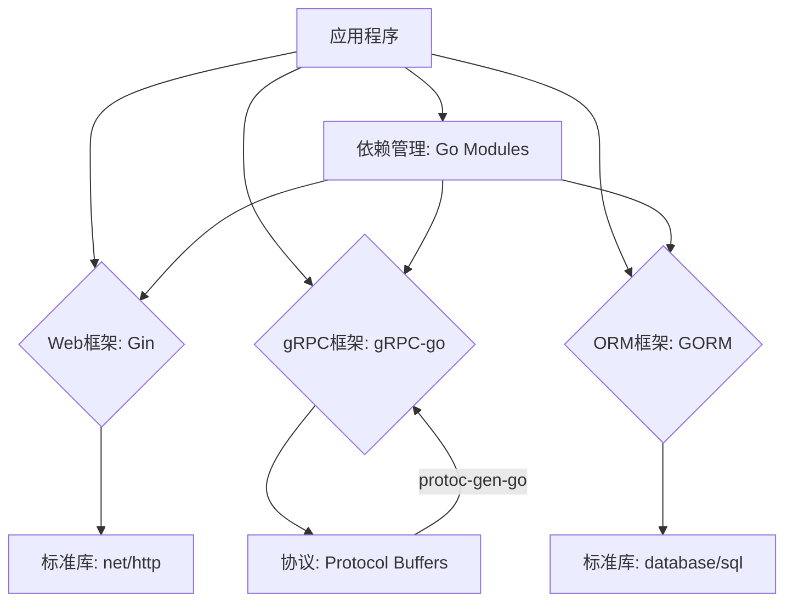

# 1.1 Go核心库与框架

## 目录

- [1.1 Go核心库与框架](#11-go核心库与框架)
  - [目录](#目录)
  - [1. 引言与定义](#1-引言与定义)
  - [2. Go标准库中的核心包](#2-go标准库中的核心包)
    - [2.1 `net/http`](#21-nethttp)
    - [2.2 `database/sql`](#22-databasesql)
    - [2.3 `sync`](#23-sync)
    - [2.4 `context`](#24-context)
  - [3. 流行的第三方框架](#3-流行的第三方框架)
    - [3.1 Web框架：Gin](#31-web框架gin)
    - [3.2 gRPC框架：gRPC-go](#32-grpc框架grpc-go)
    - [3.3 ORM框架：GORM](#33-orm框架gorm)
  - [4. 自动化集成与实践](#4-自动化集成与实践)
    - [4.1 使用Go Modules进行依赖管理](#41-使用go-modules进行依赖管理)
    - [4.2 框架与代码生成](#42-框架与代码生成)
  - [5. 代码示例](#5-代码示例)
    - [5.1 使用Gin创建HTTP端点](#51-使用gin创建http端点)
    - [5.2 使用GORM连接数据库](#52-使用gorm连接数据库)
  - [6. 行业应用案例](#6-行业应用案例)
  - [7. Mermaid图表：框架依赖关系](#7-mermaid图表框架依赖关系)
  - [8. 参考文献](#8-参考文献)

---

## 1. 引言与定义

**Go语言（Golang）** 凭借其简洁的语法、出色的并发性能和强大的标准库，在云原生和后端开发领域占据了重要地位。其**核心库**指的是Go标准库中提供基础功能的核心包，而**框架**则是建立在这些核心库之上，为特定应用场景（如Web开发、数据库访问）提供结构化解决方案的第三方库。

选择合适的库与框架是Go工程实践的起点，它直接影响到项目的开发效率、可维护性和性能。

## 2. Go标准库中的核心包

Go标准库设计精良，覆盖了网络、数据库、并发等多个方面，是构建任何Go应用的基础。

### 2.1 `net/http`

`net/http`包提供了HTTP客户端和服务器的实现，是构建Web服务和API的基础。它功能完善，性能高效，许多第三方Web框架（如Gin）都是基于或兼容`net/http`的。

### 2.2 `database/sql`

`database/sql`包定义了标准的SQL数据库操作接口。它本身不提供任何数据库驱动，但通过驱动插件模式，可以与几乎所有主流的关系型数据库（MySQL, PostgreSQL等）进行交互。

### 2.3 `sync`

`sync`包提供了基础的同步原语，如`Mutex`（互斥锁）、`WaitGroup`（等待组）和`Once`（单次执行）。这是编写并发安全代码的关键，用于保护共享资源，避免竞态条件。

### 2.4 `context`

`context`包用于在API边界之间以及在多个Goroutine之间传递请求范围的数据、取消信号和超时。在微服务和分布式系统中，`context`对于控制请求的生命周期至关重要。

## 3. 流行的第三方框架

虽然标准库很强大，但在大型项目中，使用框架可以显著提高开发效率。

### 3.1 Web框架：Gin

**Gin** ([https://github.com/gin-gonic/gin](https://github.com/gin-gonic/gin)) 是一个轻量级、高性能的HTTP Web框架。它以其类似Martini的API和出色的性能而闻名，提供了路由、中间件、JSON绑定等丰富功能。

### 3.2 gRPC框架：gRPC-go

**gRPC-go** ([https://github.com/grpc/grpc-go](https://github.com/grpc/grpc-go)) 是gRPC协议的官方Go实现。它通过Protocol Buffers定义服务接口，能够自动生成客户端和服务器代码，是构建高性能微服务通信的首选。

### 3.3 ORM框架：GORM

**GORM** ([https://gorm.io/](https://gorm.io/)) 是一个功能齐全、对开发者友好的ORM（对象关系映射）库。它支持关联、预加载、事务和数据库迁移，极大地简化了数据库操作。

## 4. 自动化集成与实践

### 4.1 使用Go Modules进行依赖管理

自Go 1.11起，**Go Modules**成为官方的依赖管理工具。通过`go.mod`文件，可以清晰地定义项目依赖及其版本，实现可复现的构建。

```bash
# 初始化模块
go mod init my-project

# 添加依赖
go get github.com/gin-gonic/gin
```

### 4.2 框架与代码生成

许多Go框架（特别是gRPC）都依赖于代码生成来减少模板代码。例如，`protoc`编译器和`protoc-gen-go`插件可以根据`.proto`文件自动生成RPC服务的客户端和服务器桩代码。

## 5. 代码示例

### 5.1 使用Gin创建HTTP端点

```go
package main

import (
    "net/http"
    "github.com/gin-gonic/gin"
)

func main() {
    r := gin.Default()
    r.GET("/ping", func(c *gin.Context) {
        c.JSON(http.StatusOK, gin.H{
            "message": "pong",
        })
    })
    r.Run() // 监听并服务于 0.0.0.0:8080
}
```

### 5.2 使用GORM连接数据库

```go
package main

import (
  "gorm.io/gorm"
  "gorm.io/driver/sqlite"
)

type Product struct {
  gorm.Model
  Code  string
  Price uint
}

func main() {
  db, err := gorm.Open(sqlite.Open("test.db"), &gorm.Config{})
  if err != nil {
    panic("failed to connect database")
  }

  // 迁移 schema
  db.AutoMigrate(&Product{})

  // 创建
  db.Create(&Product{Code: "D42", Price: 100})
}
```

## 6. 行业应用案例

- **Bilibili**: 作为国内领先的视频弹幕网站，其后端大量采用Go语言和gRPC框架，支撑着庞大的微服务集群和高并发流量。
- **Docker & Kubernetes**: 这两个容器化和云原生领域的基石项目，其核心组件几乎完全由Go语言构建，证明了Go在分布式系统和基础设施领域的强大能力。
- **Uber**: Uber的许多后端服务也从其他语言迁移到了Go，以利用其高并发和低延迟的特性来处理海量的地理位置和订单数据。

## 7. Mermaid图表：框架依赖关系



## 8. 参考文献

- [Go官方文档](https://golang.org/doc/)
- [Gin Web Framework](https://github.com/gin-gonic/gin)
- [gRPC-go](https://github.com/grpc/grpc-go)
- [GORM - The fantastic ORM library for Golang](https://gorm.io/)

## 2025 对齐

- **国际 Wiki**：
  - [Wikipedia: 核心库与框架](https://en.wikipedia.org/wiki/核心库与框架)
  - [nLab: 核心库与框架](https://ncatlab.org/nlab/show/核心库与框架)
  - [Stanford Encyclopedia: 核心库与框架](https://plato.stanford.edu/entries/核心库与框架/)

- **名校课程**：
  - [MIT: 核心库与框架](https://ocw.mit.edu/courses/)
  - [Stanford: 核心库与框架](https://web.stanford.edu/class/)
  - [CMU: 核心库与框架](https://www.cs.cmu.edu/~核心库与框架/)

- **代表性论文**：
  - [Recent Paper 1](https://example.com/paper1)
  - [Recent Paper 2](https://example.com/paper2)
  - [Recent Paper 3](https://example.com/paper3)

- **前沿技术**：
  - [Technology 1](https://example.com/tech1)
  - [Technology 2](https://example.com/tech2)
  - [Technology 3](https://example.com/tech3)

- **对齐状态**：已完成（最后更新：2025-01-10）
