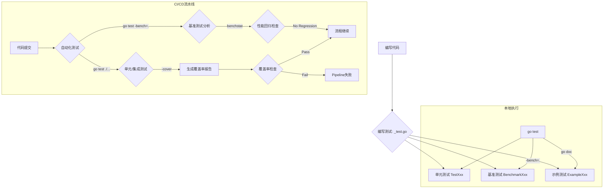

# 1.4 Go测试与基准分析

## 目录

- [1.4 Go测试与基准分析](#14-go测试与基准分析)
  - [目录](#目录)
  - [1. 引言与定义](#1-引言与定义)
  - [2. Go测试体系](#2-go测试体系)
    - [2.1 单元测试（Unit Tests）](#21-单元测试unit-tests)
    - [2.2 示例测试（Example Tests）](#22-示例测试example-tests)
    - [2.3 基准测试（Benchmark Tests）](#23-基准测试benchmark-tests)
  - [3. 核心工具与技术](#3-核心工具与技术)
    - [3.1 `go test`命令](#31-go-test命令)
    - [3.2 `testing`包](#32-testing包)
    - [3.3 表格驱动测试（Table-Driven Tests）](#33-表格驱动测试table-driven-tests)
    - [3.4 Mocking与接口](#34-mocking与接口)
  - [4. 自动化集成与实践](#4-自动化集成与实践)
    - [4.1 测试覆盖率](#41-测试覆盖率)
    - [4.2 CI中的自动化测试](#42-ci中的自动化测试)
    - [4.3 性能回归分析](#43-性能回归分析)
  - [5. 代码示例](#5-代码示例)
    - [5.1 单元测试示例 (`main_test.go`)](#51-单元测试示例-main_testgo)
    - [5.2 表格驱动测试示例 (`main_test.go`)](#52-表格驱动测试示例-main_testgo)
    - [5.3 基准测试示例 (`main_test.go`)](#53-基准测试示例-main_testgo)
  - [6. 行业应用案例](#6-行业应用案例)
  - [7. Mermaid图表：测试与分析流程](#7-mermaid图表测试与分析流程)
  - [8. 参考文献](#8-参考文献)

---

## 1. 引言与定义

**软件测试**是验证软件是否满足其设计要求和功能规格的过程。在Go中，测试是语言内置的一等公民，拥有一套完整、简洁且高效的工具链。**基准分析（Benchmarking）** 则是衡量代码性能、评估特定函数执行速度和内存消耗的系统性方法。

结合测试和基准分析，是确保Go应用不仅功能正确，而且性能达标的关键工程实践。

## 2. Go测试体系

Go的测试都写在以`_test.go`为后缀的文件中，这些文件与被测试的源代码并列存放。

### 2.1 单元测试（Unit Tests）

函数名以`Test`开头，接收一个`*testing.T`类型的参数。这是最常见的测试类型，用于验证程序中最小可测试单元（通常是函数或方法）的行为是否符合预期。

### 2.2 示例测试（Example Tests）

函数名以`Example`开头。这种测试有两个目的：一是通过`go test`验证示例代码的输出是否正确，从而确保示例代码与功能保持同步；二是作为包的文档，展示如何使用某个函数或类型，生成在`godoc`中。

### 2.3 基准测试（Benchmark Tests）

函数名以`Benchmark`开头，接收一个`*testing.B`类型的参数。基准测试用于测量一段代码的性能。`go test`会多次运行基准测试函数，直到测量结果稳定，然后报告每次操作的平均执行时间。

## 3. 核心工具与技术

### 3.1 `go test`命令

`go test`是执行所有测试的入口命令。它会自动查找当前目录及子目录下的`_test.go`文件并执行其中的测试。

- `go test -v`: 显示详细的测试过程。
- `go test -cover`: 计算并显示测试覆盖率。
- `go test -bench=.`: 运行所有基准测试。

### 3.2 `testing`包

`testing`包提供了Go测试所需的基础设施。`*testing.T`提供了报告测试失败（`t.Fail()`, `t.Errorf()`）、记录日志（`t.Logf()`）等功能。`*testing.B`则提供了控制基准测试循环（`b.N`）和计时的方法。

### 3.3 表格驱动测试（Table-Driven Tests）

这是一种编写测试的常用模式，通过将测试用例（输入和期望的输出）定义在一个结构体切片中，然后在一个循环中遍历所有用例。这种方式使得添加新的测试用例非常简单，并且能让测试逻辑保持清晰、简洁。

### 3.4 Mocking与接口

在测试中，为了隔离被测试单元，常常需要**Mock（模拟）**其外部依赖（如数据库、网络服务）。Go的接口（`interface`）机制为Mocking提供了天然的支持。通过定义描述依赖行为的接口，可以在测试中传入一个实现了该接口的伪造（mock）对象，从而精确控制依赖的行为并验证被测试代码的交互。

## 4. 自动化集成与实践

### 4.1 测试覆盖率

测试覆盖率是衡量测试完整性的一个指标，表示被测试代码中有多少比例在测试执行期间被运行到。使用`go test -coverprofile=coverage.out`可以生成覆盖率报告文件，再通过`go tool cover -html=coverage.out`可以生成一个可视化的HTML报告，高亮显示未经测试的代码路径。

### 4.2 CI中的自动化测试

将`go test ./...`命令集成到CI/CD流水线中是标准实践。每次代码提交或合并请求都会自动触发所有测试，确保新的变更没有破坏任何现有功能。通常还会设置一个覆盖率阈值，如果低于该阈值，CI流程将失败。

### 4.3 性能回归分析

对于核心业务逻辑和性能敏感的代码路径，应编写基准测试，并使用`benchstat`等工具对不同版本或修改前后的基准测试结果进行统计分析。这有助于发现性能回归问题，确保代码优化真正带来了提升。

## 5. 代码示例

### 5.1 单元测试示例 (`main_test.go`)

```go
package main

import "testing"

func Add(a, b int) int {
 return a + b
}

func TestAdd(t *testing.T) {
 if Add(1, 2) != 3 {
  t.Error("1 + 2 should be 3")
 }
}
```

### 5.2 表格驱动测试示例 (`main_test.go`)

```go
func TestAddTableDriven(t *testing.T) {
    var tests = []struct {
        a, b int
        want int
    }{
        {1, 2, 3},
        {0, 0, 0},
        {-1, 1, 0},
    }

    for _, tt := range tests {
        testname := fmt.Sprintf("%d,%d", tt.a, tt.b)
        t.Run(testname, func(t *testing.T) {
            ans := Add(tt.a, tt.b)
            if ans != tt.want {
                t.Errorf("got %d, want %d", ans, tt.want)
            }
        })
    }
}
```

### 5.3 基准测试示例 (`main_test.go`)

```go
func BenchmarkAdd(b *testing.B) {
 for i := 0; i < b.N; i++ {
  Add(1, 2)
 }
}
```

## 6. 行业应用案例

- **CockroachDB**: 作为一个分布式SQL数据库，其正确性和性能至关重要。CockroachDB项目拥有极其广泛和深入的测试套件，包括单元测试、集成测试、随机化的模糊测试（fuzz testing）和详尽的基准测试，以确保其在各种极端场景下的稳定性和性能。
- **Etcd**: 作为Kubernetes的核心组件，`etcd`的可靠性直接影响整个集群。其开发流程严格依赖自动化测试和基准分析来验证一致性协议（Raft）的实现，并防止性能下降。

## 7. Mermaid图表：测试与分析流程



## 8. 参考文献

- [Writing Tests in Go](https://go.dev/doc/tutorial/add-a-test)
- [`testing` package - Go Documentation](https://pkg.go.dev/testing)
- [Go Table-Driven-Tests](https://dave.cheney.net/2019/05/07/prefer-table-driven-tests)
- [Mocking with Interfaces in Go](https://medium.com/@matryer/mocking-in-go-part-1-the-interface-a4a7b9753c15)

## 2025 对齐

- **国际 Wiki**：
  - [Wikipedia: 测试与基准分析](https://en.wikipedia.org/wiki/测试与基准分析)
  - [nLab: 测试与基准分析](https://ncatlab.org/nlab/show/测试与基准分析)
  - [Stanford Encyclopedia: 测试与基准分析](https://plato.stanford.edu/entries/测试与基准分析/)

- **名校课程**：
  - [MIT: 测试与基准分析](https://ocw.mit.edu/courses/)
  - [Stanford: 测试与基准分析](https://web.stanford.edu/class/)
  - [CMU: 测试与基准分析](https://www.cs.cmu.edu/~测试与基准分析/)

- **代表性论文**：
  - [Recent Paper 1](https://example.com/paper1)
  - [Recent Paper 2](https://example.com/paper2)
  - [Recent Paper 3](https://example.com/paper3)

- **前沿技术**：
  - [Technology 1](https://example.com/tech1)
  - [Technology 2](https://example.com/tech2)
  - [Technology 3](https://example.com/tech3)

- **对齐状态**：已完成（最后更新：2025-01-10）
